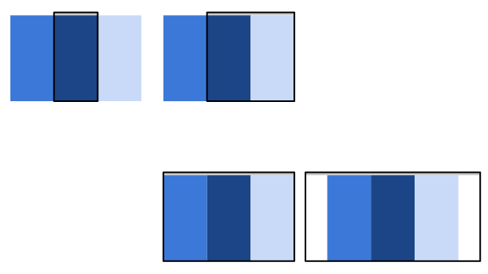

  Rather than stacking content vertically, the off canvas pattern places less frequently used content, perhaps navigation or app menus off screen, only showing it when the screen size is large enough, and on smaller screens, content is only a click away.


  
  Try it


Rather than stacking content vertically, this sample hides two of the content
`div`s off screen by using a `transform: translate(-250px, 0)`.  JavaScript is used
to show the divs by adding an open class to the element to make visible.  As the
screen gets wider, the off-screen positioning is removed from the elements and
they're shown within the visible viewport.

Note in this sample, Safari for iOS 6 and Android Browser do not support the
`flex-flow: row nowrap` feature of `flexbox`, so we’ve had to fallback to
absolute positioning.

Sites using this pattern include:

 * [HTML5Rocks
  Articles](http://www.html5rocks.com/en/tutorials/developertools/async-call-stack/)
 * [Google Nexus](https://www.google.com/nexus/)
 * [Facebook's Mobile Site](https://m.facebook.com/)



