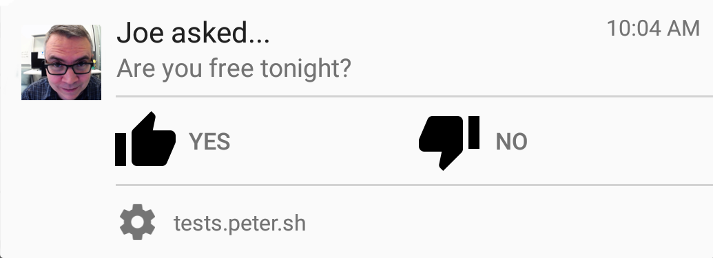

project_path: /web/_project.yaml
book_path: /web/fundamentals/_book.yaml
description: You've seen what makes a good notification. Now let's see how to implement them.

{# wf_review_required #}
{# wf_updated_on: 2016-06-30 #}
{# wf_published_on: 2016-06-30 #}

# Handling messages {: .page-title }



<figure class="attempt-right">
  
</figure>

Way back at the [beginning of this section](.), we
showed a notification that looks like this and the code that goes with it.

While we showed you a little bit about how this is coded, we really didn't give
you enough information for it to be useful. That's what this section is about.

## More notification anatomy {#more-anatomy}

When a notification is received from the server, it's intercepted by a service
worker using the push event. It's basic structure is this.

    self.addEventListener('push', event => {
      event.waitUntil(
        // Process the event and display a notification.
      );
    });
    

Somewhere inside `waitUntil()`, we're going to call `showNotification()` on a
service worker registration object.

    self.registration.showNotification(title, {
        body: 'Are you free tonight?',
        icon: 'images/joe.png',
        vibrate: [200, 100, 200, 100, 200, 100, 400],
        tag: 'request',
        actions: [
          { action: 'yes', title: 'Yes!', icon: 'images/thumb-up.png' },
          { action: 'no', title: 'No', icon: 'images/thumb-down.png' }
        ]
      })
    

Technically, the only required parameter for `showNotification()` is the title.
Practically speaking, you should include a body and an icon.

Finally, we'll process the user's response using the `notificationclick` and
`notificationclose` methods.

    self.addEventListener('notificationclick', event => {  
      // Do something with the event  
      event.notification.close();  
    });
    
    self.addEventListener('notificationclose', event => {  
      // Do something with the event  
    });
    

Everything else is just an elaboration of these basic ideas.

## Preparing message content {#preparing-messages}

As we said earlier, your server sends two kinds of messages. 

* Messages with a data payload.
* Messages without a data payload, often called a tickle.

Your push handler needs to account for both. For messages without a payload you 
want to provide a good user experience by getting the data before you tell the 
user it's available.

Let's start with our basic push event handler with a call to
`event.waitUntil()`.  This method can only take a Promise or something that
resolves to a promise.

    self.addEventListener('push', event => {
      event.waitUntil(() => {
        // Do something with the event.
      });
    });
    

Next, if you find data in the event object, get it.

<pre class="prettyprint">
self.addEventListener('push', event => {
  <strong>event.waitUntil(() => {
    if (event.data) {
      return Promise.resolve(event.data);
    }
    // No data, so do something else.</strong>
  });  
});
</pre>
    

If there's no data in the object, call `fetch()` to get it from the server. 
Otherwise, just return the data.

<pre class="prettyprint">
self.addEventListener('push', event => {
  event.waitUntil(() => {
    if (event.data) {
      return Promise.resolve(event.data);
    }
    <strong>return fetch('some/data/endpoint.json')
      .then(response => response.json());</strong>
  });
});
</pre>

In both cases we end up with a JSON object. Now it's time to show a
notification to the user.

<pre class="prettyprint">
self.addEventListener('push', event => {
  event.waitUntil(() => {
    if (event.data) {
      return Promise.resolve(event.data);
    }
    return fetch('some/data/endpoint.json')
        .then(response => response.json());
    })
    <strong>.then(data => {
      return self.registration.showNotification(data.title, {
        body: data.body,
        icon: (data.icon ? data.icon : '/images/icon-192x192.png'),
        vibrate: [200, 100, 200, 100, 200, 100, 400],
        tag: data.tag
       })
    }))</strong>
});
</pre>

## Combine similar notifications {#combine-similar-notes}

<figure class="attempt-right">
  
</figure>

Sometimes it's useful to combine multiple notifications into a single one. For
example, a social networking app might want to avoid messaging users for every
post from a particular person, and instead combine them.

Combining similar notifications comes down to three things.

* A call to `getNotifications()`.
* reusing an existing `tag` value.
* Setting the `renotify` flag in the call to `showNotification()`.

Let's look at an example that shows all three.

The following examples, we're going to assume that you've already received or
retrieved message data  as described in the last section. Now let's look at what
to do with it. Start with a basic push event handler.

    self.addEventListener('push', function(event) {
      event.waitUntil(
        // Get the message data somehow and return a Promise.
      )
      .then(data => {
        // Do something with the data.
      })
    });
    

Check for notifications that match `data.tag` with a call to `getNotifications()`.

<pre class="prettyprint">
self.addEventListener('push', function(event) {
  event.waitUntil(
    // Get the message data somehow and return a Promise.
  )
  .then(data => {
    <strong>return self.registration.getNotifications({tag: data.tag});
  })
  .then(notifications => {
    //Do something with the notifications.
  })</strong>
});
</pre>

In other examples, we've instantiated our `options` object right in the call  to
`showNotification()`. For this scenario, the `options` object needs to change
based on the results of `getNotifications()`.  So instantiate a notification
`options` object.

Notice that we've also attached the notification data to the notification
options. We're doing this to ensure that it's available to `notificationclick`,
which we'll look at in a later section. To tell the browser we're combining
notifications, we need to reuse the `tag` and set `renotify` to `true`. Both are highlighted below.

<pre class="prettyprint">
self.addEventListener('push', function(event) {
  event.waitUntil(
    // Get the message data somehow and return a Promise.
  )
  .then(data => {
    return self.registration.getNotifications({tag: data.tag})
  })
  .then( notifications => {
  	var noteOptions = {
      body: data.body,
      icon: (data.icon ? data.icon : '/images/ic_flight_takeoff_black_24dp_2x.png'),
      vibrate: [200, 100, 200, 100, 200, 100, 400],
      <strong>tag: data.tag,</strong>
      data: data
  	}
    if (notifications.length > 0) {
      <strong>noteOptions.renotify = true;</strong>
      // Configure other options for combined notifications.
    }
  })  
});
</pre>

When we fill out the remaining properties for the new notifications we're also
going to add two action buttons to the notification. One
will open the application. The other will dismiss the notification without
taking action. Neither of those actions is handled by the push event. We'll look
at that in the next section. Finally, show the notification (line 26).

<pre class="prettyprint">
self.addEventListener('push', function(event) {
  event.waitUntil(
    // Get the message data somehow and return a Promise.
  )
  .then(data => {
    return self.registration.getNotifications({tag: data.tag})
  })
  .then( notifications => {
    var noteOptions = {
      body: data.body,
      icon: (data.icon ? data.icon : '/images/ic_flight_takeoff_black_24dp_2x.png'),
      vibrate: [200, 100, 200, 100, 200, 100, 400],
      tag: data.tag,
      data: data
    };

    if (notifications.length > 0) {
      data.title = "Flight Updates";
      noteOptions.body = "There are several updates regarding your flight, 5212 to Kansas City.";
      noteOptions.renotify = true;
      <strong>noteOptions.actions = [
        {action: 'view', title: 'View updates'},
        {action: 'notNow', title: 'Not now'}
      ]
    }
    self.registration.showNotification(data.title, noteOptions);</strong>
  })  
});
</pre>

## Put actions on the notification {#notification-actions}

We've already seen examples of notifications with actions built into them. Let's 
look at how they're implemented and how to respond to them.

Recall that `showNotification()` takes an options argument with one or more 
optional actions.

    ServiceWorkerRegistration.showNotification(title, {  
      body: data.body,  
      icon: (data.icon ? data.icon : '/images/i_face_black_24dp_2x.png'),  
      vibrate: [200, 100, 200, 100, 200, 100, 400],  
      tag: data.tag,  
      actions: [  
        {action: 'change', title: 'Ask for reschedule'},  
        {action: 'confirm', title: 'Confirm'}  
      ],  
      data: data  
    })
    
<figure class="attempt-right">
  
</figure>

The notification says that Stacy has
confirmed an appointment for 3:00 PM. The recipient can either respond with
their own confirmation or ask for the appointment to be rescheduled. For the
former we will send a message directly to the server. For the later we will open
the application to an appropriate interface.

First, let's add a `notificationclick` event handler to the service worker. Also, 
close the notification.

    self.addEventListener('notificationclick', function(event) {  
      event.notification.close();  
      // Process the user action.  
    });
    

Next, we need some logic to figure out where the notification was clicked. Did
the user click Confirm, Reschedule, or neither?

<pre class="prettyprint">
self.addEventListener('notificationclick', function(event) {
  event.notification.close();
  <strong>if (event.action === 'confirm') {
    // Send the confirmation to the server.
  } else if (event.action === 'change') {
    // Open the application to a place where the user can reschedule.
  } else {
    // Just open the app.
  }</strong>
});
</pre>

If the user clicked confirm, we can send that straight back to the server
without opening the application (lines 3 through 13). Notice that we're
returning from the `notificationclick` event immediately after sending the
confirmation to the server. This prevents the app from opening.

<pre class="prettyprint">
self.addEventListener('notificationclick', function(event) {
  event.notification.close();
  <strong>if (event.action === 'confirm')
    var fetchOptions = {
      method: 'post',
      headers: new Headers({
        'Content-Type': 'application/json'
      }),
      body: event.notification.data.confirmation_id
    };
    var confirmation = new Request('/back/end/system/confirm');
    event.waitUntil(fetch(confirmation, fetchOptions));
    return; // So we don't open the page when we don't need to.</strong>
  } else if (event.action === 'change') {
    // Open the application to a place where the user can reschedule.
  } else {
    // Just open the app.
  }
});
</pre>

If the recipient clicked change, we want to open to a confirmation page. If the
user clicks somewhere other than an action button, we just want to open the app.
In both cases, we'll create an appropriate URL.

<pre class="prettyprint">
self.addEventListener('notificationclick', function(event) {
  event.notification.close();
  if (event.action === 'confirm') {
    var fetchOptions = {
      method: 'post',
      headers: new Headers({
        'Content-Type': 'application/json'
      }),
      body: event.notification.data.confirmation_id
    };
    var confirmation = new Request('/back/end/system/confirm');
    event.waitUntil(fetch(confirmation, fetchOptions));
    return; // So we don't open the page when we don't need to.
  <strong>} else if (event.action === 'change') {
    var appUrl = '/?confirmation_id=' +
      event.notification.data.confirmation_id + '#reschedule';
  } else {
    var appUrl = '/';
  }
  // Navigate to appUrl.</strong>
});
</pre>

Note: From here on, the code samples start to get a little large. We're going to truncate them for the sake of space. But, don't worry. We'll show you the whole thing at the end.

Regardless of URL, we'll call `clients.matchAll()` to get a client window we can
navigate with.

    self.addEventListener('notificationclick', function(event) {
      // Content excerpted
      
      event.waitUntil(clients.matchAll({
        includeUncontrolled: true,
        type: 'window'
        })
      );
    });
    

Finally, we need to take different navigation paths depending on whether a
client is open.

<pre class="prettyprint">
self.addEventListener('notificationclick', function(event) {
  // Content excerpted

  event.waitUntil(clients.matchAll({
    includeUncontrolled: true,
    type: 'window'
    <strong>}).then( activeClients => {
      if (activeClients.length > 0) {
        activeClients[0].navigate(appUrl);
        activeClients[0].focus();
      } else {
        clients.openWindow(appUrl);
      }</strong>
    })
  );
});
</pre>
    

Here's the entire `notificationclick` handler from end to end.

    self.addEventListener('notificationclick', function(event) {
      event.notification.close();
      if (event.action === 'confirm') {
        var fetchOptions = {
          method: 'post',
          headers: new Headers({
            'Content-Type': 'application/json'
          }),
          body: event.notification.data.confirmation_id
        };
        var confirmation = new Request('/back/end/system/confirm');
        event.waitUntil(fetch(confirmation, fetchOptions));
        return; // So we don't open the page when we don't need to.
      } else if (event.action === 'change') {
        var appUrl = '?confirmation_id=' +
          event.notification.data.confirmation_id + '#reschedule';
      } else {
        var appUrl = '/';
      }
      
      event.waitUntil(clients.matchAll({
        includeUncontrolled: true,
        type: 'window'
        }).then( activeClients => {
          if (activeClients.length > 0) {
            activeClients[0].navigate(appUrl);
            activeClients[0].focus();
          } else {
            clients.openWindow(appUrl);
          }
        })
      );
    });
    
