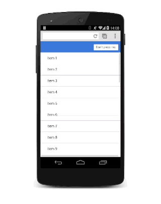

project_path: /web/_project.yaml
book_path: /web/_book.yaml
description: Learn how to animate modal views in your apps.

Modal views are for important messages, and for which you have very good reasons to block the user interface. Care must be taken when you use them as they are disruptive and can easily ruin the user’s experience if overused. But, in some circumstances, they’re the right views to use, and adding some animation will bring them to life."

  <h3 class="wf-highlight-list__title">TL;DR</h3>

  
  <ul class="wf-highlight-list__list">
    
    <li>Modal views should be used sparingly; users will get frustrated if you interrupt their experience unnecessarily.</li>
    
    <li>Adding scale to the animation gives a nice 'drop on' effect.</li>
    
    <li>Be sure to get rid of the modal view quickly when the user dismisses it, but you should bring it on to screen a little more slowly so it doesn't surprise the user.</li>
    
  </ul>
  

<a href="/web/resources/samples/fundamentals/design-and-ui/animations/modal-view-animation.html">See sample.</a>

The modal overlay should be aligned to the viewport so it needs to have its `position` set to `fixed`:

<pre><code class="language-css" data-lang="css">.modal {
  position: fixed;
  top: 0;
  left: 0;
  width: 100%;
  height: 100%;

  pointer-events: none;
  opacity: 0;

  will-change: transform, opacity;
}</code></pre>

It has an initial `opacity` of 0 so it's hidden from view, but then it will also need `pointer-events` set to `none` so that click and touches pass through. Without that it will block all interactions rendering the whole page unresponsive. Finally, since it will animate its `opacity` and `transform` those need to be marked as changing with `will-change` (see also [Using the will-change property](/web/fundamentals/design-and-ui/animations/animations-and-performance.html#using-the-will-change-property)).

When the view is visible it will need to accept interactions and have an `opacity` of 1:

<pre><code class="language-css" data-lang="css">.modal.visible {
  pointer-events: auto;
  opacity: 1;
}</code></pre>

Now whenever the modal view is required, you can use JavaScript to toggle the "visible" class:

<pre><code class="language-javascript" data-lang="javascript">modal.classList.add(&#39;visible&#39;);</code></pre>

At this point the modal view will appear without any animation, so that can now be added in
(see also [Custom Easing](/web/fundamentals/design-and-ui/animations/custom-easing.html)):

<pre><code class="language-css" data-lang="css">.modal {
  -webkit-transform: scale(1.15);
  transform: scale(1.15);

  -webkit-transition:
    -webkit-transform 0.1s cubic-bezier(0.465, 0.183, 0.153, 0.946),
    opacity 0.1s cubic-bezier(0.465, 0.183, 0.153, 0.946);

  transition:
    transform 0.1s cubic-bezier(0.465, 0.183, 0.153, 0.946),
    opacity 0.1s cubic-bezier(0.465, 0.183, 0.153, 0.946);

}</code></pre>

Adding `scale` to the transform makes the view appear to drop onto the screen slightly, which is a nice effect. The default transition applies to both transform and opacity properties with a custom curve and a duration of 0.1 seconds.

The duration is pretty short, though, but it's ideal for when the user dismisses the view and wants to get back to your app. The downside is that it’s probably too aggressive for when the modal view appears. To fix this you should override the transition values for the `visible` class:

<pre><code class="language-css" data-lang="css">.modal.visible {

  -webkit-transform: scale(1);
  transform: scale(1);

  -webkit-transition:
    -webkit-transform 0.3s cubic-bezier(0.465, 0.183, 0.153, 0.946),
    opacity 0.3s cubic-bezier(0.465, 0.183, 0.153, 0.946);

  transition:
    transform 0.3s cubic-bezier(0.465, 0.183, 0.153, 0.946),
    opacity 0.3s cubic-bezier(0.465, 0.183, 0.153, 0.946);

}</code></pre>

Now the modal view takes 0.3s seconds to come onto the screen, which is a bit less aggressive, but it is dismissed quickly, which the user will appreciate.

