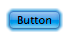

project_path: /web/_project.yaml
book_path: /web/_book.yaml
description: The simplest way to reassure a user that their touch isn't ignored is to change your UI as they press down. Changing a background color can make all the difference and is simple to do.

  Touchscreens are available on more and more devices, ranging from phones up to desktop screens. When your users choose to interact with your UI, your app should respond to their touch in intuitive and beautiful ways.

## Add Touch States

Have you ever touched or clicked an element on a web page and questioned
whether the site actually detected it?

Simply altering the color of elements as users touch parts of your UI gives a basic reassurance that your site is working. Not only does this alleviate frustation, but can also give a snappy and responsive feel to your site.

### Use Pseudo Classes to Change UI for each Touch State

The fastest way to support touch is to change the UI in response to a DOM
element’s change in state.

  <h3 class="wf-highlight-list__title">TL;DR</h3>

  
  <ul class="wf-highlight-list__list">
    
    <li>Make your site feel snappy and responsive&colon; change the UI for each state <code>:hover</code>, <code>:active</code> and <code>:focus</code>.</li>
    
    <li>Don’t override a browser’s default responses to touch and focus unless you are implementing your own UI changes.</li>
    
    <li>Disable text selection on elements users will touch, unless there’s a good reason why users might need to copy / select the text.</li>
    
  </ul>
  

DOM elements can be in one of the following states, default, focus, hover, and active. To change
our UI for each of these states, we need to apply styles to the following
pseudo classes `:hover`, `:focus` and `:active` as shown below:

  

      
<pre>.btn {
  background-color: #4285f4;
}

.btn:hover {
  background-color: #296CDB;
}

.btn:focus {
  background-color: #0F52C1;

  /* The outline parameter surpresses the border
  color / outline when focused */
  outline: 0;
}

.btn:active {
  background-color: #0039A8;
}
</pre>

      

        <a class="highlight-module__cta mdl-button mdl-js-button mdl-button--raised mdl-button--colored" href="/web/resources/samples/fundamentals/design-and-ui/input/touch/states-example.html">Try full sample</a>
      

  

See [Pseudo classes for touch states](#pseudo-classes-for-touch-states):

### Hover and Focus Stickiness

On most mobile browsers *hover* and/or *focus* states will apply 
to an element after it's been tapped.

Consider carefully 
what styles you set and how they will look to the user after
they finish their touch.

Bear in mind that anchor tags and buttons may have different behaviour in different browsers, so assume in some cases *hover* will remain and in others *focus* will remain.

### Enabling Active State Support on iOS

Unfortunately, Safari on iOS does not apply the *active* state by default, to get it working you need to add a `touchstart` event listener to the *document body* or to each element.

You should do this behind a user agent test so it's only run on iOS devices.

Adding a touch start to the body has the advantage of applying to all elements in the DOM, however this may have performance issues when scrolling the page.

<pre><code class="language-js" data-lang="js">window.onload = function() {
  if(/iP(hone|ad)/.test(window.navigator.userAgent)) {
    document.body.addEventListener(&#39;touchstart&#39;, function() {}, false);
  }
};</code></pre>

The alternative is to add the touch start listeners to all the interactable elements in the page, alleviating some of the performance concerns.

<pre><code class="language-js" data-lang="js">window.onload = function() {
  if(/iP(hone|ad)/.test(window.navigator.userAgent)) {
    var elements = document.querySelectorAll(&#39;button&#39;);
    var emptyFunction = function() {};
    for(var i = 0; i &lt; elements.length; i++) {
      elements[i].addEventListener(&#39;touchstart&#39;, emptyFunction, false);
    }
  }
};</code></pre>

### Override Default Browser Styles for Touch States

Once you add styles for the different states, you'll notice that most browsers implement their own styles to respond to a user’s
touch, you should override these defaults when you've added your own styles.

  <h3 class="wf-highlight-list__title">Remember</h3>

  
  <ul class="wf-highlight-list__list">
    
    <li>Only override browser styles if you are implementing your own!</li>
    
  </ul>
  

#### Override Tap Highlight Styles

When mobile devices first launched, a number of sites didn’t have styling for
the active state. As a result, many browsers add a highlight color or style to elements when a user touches them.

Safari and Chrome add a tap highlight color which can be prevented with the
`-webkit-tap-highlight-color` CSS property:

  

      
<pre>/* Webkit / Chrome Specific CSS to remove tap
highlight color */
.btn {
  -webkit-tap-highlight-color: transparent;
}
</pre>

      

        <a class="highlight-module__cta mdl-button mdl-js-button mdl-button--raised mdl-button--colored" href="/web/resources/samples/fundamentals/design-and-ui/input/touch/states-example.html">Try full sample</a>
      

  

Internet Explorer on Windows Phone has a similar behavior, but is suppressed
via a meta tag:

<pre><code class="language-html" data-lang="html">&lt;meta name=&quot;msapplication-tap-highlight&quot; content=&quot;no&quot;&gt;</code></pre>

#### Override FirefoxOS Button State Styles

The Firefox `-moz-focus-inner` pseudo class includes an outline on touchable elements.
You can remove this outline by setting the `border: 0`.

If you are
using a `<button>` element, you get a gradient applied to your button which you can remove by setting `background-image: none`.

  

      
<pre>/* Firefox Specific CSS to remove button
differences and focus ring */
.btn {
  background-image: none;
}

.btn::-moz-focus-inner {
  border: 0;
}
</pre>

      

        <a class="highlight-module__cta mdl-button mdl-js-button mdl-button--raised mdl-button--colored" href="/web/resources/samples/fundamentals/design-and-ui/input/touch/states-example.html">Try full sample</a>
      

  

#### Override Element Outline in Focus State

Suppress the outline color when an element is focused using `outline: 0`.

<pre><code class="language-css" data-lang="css">.btn:focus {
  outline: 0;

  // Add replacement focus styling here (i.e. border)
}</code></pre>

### Disable user-select on UI which Responds to Touch

Some mobile browsers will select text if the user long presses on the screen.
This can result in a bad user experience if the user accidentally presses down
on a button for too long. You can prevent this from happening using the
`user-select` CSS property.

<pre><code class="language-css" data-lang="css">-moz-user-select: none;
-webkit-user-select: none;
-ms-user-select: none;
user-select: none;</code></pre>

  <h3 class="wf-highlight-list__title">Remember</h3>

  
  <ul class="wf-highlight-list__list">
    
    <li>You should be cautious not to disable user selection if the information on the element may be useful to the user (phone number, e-mail address, and so on).</li>
    
  </ul>
  

## Reference

### Pseudo Classes for Touch States

<table class="mdl-data-table mdl-js-data-table">
  <thead>
    <tr>
      <th>Class</th>
      <th>Example</th>
      <th>Description</th>
    </tr>
  </thead>
  <tbody>
    <tr>
      <td data-th="Class">:hover</td>
      <td data-th="Example"></td>
      <td data-th="Description">
        This state is entered when a is cursor placed over an element.
        Changes in UI on hover are helpful to encourage users to interact
        with elements.
      </td>
    </tr>
    <tr>
      <td data-th="Class">:focus</td>
      <td data-th="Example">
        
      </td>
      <td data-th="Description">
        When you tab through elements on a page, you are moving the focus
        from one element to the next. The focus state allows the user to
        know what element they are currently interacting with; also allows
        users to navigate your UI easily using a keyboard.
      </td>
    </tr>
    <tr>
      <td data-th="Class">:active</td>
      <td data-th="Example">
        
      </td>
      <td data-th="Description">
        This is the state an element has when it's being selected, for
        example a user clicking or touching an element.
      </td>
    </tr>
  </tbody>
</table>

