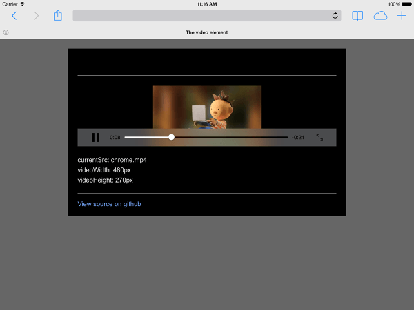

project_path: /web/_project.yaml
book_path: /web/fundamentals/_book.yaml
description: Different platforms display video differently. Mobile solutions need to consider device orientation. Use Fullscreen API to control the fullscreen view of video content.

{# wf_review_required #}
{# wf_updated_on: 2014-04-28 #}
{# wf_published_on: 2014-04-15 #}

# Customize the video player {: .page-title }



Different platforms display video differently. Mobile solutions need to consider device orientation. Use Fullscreen API to control the fullscreen view of video content.

Different platforms display video differently. Mobile solutions need to
consider device orientation. Use Fullscreen API to control the fullscreen view
of video content.

## How device orientation works across devices

Device orientation isn't an issue for desktop monitors or laptops, but is
hugely important when considering web page design for mobile and tablets.

Safari on iPhone does a good job of switching between portrait and landscape
orientation:

  <figure class="mdl-cell mdl-cell--4-col">
    
    <figcaption>Screenshot of video playing in Safari on iPhone, portrait</figcaption>
  </figure>
  <figure class="mdl-cell mdl-cell--8-col">
    
    <figcaption>Screenshot of video playing in Safari on iPhone, landscape</figcaption>
  </figure>

Device orientation on an iPad and Chrome on Android can be problematic.
For example, without any customization a video playing on an iPad in landscape
orientation looks like this:

Setting the video `width: 100%` or `max-width: 100%` with CSS can resolve
many device orientation layout problems. You may also want to consider
fullscreen alternatives.

## Inline or fullscreen display

Different platforms display video differently. Safari on an iPhone displays a
video element inline on a web page, but plays video back in fullscreen mode:

On Android, users can request request fullscreen mode by clicking the
fullscreen icon. But the default is to play video inline:

Safari on an iPad plays video inline:

## Control fullscreening of content

For platforms that do not force fullscreen video playback, the Fullscreen API
is [widely supported](//caniuse.com/fullscreen). Use this API to control
fullscreening of content, or the page.

To full screen an element, like a video:

    elem.requestFullScreen();
    

To full screen the entire document:

    document.body.requestFullScreen();
    

You can also listen for fullscreen state changes:

    video.addEventListener("fullscreenchange", handler);
    

Or, check to see if the element is currently in fullscreen mode:

    console.log("In full screen mode: ", video.displayingFullscreen);
    

You can also use the CSS `:fullscreen` pseudo-class to change the way
elements are displayed in fullscreen mode.

On devices that support the Fullscreen API, consider using thumbnail
images as placeholders for video:

<video autoplay loop class="center">
  <source src="video/fullscreen.webm" type="video/webm">
  <source src="video/fullscreen.mp4" type="video/mp4">
  
This browser does not support the video element.

</video>

To see this in action, check out the <a href="https://googlesamples.github.io/web-fundamentals/samples/fundamentals/design-and-ui/media/video/fullscreen.html">demo</a>.

**NOTE:** `requestFullScreen()` is currently vendor prefixed and may require
extra code for full cross browser compatibility.

