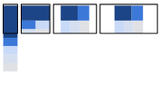

project_path: /web/_project.yaml
book_path: /web/_book.yaml
description: Responsive web design patterns are quickly evolving, but there are a handful of established patterns that work well across the desktop and mobile devices

  The mostly fluid pattern consists primarily of a fluid grid.  On large or medium screens, it usually remains the same size, simply adjusting the margins on wider screens.

On smaller screens, the fluid grid causes the main content to reflow,
while columns are stacked vertically.  One major advantage of this pattern is
that it usually only requires one breakpoint between small screens and large
screens.

<a href="/web/resources/samples/fundamentals/design-and-ui/responsive/patterns/mostly-fluid.html">
  
  Try it
</a>

In the smallest view, each content `div` is stacked vertically.  Once the screen
width hits 600px, the primary content `div` remains at `width: 100%`, while the
secondary `div`'s are shown as two columns below the primary `div`.  Beyond
800px, the container `div` becomes fixed width and is centered on the screen.

Sites using this pattern include:

 * [A List Apart](http://mediaqueri.es/ala/)
 * [Media Queries](http://mediaqueri.es/)
 * [SimpleBits](http://simplebits.com/)

  

      
<pre>.container {
  display: -webkit-flex;
  display: flex;
  -webkit-flex-flow: row wrap;
  flex-flow: row wrap;
}

.c1, .c2, .c3, .c4, .c5 {
  width: 100%;
}

@media (min-width: 600px) {
  .c2, .c3, .c4, .c5 {
    width: 50%;
  }
}

@media (min-width: 800px) {
  .c1 {
    width: 60%;
  }
  .c2 {
    width: 40%;
  }
  .c3, .c4, .c5 {
    width: 33.33%;
  }
}

@media (min-width: 800px) {
  .container {
    width: 800px;
    margin-left: auto;
    margin-right: auto;
  }
}
</pre>

      

        <a class="highlight-module__cta mdl-button mdl-js-button mdl-button--raised mdl-button--colored" href="/web/resources/samples/fundamentals/design-and-ui/responsive/patterns/mostly-fluid.html">Try full sample</a>
      

  

