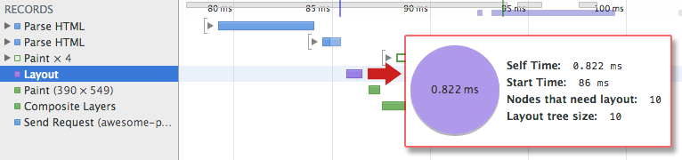

project_path: /web/_project.yaml
book_path: /web/_book.yaml
description: TODO

  The CSSOM and DOM trees are combined into a render tree, which is then used 
  to compute the layout of each visible element and serves as an input to the 
  paint process which renders the pixels to screen. Optimizing each of these 
  steps is critical to achieve optimal rendering performance.

In the previous section on constructing the object model, we built the DOM and the CSSOM trees based on the HTML and CSS input. However, both of these are independent objects which capture different aspects of the document: one describes the content and the other the style rules that need to be applied to the document. How do we merge the two and get the browser to render pixels on the screen?

# WARNING: This page has an include that should be a callout (i.e. a highlight.liquid, but it has no text - please fix this)

# WARNING: This page has a highlight.liquid include that wants to show a list but it's not supported on devsite. Please change this to text and fix the issue

The first step is for the browser to combine the DOM and CSSOM into a "render tree" that captures all the visible DOM content on the page, plus all the CSSOM style information for each node.

To construct the render tree, the browser roughly does the following:

1. Starting at the root of the DOM tree, traverse each visible node.
  * Some nodes are not visible at all (e.g. script tags, meta tags, and so on), and are omitted since they are not reflected in the rendered output.
  * Some nodes are hidden via CSS and are also omitted from the render tree - e.g. the span node in example above is missing from the render tree because we have an explicit rule that sets "display: none" property on it.
1. For each visible node find the appropriate matching CSSOM rules and apply them.
1. Emit visible nodes with content and their computed styles.

# WARNING: This page has an include that should be a callout (i.e. a highlight.liquid, but it has no text - please fix this)

# WARNING: This page has a highlight.liquid include that wants to show a list but it's not supported on devsite. Please change this to text and fix the issue

The final output is a render that contains both the content and the style information of all the visible content on the screen - we're getting close!  **With the render tree in place, we can proceed to the "layout" stage.**

Up to this point we've calculated which nodes should be visible and their computed styles, but we have not calculated their exact position and size within the [viewport](/web/fundamentals/design-and-ui/responsive/fundamentals/set-the-viewport) of the device - that's the "layout" stage, also sometimes known as "reflow."

To figure out the exact size and position of each object the browser begins at the root of the render tree and traverses it to compute the geometry of each object on the page. Let's consider a simple hands-on example:

  

      
<pre>&lt;html&gt;
  &lt;head&gt;
    &lt;meta name=&quot;viewport&quot; content=&quot;width=device-width,initial-scale=1&quot;&gt;
    &lt;title&gt;Critial Path: Hello world!&lt;/title&gt;
  &lt;/head&gt;
  &lt;body&gt;
    &lt;div style=&quot;width: 50%&quot;&gt;
      &lt;div style=&quot;width: 50%&quot;&gt;Hello world!&lt;/div&gt;
    &lt;/div&gt;
  &lt;/body&gt;
&lt;/html&gt;
</pre>

      

        <a class="highlight-module__cta mdl-button mdl-js-button mdl-button--raised mdl-button--colored" href="/web/resources/samples/fundamentals/performance/critical-rendering-path/nested.html">Try full sample</a>
      

  

The body of the above page contains two nested div's: the first (parent) div sets the display size of the node to 50% of the viewport width, and the second div contained by the parent sets its width to be 50% of its parent - i.e. 25% of the viewport width!

The output of the layout process is a "box model" which precisely captures the exact position and size of each element within the viewport: all of the relative measures are converted to absolute pixels positions on the screen, and so on.

Finally, now that we know which nodes are visible, their computed styles, and geometry, we can finally pass this information to our final stage which will convert each node in the render tree to actual pixels on the screen - this step is often referred to as "painting" or "rasterizing."

Did you follow all of that? Each of these steps requires a non-trivial amount of work by the browser, which also means that it can often take quite a bit of time. Thankfully, Chrome DevTools can help us get some insight into all three of the stages we've described above. Let's examine the layout stage for our original "hello world" example:

* The render tree construction and position and size calculation are captured with the "Layout" event in the Timeline.
* Once layout is complete, the browser issues a "Paint Setup" and "Paint" events which convert the render tree to actual pixels on the screen.

The time required to perform render tree construction, layout and paint will vary based on the size of the document, the applied styles, and of course, the device it is running on: the larger the document the more work the browser will have to do; the more complicated the styles are the more time will be consumed for painting also (e.g. a solid color is "cheap" to paint, and a drop shadow is much more "expensive" to compute and render).

Once all is said and done, our page is finally visible in the viewport - woohoo!

Let's do a quick recap of all the steps the browser went through:

1. Process HTML markup and build the DOM tree.
1. Process CSS markup and build the CSSOM tree.
1. Combine the DOM and CSSOM into a render tree.
1. Run layout on the render tree to compute geometry of each node.
1. Paint the individual nodes to the screen.

Our demo page may look very simple, but it requires quite a bit of work! Care to guess what would happen if the DOM, or CSSOM is modified? We would have to repeat the same process over again to figure out which pixels need to be re-rendered on the screen.

**Optimizing the critical rendering path is the process of minimizing the total amount of time spent in steps 1 through 5 in the above sequence.** Doing so enables us to render content to the screen as soon as possible and also to reduces the amount of time between screen updates after the initial render - i.e. achieve higher refresh rate for interactive content.

