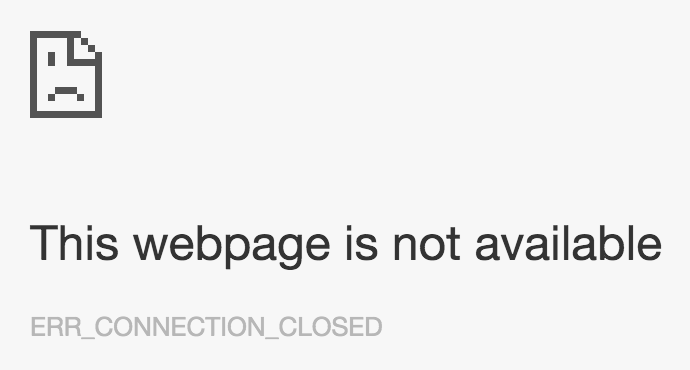

project_path: /web/_project.yaml
book_path: /web/_book.yaml
description: Finding and fixing mixed content is an important task, but it can be time-consuming. This guide discusses some tools that are available to help with the process.

  Finding and fixing mixed content is an important task, but it can be time-consuming. This guide discusses some tools that are available to help with the process.

This guide discusses tools and techniques to find and fix mixed content; for 
more information on mixed content itself, see our [previous guide](.) on this topic.

# WARNING: This page has an include that should be a callout (i.e. a highlight.liquid, but it has no text - please fix this)

# WARNING: This page has a highlight.liquid include that wants to show a list but it's not supported on devsite. Please change this to text and fix the issue

## Find and fix mixed content 

Manually finding mixed content is rather simple, but can be time consuming 
depending on the number of issues you have. Chrome is used to describe the 
process here, however most modern browsers provide similar tools to help you 
with this process.

### Finding mixed content by visiting your site

When visiting an HTTPS page in Google Chrome, the browser alerts you to mixed 
content as errors and warnings in the JavaScript console.

To see these alerts, visit the sample page from our passive mixed content or 
active mixed content examples, and open the Chrome JavaScript console. The 
console can be opened from the View menu, _View_ -&gt; _Developer_ -&gt; 
_JavaScript Console_ or by right-clicking the page, selecting _Inspect Element_ 
then selecting _Console_.

The [passive mixed content example](https://googlesamples.github.io/web-fundamentals/samples/discovery-and-distribution/avoid-mixed-content/passive-mixed-content.html) in our [previous guide](what-is-mixed-content#passive-mixed-content) will cause mixed content warnings to be displayed, like the ones below:

<figure>
  
</figure>

<a class="mdl-button mdl-js-button mdl-button--raised mdl-button--colored" href="/web/resources/samples/fundamentals/security/prevent-mixed-content/passive-mixed-content.html">
  Try sample
</a>

While the active mixed content example will cause mixed content errors to be 
displayed:

<figure>
  
</figure>

<a class="mdl-button mdl-js-button mdl-button--raised mdl-button--colored" href="/web/resources/samples/fundamentals/security/prevent-mixed-content/active-mixed-content.html">
  Try sample
</a> 

The `http://` URLs listed in these errors and warnings should be fixed in your 
site's source, it helps to make a list of these URLs, along with the page you 
found them on, to help you fix them later. 

# WARNING: This page has an include that should be a callout (i.e. a highlight.liquid, but it has no text - please fix this)

# WARNING: This page has a highlight.liquid include that wants to show a list but it's not supported on devsite. Please change this to text and fix the issue

### Finding mixed content in your source code

You can search for mixed content directly in your source code. Search for 
`http://` in your source and look for tags that include HTTP URL attributes. 
Specifically, you are looking for the tags listed in the [mixed content types & security threats associated](what-is-mixed-content#mixed-content-types--security-threats-associated) section of our previous guide. 
Note that having `http://` in the href attribute of anchor tags (`<a>`)
is often not a mixed content issue, with some notable exceptions discussed later. 

If you have a list of HTTP URLs from Chrome mixed content errors and warnings, 
you can also search for these complete URLs in your source to find where they 
are included in your site. 

### Fixing mixed content

Once you've found where the mixed content is included in your site's source, 
follow these steps to fix it.

Assuming you have the following mixed content error in Chrome:

<figure>
  
</figure>

Which you found in source here:

<pre><code class="language-html" data-lang="html">&lt;img src=&quot;http://googlesamples.github.io/web-fundamentals/.../puppy.jpg&quot;&gt;</code></pre>

#### Step 1

Check that the URL is available over HTTPS. Open a new tab in 
your browser, enter the URL in the address bar, and change `http://` to `https://`

If the resource displayed is the same over **HTTP** and **HTTPS**, everything is OK, 
proceed to [step 2](#step-2).

  <figure class="mdl-cell mdl-cell--6-col">
    
    <figcaption class="wf-figcaption-good">HTTP image loads without error.</figcaption>
  </figure>
  <figure class="mdl-cell mdl-cell--6-col">
    
    <figcaption class="wf-figcaption-good">HTTPS image loads without error, and image is the same as HTTP. Go to <a href="#step-2">step 2</a>!</figcaption>
   </figure>

If you see a certificate warning, or if the content can't be displayed over
**HTTPS**, it means the resource is not available securely.

  <figure class="mdl-cell mdl-cell--6-col">
    
    <figcaption class="wf-figcaption-bad">Resource not available over HTTPS.</figcaption>
  </figure>
  <figure class="mdl-cell mdl-cell--6-col">
    
    <figcaption class="wf-figcaption-bad">Certificate warning when attempting to view resource over HTTPS.</figcaption>
  </figure>

In this case, you should consider one of the following options:

* Include the resource from a different host, if one is available.
* Download and host the content on your site directly, if you are legally allowed to do so.
* Exclude the resource from your site altogether.

#### Step 2

Change the `http://` URL to `https://`, save the source file, and redeploy the updated file if necessary.

#### Step 3

View the page where you found the error originally, verify that the error no longer appears.

### Beware of non-standard tag usage

Beware of non-standard tag usage on your site. For instance, anchor (`<a>`)
tag URLs don't cause mixed content by themselves, as they cause the browser to 
navigate to a new page. This means they usually don't need to be fixed. However 
some image gallery scripts overrides the functionality of the `<a>` tag and 
load the HTTP resource specified by the `href` attribute into a lightbox display 
on the page, causing a mixed content problem. 

  

      
<pre>&lt;a class=&quot;gallery&quot; href=&quot;http://googlesamples.github.io/web-fundamentals/samples/discovery-and-distribution/avoid-mixed-content/puppy.jpg&quot;&gt;
  &lt;img src=&quot;https://googlesamples.github.io/web-fundamentals/samples/discovery-and-distribution/avoid-mixed-content/puppy-thumb.jpg&quot;&gt;
&lt;/a&gt;
</pre>

      

        <a class="highlight-module__cta mdl-button mdl-js-button mdl-button--raised mdl-button--colored" href="/web/resources/samples/fundamentals/security/prevent-mixed-content/image-gallery-example.html">Try full sample</a>
      

  

In the code above, it may seem safe to leave the `<a>` tags href as `http://`, 
however if you view the sample and click on the image, you'll see that it loads 
a mixed content resources and displays it on the page. 

## Handle mixed content at scale

The manual steps above work well for smaller websites, but for large websites, 
or sites with many separate development teams, it can be tough to keep track of 
all the content being loaded. To help with this task, you can use content 
security policy to instruct the browser to notify you about mixed content and 
ensure that your pages never unexpectedly load insecure resources.

### Content security policy

**Content security policy** (CSP) is a multi-purpose browser feature that you 
can use to manage mixed content at scale. The CSP reporting mechanism can be 
used to track the mixed content on your site; and the enforcement policy, to 
protect users by upgrading or blocking mixed content. 

You can enable these features for a page by including the 
`Content-Security-Policy` or `Content-Security-Policy-Report-Only` header in the 
response sent from your server. Additionally, `Content-Security-Policy` (but 
**not** `Content-Security-Policy-Report-Only`) can be set using a `<meta>` tag 
in the `<head>` section of your page. See examples in the following 
sections.

CSP is useful for many things outside of its mixed content uses, you can find 
more information about other CSP directives at the following resources:

* [Mozilla's intro to CSP](https://developer.mozilla.org/en-US/docs/Web/Security/CSP/Introducing_Content_Security_Policy)
* [HTML5 Rocks' intro to CSP](http://www.html5rocks.com/en/tutorials/security/content-security-policy/)
* [CSP playground](http://www.cspplayground.com/)
* [CSP spec](http://www.w3.org/TR/CSP/)

<!-- Span required to prevent rest of page from being indented. 
https://github.com/google/WebFundamentals/issues/1873 -->

# WARNING: This page has an include that should be a callout (i.e. a highlight.liquid, but it has no text - please fix this)

# WARNING: This page has a highlight.liquid include that wants to show a list but it's not supported on devsite. Please change this to text and fix the issue

### Finding mixed content with content security policy 

You can use content security policy to collect reports of mixed content on your 
site. To enable this feature, set the `Content-Security-Policy-Report-Only` 
directive by adding it as a response header for your site. 

Response header:  

<pre><code class="language-http" data-lang="http">Content-Security-Policy-Report-Only: default-src https: &#39;unsafe-inline&#39; &#39;unsafe-eval&#39;; report-uri https://example.com/reportingEndpoint</code></pre>

Whenever a user visits a page on your site, their browser sends JSON-formatted 
reports regarding anything that violates the content security policy to 
`https://example.com/reportingEndpoint`. In this case, anytime a 
subresource is loaded over HTTP, a report is sent. These reports include the 
page URL where the policy violation occurred and the subresource URL that 
violated the policy. If you configure your reporting endpoint to log these 
reports, you can  track the mixed content on your site without visiting each 
page yourself. 

The two caveats to this are:

* Users have to visit your page in a browser that understands the CSP header. 
  This is true for most modern browsers.
* You only get reports for pages visited by your users. So if you have pages 
  that don't get much traffic, it might be some time before you get reports for 
  your entire site.

For more information on CSP header format, see the [Content Security Policy specification](https://w3c.github.io/webappsec/specs/content-security-policy/#violation-reports). 

If you don't want to configure a reporting endpoint yourself, 
[https://report-uri.io/](https://report-uri.io/) is a reasonable 
alternative.

### Upgrading insecure requests

One of the newest and best tools to automatically fix mixed content is the 
[**`upgrade-insecure-requests`**](http://www.w3.org/TR/upgrade-insecure-requests) 
CSP directive. This directive instructs the browser to upgrade insecure URLs 
before making network requests.

As an example, if a page contains an image tag with a HTTP URL:

<pre><code class="language-html" data-lang="html">&lt;img src=&quot;http://example.com/image.jpg&quot;&gt;</code></pre>

The browser instead makes a secure request for 
<code><b>https:</b>//example.com/image.jpg</code>, thus saving the user from mixed 
content.

You can enable this behavior either by sending a `Content-Security-Policy` header 
with this directive:

<pre><code class="language-http" data-lang="http">Content-Security-Policy: upgrade-insecure-requests</code></pre>

Or by embedding that same directive inline in the document's `<head>` 
section using a `<meta>` element:

<pre><code class="language-html" data-lang="html">&lt;meta http-equiv=&quot;Content-Security-Policy&quot; content=&quot;upgrade-insecure-requests&quot;&gt;</code></pre>

It is worth noting, that if the resource is not available over HTTPS, the 
upgraded request fails and the resource is not loaded. This maintains the 
security of your page. 

The `upgrade-insecure-requests` directive cascades into `<iframe>` documents, 
ensuring the entire page is protected.

### Blocking all mixed content

Not all browsers support the upgrade-insecure-requests directive, so an 
alternative for protecting users is the 
[**`block-all-mixed-content`**](http://www.w3.org/TR/mixed-content/#strict-checking)
CSP directive. This directive instructs the browser to never load mixed content; 
all mixed content resource request are blocked, including both active and 
passive mixed content. This option also cascades into `<iframe>` documents, 
ensuring the entire page is mixed content free.

A page can opt itself into this behavior either by sending a 
`Content-Security-Policy` header with this directive:

<pre><code class="language-http" data-lang="http">Content-Security-Policy: block-all-mixed-content</code></pre>

Or by embedding that same directive inline in the document's `<head>` 
section using a `<meta>` element:

<pre><code class="language-html" data-lang="html">&lt;meta http-equiv=&quot;Content-Security-Policy&quot; content=&quot;block-all-mixed-content&quot;&gt;</code></pre>

The downside of using `block-all-mixed-content` is, perhaps obviously, that all 
content is blocked. This is a security improvement, but it means that these 
resources are no longer available on the page. This might break features and 
content your users expect to be available. 

# WARNING: This page has an include that should be a callout (i.e. a highlight.liquid, but it has no text - please fix this)

# WARNING: This page has a highlight.liquid include that wants to show a list but it's not supported on devsite. Please change this to text and fix the issue

