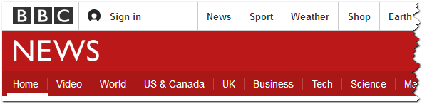

Accessibility is about understanding the experience of a diverse range of users. One popular type of software is the *screen reader*, a program that enables visually impaired people to use computers by reading screen text aloud in a generated voice. The user can control what is read by moving the cursor to a relevant area with the mouse or keyboard.

We asked Victor Tsaran to explain how, as a blind person, he accesses the web using a free screen reader for Windows called NonVisual Desktop Access, or NVDA.

>I access the web using a screen reader that converts text and UI elements to descriptive text in either speech or braille form. For example, I would use NVDA to access the BBC.com website.
>
>When the page loads, I hear the page title, and I get this nice summary of what's on the page. The page title is really important for me because otherwise when I'm switching tabs or windows I'd have no idea where I was!
>
>I've been to this page before, so I know I want to go to the News link, and I know that's near the top of the page so I'll just hit tab a few times until I hit that link and hear it read aloud. One nice thing the BBC website has is "Skip to main content" and "Accessibility help" links which jump to the main screen if you're using the keyboard.

>Having found the News link, I'm going to use my screen reader to click that. When I get to the News page, it's telling me there are 57 headings on the page. I know the headings are the article headlines, so I'm going to bring up a list of headings and go through those.
>
>In that list, I might find an article about the Oscars. I can look at that article by clicking the headline. Once I'm on the article page, I can get the screen reader to read me the rest of the page.

>With NVDA, I have the option to change the speed of the reader's speaking voice. I can set it to speak really fast, but honestly it's just like learning to read visually &mdash; at first you have to go slow, but you learn to recognize words at a faster and faster rate. That way, I can consume the content as quickly as a sighted person.

Now, it's your turn to try using a screen reader. Here is a page with *ChromeVox Lite*, a minimal but functioning screen reader written in Javascript. The screen is purposefully blurred to simulate a low-vision experience and force the user to complete the task with a screen reader. Of course, you'll need to use the Chrome browser for this exercise.

<a href="http://robdodson.github.io/udacity-a11y/lesson3-semantics-built-in/02-chromevox-lite/" target="_blank">ChromeVox lite demo page</a>

You can use the control panel at the bottom of the screen to control the screen reader. This screen reader has very minimal functionality, but you can explore the content using the `Previous` and `Next` buttons, and you can click things using the `Click` button.

Try using this page with ChromeVox lite enabled to get a feel for screen reader use. Come back when you're done and we'll continue the course.
