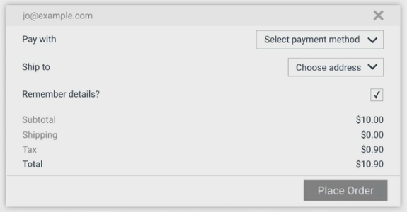
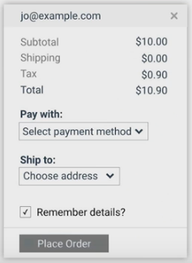

Broadly speaking, when we say a site is "accessible", we mean that the site's content is available, and its functionality can be operated, by literally *anyone*. As developers, it's easy to assume that all users can see and use a keyboard, mouse, or touch screen, and interact with your application the same way you do. This can lead to an experience that might work well for some people, but create issues that can range from simple annoyances to show-stoppers for others. 

Accessibility, then, refers to the experience of users who might be outside the narrow range of the "typical" user, who might access or interact with things differently than you expect. Specifically, it concerns users who are experiencing some type of impairment or disability &mdash; and the word "experiencing" is an important concept here, because that experience might be non-physical or temporary.

For example, although we tend to center our discussion of accessibility on users with physical impairments, we can all relate to the experience of using an interface that is not accessible to us for other reasons. Have you ever had a problem using a desktop site on a mobile phone, or seen the message "This content is not available in your area", or been unable to find a familiar menu on a tablet? Those are accessibility issues too.

As you learn more, you'll find that addressing accessibility issues in this broader, more general sense almost always improves the user experience for everyone. Let's look at an example with some accessibility issues.

This form has several accessibility issues.

 - The text is low contrast, which is hard for low-vision users to read.
 - Having labels on the left and fields on the right makes it hard for many people to associate them, and almost impossible for a someone who needs to zoom in to use the page; imagine looking at this on a phone and having to pan around to figure out what goes with what.
 - The "Remember details?" label isn't associated with the checkbox, so you have to tap or click only on the tiny square rather than just clicking the label; also, someone using a screen reader would have trouble figuring out the association.

Now let's wave our accessibility wand and see the form with those issues fixed. We're going to make the text darker, modify the design so that the labels are close to the things they're labeling, and fix the label to be associated with the checkbox so you can toggle it by clicking the label as well.

Which would you rather use? If you said "the *accessible* version", you're on your way to understanding the main premise of this course. Often, something that's a complete blocker for a few users is also an annoying pain point for many others, so by fixing the accessibility issue you improve the experience for everyone.
