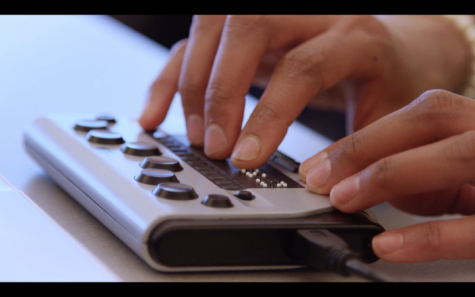
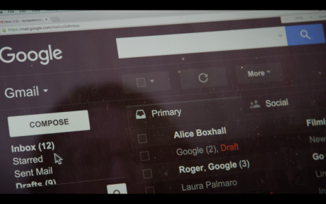
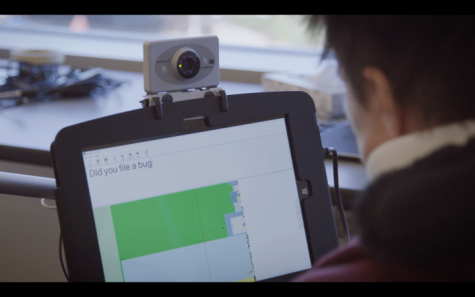
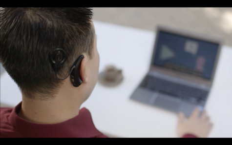
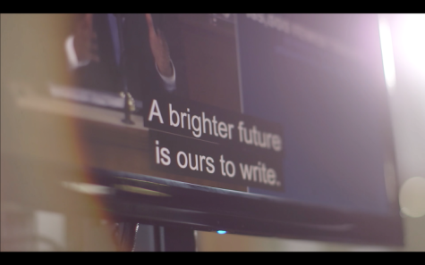
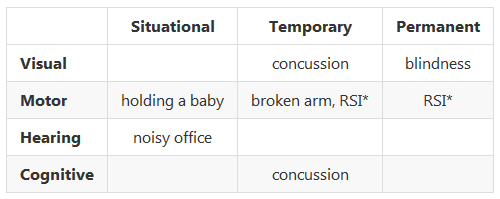

project_path: /web/_project.yaml
book_path: /web/fundamentals/_book.yaml
description: Accessibility Codelab

{# wf_review_required #}
{# wf_updated_on: 2016-02-29 #}
{# wf_published_on: 2016-02-29 #}

# Understanding Users' Diversity {: .page-title }




When learning about accessibility, it helps to have an understanding of the diverse range of users in the world and the kinds of accessibility topics that affect them. To explain further, here's an informative question/answer session with Victor Tsaran, a Technical Program Manager at Google, who is totally blind.

<figure>
  	
  <figcaption>Victor Tsaran</figcaption>
</figure>

*What do you work on at Google?*

>Here at Google my job is to help ensure that our products work for all of our diverse users, regardless of impairment or ability.

 *What kinds of impairments do users have?*

>When we think about the kinds of impairments which would make it difficult for someone to access our content, many people will immediately picture a blind user like me. And it's true, this impairment can really make it frustrating or even impossible to use a lot of web sites.
>
>A lot of modern web techniques have the unfortunate side effect of creating sites which don't work well with the tools used by blind users to access the web. However, there is actually more to accessibility than that. We find it useful think of impairments falling into four broad buckets: visual, motor, hearing, and cognitive.

 *Let's go through those one at a time. Can you give some examples of visual impairments?*

>Visual impairments can be split into a few categories: Users with no vision, like me, might use a screen reader, braille, or combination of the two.

<figure>
  	
  <figcaption>A braille reader</figcaption>
</figure>

>Now, it's actually pretty unusual to have literally no vision, but still, there's a good chance you know or have met at least one person who can't see at all. However there are also a much larger number of what we call low-vision users.
>
>This is a broad range, from someone like my wife, who doesn't have any corneas &mdash; so while she can basically see things she has a hard time reading print and is considered legally blind &mdash; to someone who might have just poor vision and needs to wear very strong prescription glasses.
>
>There's a huge range, and so naturally there's a big range of accommodations that people in this category use: some do use a screen reader or a braille display (I've even heard of one woman who reads braille displayed on-screen because it's easier to see than printed text), or they might use text-to-speech technology without the full screen reader functionality, or they might use a screen magnifier which zooms in on part of the screen, or they might just use their browser zoom to make all the fonts bigger. They might also use high-contrast options like an operating system high-contrast mode, a high-contrast browser extension or a high-contrast theme for a website. 

<figure>
  	
  <figcaption>High-contrast mode</figcaption>
</figure>

>A lot of users even use a combination of these, like my friend Laura who uses a combination of high-contrast mode, browser zoom and text-to-speech.
>
>Low vision is something a lot of people can relate to. For a start, we all experience deteriorating vision as we age, so even if you haven't experienced it there's a good chance you've heard your parents complain about it. But a lot of people experience the frustration of taking their laptop out by a sunny window only to find they suddenly can't read anything! Or anyone who's had laser surgery or maybe just has to read something from across the room might have used one of those accommodations I mentioned. So I think it's pretty easy for developers to have some empathy for low-vision users.
>
>Oh, and I shouldn't forget to mention people with poor color vision &mdash; about 9% of males have some form of color vision deficiency! Plus about 1% of females. They may have trouble distinguishing red and green, or yellow and blue. Think about that the next time you design form validation.

 *What about motor impairments?*

>Yes, motor impairments, or dexterity impairments. This group ranges all the way from those who would prefer not to use a mouse, because perhaps they've had some RSI or something and find it painful, to someone who may be physically paralyzed and have limited range of motion for certain parts of their body. Motor impaired users may use a keyboard, switch device, voice control, or even an eye-tracking device to interact with their computer.

<figure>
  	
  <figcaption>A switch device</figcaption>
</figure>

<figure>
  	
  <figcaption>An eye tracking device</figcaption>
</figure>

>Similar to vision impairments, mobility can also be a temporary or situational issue: Maybe you have a broken wrist on your mouse hand. Maybe the trackpad is broken on your laptop, or you're just riding on a shaky train. There can be a lot of situations where a user's mobility is impeded, and by making sure we cater for them we improve the experience overall, both for anyone with a permanent impairment but also for anyone who temporarily finds that they can't use a pointer-based UI.

 *Great, let's talk about hearing impairments.*

>This group can range from the profoundly deaf through to hard-of-hearing. And much like eyesight, our hearing tends to degrade with age. Many of us use common affordances like hearing aids to help us.

<figure>
  	
  <figcaption>Hearing aid (cochlear implant type)</figcaption>
</figure>

>For hearing-impaired users we need to make sure that we're not relying on sound, so making sure to use things like video captions and transcripts, and providing some kind of alternative, if sound is part of the interface.

<figure>
  	
  <figcaption>Screen captions</figcaption>
</figure>

>And like we saw with vision and motor impairments, it's really easy to imagine a situation where someone whose ears work fine would benefit from these accommodations as well. A lot of my friends say they love it when videos have captions and transcripts because it means that if they're in an open plan office and didn't bring their headphones, they can still watch the video!

 *All right, can you tell us a bit about cognitive impairments?*

>Finally there's a range of cognitive conditions like ADD, Dyslexia, and Autism, which can mean that people want or need to access things differently. The accommodations for these groups are naturally extremely diverse, but we definitely find some overlap with other areas, like using zoom functionality to make reading or concentrating easier. Also, these users may find that really minimal design works best because it minimizes distraction and cognitive load. 
>
>I think everyone can relate to the stress of cognitive overload, so it's obvious that if we create something that works well for someone with a cognitive impairment, we're going to be creating something which is going to be a pleasant experience for everyone.

 *So, how would you summarize how you think about accessibility?*

>When you look at the broad range of abilities and disabilities that people might have, you can see that designing and building products only for people who have perfect vision, hearing, dexterity, and cognition seems incredibly narrow. It's almost self-defeating, because we're creating a more stressful and less usable experience for everyone, and for some users creating an experience which actually excludes them altogether.

In this interview, Victor identified a range of impairments, and placed them into four broad categories: *visual*, *motor*, *hearing*, and *cognitive*. He also pointed out that each type of impairment might be *situational*, *temporary*, or *permanent*. 

Let's take a look at some real-world examples of access impairments and see where they fall within those categories and types. Note that some impairments may fall into more than one category or type.

*Repetitive Strain Injury: e.g., carpal tunnel syndrome, tennis elbow, trigger finger
