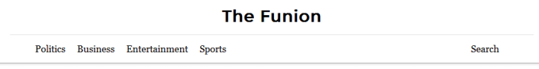
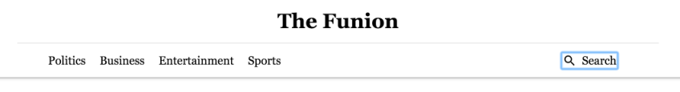
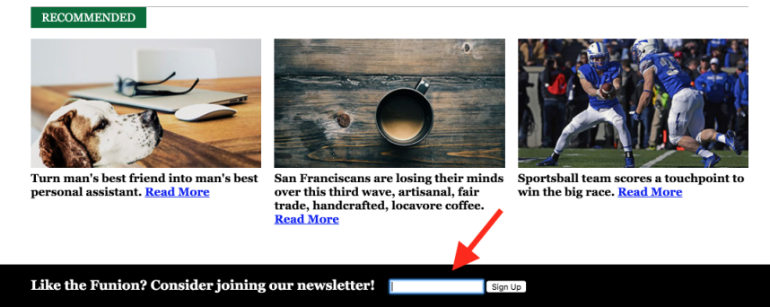

project_path: /web/_project.yaml
book_path: /web/fundamentals/_book.yaml
description: The importance of the default DOM order

{# wf_review_required #}
{# wf_updated_on: 2016-02-29 #}
{# wf_published_on: 2016-02-29 #}

# DOM Order Matters {: .page-title }




Working with native elements is a great way to learn about focus behavior because they are automatically inserted into the tab order based on their position in the DOM.

For example, you might have three button elements, one after the other in the DOM. Pressing `Tab` focuses each button in order. However, it's important to note that, using CSS, it's possible to have things exist in one order in the DOM but appear in a different order on screen.

    <button>I Should</button>
    <button>Be Focused</button>
    <button>Last!</button>


<button>I Should</button>
<button>Be Focused</button>
<button>Last!</button>


For example, if you use a CSS property like *float* to move one button to the right, the buttons appear in a different order on screen. But, because their order in the DOM remains the same, so does their tab order. When the user tabs through the page, the buttons gain focus in a non-intuitive order.

    <button style="float: right">I Should</button>
    <button>Be Focused</button>
    <button>Last!</button>


<button style="float: right;">I Should</button>
<button>Be Focused</button>
<button>Last!</button>


Be careful when changing the visual position of elements on screen using CSS. This can cause the tab order to jump around, seemingly at random, confusing users who rely on the keyboard. For this reason, the Web AIM checklist states in section 1.3.2 that the reading and navigation order, as determined by code order, should be logical and intuitive.

As a rule, try tabbing through your pages every so often just to make sure you haven't accidentally messed up the tab order. It's a good habit to adopt, and one that doesn't require much effort.

Here's a <a href="http://udacity.github.io/ud891/lesson2-focus/02-dom-order/" target="_blank">page with a broken tab order</a>.

Check it out and try to navigate through the page using only `Tab`; you'll quickly find that the tab order doesn't match the visual order. If you examine the page source, you'll see that the tab order originally dictated by the DOM is rearranged by the CSS, making the page confusing and difficult to use and resulting in a serious accessibility issue.

It would make more sense if the page could be navigated in this order: navigation, search, content, footer. How might you accomplish that? Grab the code and use a text editor to review the order of the elements in the DOM. Think about how we might reorder them so that the tab order makes sense. <a href="https://github.com/udacity/ud891/tree/gh-pages/lesson2-focus/02-dom-order" target"_blank">This code</a> includes an example of this technique.

First, you can see that the Search link is actually higher in the DOM order than the other navigation links, and that it's using a "pull-right" CSS class to float to the right. That's fine visually, but the style placement overrides the link's physical DOM order. The easiest fix is to move the Search button below the other links in the HTML; that won't change the visual presentation because the CSS will still float it to the right, but it will change the element's DOM position so that it matches the default tab order.

You may also notice that the newsletter footer's tab order is ahead of the other elements on the page. Although it is near the top of the DOM in the HTML, the "newsletter" CSS class absolutely positions it at the bottom of the page. Just like the search link, let's move the newsletter `div`, placing it at the bottom of the document, just after the `main` element. Again, this has no visual effect because the CSS still positions it, but it changes the element's physical DOM position so that its default tab order now falls in a logical place.

You can see that these two minor changes result in a much more intuitive tab order.
