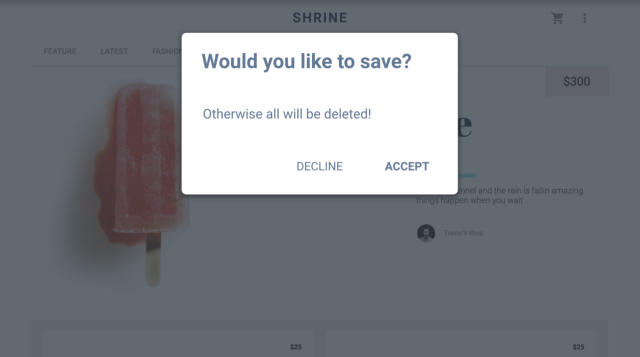

project_path: /web/_project.yaml
book_path: /web/fundamentals/_book.yaml
description: Managing focus with modal elements and keyboard traps

{# wf_review_required #}
{# wf_updated_on: 2016-02-29 #}
{# wf_published_on: 2016-02-29 #}

# Modals and Keyboard Traps {: .page-title }




Sometimes when you're managing focus you can get into a situation you can't get out of. Consider an autocomplete widget that tries to manage focus and captures the tab behavior, but prevents the user from leaving it until it's complete. This is called a *keyboard trap*, and it can be very frustrating for the user. Section 2.1.2 of the Web AIM checklist addresses this issue, stating that <a href="http://webaim.org/standards/wcag/checklist#sc2.1.2" target="_blank">keyboard focus should never be locked or trapped at one particular page element</a>. The user should be able to navigate to and from all page elements using only the keyboard.

Oddly, there are times when this behavior is actually desirable, like in a modal window. Normally, when the modal is displayed, you don't want the user to access the content behind it. You might add an overlay to cover the page visually, but that doesn't stop keyboard focus from accidentally traveling outside the modal. In instances like this you can implement a temporary keyboard trap to ensure that you trap focus only while the modal is displayed and then restore focus to the previously-focused item when the modal is closed.

>There are some proposals on how to make this easier for developers, including the `<dialog>` element, but they don't yet have widespread browser support. 
>
>See <a href="https://developer.mozilla.org/en-US/docs/Web/HTML/Element/dialog" target="_blank">this MDN article</a> for more information on `<dialog>`, and this <a href="https://accessibility.oit.ncsu.edu/training/aria/modal-window/version-3/" target="_blank">North Carolina State University accessibility blog</a> for more information on modal windows.

Consider a modal dialog represented by a `div` that contains a few elements, and another `div` that represents a background overlay. Let's walk through the basic steps needed to implement a temporary keyboard trap in this situation.

 1. Using `document.querySelector`, select the modal and overlay divs and store their references.
 1. As the modal opens, store a reference to the element that was focused when the modal was opened so you can return focus to that element.
 1. Use a *keydown listener* to grab keys as they are pressed while the modal is open. You could also listen for a click on the background overlay, and close the modal if the user clicks it.
 1. Next, get the collection of focusable elements within the modal. The first and last focusable elements will act as "sentinels" to let you know when to loop focus forward or backward to stay inside the modal.
 1. Display the modal window and focus the first focusable element.
 1. As the user presses `Tab` or `Shift+Tab`, move focus forward or backward, looping at the last or first elements as appropriate.
 1. If the user presses `Esc`, close the modal. This is very helpful because it allows the user to close the modal without searching for a specific close button, and it benefits even users who are using a mouse. 
 1. When the modal is closed, hide it and the background overlay, and restore focus to the previously-focused element saved earlier.

This procedure gives you a usable, non-frustrating modal window that everyone can use effectively.

For more details, you can examine this <a href="https://github.com/udacity/ud891/blob/gh-pages/lesson2-focus/07-modals-and-keyboard-traps/modal.js" target="_blank">sample code</a>, and view a live example from a <a href="https://github.com/udacity/ud891/blob/gh-pages/lesson2-focus/07-modals-and-keyboard-traps/solution" target="_blank">completed page</a>.
