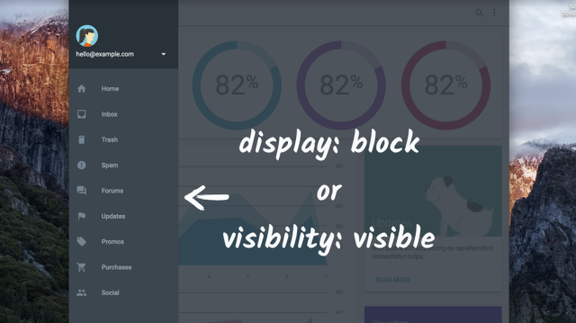

project_path: /web/_project.yaml
book_path: /web/fundamentals/_book.yaml
description: Managing tab order for off screen content

{# wf_review_required #}
{# wf_updated_on: 2016-02-29 #}
{# wf_published_on: 2016-02-29 #}

# Off screen Content {: .page-title }




Earlier we discussed making sure that elements appear in the DOM in a way that the default tab order makes sense. But what if you have content that isn't currently displayed, yet still needs to be in the DOM, such as a slide-in panel? When you have elements like this that receive focus when they're off screen, it can seem as if the focus is disappearing and reappearing as the user tabs through the page &mdash; clearly an undesirable effect. Ideally, we should prevent the panel from gaining focus when it's off screen, and only allow it to be focused when the user can interact with it.

Sometimes you need to do a bit of detective work to figure out where focus has gone. You can use `document.activeElement` from the console to figure out which element is currently focused. 

>Another tool at your disposal is the <a href="https://chrome.google.com/webstore/search/accessibility%20developer%20tools" target="_blank">Accessibility Developer Tools extension</a>, available on the Chrome Web Store. The extension offers an audit that can run against your entire site and alert you of any accessibility issues, and an accessibilities tab in the elements panel for inspecting elements and learning about their semantic information.
>
>In this example, when the focus ring disappears, you can either use `document.activeElement` from the console, or you can run the accessibility audit to actively check for other things you may have overlooked.

Once you know which off screen element is being focused, you can set it to `display: none` or `visibility: hidden`, and then set it back to `display: block` or `visibility: visible` before showing it to the user.

In general, we encourage developers to tab through your sites before each publish to see that the tab order doesn't disappear or jump out of a logical sequence. If it does, you should make sure you are appropriately hiding offscreen content with `display: none` or `visibility: hidden`, or that you rearrange elements' physical positions in the DOM so they are in a logical order.
