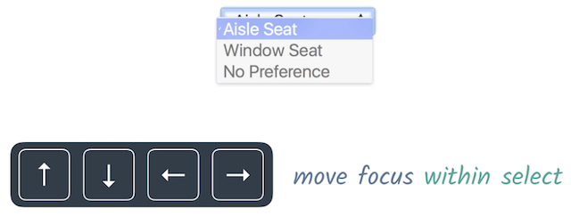

project_path: /web/_project.yaml
book_path: /web/fundamentals/_book.yaml
description: Managing focus with complex or custom components

{# wf_review_required #}
{# wf_updated_on: 2016-02-29 #}
{# wf_published_on: 2016-02-29 #}

# Focus in Complex Components {: .page-title }




Managing focus when you change something on the page is important, but sometimes you need to manage focus at the control level &mdash; for example, if you're building a custom component.

Consider the native `select` element. It can receive basic focus but, once there, you can use the arrow keys to expose additional functionality (the selectable options). If you were building a custom select element, you would want to expose these same kinds of behaviors so that users who rely primarily on the keyboard could still interact with your control.

Knowing which keyboard behaviors to implement can be difficult, but there is a helpful document you can refer to. The <a href="https://www.w3.org/TR/wai-aria-practices/" target="_blank">Accessible Rich Internet Applications (ARIA) Authoring Practices</a> guide lists types of components and what kinds of keyboard actions they support. We will cover ARIA in more detail later, but for now let's use the guide to help us add keyboard support to a new component.

Perhaps you're working on a new input element that resembles a set of radio buttons, but with your unique take on appearance and behavior. To determine what kind of keyboard support it needs, you would check the ARIA Design Patterns guide. Section 2 contains a list of design patterns, and in that list is a <a href="https://www.w3.org/TR/wai-aria-practices/#radiobutton" target="_blank">characteristics table for radio groups</a>, the existing component that most closely matches your new element.

As you can see in the table, one of the common keyboard behaviors that should be supported is the up/down/left/right arrow keys. To add this behavior to the new component, we'll use a technique called *roving tabindex*.

Roving tabindex works by setting `tabindex` to -1 for all children except the currently-active one. The component then uses a keyboard event listener to determine which key the user presses; when this happens, it sets the previously focused child's `tabindex` to -1, sets the to-be-focused child's `tabindex` to 0, and calls the focus method on it. 

When the user reaches the last (or first, depending on the direction they're moving the focus) child, you will loop around and focus the first (or last) child again.

You can learn more about roving tabindex at <a href="https://developer.mozilla.org/en-US/docs/Web/Accessibility/Keyboard-navigable_JavaScript_widgets#Technique_1_Roving_tabindex" target="_blank">this MDN article</a>.
