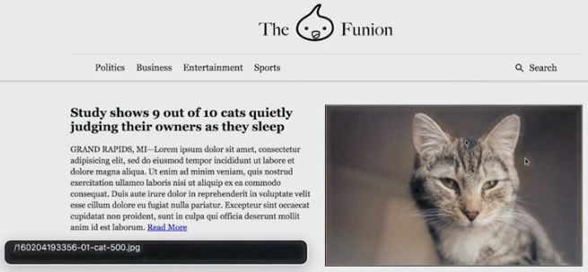
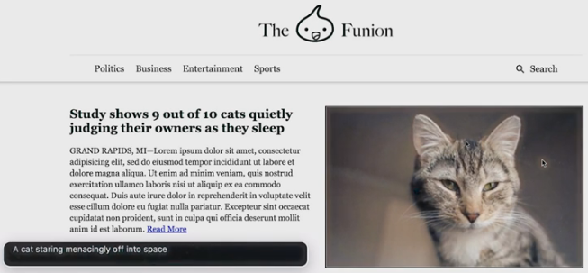

Of course, images are an important component of most web pages, and are a particular sticking point for low-vision users. We must consider the role an image plays in a page to work out what type of text alternative it should have. Take a look at this page.

In the page we have a picture of some bees, illustrating the article on bees. ChromeVox announces this as its literal name, "160204193356-01-cat-500.jpg" (which you can see in the black voiceover bar). Accurate, yes, but not at all useful.

You can use the `alt` attribute to provide a useful text alternative to this image &mdash; for example, "A cat staring menacingly into space" &mdash; then the screen reader can provide a succinct description of the image (again, seen in the black voiceover bar) and the user can choose whether to move on to the article.

A couple of comments about `alt`:

 - `alt` allows you to specify a simple string to be used any time the image isn't available, such as when the image fails to load, or is accessed by web crawling bot, or encountered by a screen reader.
 - `alt` differs from `title`, or any type of caption, in that it is *only* used if the image isn't available.

Writing useful alt text is a bit of an art. In order for a string to be a usable text alternative, it needs to convey the same concept as the image, in the same context. 

Consider a linked logo image in the masthead of a page. We can describe the image pretty accurately as "The Funion logo". It might be tempting to give it a simpler text alternative of "home" or "main page", but that does a disservice to both low-vision and sighted users.

Imagine a screen reader user who wants to locate the masthead logo on the page; giving it an alt value of "home" actually creates a more confusing experience. And a sighted user faces the same challenge &mdash; figuring out what clicking the site logo does &mdash; as a screen reader user.

However, it's not always useful to describe an image. For example, consider a magnifying glass image inside a search button that has the text "Search". If the text wasn't there, you would definitely give that image an alt value of "search". But because we have the visible text, the screen reader will pick it up, and an identical alt value on the image is redundant. 

However, we know that if we leave the alt text out, we'll probably hear the image file name instead, which is a useless and potentially confusing experience. In this case you can just use an empty `alt` attribute, and the screen reader will skip the image altogether.

To summarize, *all* images should have an `alt` attribute, but they need not all have text. Important images should have descriptive alt text that succinctly describes what the image is, while decorative images should have no alt text &mdash; that is, `alt=""`. 
