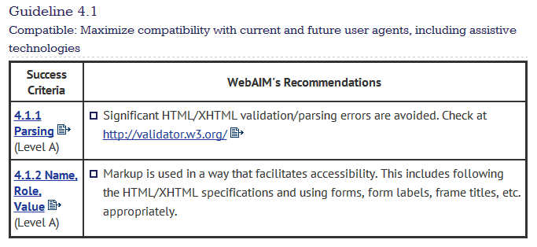
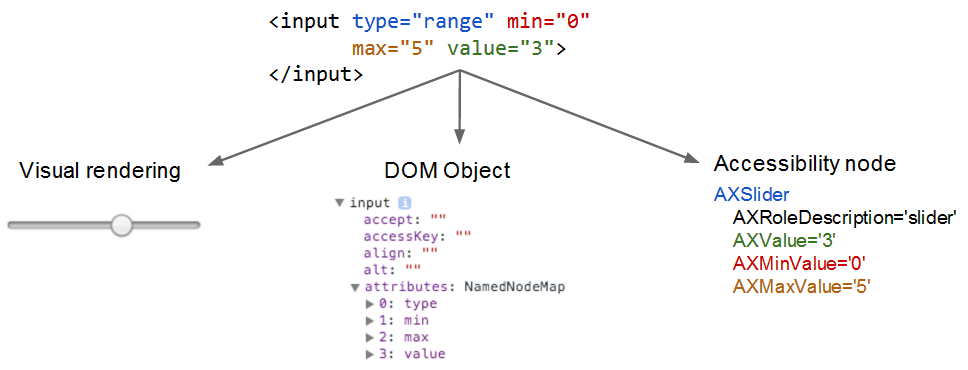

# Affordances

When we use a man-made tool or device, we typically look to its form and design to give us an idea of what it does and how it works. An *affordance* is an object that offers, or affords, its user the opportunity to perform an action. The better the affordance is designed, the more obvious or intuitive its use.

Some affordances can be misleading. A common example is a door with a U-shaped handle that most users expect to pull, but which may respond only to pushing. Others, such as a door with a flat plate that is clearly meant to be pushed, are more direct and obvious.

In graphical user interfaces, affordances represent actions we can take, but can be ambiguous because there is no physical object to interact with. GUI affordances are thus specifically designed to be unambiguous: buttons, check boxes, and scroll bars are meant to convey their usage with as little training as possible.

For example, you might paraphrase the use of common form elements (affordances) like this:

 - Radio buttons &mdash; "I can choose one of these options."
 - Check box &mdash; "I can choose 'yes' or 'no' to this option."
 - Text field &mdash; "I can type something into this area."
 - Dropdown &mdash; "I can open this element to display my options."

You can draw conclusions about these elements *only because you can see them*. Obviously, someone who can't see the visual cues provided by the element can't comprehend its meaning or intuitively grasp the value of the affordance. So we must make sure that the information is expressed flexibly enough to be accessed by assistive technology that can construct an alternative interface to suit its user's needs.

## Semantics and Assistive Technology

This non-visual exposure of an affordance's use is called its *semantics*. The WebAIM WCAG guidelines address it like this.

Let's try out some things from the point of view of someone using assistive technology. In the introduction, you had a brief look at ChromeVox Lite. Now we'll try using it without any access to the web page's visible interface.

We've modified the flight reservation page from the previous lesson so that you can't see what you're doing any more, so you'll have to use the screen reader. You might want to refer back to the earlier exercise if you get stuck. As before, use the form to book a one-way ticket to Melbourne with a window seat.

[ChromeVox lite demo page](http://robdodson.github.io/udacity-a11y/lesson3-semantics-built-in/02-chromevox-lite/)

A screen reader actually creates an alternate user experience for the user based on the programmatically expressed semantics. Instead of a visual interface, the screen reader provides an auditory interface.

Notice how the screen reader tells you some information about each interface element. You should expect a well-designed reader to tell you all, or at least most, of the following information about the elements it encounters.

 - The element's *role*, or type. Sometimes the screen reader might just state the element's role, or play a recognizable sound, or both. 
 - The element's *name*, if it has one (it should).
 - The element's *value*, if it has one (it may or may not).
 - The element's *state*, e.g., if it is disabled.

The screen reader is able to construct this alternate UI because the native elements contain built-in accessibility metadata. Just as the rendering engine uses the native code to construct a visual interface, the screen reader uses the metadata in the node to construct an accessible version, something like this.

