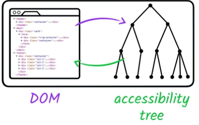
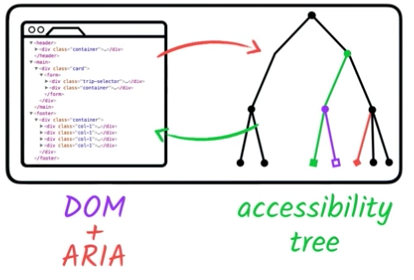

project_path: /web/_project.yaml
book_path: /web/fundamentals/_book.yaml
description: Introduction to ARIA and non-native HTML semantics

{# wf_review_required #}
{# wf_updated_on: 2016-02-29 #}
{# wf_published_on: 2016-02-29 #}

# Introduction to ARIA {: .page-title }




So far, we've encouraged using native HTML elements because they give you focus, keyboard support, and built-in semantics, but there are times when a simple layout and native HTML won't do the job. For example, currently there's no standardized HTML element for a very common UI construct, the pop-up menu. Nor is there an HTML element that provides a semantic characteristic such as "the user needs to know about this as soon as possible".

In this lesson, then, we'll explore how to express semantics that HTML can't express on its own.

The <a href="https://www.w3.org/TR/wai-aria/" target="_blank">Web Accessibility Initiative's Accessible Rich Internet Applications specification</a> (WAI-ARIA, or just ARIA) is good for bridging areas with accessibility issues that can't be managed with native HTML. It works by allowing you to specify attributes that modify the way an element is translated into the accessibility tree. Let's look at an example.

In the following snippet, we use a list item as a kind of custom checkbox. The CSS "checkbox" class gives the element the required visual characteristics.

    <li tabindex="0" class="checkbox" checked>
      Receive promotional offers
    </li>
    

While this works fine for sighted users, a screen reader will give no indication that the element is meant to be a checkbox, so low-vision users may miss the element entirely. 

Using ARIA attributes, however, we can give the element the missing information so the screen reader can properly interpret it. Here, we've added the `role` and `aria-checked` attributes to explicitly identify the element as a checkbox and to specify that it is checked by default. The list item will now be added to the accessibility tree and a screen reader will correctly report it as a checkbox.

    <li tabindex="0" class="checkbox" role="checkbox" checked aria-checked="true">
      Receive promotional offers
    </li>
    

>Later, we will cover the list of ARIA attributes and when to use them.

ARIA works by changing and augmenting the standard DOM accessibility tree.

Although ARIA allows us to subtly (or even radically) modify the accessibility tree, that is the only page component it changes. ARIA doesn't augment any of the element's inherent behavior; it won't make the element focusable or give it keyboard event listeners. That is still part of our development task.

It's important to understand that there is no need to redefine default semantics. Regardless of its use, a standard HTML `<input type="checkbox">` element doesn't need an additional `role="checkbox"` ARIA attribute to be correctly announced.

It's also worth noting that certain HTML elements have restrictions on what ARIA roles and attributes can be used on them. For example, a standard `<input type="text">` element may not have any additional role/attribute applied to it. 

>See the <a href="https://www.w3.org/TR/html-aria/#sec-strong-native-semantics" target="_blank">ARIA in HTML</a> spec for more information.

Let's see what other capabilities ARIA has to offer.
