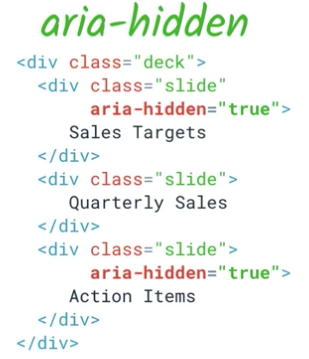

Another important technique in fine-tuning the experience for assistive technology users involves ensuring that only relevant parts of the page are exposed to assistive technology. There are several ways to ensure that a section of the DOM does not get exposed to accessibility APIs.

First, anything that is explicitly hidden from the DOM will also not be included in the accessibility tree. So anything that has a CSS style of `visibility: hidden` or `display: none` or uses the HTML5 `hidden` attribute will also be hidden from assistive technology users.

However, an element that is not visually rendered but not explicitly hidden is still included in the accessibility tree. One common technique is to include "screen reader only text" in an element that is absolute positioned offscreen.


.screenreader {
  position: absolute;
  left: -10000px;
  width: 1px;
  height: 1px;
  overflow: hidden;
}


Also, as we have seen, it's possible to provide screen reader only text via an `aria-label`, `aria-labelledby`, or `aria-describedby` attribute referencing an element that is otherwise hidden. 

See this WebAIM article on <a href="http://webaim.org/techniques/css/invisiblecontent/#techniques" target="_blank">Techniques for hiding text</a> for more information on creating "screen reader only" text. 

Finally, ARIA provides a mechanism for excluding content from assistive technology that is not visually hidden, using the `aria-hidden` attribute. Applying this attribute to an element effectively removes it *and all of its descendants* from the accessibility tree. The only exceptions are elements referred to by an `aria-labelledby` or `aria-describedby` attribute. 

For example, you might use `aria-hidden` if you're creating some modal UI that blocks access to the main page. In this case, a sighted user might see some kind of semi-transparent overlay indicating that most of the page can't currently be used, but a screen reader user may still be able to explore to the other parts of the page. In this case, as well as creating the keyboard trap [explained earlier](/web/fundamentals/accessibility/01-focus/focus-eight), you need to make sure that the parts of the page that are currently out of scope are `aria-hidden` as well.

Now that you understand the basics of ARIA, how it plays with native HTML semantics, and how it can be used to perform fairly major surgery on the accessibility tree as well as changing the semantics of a single element, let's look at how we can use it to convey time-sensitive information, and take a deeper look at exactly what it means to add an ARIA role to an element.
