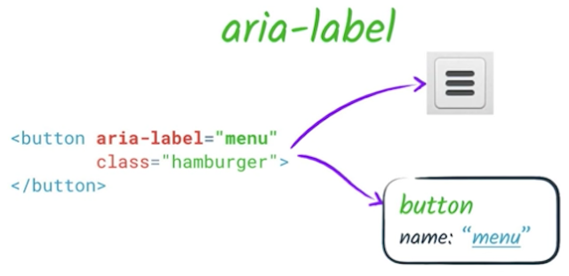

project_path: /web/_project.yaml
book_path: /web/fundamentals/_book.yaml
description: Using ARIA labels to create accessible element descriptions

{# wf_review_required #}
{# wf_updated_on: 2016-02-29 #}
{# wf_published_on: 2016-02-29 #}

# ARIA Labels {: .page-title }




ARIA provides several mechanisms for adding labels and descriptions to elements. In fact, ARIA is the only way to add accessible help or description text. Let's look at the properties ARIA uses to create accessible labels.

`aria-label` allows us to specify a string to be used as the accessible label. This overrides any other native labeling mechanism, such as a `label` element &mdash; for example, if a `button` has both text content and an `aria-label`, only the `aria-label` value will be used. 

You might use an `aria-label` attribute when you have some kind of visual indication of an element's purpose, such as a button that uses a graphic instead of text, but still need to clarify that purpose for anyone who cannot access the visual indication, such as a button that uses only an image to indicate its purpose.

`aria-labelledby` allows us to specify the ID of another element in the DOM as an element's label. This is much like using a `label` element, with some key differences.

 1. `aria-labelledby` may be used on any element, not just labelable elements.
 1. While a `label` element refers to the thing it labels, the relationship is reversed in the the case of `aria-labelledby` &mdash; the thing being labeled refers to the thing that labels it.
 1. Only one label element may be associated with a labelable element, but `aria-labelledby` can take a list of IDREFs to compose a label from multiple elements. The label will be concatenated in the order that the IDREFs are given.
 1. You can use `aria-labelledby` to refer to elements that are hidden and would otherwise not be in the accessibility tree. For example, you could add a hidden `span` next to an element you want to label, and refer to that with `aria-labelledby`.
 1. However, since ARIA only affects the accessibility tree, `aria-labelledby` does not give you the familiar label-clicking behavior you get from using a `label` element.

Importantly, `aria-labelledby` overrides **all** other name sources for an element. So, for example, if an element has both an `aria-labelledby` and an `aria-label`, or an `aria-labelledby` and a native HTML `label`, the `aria-labelledby` label always takes precedence.

ARIA allows us to add extra semantics to  HTML via attributes. Essentially, it allows us to modify the accessibility tree without changing anything else about the page presentation or behavior. By default, it won't affect styling nor interactive behavior; the only thing it changes is how the page appears to assistive technology users.

We've taken a look at how to use ARIA to change an element's role, state, and properties, and how we can use ARIA to fine-tune the accessible name. Next, we'll learn more about how ARIA semantics interact with native HTML semantics. We'll look at some ARIA attributes that allow us to define more nuanced element relationships than we can express in the DOM alone, and we'll learn how and why to hide or show information exclusively for assistive technology users.
