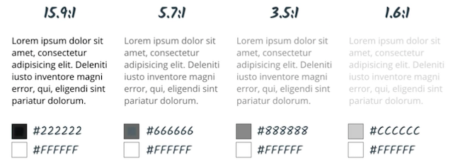
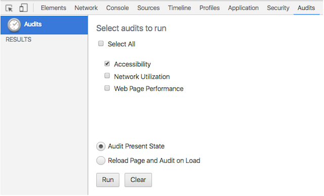

project_path: /web/_project.yaml
book_path: /web/fundamentals/_book.yaml
description: Color and contrast recommendations for improving accessibility

{# wf_review_required #}
{# wf_updated_on: 2016-02-29 #}
{# wf_published_on: 2016-02-29 #}

# Color and Contrast {: .page-title }




If you have good vision, it's easy to assume that everyone perceives colors, or text legibility, the same way you do &mdash; but of course that's not the case. Let's wrap things up by looking at how we can effectively use color and contrast to create pleasant designs that are accessible to everyone.

As you might imagine, some color combinations that are easy for many people to read are difficult or impossible for others. This usually comes down to *color contrast*, the relationship between the foreground and background colors' *luminance*. When the colors are similar, the contrast ratio is low; when they are different, the contrast ratio is high.

The <a href="http://webaim.org/standards/wcag/" target="_blank">WebAIM guidelines</a> recommend an AA (minimum) contrast ratio of 4.5:1 for all text. An exception is made for very large text (120-150% larger than the default body text), for which the ratio can go down to 3:1. Notice the difference in the contrast ratios shown below.

The contrast ratio of 4.5:1 was chosen for level AA because it compensates for the loss in contrast sensitivity usually experienced by users with vision loss equivalent to approximately 20/40 vision. 20/40 is commonly reported as typical visual acuity of people at about age 80. For users with low vision impairments or color deficiencies, we can increase the contrast up to 7:1 for body text.

You can use the <a href="https://chrome.google.com/webstore/detail/accessibility-developer-t/fpkknkljclfencbdbgkenhalefipecmb?hl=en" target="_blank">Accessibility DevTools extension</a> in Chrome to identify contrast ratios. One benefit of using the Chrome Devtools is that they will suggest AA and AAA (enhanced) alternatives to your current colors, and you can click the values to preview them in your app.

To run a color/contrast audit, follow these basic steps.

 1. After installing the extension, click `Audits`
 1. Uncheck everything except `Accessibility`
 1. Click `Audit Present State`
 1. Note any contrast warnings

WebAIM itself provides a handy <a href="http://webaim.org/resources/contrastchecker/" target="_blank">color contrast checker</a> you can use to examine the contrast of any color pair.
