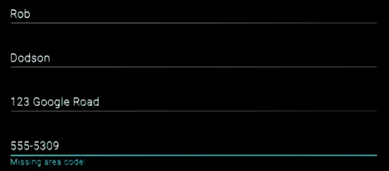

project_path: /web/_project.yaml
book_path: /web/fundamentals/_book.yaml
description: Using high-contrast mode to improve accessibility

{# wf_review_required #}
{# wf_updated_on: 2016-02-29 #}
{# wf_published_on: 2016-02-29 #}

# High-contrast Mode {: .page-title }




High-contrast mode allows a user to invert foreground and background colors, which often helps text stand out better. For someone with a low vision impairment, high-contrast mode can make it much easier to navigate the content on the page. There are a few ways to get a high-contrast setup on your machine.

Operating systems like Mac OSX and Windows offer high-contrast modes that can be enabled for everything at the system level. Or users can install an extension, like the <a href="https://chrome.google.com/webstore/detail/high-contrast/djcfdncoelnlbldjfhinnjlhdjlikmph?hl=en-US" target="_blank">Chrome High Contrast extension</a> to enable high-contrast only in that specific app.

A useful exercise is to turn on high-contrast settings and verify that all of the UI in your application is still visible and usable.

For example, a navigation bar might use a subtle background color to indicate which page is currently selected. If you view it in a high-contrast extension, that subtlety completely disappears, and with it goes the reader's understanding of which page is active.

Similarly, if you consider the example from the previous lesson, the red underline on the invalid phone number field might be displayed in a hard-to-distinguish blue-green color.

If you are meeting the contrast ratios covered in the previous lessons you should be fine when it comes to supporting high-contrast mode. But for added peace of mind, consider installing the Chrome High Contrast extension and giving your page a once-over just to check that everything works, and looks, as expected.
