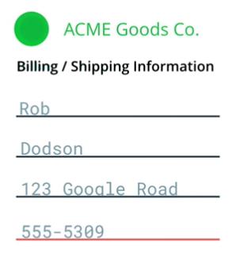
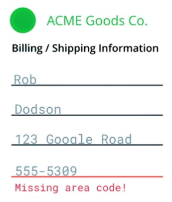

project_path: /web/_project.yaml
book_path: /web/fundamentals/_book.yaml
description: Don't convey information with color alone

{# wf_review_required #}
{# wf_updated_on: 2016-02-29 #}
{# wf_published_on: 2016-02-29 #}

# Color Deficiency and Accessibility {: .page-title }




There are roughly 320 million users with color vision deficiency. About 1 in 12 men and 1 in 200 women have some form of "color blindness"; that means about 1/20th, or 5%, of your users will not experience your site the way you intended. When we rely on color to convey information, we push that number to unacceptable levels.

>The term "color blindness" is often used to describe a visual condition where a person has trouble distinguishing colors, but in fact very few people are truly color blind. Most people with color deficiencies can see some or most colors, but have difficulty differentiating between certain colors such as reds and greens (most common), browns and oranges, and blues and purples.

For example, in an input form, a telephone number might be underlined in red to show that it is invalid. But to a color deficient or screen reader user, that information is not conveyed well, if at all. Thus, you should always try to provide multiple avenues for the user to access critical information.

The <a href="http://webaim.org/standards/wcag/checklist#sc1.4.1" target="_blank">WebAIM checklist states in section 1.4.1</a> that "color should not be used as the sole method of conveying content or distinguishing visual elements." It also notes that "color alone should not be used to distinguish links from surrounding text" unless they meet certain contrast requirements. Instead, the checklist recommends adding an additional indicator such as an underscore (using the CSS `text-decoration` property) to indicate when the link is active.

An easy way to fix the previous example is to add an additional message to the field, announcing that it is invalid and why. 

When you're building an app, keep these sorts of things in mind and watch out for areas where you may be relying too heavily on color to convey important information.

If you're curious about how your site looks to different people, or if you rely heavily on the use of color in your UI, you can use the <a href="https://chrome.google.com/webstore/detail/nocoffee/jjeeggmbnhckmgdhmgdckeigabjfbddl?hl=en-US" target="_blank">NoCoffee Chrome extension</a> to simulate various forms of visual impairment, including different types of color blindness. 
