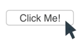
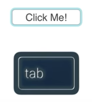

For native elements like `button`, browsers can detect whether user interaction occurred via the mouse or the keyboard press, and typically only display the focus ring for keyboard interaction. For example, when you click this native button with the mouse

there is no focus ring, but when you tab to it with the keyboard

the focus ring appears. 

The logic here is that mouse users are less likely to need the focus ring because they know what element they clicked. But where does that leave us in our accessibility efforts? Unfortunately there isn't currently a single cross-browser solution that yields this same behavior. But there are some options.

In Firefox, the `:-moz-focusring` CSS pseudo-class allows you to write a focus style that is only applied if the element is focused via the keyboard, quite a handy feature. While this pseudo-class is currently only supported in Firefox, there is currently work going on to add it to other browsers.

There is also <a href="http://radar.oreilly.com/2015/08/proposing-css-input-modailty.html" target="_blank">this great article by Alice Boxhall</a> that explores the topic of modality and contains prototype code for differentiating between mouse and keyboard input. You can use her solution today, and then include the focus ring pseudo-class later when it has more widespread support.

A different approach is to use ARIA styles to indicate control states. When you build components, it's common practice to reflect their state, and thus their appearance, using CSS classes controlled with JavaScript.

Fox example, consider a toggle button that goes into a "pressed" visual state when clicked and retains that state until it is clicked again. To style the state, your JavaScript might add a `pressed` class to the button. And, because you want good semantics on all your controls, you would also set the `aria-pressed` state for the button to `true`.

A useful technique to employ here is to remove the class altogether, and just use the ARIA attributes to style the element. Now you can update the CSS selector for the pressed state of the button from this


.toggle.pressed { ... }


to this.


.toggle[aria-pressed="true"] { ... }


This creates both a logical and a semantic relationship between the ARIA state and the element's appearance, and cuts down on extra code as well.
