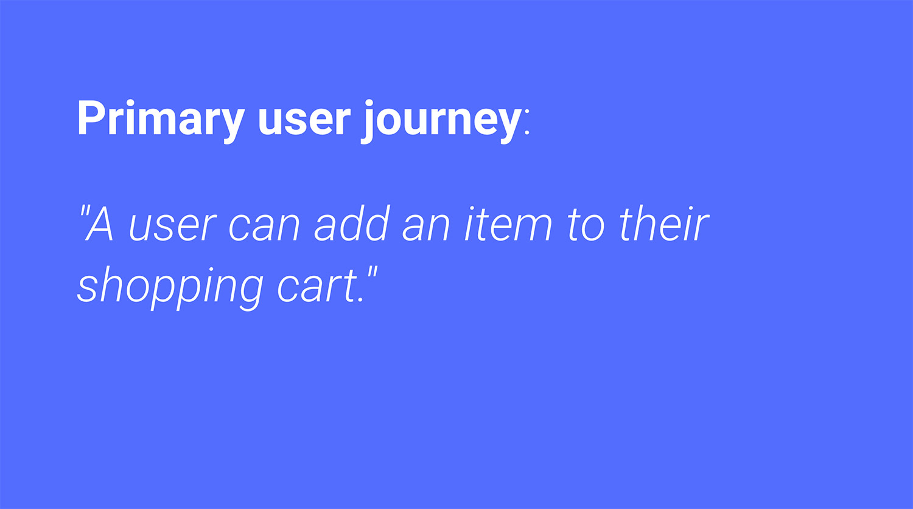
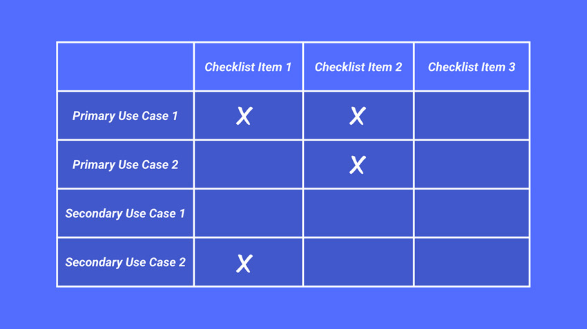
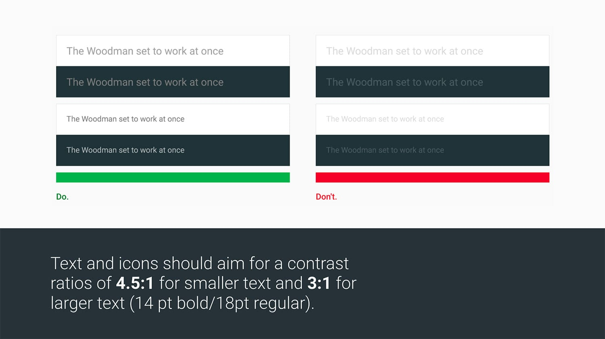
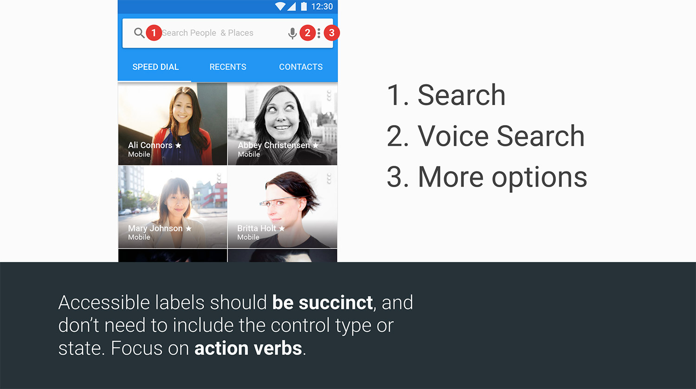
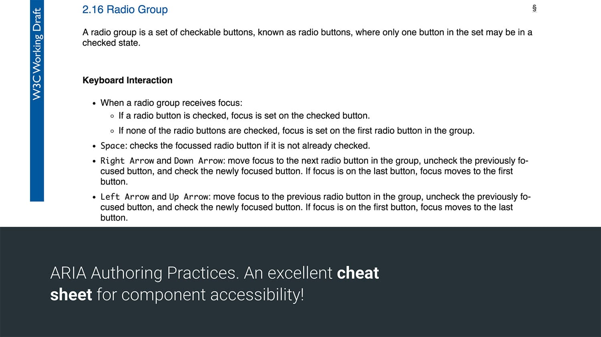

project_path: /web/fundamentals/_project.yaml
book_path: /web/fundamentals/_book.yaml
description: How to incorporate accessibility into your team's process.

{# wf_updated_on: 2017-08-01 #}
{# wf_published_on: 2017-08-01 #}
{# wf_blink_components: Blink>Accessibility #}

# Accessibility for teams {: .page-title }



Making your site more accessible can be a daunting task. If you are approaching
accessibility for the first time, the sheer breadth of the topic can leave you
wondering where to start. After all, working to accommodate a diverse range of
abilities means there are a correspondingly diverse range of issues to consider.

Remember, accessibility is a team effort. Every person has a role to play. This
article outlines criteria for each of the major disciplines (project manager, UX
designer, and developer) so that they can work to incorporate accessibility best
practices into their process.

  <iframe class="devsite-embedded-youtube-video" data-video-id="A5XzoDT37iM"
          data-autohide="1" data-showinfo="0" frameborder="0" allowfullscreen>
  </iframe>

## Project manager {: #project-manager }

An overriding goal for any project manager is to try to include accessibility
work in every milestone; making sure it’s just as much a priority as other
topics like performance, and user experience. Below are a few checklist items to
keep in mind when working through your process.

- Make accessibility training available to the team.
- Identify critical user journeys in the site or application.
- Try to incorporate an accessibility checklist into the team process.
- Where possible, evaluate the site or application with user studies.

### Accessibility training

There are a number of great free resources for learning about web accessibility.
Setting aside time for your team to study the topic can make it easier to
include accessibility early in the process.

Some resources provided by Google include:

[Web Accessibility by Google](https://bit.ly/web-a11y) — a multi-week interactive
training course.

[Accessibility Fundamentals](https://bit.ly/a11y-fundamentals) — written
accessibility guides and best practices.

[Material Guidelines: Accessibility](https://bit.ly/a11y-material) — a set of
UX best practices for inclusive design.

### Identifying critical user journeys

Every application has some primary action that the user needs to take. For
example, if you're building an e-commerce app, then every user will need to be
able to add an item to their shopping cart.

Some actions may be of secondary importance, and perhaps only performed
occasionally. For example, changing your avatar photo is a nice feature, but
may not be critical for every experience.

Identifying the primary and secondary actions in your application will help you
prioritize the accessibility work ahead. Later, you can combine these actions
with an accessibility checklist to keep track of your progress and avoid
regressions.

### Incorporating an accessibility checklist

The topic of accessibility is quite broad, so having a checklist of
important areas to consider can help you make sure you're covering all of your
bases.

There are a number of accessibility checklists out there, a few industry
examples include:

[WebAIM WCAG Checklist](https://webaim.org/standards/wcag/checklist)

[Vox Accessibility Guidelines](https://accessibility.voxmedia.com)

With a checklist in hand, you can look over your primary and secondary actions
to start to triage what work still needs to be done. You can get pretty tactical
about this process and even build a matrix of primary and secondary actions and
determine for each step in those processes, whether there are any missing
accessibility bits.

### Evaluating with user studies

Nothing beats sitting down with actual users and observing them as they try to
use your app. If you're retrofitting accessibility into an existing experience,
this process can help you quickly identify areas that need improvement. And if
you're starting a new project, early user studies can help you
avoid spending too much time developing a feature that is difficult to use.

Aim to incorporate feedback from as diverse of a user population as possible.
Consider users who primarily navigate with the keyboard, or rely on assistive
technology like screen readers or screen magnifiers.

## UX designer

Because people tend to design using their own biases, if you don't have a
disability and don't have colleagues with disabilities, you might be
unintentionally designing for only some of your users. As you work, ask yourself
"what are all the types of users who might rely on this design?" Here are some
techniques you can try to make your process more inclusive.

- Content has sufficient color contrast.
- The tab order is defined.
- Controls have accessible labels.
- There are multiple ways to interact with the UI.

### Content has good color contrast

The primary goal of most sites is to convey some information to the user, either
through written text or images. However, if this content is low contrast, it may
be difficult for some users (particularly those with a vision impairment) to 
read. This may negatively affect their user experience. To address
this concern, aim for all text and images to have sufficient color contrast.

Contrast is measured by comparing the luminance of a foreground and background
color. For smaller text (anything below 18pt or 14pt bold) a minimum ratio of
4.5:1 is recommended. For larger text, this ratio can be adjusted to 3:1.

In the image below, the text on the left hand side meets these contrast
minimums, whereas the text on right hand side is low contrast.

There are a number of tools for measuring color contrast, such as Google’s [Material
Color Tool](https://material.io/color), [Lea Verou's Contrast Ratio
app](https://leaverou.github.io/contrast-ratio), and Deque’s
[aXe](https://chrome.google.com/webstore/detail/axe/lhdoppojpmngadmnindnejefpokejbdd).

### Tab order is defined

The tab order is the order in which elements receive focus as the user
presses the tab key. For users who navigate primarily with a keyboard, the
tab key is their primary means of reaching everything on screen. Think of it
like their mouse cursor.

Ideally the tab order should follow the reading order and flow from the top of
the page to the bottom, with more important items appearing higher up in the
order. This makes it more efficient for anyone using a keyboard to quickly reach
these items.

The mock interface above is numbered to show the tab order. Creating a mock like
this can help by identifying the intended tab order. This can then be shared
with the developers and QA testers to make sure it is properly implemented and
tested.

### Controls have accessible labels

For users of assistive technology like screen readers, labels provide
information that would otherwise be visual only. For example a search button
that's just a magnifying glass icon can have an accessible label of "Search" to
help fill in the missing visual affordance.

Here are a few simple suggestions to follow when designing accessible labels:

- Be succinct - It can be tedious to listen to long descriptions.
- Try not to include control type or state - If the control is coded properly
  then a screen reader will announce this automatically.
- Focus on action verbs - Use "search" not "magnifying glass".

You might consider creating a mock with all of your controls labeled. This can
be shared with your development team and QA team for implementation and testing.

### Multiple ways to interact with and understand UI

It's easy to assume that all users interact with the
page primarily using a mouse. When designing, consider how someone will
interact with a control using a keyboard instead.

Plan your focus states! This means determining what a control will look like
when the user focuses it with tab or presses the arrow keys. It's useful to have
these states planned early, rather than trying to shoehorn them into the design
later.

Finally, for any point of interaction, you want to make sure that the user has
multiple ways of understanding the content. Try not to use color alone to convey
information, as these subtle cues may be missed by a user with a color vision
deficiency. A classic example is an invalid text field. Instead of just a red
underline to signify a problem, also consider adding some helper text. That
way you're covering more bases and increasing the likelihood that a user will
notice the issue.

## Developer

The developer's role is where focus management and semantics combine to form a
robust user experience. Below are a few items a developers can keep in mind as
they're working on their site or application:

- The tab order is logical.
- Focus is properly managed and visible.
- Interactive elements have keyboard support.
- ARIA roles and attributes are applied as needed.
- Elements are properly labeled.
- Testing is automated.

### Logical tab order

Native elements like `input`, `button`, and `select` get opted into the tab
order for free and are automatically focusable with the keyboard. But not all
elements receive this same behavior! In particular, generic elements like `div`,
and `span`, are not opted into the tab order. This means if you use a `div` to
create an interactive control, you'll need to do additional work to make
it keyboard accessible.

Two options are:

- Give the control a `tabindex="0"`. This will at least make it focusable,
  though you'll likely need to do additional work to add support for keypresses.
- Where possible, consider using a `button` instead of a `div` or `span` for any
button-like control. The native `button` element is very easy to style and gets
keyboard support for free.

  <iframe class="devsite-embedded-youtube-video" data-video-id="CZGqnp06DnI"
          data-autohide="1" data-showinfo="0" frameborder="0" allowfullscreen>
  </iframe>

### Managing focus

When you change the content of the page, it's important to direct the user's
attention by moving focus. A classic example of when this technique is useful is
when opening a modal dialog. If a user relying on a keyboard presses a button to
open a dialog and their focus _is not_ moved into the dialog element, then their
only course of action is to tab through the entire site until they eventually
find the new control. By moving focus into the new content as soon as it
appears, you can improve the efficiency of these users’ experiences.

  <iframe class="devsite-embedded-youtube-video" data-video-id="JS68faEUduk"
          data-autohide="1" data-showinfo="0" frameborder="0" allowfullscreen>
  </iframe>

### Keyboard support for interactive elements

If you're building a custom control like a carousel or dropdown, then you'll
need to do some additional work to add keyboard support. The [ARIA Authoring
Practices Guide](https://w3.org/TR/wai-aria-practices-1.1) is a useful resource
which identifies various UI patterns and the kinds of keyboard actions they are
expected to support.

To learn more about adding keyboard support to an element, take a look at the
[roving tabindex](/web/fundamentals/accessibility/focus/using-tabindex#managing_focus_in_components)
section in Google’s Accessibility Fundamentals docs.

### ARIA roles and attributes are applied as needed

Not only do custom controls need proper keyboard support, they also need proper
semantics. After all, a `div`, semantically, is just a generic grouping
container. If you're using a `div` as the basis for your dropdown menu, you'll
need to rely on
[ARIA](/web/fundamentals/accessibility/semantics-aria/)
to layer in additional semantics so the control type can be conveyed to
assistive technology. Here again the
[ARIA Authoring Practices Guide](https://w3.org/TR/wai-aria-practices-1.1)
can help by identifying which roles, states, and properties you should be using.
As an added bonus, many of the explanations in the ARIA guide also come with
sample code!

### Labeling elements

For labeling native inputs, you can use the built-in
[`<label>` element](https://developer.mozilla.org/en-US/docs/Web/HTML/Element/label)
as described on MDN. Not only will this help you create an onscreen visual
affordance, but it also gives the input an accessible name in the accessibility
tree. This name is then picked up by assistive technology (like a screen reader)
and announced to the user.

Unfortunately `<label>` _does not_ support giving an accessible name to custom
controls (like ones created using [Custom
Elements](/web/fundamentals/web-components/customelements)
or out of simple divs and spans). For these kinds of controls you'll need to use
the [`aria-label` and `aria-labelledby`
attributes](/web/fundamentals/accessibility/semantics-aria/aria-labels-and-relationships#labels).

### Automated testing

Being lazy can be good, especially when it comes to testing. Wherever possible
seek to automate your accessibility tests so you don't have to do everything
manually. There are a number of great industry testing tools that exist today to
make it easy and fast to check for common accessibility issues:

aXe, created by Deque systems, is available as a [Chrome
extension](https://chrome.google.com/webstore/detail/axe/lhdoppojpmngadmnindnejefpokejbdd)
and [a Node module](https://github.com/dequelabs/axe-core) (good for continuous
integration environments). This short A11ycast explains a few different ways to
incorporate aXe into your development process.

  <iframe class="devsite-embedded-youtube-video" data-video-id="jC_7NnRdYb0"
          data-autohide="1" data-showinfo="0" frameborder="0" allowfullscreen>
  </iframe>

[Lighthouse](/web/tools/lighthouse/) is Google’s
open source project for auditing the performance of your Progressive Web Apps.
In addition to checking if your PWA has support for things like [Service
Worker](/web/fundamentals/getting-started/primers/service-workers)
and a [Web App
Manifest](/web/fundamentals/engage-and-retain/web-app-manifest/),
Lighthouse will also run a series of best practice tests, including tests for
accessibility issues.

## Conclusion

Accessibility is a team effort. Everyone has a role to play. This guide has laid
out a few key items that each team member can use to quickly ramp up on the
subject and hopefully improve the overall experience of their app.

To learn more about accessibility, be sure to check out [our free Udacity
course](https://bit.ly/web-a11y) and browse [the accessibility docs](/web/fundamentals/accessibility/)
available here on Web Fundamentals.

