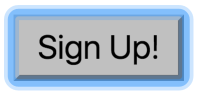
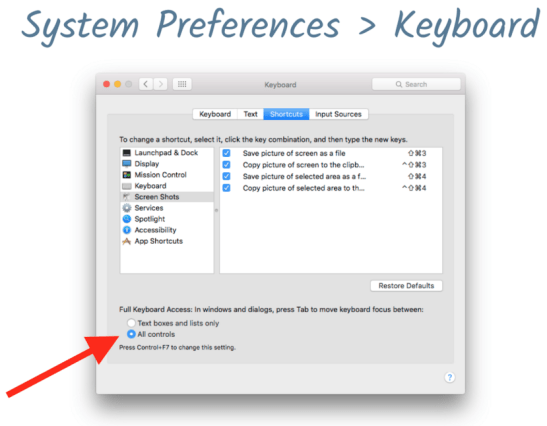
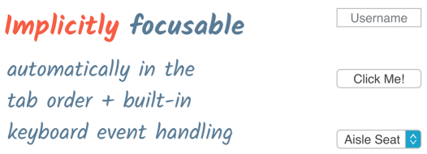
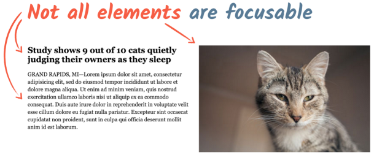
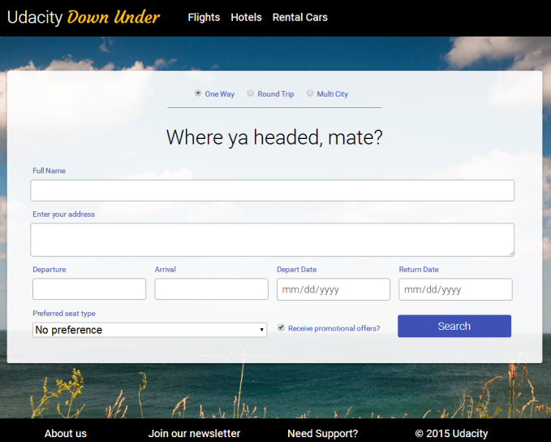

project_path: /web/_project.yaml
book_path: /web/fundamentals/_book.yaml
description: Overview of screen focus in accessibility

{# wf_review_required #}
{# wf_updated_on: 2016-02-29 #}
{# wf_published_on: 2016-02-29 #}

# Introduction to Focus {: .page-title }





In this lesson we'll talk about *focus* and how you can manage it in your application. Focus refers to which control on the screen (an input item such as a field, checkbox, button, or link) currently receives input from the keyboard, and from the clipboard when you paste content.

This is a great place to start learning about accessibility because we all know how to use a keyboard, it's easy to relate to and test, and it benefits virtually all users. 

Users with motor impairments, which could be anything from permanent paralysis to a sprained wrist, may rely on a keyboard or switch device to navigate your page, so a good focus strategy is critical to providing a good experience for them.

And for the power users who know every keyboard shortcut on their machine, being able to quickly navigate your site with the keyboard alone will certainly make them more productive.

Thus, a well implemented focus strategy ensures that everyone using your application has a better experience. We'll see in the upcoming lessons that the effort you put into focus is an important basis for supporting assistive technology users and, indeed, all users.

## What is focus?

Focus determines where keyboard events go in the page at any given moment. For instance, if you focus a text input field and begin typing, the input field receives the keyboard events and displays the characters you type. While it has focus, it will also receive pasted input from the clipboard.

The currently focused item is often indicated by a *focus ring*, the style of which depends on both the browser and on any styling the page author has applied. Chrome, for instance, typically highlights focused elements with a blue border, whereas Firefox uses a dashed border.

Some users operate their computer almost entirely with the keyboard or other input device. For those users, focus is critical; it's their primary means of reaching everything on the screen. For that reason, the Web AIM checklist states in section 2.1.1 that <a href="http://webaim.org/standards/wcag/checklist#sc2.1.1" target="_blank">all page functionality should be available using the keyboard</a>, unless it's something you cannot do with a keyboard, such as freehand drawing.

As a user, you can control which element is currently focused using `Tab`, `Shift+Tab`, or the arrow keys. On Mac OSX this works a little differently: while Chrome always lets you navigate with `Tab`, you need to press `Option+Tab` to change focus in other browsers like Safari. (You can change this setting in the Keyboard section of System Preferences.)

The order in which focus proceeds forward and backward through interactive elements via `Tab` is called, not surprisingly, the *tab order*. Ensuring that you design your page with a logical tab order is an important step that we'll cover later.

## What is focusable?

Built-in interactive HTML elements like text fields, buttons, and select lists are *implicitly focusable*, meaning they are automatically inserted into the tab order and have built-in keyboard event handling without developer intervention.

But not all elements are focusable; paragraphs, divs, and various other page elements are not focused as you tab through the page, and that's by design. There's generally no need to focus something if the user can't interact with it.

## Experiencing focus

Let's try some of the focus techniques we just discussed. Using Chrome, go to this <a href="http://udacity.github.io/ud891/lesson2-focus/01-basic-form/" target="_blank">airline site mockup page</a> and search for a specific ticket **using only keyboard input**. The page doesn't accept mouse input, so you can't fudge the exercise (not that we don't trust you ;-). 

The ticket parameters you should specify are:

 - one way
 - to Melbourne
 - leaving on 12 October 2017 (10/12/2017)
 - returning on 23 October 2017 (10/23/2017)
 - window seat
 - do not want to receive promotional offers

When you successfully complete the form with no input errors and activate the Search button, the form will simply clear and reset. Go ahead and complete the form, then come back.

Let's examine how the form uses your keyboard input. Starting with your first few `Tab` presses, the browser highlights the navigation items for Flights, Hotels, and Rental Cars. As you continue to press `Tab` you proceed to the radiobutton group where you can choose from Round Trip, One Way, or Multi City using the arrow keys. 

Continue through the name and address fields, filling in the required information. When you arrive at the destination select element, you can use the arrow keys to choose a city, or you can start typing to autocomplete the field. Similarly, in the date fields, you can use the arrow keys or just type a date. 

Selecting a seat type also relies on the arrow keys, or you can type "w", "a", or "n" to jump to a seat option. Then you can disable the promotional offers default by pressing the spacebar while the checkbox is focused. Finally, focus the Search button and press `Enter` to submit the form.

It's very handy to interact with a form using just the keyboard and to not have to switch to the mouse and back to complete a task. Because all of the elements used in the form are native HTML tags with implicit focus, the form works fine with the keyboard, and you don't have to write any code to add or manage focus behavior.

