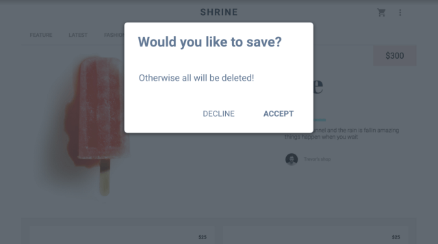

project_path: /web/_project.yaml
book_path: /web/fundamentals/_book.yaml
description: Modifying the DOM order with tabindex

{# wf_review_required #}
{# wf_updated_on: 2016-02-29 #}
{# wf_published_on: 2016-02-29 #}

# Using tabindex {: .page-title }





The default tab order provided by the DOM position of native elements is
convenient, but there are times when you'll want to modify the tab order, and
physically moving elements in the HTML isn't always an optimal, or even a
feasible, solution. For these cases you can use the `tabindex` HTML attribute to
explicitly set an element's tab position.

`tabindex` can be applied to any element &mdash; although it is not necessarily
useful on every element &mdash; and takes a range of integer values. Using
`tabindex`, you can specify an explicit order for focusable page elements,
insert an otherwise unfocusable element into the tab order, and remove elements
from the tab order. For example:

`tabindex="0"`: Inserts an element into the natural tab order. The element can
be focused by pressing the `Tab` key, and the element can be focused by calling
its `focus()` method

    <custom-button tabindex="0">Press Tab to Focus Me!</custom-button>


&nbsp;&nbsp;<custom-button tabindex="0">Press Tab to Focus Me!</custom-button>


`tabindex="-1"`: Removes an element from the natural tab order, but the element
can still be focused by calling its `focus()` method

    <button id="foo" tabindex="-1">I'm not keyboard focusable</button>
    <button onclick="foo.focus();">Focus my sibling</button>


<button id="foo" tabindex="-1">I'm not keyboard focusable</button>
<button onclick="foo.focus();">Focus my sibling</button>


`tabindex="5"`: Any tabindex greater than 0 jumps the element to the front of
the natural tab order. If there are multiple elements with a tabindex greater
than 0, the tab order starts from the lowest value that is greater than zero and
works its way up. Using a tabindex greater than 0 is considered an
**anti-pattern**.

    <button>I should be first</button>
    <button>And I should be second</button>
    <button tabindex="5">But I jumped to the front!</button>


<button>I should be first</button>
<button>And I should be second</button>
<button tabindex="5">But I jumped to the front!</button>


This is particularly true of non-input elements like headers, images, or article
titles. Adding `tabindex` to those kinds of elements is counter-productive. If
possible, it's best to arrange your source code so the DOM sequence provides a
logical tab order. If you do use `tabindex`, restrict it to custom interactive
controls like buttons, tabs, dropdowns, and text fields; that is, elements the
user might expect to provide input to.

Don't worry about screen reader users missing important content because it
doesn't have a `tabindex`. Even if the content is very important, like an image,
if it's not something the user can interact with, there's no reason to make it
focusable. Screen reader users can still understand the content of the image so
long as you provide proper `alt` attribute support, which we'll cover shortly.

## Managing focus at the page level

Here's a scenario where `tabindex` is not only useful, but necessary. You might
be building a robust single page with different content sections, not all of
which are simultaneously visible. In this kind of page, clicking a navigation
link might change the visible content without doing a page refresh.

When this happens, you would probably identify the selected content area, give
it a `tabindex` of -1 so that it doesn't appear in the natural tab order, and
call its `focus` method. This technique, called *managing focus*, keeps the
user's perceived context in sync with the site's visual content.

## Managing focus in components

Managing focus when you change something on the page is important, but sometimes
you need to manage focus at the control level &mdash; for example, if you're
building a custom component.

Consider the native `select` element. It can receive basic focus but, once
there, you can use the arrow keys to expose additional functionality (the
selectable options). If you were building a custom `select` element, you would
want to expose these same kinds of behaviors so that users who rely primarily on
the keyboard could still interact with your control.

    <!-- Focus the element using Tab and use the up/down arrow keys to navigate -->
    <select>
      <option>Aisle seat</option>
      <option>Window seat</option>
      <option>No preference</option>
    </select>


<select>
  <option>Aisle seat</option>
  <option>Window seat</option>
  <option>No preference</option>
</select>


Knowing which keyboard behaviors to implement can be difficult, but there is a
helpful document you can refer to. The <a
href="https://www.w3.org/TR/wai-aria-practices/" target="_blank">Accessible Rich
Internet Applications (ARIA) Authoring Practices</a> guide lists types of
components and what kinds of keyboard actions they support. We will cover ARIA
in more detail later, but for now let's use the guide to help us add keyboard
support to a new component.

Perhaps you're working on some new [Custom
Elements](/web/fundamentals/primers/customelements/) that resemble a set of
radio buttons, but with your unique take on appearance and behavior.

    <radio-group>
      <radio-button>Water</radio-button>
      <radio-button>Coffee</radio-button>
      <radio-button>Tea</radio-button>
      <radio-button>Cola</radio-button>
      <radio-button>Ginger Ale</radio-button>
    </radio-group>

To determine what kind of keyboard support they need, you would check the ARIA
Authoring Practices guide. Section 2 contains a list of design patterns, and in
that list is a <a href="https://www.w3.org/TR/wai-aria-practices/#radiobutton"
target="_blank">characteristics table for radio groups</a>, the existing
component that most closely matches your new element.

As you can see in the table, one of the common keyboard behaviors that should be
supported is the up/down/left/right arrow keys. To add this behavior to the new
component, we'll use a technique called *roving tabindex*.

Roving tabindex works by setting `tabindex` to -1 for all children except the
currently-active one.

    <radio-group>
      <radio-button tabindex="0">Water</radio-button>
      <radio-button tabindex="-1">Coffee</radio-button>
      <radio-button tabindex="-1">Tea</radio-button>
      <radio-button tabindex="-1">Cola</radio-button>
      <radio-button tabindex="-1">Ginger Ale</radio-button>
    </radio-group>

The component then uses a keyboard event listener to determine which key the
user presses; when this happens, it sets the previously focused child's
`tabindex` to -1, sets the to-be-focused child's `tabindex` to 0, and calls the
focus method on it.

    <radio-group>
      // Assuming the user pressed the down arrow, we'll focus the next available child
      <radio-button tabindex="-1">Water</radio-button>
      <radio-button tabindex="0">Coffee</radio-button> // call .focus() on this element
      <radio-button tabindex="-1">Tea</radio-button>
      <radio-button tabindex="-1">Cola</radio-button>
      <radio-button tabindex="-1">Ginger Ale</radio-button>
    </radio-group>

When the user reaches the last (or first, depending on the direction they're
moving the focus) child, you will loop around and focus the first (or last)
child again.

You can give the completed example a try down below. Inspect the element in the
DevTools to observe the tabindex moving from one radio to the next.



  <radio-group>
    <radio-button>Water</radio-button>
    <radio-button>Coffee</radio-button>
    <radio-button>Tea</radio-button>
    <radio-button>Cola</radio-button>
    <radio-button>Ginger Ale</radio-button>
  </radio-group>



You can view <a href="//TODO">the complete source for this element</a> over on
GitHub

## Modals and keyboard traps

Sometimes when you're managing focus you can get into a situation you can't get
out of. Consider an autocomplete widget that tries to manage focus and captures
the tab behavior, but prevents the user from leaving it until it's complete.
This is called a *keyboard trap*, and it can be very frustrating for the user.
Section 2.1.2 of the Web AIM checklist addresses this issue, stating that <a
href="http://webaim.org/standards/wcag/checklist#sc2.1.2"
target="_blank">keyboard focus should never be locked or trapped at one
particular page element</a>. The user should be able to navigate to and from all
page elements using only the keyboard.

Oddly, there are times when this behavior is actually desirable, like in a modal
window. Normally, when the modal is displayed, you don't want the user to access
the content behind it. You might add an overlay to cover the page visually, but
that doesn't stop keyboard focus from accidentally traveling outside the modal.

In instances like this you can implement a temporary keyboard trap to ensure
that you trap focus only while the modal is displayed and then restore focus to
the previously-focused item when the modal is closed.

>There are some proposals on how to make this easier for developers, including
the `<dialog>` element, but they don't yet have widespread browser support.
>
>See <a href="https://developer.mozilla.org/en-US/docs/Web/HTML/Element/dialog"
target="_blank">this MDN article</a> for more information on `<dialog>`, and
this <a
href="https://accessibility.oit.ncsu.edu/training/aria/modal-window/version-3/"
target="_blank">North Carolina State University accessibility blog</a> for more
information on modal windows.

Consider a modal dialog represented by a `div` that contains a few elements, and
another `div` that represents a background overlay. Let's walk through the basic
steps needed to implement a temporary keyboard trap in this situation.

 1. Using `document.querySelector`, select the modal and overlay divs and store
    their references.
 1. As the modal opens, store a reference to the element that was focused when
    the modal was opened so you can return focus to that element.
 1. Use a *keydown listener* to grab keys as they are pressed while the modal is
    open. You could also listen for a click on the background overlay, and close
    the modal if the user clicks it.
 1. Next, get the collection of focusable elements within the modal. The first
    and last focusable elements will act as "sentinels" to let you know when to
    loop focus forward or backward to stay inside the modal.
 1. Display the modal window and focus the first focusable element.
 1. As the user presses `Tab` or `Shift+Tab`, move focus forward or backward,
    looping at the last or first elements as appropriate.
 1. If the user presses `Esc`, close the modal. This is very helpful because it
    allows the user to close the modal without searching for a specific close
    button, and it benefits even users who are using a mouse.
 1. When the modal is closed, hide it and the background overlay, and restore
    focus to the previously-focused element saved earlier.

This procedure gives you a usable, non-frustrating modal window that everyone
can use effectively.

For more details, you can examine this <a
href="https://github.com/udacity/ud891/blob/gh-pages/lesson2-focus/07-modals-and-keyboard-traps/solution"
target="_blank">sample code</a>, and view a live example from a <a
href="http://udacity.github.io/ud891/lesson2-focus/07-modals-and-keyboard-traps/solution/index.html"
target="_blank">completed page</a>.

