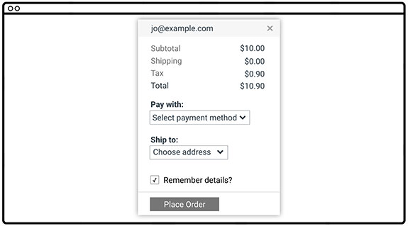
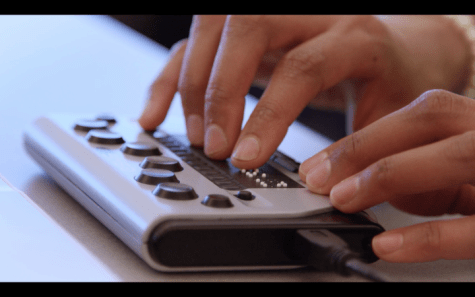
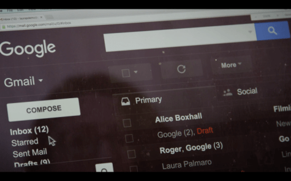
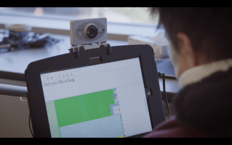
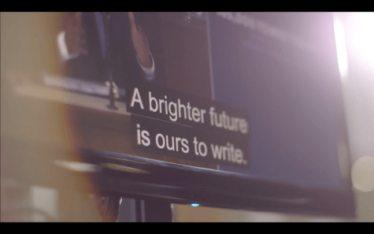

project_path: /web/_project.yaml
book_path: /web/fundamentals/_book.yaml
description: Improving accessibility for web pages

{# wf_review_required #}
{# wf_updated_on: 2016-06-26 #}
{# wf_published_on: 2016-06-26 #}

# Accessibility {: .page-title }





This document set is a text-based version of part of the content covered in the
<a href="https://www.udacity.com/course/web-accessibility--ud891"
target="_blank">Udacity course on Accessibility</a>. Rather than a direct
transcription of the video course, it is meant to be a more concise treatment of
accessibility principles and practices, using the course's original content as a
base.

## TL;DR {: .hide-from-toc }
- Learn what accessibility means and how it applies to web development.
- Learn how to make web sites accessible and usable for everyone.
- Learn how to include basic accessibility with minimal development impact.
- Learn what HTML features are available and how to use them to improve
  accessibility.
- Learn about advanced accessibility techniques for creating polished
  accessibility experiences.

Understanding accessibility, its scope, and its impact can make you a better web
developer. This guide is intended to help you understand how you can make your
websites accessible and usable for everyone.

"Accessibility" can be difficult to spell, but it doesn't have to be difficult
to accomplish. In this guide, you will see how to get some easy wins to help
improve accessibility with minimal effort, how you can use what's built in to
HTML to create more accessible and robust interfaces, and how to leverage some
advanced techniques for creating polished accessible experiences.

You'll also find that many of these techniques will help you create interfaces
that are more pleasant and easy to use for *all* users, not just for those with
disabilities.

Of course, many developers have only a hazy understanding of what accessibility
means &mdash; something to do with government contracts, checklists, and screen
readers, right? &mdash; and there are plenty of misconceptions floating around.
For example, many developers feel that addressing accessibility will force them
to choose between creating a delightful and attractive experience, and one that
is clunky and ugly but accessible.

That is, of course, not the case at all, so let's clear that up before we get
into anything else. What do we mean by accessibility, and what are we here to
learn about?

## What is accessibility?
Broadly speaking, when we say a site is accessible, we mean that the site's
content is available, and its functionality can be operated, by literally
*anyone*. As developers, it's easy to assume that all users can see and use a
keyboard, mouse, or touch screen, and can interact with your page content the
same way you do. This can lead to an experience that works well for some people,
but creates issues that range from simple annoyances to show-stoppers for
others.

Accessibility, then, refers to the experience of users who might be outside the
narrow range of the "typical" user, who might access or interact with things
differently than you expect. Specifically, it concerns users who are
experiencing some type of impairment or disability &mdash; and bear in mind that
that experience might be non-physical or temporary.

For example, although we tend to center our discussion of accessibility on users
with physical impairments, we can all relate to the experience of using an
interface that is not accessible to us for other reasons. Have you ever had a
problem using a desktop site on a mobile phone, or seen the message "This
content is not available in your area", or been unable to find a familiar menu
on a tablet? Those are all accessibility issues.

As you learn more, you'll find that addressing accessibility issues in this
broader, more general sense almost always improves the user experience for
everyone. Let's look at an example.

This form has several accessibility issues.

 - The text is low contrast, which is hard for low-vision users to read.
 - Having labels on the left and fields on the right makes it hard for many
   people to associate them, and almost impossible for someone who needs to zoom
   in to use the page; imagine looking at this on a phone and having to pan
   around to figure out what goes with what.
 - The "Remember details?" label isn't associated with the checkbox, so you have
   to tap or click only on the tiny square rather than just clicking the label;
   also, someone using a screen reader would have trouble figuring out the
   association.

Now let's wave our accessibility wand and see the form with those issues fixed.
We're going to make the text darker, modify the design so that the labels are
close to the things they're labeling, and fix the label to be associated with
the checkbox so you can toggle it by clicking the label as well.

Which would you rather use? If you said "the accessible version", you're on your
way to understanding a main premise of this guide. Often, something that's a
complete blocker for a few users is also a pain point for many others, so by
fixing the accessibility issue you improve the experience for everyone.

## Web Content Accessibility Guidelines

Throughout this guide we'll refer to the <a href="https://www.w3.org/TR/WCAG20/"
target="_blank">Web Content Accessibility Guidelines (WCAG) 2.0</a>, a set of
guidelines and best practices put together by accessibility experts to address
what "accessibility" means in a methodical way. Several countries actually
mandate the use of these guidelines in their web accessibility legal
requirements.

WCAG is organized around four principles often called by the acronym *POUR*:

 - **Perceivable**: Can users perceive the content? This helps us keep in mind
   that just because something is perceivable with one sense, such as sight,
   that doesn't mean that all users can perceive it.

 - **Operable**: Can users use UI components and navigate the content? For
   example, something that requires a hover interaction cannot be operated by
   someone who can't use a mouse or touch screen.

 - **Understandable**: Can users understand the content? Can users understand
   the interface and is it consistent enough to avoid confusion?

 - **Robust**: Can the content be consumed by a wide variety of user agents
   (browsers)? Does it work with assistive technology?

While WCAG provides a comprehensive overview of what it means for content to be
accessible, it can also be a bit overwhelming. To help mitigate this, the <a
href="http://webaim.org/" target="_blank">WebAIM</a> (Web Accessibility in Mind)
group has distilled the WCAG guidelines into an easy-to-follow checklist,
targeted specifically for web content.

The <a href="http://webaim.org/standards/wcag/checklist" target="_blank">WebAIM
checklist</a> can give you a short, high-level summary of what you need to
implement, while also linking to the underlying WCAG specification if you need
an expanded definition.

With this tool in hand, you can chart a direction for your accessibility work
and be confident that, as long as your project meets the outlined criteria, your
users should have a positive experience accessing your content.

## Understanding users' diversity

When learning about accessibility, it helps to have an understanding of the
diverse range of users in the world and the kinds of accessibility topics that
affect them. To explain further, here's an informative question/answer session
with Victor Tsaran, a Technical Program Manager at Google, who is totally blind.

<figure>
  	
  <figcaption>Victor Tsaran</figcaption>
</figure>

*What do you work on at Google?*

>Here at Google my job is to help ensure that our products work for all of our
diverse users, regardless of impairment or ability.

 *What kinds of impairments do users have?*

>When we think about the kinds of impairments which would make it difficult for
someone to access our content, many people will immediately picture a blind user
like me. And it's true, this impairment can really make it frustrating or even
impossible to use a lot of web sites.
>
>A lot of modern web techniques have the unfortunate side effect of creating
sites which don't work well with the tools used by blind users to access the
web. However, there is actually more to accessibility than that. We find it
useful think of impairments falling into four broad buckets: visual, motor,
hearing, and cognitive.

 *Let's go through those one at a time. Can you give some examples of visual
 impairments?*

>Visual impairments can be split into a few categories: Users with no vision,
like me, might use a screen reader, braille, or combination of the two.

<figure>
  	
  <figcaption>A braille reader</figcaption>
</figure>

>Now, it's actually pretty unusual to have literally no vision, but still,
there's a good chance you know or have met at least one person who can't see at
all. However there are also a much larger number of what we call low-vision
users.
>
>This is a broad range, from someone like my wife, who doesn't have any corneas
&mdash; so while she can basically see things she has a hard time reading print
and is considered legally blind &mdash; to someone who might have just poor
vision and needs to wear very strong prescription glasses.
>
>There's a huge range, and so naturally there's a big range of accommodations
that people in this category use: some do use a screen reader or a braille
display (I've even heard of one woman who reads braille displayed on-screen
because it's easier to see than printed text), or they might use text-to-speech
technology without the full screen reader functionality, or they might use a
screen magnifier which zooms in on part of the screen, or they might just use
their browser zoom to make all the fonts bigger. They might also use
high-contrast options like an operating system high-contrast mode, a
high-contrast browser extension or a high-contrast theme for a website.

<figure>
  	
  <figcaption>High-contrast mode</figcaption>
</figure>

>A lot of users even use a combination of these, like my friend Laura who uses a
combination of high-contrast mode, browser zoom and text-to-speech.
>
>Low vision is something a lot of people can relate to. For a start, we all
experience deteriorating vision as we age, so even if you haven't experienced it
there's a good chance you've heard your parents complain about it. But a lot of
people experience the frustration of taking their laptop out by a sunny window
only to find they suddenly can't read anything! Or anyone who's had laser
surgery or maybe just has to read something from across the room might have used
one of those accommodations I mentioned. So I think it's pretty easy for
developers to have some empathy for low-vision users.
>
>Oh, and I shouldn't forget to mention people with poor color vision &mdash;
about 9% of males have some form of color vision deficiency! Plus about 1% of
females. They may have trouble distinguishing red and green, or yellow and blue.
Think about that the next time you design form validation.

 *What about motor impairments?*

>Yes, motor impairments, or dexterity impairments. This group ranges all the way
from those who would prefer not to use a mouse, because perhaps they've had some
RSI or something and find it painful, to someone who may be physically paralyzed
and have limited range of motion for certain parts of their body. Motor impaired
users may use a keyboard, switch device, voice control, or even an eye-tracking
device to interact with their computer.

<figure>
  	
  <figcaption>A switch device</figcaption>
</figure>

<figure>
  	
  <figcaption>An eye tracking device</figcaption>
</figure>

>Similar to vision impairments, mobility can also be a temporary or situational
issue: Maybe you have a broken wrist on your mouse hand. Maybe the trackpad is
broken on your laptop, or you're just riding on a shaky train. There can be a
lot of situations where a user's mobility is impeded, and by making sure we
cater for them we improve the experience overall, both for anyone with a
permanent impairment but also for anyone who temporarily finds that they can't
use a pointer-based UI.

 *Great, let's talk about hearing impairments.*

>This group can range from the profoundly deaf through to hard-of-hearing. And
much like eyesight, our hearing tends to degrade with age. Many of us use common
affordances like hearing aids to help us.

<figure>
  	
  <figcaption>Hearing aid (cochlear implant type)</figcaption>
</figure>

>For hearing-impaired users we need to make sure that we're not relying on
sound, so making sure to use things like video captions and transcripts, and
providing some kind of alternative, if sound is part of the interface.

<figure>
  	
  <figcaption>Screen captions</figcaption>
</figure>

>And like we saw with vision and motor impairments, it's really easy to imagine
a situation where someone whose ears work fine would benefit from these
accommodations as well. A lot of my friends say they love it when videos have
captions and transcripts because it means that if they're in an open plan office
and didn't bring their headphones, they can still watch the video!

 *All right, can you tell us a bit about cognitive impairments?*

>Finally there's a range of cognitive conditions like ADD, Dyslexia, and Autism,
which can mean that people want or need to access things differently. The
accommodations for these groups are naturally extremely diverse, but we
definitely find some overlap with other areas, like using zoom functionality to
make reading or concentrating easier. Also, these users may find that really
minimal design works best because it minimizes distraction and cognitive load.
>
>I think everyone can relate to the stress of cognitive overload, so it's
obvious that if we create something that works well for someone with a cognitive
impairment, we're going to be creating something which is going to be a pleasant
experience for everyone.

 *So, how would you summarize how you think about accessibility?*

>When you look at the broad range of abilities and disabilities that people
might have, you can see that designing and building products only for people who
have perfect vision, hearing, dexterity, and cognition seems incredibly narrow.
It's almost self-defeating, because we're creating a more stressful and less
usable experience for everyone, and for some users creating an experience which
actually excludes them altogether.

In this interview, Victor identified a range of impairments, and placed them
into four broad categories: *visual*, *motor*, *hearing*, and *cognitive*. He
also pointed out that each type of impairment might be *situational*,
*temporary*, or *permanent*.

Let's take a look at some real-world examples of access impairments and see
where they fall within those categories and types. Note that some impairments
may fall into more than one category or type.

*Repetitive Strain Injury: e.g., carpal tunnel syndrome, tennis elbow, trigger
finger

## Next steps

We've covered quite a bit of ground already! You have read about

 - what accessibility is and why it matters for everyone
 - the WCAG and the WebAIM accessibility checklist
 - different types of impairments you should consider

For the rest of the guide, we'll dive into the practical aspects of creating
accessible web sites. We'll organize this effort around three main subject
areas:

 - [**Focus**](/web/fundamentals/accessibility/focus): We'll look at how to
   build things that can be operated with a keyboard instead of a mouse. This is
   important for users with motor impairments, of course, but it also ensures
   that your UI is in good shape for all users.

 - [**Semantics**](/web/fundamentals/accessibility/semantics-builtin): We'll
   make sure that we express our user interface in a robust way that works with
   a variety of assistive technologies.

 - [**Styling**](/web/fundamentals/accessibility/styling): We'll consider visual
   design and look at some techniques for making the visual elements of the
   interface as flexible and usable as possible.

Each of those subjects could fill a whole course, so we won't cover every aspect
of creating accessible web sites. However, we'll give you enough information to
get started, and point you to some good places where you can learn more about
each topic.

