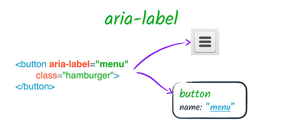
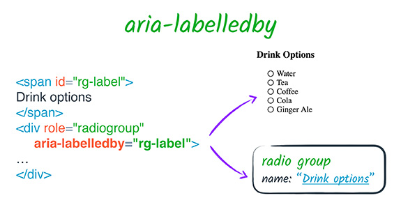
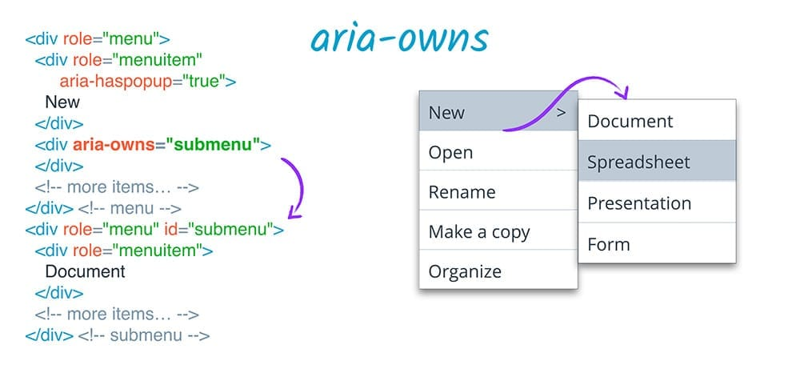
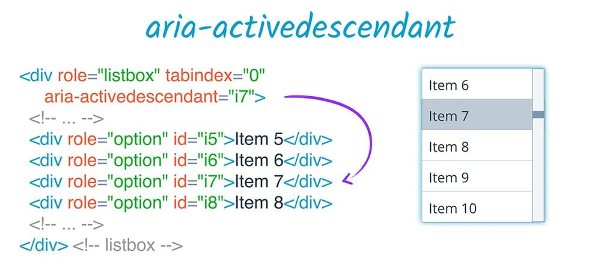
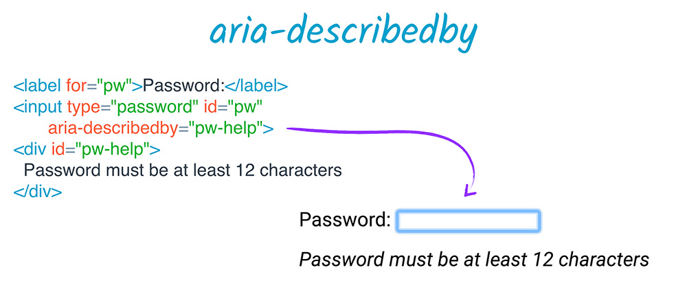
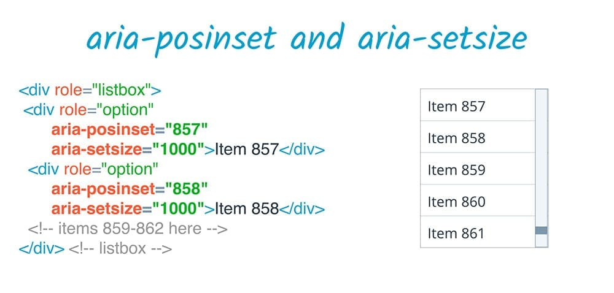

project_path: /web/_project.yaml
book_path: /web/fundamentals/_book.yaml
description: Using ARIA labels to create accessible element descriptions

{# wf_review_required #}
{# wf_updated_on: 2016-02-29 #}
{# wf_published_on: 2016-02-29 #}

# ARIA Labels and Relationships {: .page-title }





## Labels

ARIA provides several mechanisms for adding labels and descriptions to elements.
In fact, ARIA is the only way to add accessible help or description text. Let's
look at the properties ARIA uses to create accessible labels.

### aria-label

`aria-label` allows us to specify a string to be used as the accessible label.
This overrides any other native labeling mechanism, such as a `label` element
&mdash; for example, if a `button` has both text content and an `aria-label`,
only the `aria-label` value will be used.

You might use an `aria-label` attribute when you have some kind of visual
indication of an element's purpose, such as a button that uses a graphic instead
of text, but still need to clarify that purpose for anyone who cannot access the
visual indication, such as a button that uses only an image to indicate its
purpose.

### aria-labelledby

`aria-labelledby` allows us to specify the ID of another element in the DOM as
an element's label.

This is much like using a `label` element, with some key differences.

 1. `aria-labelledby` may be used on any element, not just labelable elements.
 1. While a `label` element refers to the thing it labels, the relationship is
    reversed in the the case of `aria-labelledby` &mdash; the thing being
    labeled refers to the thing that labels it.
 1. Only one label element may be associated with a labelable element, but
    `aria-labelledby` can take a list of IDREFs to compose a label from multiple
    elements. The label will be concatenated in the order that the IDREFs are
    given.
 1. You can use `aria-labelledby` to refer to elements that are hidden and would
    otherwise not be in the accessibility tree. For example, you could add a
    hidden `span` next to an element you want to label, and refer to that with
    `aria-labelledby`.
 1. However, since ARIA only affects the accessibility tree, `aria-labelledby`
    does not give you the familiar label-clicking behavior you get from using a
    `label` element.

Importantly, `aria-labelledby` overrides **all** other name sources for an
element. So, for example, if an element has both an `aria-labelledby` and an
`aria-label`, or an `aria-labelledby` and a native HTML `label`, the
`aria-labelledby` label always takes precedence.

## Relationships

`aria-labelledby` is an example of a *relationship attribute*. A relationship
attribute creates a semantic relationship between elements on the page
regardless of their DOM relationship. In the case of `aria-labelledby`, that
relationship is "this element is labelled by that element".

The ARIA specification lists <a
href="https://www.w3.org/TR/wai-aria/states_and_properties#attrs_relationships"
target="_blank">eight relationship attributes</a>. Six of these,
`aria-activedescendant`, `aria-controls`, `aria-describedby`, `aria-flowto`,
`aria-labelledby`, and `aria-owns`, take a reference to one or more elements to
create a new link between elements on the page. The difference in each case is
what that link means and how it is presented to users.

### aria-owns

`aria-owns` is one of the most widely used ARIA relationships. This attribute
allows us to tell assistive technology that an element that is separate in the
DOM should be treated as a child of the current element, or to rearrange
existing child elements into a different order. For example, if a pop-up
sub-menu is visually positioned near its parent menu, but cannot be a DOM child
of its parent because it would affect the visual presentation, you can use
`aria-owns` to present the sub-menu as a child of the parent menu to a screen
reader.

### aria-activedescendant

`aria-activedescendant` plays a related role. Just as the active element of a
page is the one that has focus, setting the active descendant of an element
allows us to tell assistive technology that an element should be presented to
the user as the focused element when its parent actually has the focus. For
example, in a listbox, you might want to leave page focus on the listbox
container, but keep its `aria-activedescendant` attribute updated to the
currently selected list item. This makes the currently selected item appear to
assistive technology as if it is the focused item.

### aria-controls & aria-flowto

`aria-controls` and `aria-flowto` provide more "advisory only" relationships.
`aria-controls` can provide a hint to the user that a particular element
controls another part of the page, such as a sorting button on a column of data.
And `aria-flowto` provides a user with one or more alternate "next elements"
that they can optionally navigate to and from, such as a footnote or a selection
of options in a flow chart.

### aria-describedby

`aria-describedby` provides an accessible description in the same way that
`aria-labelledby` provides a label. Like `aria-labelledby`, `aria-describedby`
may reference elements that are otherwise not visible, whether hidden from the
DOM, or hidden from assistive technology users. This is a useful technique when
there is some extra explanatory text that a user might need, whether it applies
only to users of assistive technology or all users.

A common example is a password input field that is accompanied by some
descriptive text explaining the mimimum password requirements. Unlike a label,
this description may or may not ever be presented to the user; they may have a
choice of whether to access it, or it may come after all the other information,
or it may be pre-empted by something else. For example, if the user is entering
information, their input will be echoed back and may interrupt the element's
description. Thus, a description is a great way to communicate supplementary,
but not essential, information; it won't get in the way of more critical
information such as the element's role.

### aria-posinset & aria-setsize

The remaining relationship attributes are a little different, and work together.
`aria-posinset` ("position in set") and `aria-setsize` ("size of set") are about
defining a relationship between sibling elements in a set, such as a list.

When the size of a set cannot be determined by the elements present in the DOM
&mdash; such as when lazy rendering is used to avoid having all of a large list
in the DOM at once &mdash; `aria-setsize` can specify the actual set size, and
`aria-posinset` can specify the element's position in the set. For example, in a
set that might contain 1000 elements, you could say that a particular element
has an `aria-posinset` of 857 even though it appears first in the DOM, and then
use dynamic HTML techniques to ensure that the user can explore the full list on
demand.

