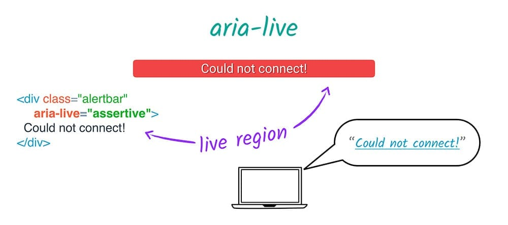

project_path: /web/_project.yaml
book_path: /web/fundamentals/_book.yaml
description: Hiding content from assistive technology

{# wf_review_required #}
{# wf_updated_on: 2016-02-29 #}
{# wf_published_on: 2016-02-29 #}

# Hiding and Updating Content {: .page-title }





## aria-hidden

Another important technique in fine-tuning the experience for assistive
technology users involves ensuring that only relevant parts of the page are
exposed to assistive technology. There are several ways to ensure that a section
of the DOM does not get exposed to accessibility APIs.

First, anything that is explicitly hidden from the DOM will also not be included
in the accessibility tree. So anything that has a CSS style of `visibility:
hidden` or `display: none` or uses the HTML5 `hidden` attribute will also be
hidden from assistive technology users.

However, an element that is not visually rendered but not explicitly hidden is
still included in the accessibility tree. One common technique is to include
"screen reader only text" in an element that is absolute positioned offscreen.

    .sr-only {
      position: absolute;
      left: -10000px;
      width: 1px;
      height: 1px;
      overflow: hidden;
    }
    

Also, as we have seen, it's possible to provide screen reader only text via an
`aria-label`, `aria-labelledby`, or `aria-describedby` attribute referencing an
element that is otherwise hidden.

See this WebAIM article on <a
href="http://webaim.org/techniques/css/invisiblecontent/#techniques"
target="_blank">Techniques for hiding text</a> for more information on creating
"screen reader only" text.

Finally, ARIA provides a mechanism for excluding content from assistive
technology that is not visually hidden, using the `aria-hidden` attribute.
Applying this attribute to an element effectively removes it *and all of its
descendants* from the accessibility tree. The only exceptions are elements
referred to by an `aria-labelledby` or `aria-describedby` attribute.

    

      

        Sales Targets
      

      

        Quarterly Sales
      

      

        Action Items
      

    

For example, you might use `aria-hidden` if you're creating some modal UI that
blocks access to the main page. In this case, a sighted user might see some kind
of semi-transparent overlay indicating that most of the page can't currently be
used, but a screen reader user may still be able to explore to the other parts
of the page. In this case, as well as creating the keyboard trap [explained
earlier](/web/fundamentals/accessibility/focus/using-tabindex#modals-and-keyboard-traps),
you need to make sure that the parts of the page that are currently out of scope
are `aria-hidden` as well.

Now that you understand the basics of ARIA, how it plays with native HTML
semantics, and how it can be used to perform fairly major surgery on the
accessibility tree as well as changing the semantics of a single element, let's
look at how we can use it to convey time-sensitive information.

## aria-live

`aria-live` lets developers mark a part of the page as "live" in the sense that
updates should be communicated to users immediately regardless of the page
position, rather than if they just happen to explore that part of the page. When
an element has an `aria-live` attribute, the part of the page containing it and
its descendants is called a *live region*.

For example, a live region might be a status message that appears as a result of
a user action. If the message is important enough to grab a sighted user's
attention, it is important enough to direct an assistive technology user's
attention to it by setting its `aria-live` attribute. Compare this plain `div`

    
Your message has been sent.

    

with its "live" counterpart.

    
Your message has been sent.

    

`aria-live` has three allowable values: `polite`, `assertive`, and `off`.

 - `aria-live="polite"` tells assistive technology to alert the user to this
   change when it has finished whatever it is currently doing. It's great to use
   if something is important but not urgent, and accounts for the majority of
   `aria-live` use.
 - `aria-live="assertive"` tells assistive technology to interrupt whatever it's
   doing and alert the user to this change immediately. This is only for
   important and urgent updates, such as a status message like "There has been a
   server error and your changes are not saved; please refresh the page", or
   updates to an input field as a direct result of a user action, such as
   buttons on a stepper widget.
 - `aria-live="off"` tells assistive technology to temporarly suspend
   `aria-live` interruptions.

There are some tricks to making sure your live regions work correctly.

First, your `aria-live` region should probably be set in the initial page load.
This is not a hard-and-fast rule, but if you're having difficulty with an
`aria-live` region, this might be the issue.

Second, different screen readers react differently to different types of
changes. For example, it's possible to trigger an alert on some screen readers
by toggling a descendant element's `hidden` style from true to false.

Other attributes that work with `aria-live` help you fine-tune what is
communicated to the user when the live region changes.

`aria-atomic` indicates whether the entire region should be considered as a
whole when communicating updates. For example, if a date widget consisting of a
day, month, and year has `aria-live=true` and `aria-atomic=true`, and the user
uses a stepper control to change the value of just the month, the full contents
of the date widget would be read out again. `aria-atomic`'s value may be `true`
or `false` (the default).

`aria-relevant` indicates what types of changes should be presented to the user.
There are some options that may be used separately or as a token list.

 - *additions*, meaning that any element being added to the live region is
   significant. For example, appending a span to an existing log of status
   messages would mean that the span would be announced to the user (assuming
   that `aria-atomic` was `false`).
 - *text*, meaning that text content being added to any descendant node is
   relevant. For example, modifying a custom text field's `textContent` property
   would read the modified text to the user.
 - *removals*, meaning that the removal of any text or descendant nodes should
   be conveyed to the user.
 - *all*, meaning that all changes are relevant. However, the default value for
   `aria-relevant` is `additions text`, meaning that if you don't specify
   `aria-relevant` it will update the user for any addition to the element,
   which is what you are most likely to want.

Finally, `aria-busy` lets you notify assistive technology that it should
temporarily ignore changes to an element, such as when things are loading. Once
everything is in place, `aria-busy` should be set to false to normalize the
reader's operation.
 
