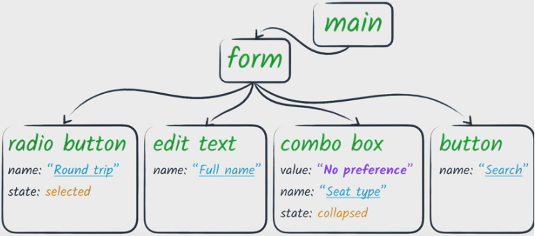
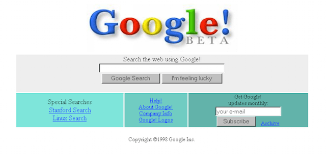
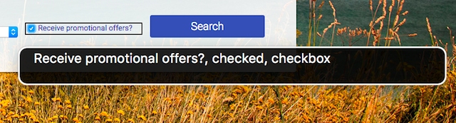

project_path: /web/_project.yaml
book_path: /web/fundamentals/_book.yaml
description: Introduction to the Accessibility Tree

{# wf_review_required #}
{# wf_updated_on: 2016-02-29 #}
{# wf_published_on: 2016-02-29 #}

# The Accessibility Tree {: .page-title }






Imagine that you're building a user interface *for screen reader users only*.
Here, you don't need to create any visual UI at all, but just provide enough
information for the screen reader to use.

What you'd be creating is a kind of API describing the page structure, similar
to the DOM API, but you can get away with less information and fewer nodes,
because a lot of that information is only useful for visual presentation. It
might look something like this.



This is basically what the browser actually presents to the screen reader. The
browser takes the DOM tree and modifies it into a form that is useful to
assistive technology. We refer to this modified tree as the *Accessibility
Tree*.

You might visualize the accessibility tree as looking a bit like an old web page
from the '90s: a few images, lots of links, perhaps a field and a button.



Visually scanning down a page like this case gives you an experience similar to
what a screen reader user would get. The interface is there, but it is simple
and direct, much like an accessibility tree interface.

The accessibility tree is what most assistive technologies interact with. The
flow goes something like this.

 1. An application (the browser or other app) exposes a semantic version of its
    UI to assistive technology via an API.
 1. The assistive technology may use the information it reads via the API to
    create an alternative user interface presentation for the user. For example,
    a screen reader creates an interface in which the user hears a spoken
    representation of the app.
 1. The assistive technology may also allow the user to interact with the app in
    a different way. For example, most screen readers provide hooks to allow a
    user to easily simulate a mouse click or finger tap.
 1. The assistive technology relays the user intent (such as "click") back to
    the app via the accessibility API. The app then has the responsibility to
    interpret the action appropriately in the context of the original UI.

For web browsers, there's an extra step in each direction, because the browser
is in fact a platform for web apps that run inside it. So the browser needs to
translate the web app into an accessibility tree, and must make sure that the
appropriate events get fired in JavaScript based on the user actions that come
in from the assistive technology.

But that is all the browser's responsibility. Our job as web developers is just
to be aware that this is going on, and to develop web pages that take advantage
of this process to create an accessible experience for our users.

We do this by ensuring that we express the semantics of our pages correctly:
making sure that the important elements in the page have the correct accessible
roles, states, and properties, and that we specify accessible names and
descriptions. The browser can then let the assistive technology access that
information to create a customized experience.

## Semantics in native HTML

A browser can transform the DOM tree into an accessibility tree because much of
the DOM has *implicit* semantic meaning. That is, the DOM uses native HTML
elements that are recognized by browsers and work predictably on a variety of
platforms. Accessibility for native HTML elements such as links or buttons is
thus handled automatically. We can take advantage of that built-in accessibility
by writing HTML that expresses the semantics of our page elements.

However, sometimes we use elements that look like native elements but aren't.
For example, this "button" isn't a button at all.


<style>
    .fancy-btn {
        display: inline-block;
        background: #BEF400;
        border-radius: 8px;
        padding: 10px;
        font-weight: bold;
        -moz-user-select: none;
        -webkit-user-select: none;
        -ms-user-select: none;
        user-select: none;
        cursor: pointer;
    }
</style>
<div class="fancy-btn">Give me tacos</div>


It might be constructed in HTML in any number of ways; one way is shown below.


    <div class="button-ish">Give me tacos</div>
    

When we don't use an actual button element, the screen reader has no way to know
what it has landed on. Also, we would have to do the extra work [of adding
tabindex](/web/fundamentals/accessibility/focus/using-tabindex) to make it
usable to keyboard-only users because, as it is coded now, it can only be used
with a mouse.

We can easily fix this by using a regular `button` element instead of a `div`.
Using a native element also has the benefit of taking care of keyboard
interactions for us. And remember that you don't have to lose your spiffy visual
effects just because you use a native element; you can style native elements to
make them look the way you want and still retain the implicit semantics and
behavior.

Earlier we noted that screen readers will announce an element's role, name,
state, and value. By using the right semantic element, role, state, and value
are covered, but we must also ensure that we make an element's name
discoverable.

Broadly, there are two types of names:

 - *Visible labels*, which are used by all users to associate meaning with an
   element, and
 - *Text alternatives*, which are only used when there is no need for a visual
   label.

For text-level elements, we don't need to do anything, because by definition it
will have some text content. However, for input or control elements, and visual
content like images, we need to make sure that we specify a name. In fact,
providing text alternatives for any non-text content is <a
href="http://webaim.org/standards/wcag/checklist#g1.1" target="_blank">the very
first item on the WebAIM checklist</a>.

One way to do that is to follow their recommendation that "Form inputs have
associated text labels." There are two ways to associate a label with a form
element, such as a checkbox. Either of the methods causes the label text to also
become a click target for the checkbox, which is also helpful for mouse or
touchscreen users. To associate a label with an element, either

 - Place the input element inside a label element

```
<label>
    <input type="checkbox">Receive promotional offers?</input>
</label>
```


<div style="margin: 10px;">
    <label style="font-size: 16px; color: #212121;">
        <input type="checkbox">Receive promotional offers?</input>
    </label>
</div>



or

 - Use the label's `for` attribute and refer to the element's `id`

```
<input id="promo" type="checkbox"></input>
<label for="promo">Receive promotional offers?</label>
```


<div style="margin: 10px;">
    <input id="promo" type="checkbox"></input>
    <label for="promo">Receive promotional offers?</label>
</div>

    

When the checkbox has been labeled correctly, the screen reader can report that
the element has a role of checkbox, is in a checked state, and is named "Receive
promotional offers?".



>Tip: You can actually use the screen reader to find improperly-associated
labels by tabbing through the page and verifying the spoken roles, states, and
names.


