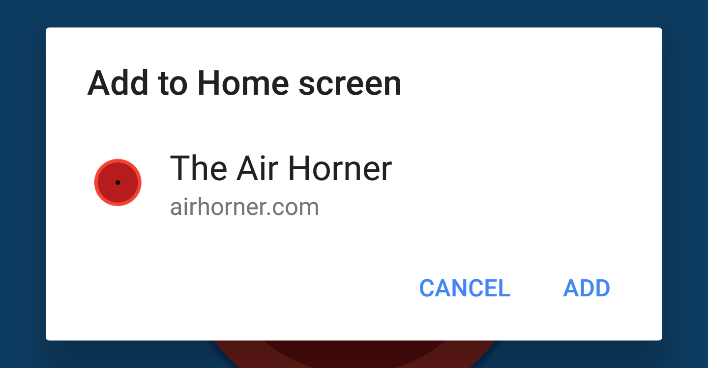

project_path: /web/fundamentals/_project.yaml
book_path: /web/fundamentals/_book.yaml
description: Add to Home Screen gives you the ability to let users quickly and seamlessly add your web app to their home screens without leaving the browser.

{# wf_updated_on: 2018-07-19 #}
{# wf_published_on: 2014-12-16 #}
{# wf_blink_components: Platform>Apps>AppLauncher>Install #}

# Add to Home Screen {: .page-title }



**Add to Home Screen**, sometimes referred to as the web app install prompt
makes it easy for users to install your Progressive Web App on their mobile
or desktop device. When installed, it adds your PWA to to their launcher,
and runs it like any other installed app.

Chrome handles most of the heavy lifting for you, and on Android, Chrome will
generate a [WebAPK](/web/fundamentals/integration/webapks) creating an even
more integrated experience for your users.

## What is the criteria? {: #criteria }



If the web app manifest includes <code>related_applications</code> and
has <code>"prefer_related_applications": true</code>, the
<a href="/web/fundamentals/app-install-banners/native">native app install
prompt</a> will be shown instead.

## Show the add to home screen dialog {: #trigger }

<figure class="attempt-right">
  
  <figcaption>Add to Home Screen dialog on Android</figcaption>
</figure>

In order to show the Add to Home Screen dialog, you need to:

1. Listen for the `beforeinstallprompt` event
1. Notify the user your app can be installed with a button or other element
   that will generate a user gesture event.
1. Show the prompt by calling `prompt()` on the saved `beforeinstallprompt`
   event.

Note: Chrome 67 and earlier showed an add to home screen banner, the banner
was removed in Chrome 68.

### Listen for `beforeinstallprompt`

If the add to home screen [criteria](#criteria) are met, Chrome will fire a
`beforeinstallprompt` event, that you can use to indicate your app can be
'installed', and then prompt the user to install it.

When the `beforeinstallprompt` event has fired, save a reference to the event,
and update your user interface to indicate that the user can add your app
to their home screen.

    let deferredPrompt;

    window.addEventListener('beforeinstallprompt', (e) => {
      // Prevent Chrome 67 and earlier from automatically showing the prompt
      e.preventDefault();
      // Stash the event so it can be triggered later.
      deferredPrompt = e;
    });

### Notify the user your app can be installed

The best way to notify the user your app can be installed is by adding a button
or other element to your user interface. **Don't show a full page interstitial
or other elements that may be annoying or distracting.**

<pre class="prettyprint">
window.addEventListener('beforeinstallprompt', (e) => {
  // Prevent Chrome 67 and earlier from automatically showing the prompt
  e.preventDefault();
  // Stash the event so it can be triggered later.
  deferredPrompt = e;
  <strong>// Update UI notify the user they can add to home screen
  btnAdd.style.display = 'block';</strong>
});
</pre>

Success: you may want to wait before showing the prompt to the user,
so you don't distract them from what they're doing. For example, if the user
is in a check-out flow, or creating their account, let them complete that
before interrupting them with the prompt.

### Show the prompt

To show the add to home screen prompt, call `prompt()` on the saved event
from within a user gesture. It will show a modal dialog, asking the user
to to add your app to their home screen.

Then, listen for the promise returned by the `userChoice` property. The
promise returns an object with an `outcome` property after the prompt has
shown and the user has responded to it.

    btnAdd.addEventListener('click', (e) => {
      // hide our user interface that shows our A2HS button
      btnAdd.style.display = 'none';
      // Show the prompt
      deferredPrompt.prompt();
      // Wait for the user to respond to the prompt
      deferredPrompt.userChoice
        .then((choiceResult) => {
          if (choiceResult.outcome === 'accepted') {
            console.log('User accepted the A2HS prompt');
          } else {
            console.log('User dismissed the A2HS prompt');
          }
          deferredPrompt = null;
        });
    });

You can only call `prompt()` on the deferred event once, if the user dismissed
it, you'll need to wait until the `beforeinstallprompt` event is fired on
the next page navigation.

## The mini-info bar

<figure class="attempt-right">
  
  <figcaption>
    The mini-infobar
  </figcaption>
</figure>

The mini-infobar is an interim experience for Chrome on Android as we work
towards creating a consistent experience across all platforms that includes
an install button into the omnibox.

The mini-infobar is a Chrome UI component and is not controllable by the site,
but can be easily dismissed by the user. Once dismissed by the user, it will
not appear again until a sufficient amount of time has passed
(currently 3 months). The mini-infobar will appear when the site meets the
[add to home screen criteria](/web/fundamentals/app-install-banners/#criteria),
regardless of whether you `preventDefault()` on the `beforeinstallprompt` event
or not.

## Feedback {: .hide-from-toc }



## Determine if the app was successfully installed {: #appinstalled }

To determine if the app was successfully added to the users home screen _after_
they accepted the prompt, you can listen for the `appinstalled` event.

    window.addEventListener('appinstalled', (evt) => {
      app.logEvent('a2hs', 'installed');
    });

## Detecting if your app is launched from the home screen {: #detect-mode }

### `display-mode` media query

The `display-mode` media query makes it possible to apply styles depending
on how the app was launched, or determine how it was launched with JavaScript.

To apply a different background color for the app above when being launched
from the home screen with `"display": "standalone"`, use conditional CSS:

    @media all and (display-mode: standalone) {
      body {
        background-color: yellow;
      }
    }

It's also possible to detect if the `display-mode` is standalone from
JavaScript:

    if (window.matchMedia('(display-mode: standalone)').matches) {
      console.log('display-mode is standalone');
    }

### Safari

To determine if the app was launched in `standalone` mode in Safari, you can
use JavaScript to check:

    if (window.navigator.standalone === true) {
      console.log('display-mode is standalone');
    }

## Updating your app's icon and name

If you change any of the properties in your manifest, those changes will be
reflected to the user after they've run your app again.

## Test your add to home screen experience {: #test }

You can manually trigger the `beforeinstallprompt` event with Chrome DevTools.
This makes it possible to see the user experience, understand how the flow
works or debug the flow. If the [PWA criteria](#pwa-criteria) aren't met,
Chrome will throw an exception in the console, and the event will not be fired.

Caution: Chrome has a slightly different install flow for desktop and mobile.
Although the instructions are similar, testing on mobile <b>requires</b> remote
debugging, without it, it will use the desktop install flow.

### Chrome for Android

1. Open a [remote debugging](/web/tools/chrome-devtools/remote-debugging/)
   session to your phone or tablet.
2. Go to the **Application** panel.
3. Go to the **Manifest** tab.
4. Click **Add to home screen**

### Chrome OS

1. Open Chrome DevTools
2. Go to the **Application** panel.
3. Go to the **Manifest** tab.
4. Click **Add to home screen**

Dogfood: To test the install flow for Desktop Progressive Web Apps on Mac or
Windows, you'll need to <a href="/web/updates/2018/05/dpwa#getting-started">
enable the <code>#enable-desktop-pwas</code> flag.</a>

### Will `beforeinstallprompt` be fired?

The easiest way to test if the `beforeinstallprompt` event will be fired, is
to use [Lighthouse](/web/tools/lighthouse/) to audit your app, and check the
results of the [User Can Be Prompted To Install The Web App](/web/tools/lighthouse/audits/install-prompt)
test.
