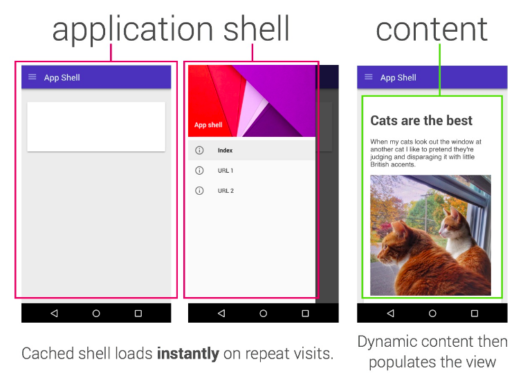
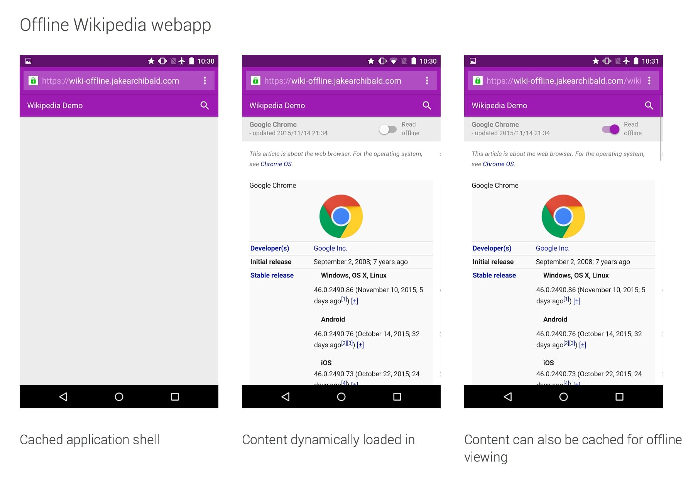

project_path: /web/fundamentals/_project.yaml 
book_path: /web/fundamentals/_book.yaml
description: Application shell architecture keeps your UI local and loads content dynamically without sacrificing the linkability and discoverability of the web. 

{# wf_updated_on: 2017-07-25 #}
{# wf_published_on: 2016-09-27 #}

# The App Shell Model {: .page-title }



An **application shell** (or app shell) architecture is one way to build a
Progressive Web App that reliably and instantly loads on your users' screens,
similar to what you see in native applications.

The app "shell" is the minimal HTML, CSS and JavaScript required to power the
user interface and when cached offline can ensure **instant, reliably good
performance** to users on repeat visits. This means the application shell is
not loaded from the network every time the user visits. Only the necessary
content is needed from the network.

For [single-page
applications](https://en.wikipedia.org/wiki/Single-page_application) with
JavaScript-heavy architectures, an application shell is a go-to approach. This
approach relies on aggressively caching the shell (using a [service
worker](/web/fundamentals/primers/service-worker/)) to get the application
running. Next, the dynamic content loads for each page using JavaScript. An app
shell is useful for getting some initial HTML to the screen fast without a
network.

Put another way, the app shell is similar to the bundle of code that you’d
publish to an app store when building a native app. It is the skeleton of your
UI and the core components necessary to get your app off the ground, but likely
does not contain the data.

Note: Try the [First Progressive Web
App](https://codelabs.developers.google.com/codelabs/your-first-pwapp/#0)
codelab to learn how to architectect and
implement your first application shell for a weather app. The [Instant
Loading with the App Shell model](https://www.youtube.com/watch?v=QhUzmR8eZAo)
video also walks through this pattern.

### When to use the app shell model

Building a PWA does not mean starting from scratch. If you are building a modern
single-page app, then you are probably using something similar to an app shell
already whether you call it that or not. The details might vary a bit depending
upon which libraries or frameworks you are using, but the concept itself is
framework agnostic.

An application shell architecture makes the most sense for apps and sites with
relatively unchanging navigation but changing content. A number of modern
JavaScript frameworks and libraries already encourage splitting your application
logic from its content, making this architecture more straightforward to apply.
For a certain class of websites that only have static content you can still
follow the same model but the site is 100% app shell.

To see how Google built an app shell architecture, take a look at
[Building the Google I/O 2016 Progressive Web App](/web/showcase/2016/iowa2016).
This real-world app started with a SPA to create a PWA that precaches content
using a service worker, dynamically loads new pages, gracefully transitions
between views, and reuses content after the first load.

### Benefits {: #app-shell-benefits }

The benefits of an app shell architecture with a service worker include:

* **Reliable performance that is consistently fast**. Repeat visits are
extremely quick.  Static assets and the UI (e.g. HTML, JavaScript, images
and CSS) are cached on the first visit so that they load instantly on
repeat visits. Content _may_ be cached on the first visit, but is
typically loaded when it is needed.

* **Native-like interactions**. By adopting the app shell model, you
can create experiences with instant, native-application-like navigation and
interactions, complete with offline support.

* **Economical use of data**. Design for minimal data usage and be judicious in
what you cache because listing files that are non-essential (large images that
are not shown on every page, for instance) result in browsers downloading more
data than is strictly necessary. Even though data is relatively cheap in western
countries, this is not the case in emerging markets where connectivity is
expensive and data is costly.

## Requirements {: #app-shell-requirements }

The app shell should ideally:

* Load fast
* Use as little data as possible
* Use static assets from a local cache
* Separate content from navigation
* Retrieve and display page-specific content (HTML, JSON, etc.)
* Optionally, cache dynamic content

The app shell keeps your UI local and pulls in content dynamically through an
API but does not sacrifice the linkability and discoverability of the web. The
next time the user accesses your app, the latest version displays automatically.
There is no need to download new versions before using it.

Note: The [Lighthouse](https://github.com/googlechrome/lighthouse) auditing
extension can be used to verify if your PWA using an app shell hits a high-bar
for performance. [To the Lighthouse](https://www.youtube.com/watch?v=LZjQ25NRV-E)
is a talk that walks through optimizing a PWA using this tool.

## Building your app shell {: #building-your-app-shell }

Structure your app for a clear distinction between the page shell and the
dynamic content. In general, your app should load the simplest shell possible
but include enough meaningful page content with the initial download. Determine
the right balance between speed and data freshness for each of your data
sources.

<figure>
  
  <figcaption>Jake Archibald’s <a href="https://wiki-offline.jakearchibald.com/wiki/Rick_and_Morty">offline Wikipedia application</a> is a good example of a PWA that uses an app shell model. It loads instantly on repeat visits, but dynamically fetches content using JS. This content is then cached offline for future visits.
</figcaption>
</figure>

### Example HTML for an app shell {: #example-html-for-appshell }

This example separates the core application infrastructure and UI from the data.
It is important to keep the initial load as simple as possible to display just
the page’s layout as soon as the web app is opened. Some of it comes from your
application’s index file (inline DOM, styles) and the rest is loaded from
external scripts and stylesheets.

All of the UI and infrastructure is cached locally using a service worker so
that on subsequent loads, only new or changed data is retrieved, instead of
having to load everything.

Your `index.html` file in your work directory should look something like the
following code. This is a subset of the actual contents and is not a complete
index file. Let's look at what it contains.

* HTML and CSS for the "skeleton" of your user interface complete with navigation
  and content placeholders.
* An external JavaScript file (app.js) for handling navigation and UI logic as
  well as the code to display posts retrieved from the server and store them
  locally using a storage mechanism like IndexedDB.
* A web app manifest and service worker loader to enable off-line capabilities.

    <!DOCTYPE html>
    <html>
    <head>
      <meta charset="utf-8">
      <title>App Shell</title>
      <link rel="manifest" href="/manifest.json">
      <meta http-equiv="X-UA-Compatible" content="IE=edge">
      <meta name="viewport" content="width=device-width, initial-scale=1.0">
      <title>App Shell</title>
      <link rel="stylesheet" type="text/css" href="styles/inline.css">
    </head>

    <body>
      <header class="header">
        <h1 class="header__title">App Shell</h1>
      </header>
      
      <nav class="nav">
      ...
      </nav>
      
      <main class="main">
      ...
      </main>

      

      ...
      

      

        <!-- Show a spinner or placeholders for content -->
      

      
      
    </body>
    </html>

Note: See [https://app-shell.appspot.com/](https://app-shell.appspot.com/) for a
real-life look at a very simple PWA using an application shell and server-side
rendering for content. An app shell can be implemented using any library or
framework as covered in our <a
href="https://www.youtube.com/watch?v=srdKq0DckXQ">Progressive Web Apps across
all frameworks</a> talk. Samples are available using Polymer (<a
href="https://shop.polymer-project.org">Shop</a>) and React (<a
href="https://github.com/insin/react-hn">ReactHN</a>,
<a
href="https://github.com/GoogleChrome/sw-precache/tree/master/app-shell-demo">iFixit</a>).
 

### Caching the application shell {: #app-shell-caching }

An app shell can be cached using a manually written service worker or a
generated service worker using a static asset precaching tool like
[sw-precache](https://github.com/googlechrome/sw-precache).

Note: The examples are provided for general information and illustrative
purposes only. The actual resources used will likely be different for your
application.

#### Caching the app shell manually

Below is example service worker code that caches static resources from the
app shell into the [Cache API](https://developer.mozilla.org/en-US/docs/Web/API/Cache)
using service worker's `install` event:

    var cacheName = 'shell-content';
    var filesToCache = [
      '/css/styles.css',
      '/js/scripts.js',
      '/images/logo.svg',

      '/offline.html’,

      '/’,
    ];

    self.addEventListener('install', function(e) {
      console.log('[ServiceWorker] Install');
      e.waitUntil(
        caches.open(cacheName).then(function(cache) {
          console.log('[ServiceWorker] Caching app shell');
          return cache.addAll(filesToCache);
        })
      );
    });

#### Using sw-precache to cache the app shell

The service worker generated by sw-precache will cache and serve the resources
that you configure as part of your build process. You can have it precache every
HTML, JavaScript, and CSS file that makes up your app shell. Everything will
both work offline, and load fast on subsequent visits without any extra effort.

Here us a basic example of using sw-precache as part of a
[gulp](http://gulpjs.com) build process:

    gulp.task('generate-service-worker', function(callback) {
      var path = require('path');
      var swPrecache = require('sw-precache');
      var rootDir = 'app';

      swPrecache.write(path.join(rootDir, 'service-worker.js'), {
        staticFileGlobs: [rootDir + '/**/*.{js,html,css,png,jpg,gif}'],
        stripPrefix: rootDir
      }, callback);
    });

To learn more about static asset caching, see the [Adding a Service Worker with
sw-precache](https://codelabs.developers.google.com/codelabs/sw-precache/index.html?index=..%2F..%2Findex#0)
codelab.

Note: sw-precache is useful for offline caching your static resources. For
runtime/dynamic resources, we recommend using our complimentary library
[sw-toolbox](https://github.com/googlechrome/sw-toolbox).

## Conclusion {: #conclusion }

An app shell using Service worker is powerful pattern for offline caching but
it also offers significant performance wins in the form of instant loading for
repeat visits to your PWA. You can cache your application shell so it works
offline and populate its content using JavaScript.

On repeat visits, this allows you to get meaningful pixels on the screen without
the network, even if your content eventually comes from there.

