project_path: /web/fundamentals/_project.yaml
book_path: /web/fundamentals/_book.yaml
description: In this codelab, you'll learn how to debug a service worker using the new DevTools Application panel. You'll also learn how to simulate a Push notification to verify your subscription is properly setup.

{# wf_auto_generated #}
{# wf_updated_on: 2017-07-24T00:43:21Z #}
{# wf_published_on: 2016-01-01 #}


# Debugging Service Workers {: .page-title }




## Introduction


Service Workers give developers the amazing ability to handle spotty networks and create truly offline-first web apps. But being a new technology means they can sometimes be difficult to debug, especially as we wait for our tools to catch up.

This codelab will walk you through creating a basic Service Worker and demonstrate how to use the new Application panel in Chrome DevTools to debug and inspect your worker.

### What are we going to be building?

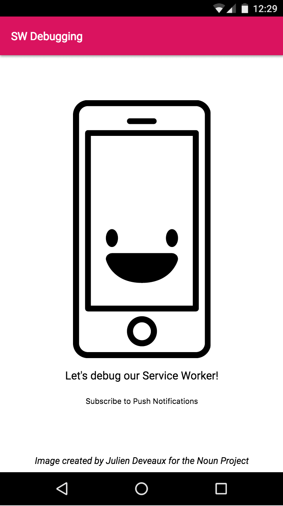

In this code lab you'll work with an extremely simple progressive web app and learn techniques you can employ in your own applications when you encounter issues.

Because this code lab is focused on teaching you tools, feel free to stop at various points and experiment. Play with the code, refresh the page, open new tabs, etc. The best way to learn debugging tools is just to break things and get your hands dirty fixing them.

### What you'll learn

* How to inspect a Service Worker with the Application panel
* How to explore the Cache and IndexedDB
* How to simulate different network conditions
* How to use debugger statements and breakpoints to debug a Service Worker
* How to simulate Push events

### What you'll need

* Chrome 52 or above
* Install  [Web Server for Chrome](https://chrome.google.com/webstore/detail/web-server-for-chrome/ofhbbkphhbklhfoeikjpcbhemlocgigb), or use your own web server of choice.
* The sample code
* A text editor
* Basic knowledge of HTML, CSS and JavaScript

This codelab is focused on debugging Service Workers and assumes some prior knowledge of working with Service Workers. Some concepts are glossed over or code blocks (for example styles or non-relevant JavaScript) are provided for you to simply copy and paste. If you are new to Service Workers be sure to  [read through the API Primer](/web/fundamentals/primers/service-worker/?hl=en) before proceeding.


## Getting set up


### Download the Code

You can download all of the code for this codelab, by clicking the following button:

[Download source code](https://github.com/googlecodelabs/debugging-service-workers/archive/master.zip)

Unpack the downloaded zip file. This will unpack a root folder (`debugging-service-workers-master`), which contains one folder for each step of this codelab, along with all of the resources you will need.

The `step-NN` folders contain the desired end state of each step of this codelab. They are there for reference. We'll be doing all our coding work in the directory called `work`.

### Install and verify web server

While you're free to use your own web server, this codelab is designed to work well with the Chrome Web Server. If you don't have that app installed yet, you can install it from the Chrome Web Store.

[Install Web Server for Chrome](https://chrome.google.com/webstore/detail/web-server-for-chrome/ofhbbkphhbklhfoeikjpcbhemlocgigb?hl=en)

After installing the Web Server for Chrome app, click on the Apps shortcut on the bookmarks bar: 


<aside markdown="1" class="key-point">
<p>More help:  <a href="https://support.google.com/chrome_webstore/answer/3060053?hl=en">Add and open Chrome apps</a></p>
</aside>


In the ensuing window, click on the Web Server icon: 

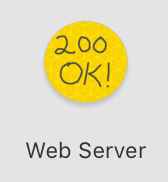

You'll see this dialog next, which allows you to configure your local web server:

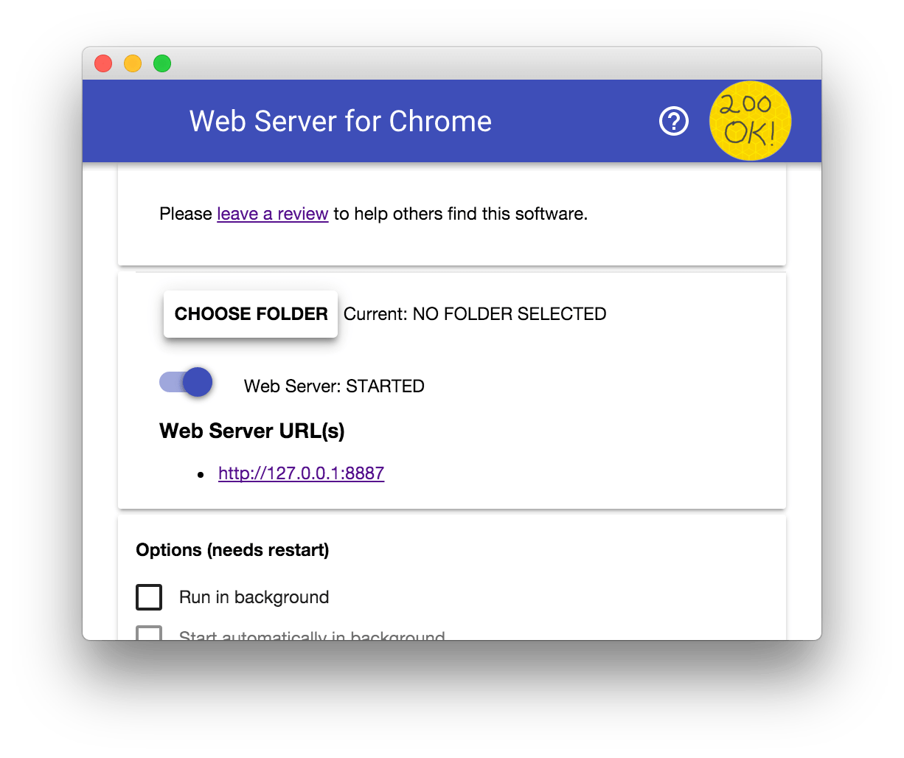

Click the __choose folder__ button, and select the `work` folder. This will enable you to serve your work in progress via the URL highlighted in the web server dialog (in the __Web Server URL(s)__ section).

Under Options, check the box next to "Automatically show index.html", as shown below:

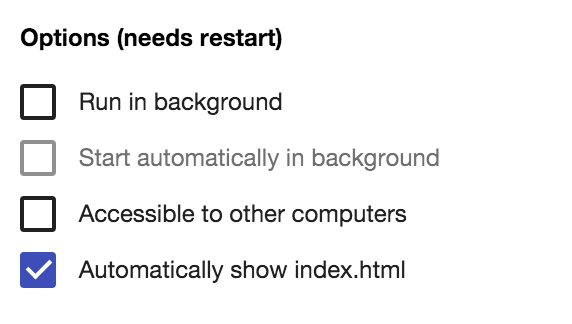

Then stop and restart the server by sliding the toggle labeled "Web Server: STARTED" to the left and then back to the right.


Now visit your work site in your web browser (by clicking on the highlighted Web Server URL) and you should see a page that looks like this:

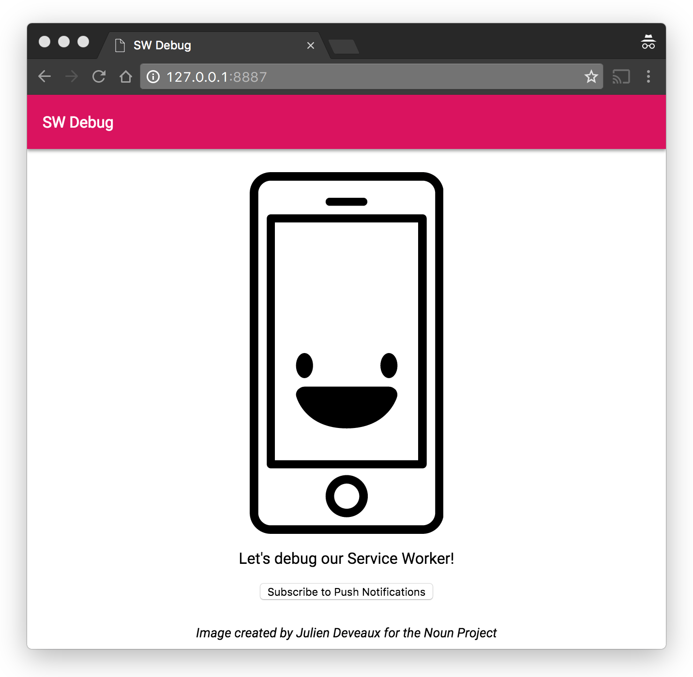

Obviously, this app is not yet doing anything interesting. We'll add functionality so we can verify it works offline in subsequent steps. 

<aside markdown="1" class="key-point">
<p>From this point forward, all testing/verification should be performed using this web server setup. You'll usually be able to get away with simply refreshing your test browser tab.</p>
</aside>


## Introducing the Application tab


### Inspecting the Manifest

Building a Progressive Web Apps requires tying together a number of different core technologies, including Service Workers and Web App Manifests, as well as useful enabling technologies, like the Cache Storage API, IndexedDB, and Push Notifications. To make it easy for developers to get a coordinated view of each of these technologies the Chrome DevTools has incorporated inspectors for each in the new Application panel.

* Open the Chrome DevTools and click on the tab that says __Application__

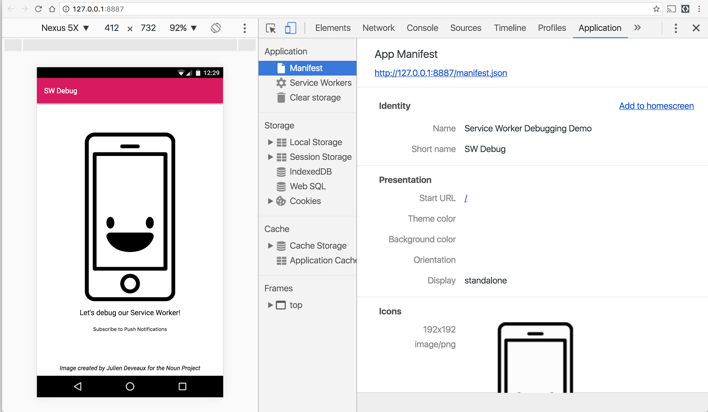

Look in the sidebar and notice __Manifest__ is currently highlighted. This view shows important information related to the `manifest.json` file such as its application name, start URL, icons, etc.

Although we won't be covering it in this codelab, note that there is an __Add to homescreen__ button which can be used to simulate the experience of adding the app to the user's homescreen.

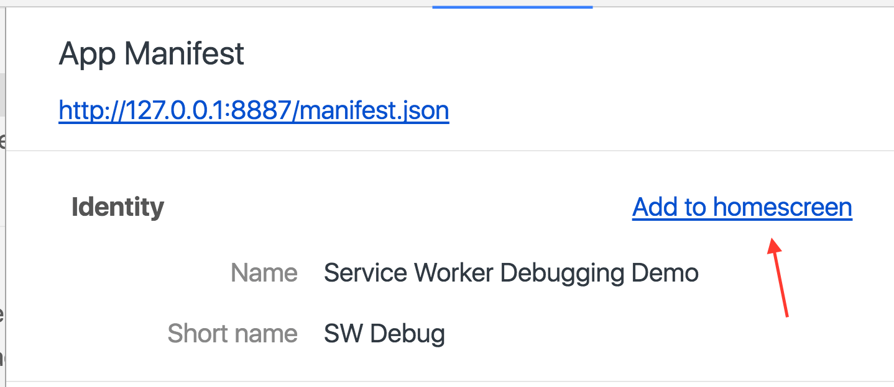

### Inspecting the Service Workers

In the past, inspecting a Service Worker required poking around in Chrome internals and was definitely not the most user friendly experience. All of that changes with the new __Application__ tab!

* Click on the __Service Workers__ menu item below the currently selected __Manifest__ item

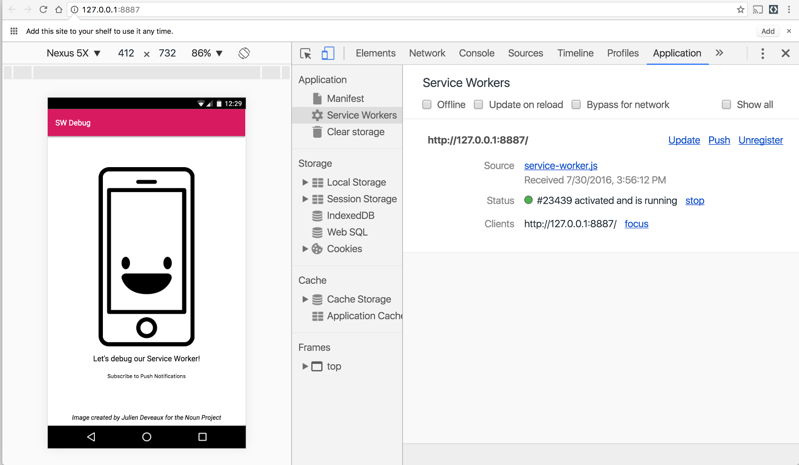

The __Service Workers__ view provides information about Service Workers which are active in the current origin. Along the top row there are a series of checkboxes.

* __Offline __- Will simulate being disconnected from the network. This can be useful to quickly verify that your Service Worker fetch handlers are working properly.
* __Update on reload__ - Will force the current Service Worker to be replaced by a new Service Worker (if the developer has made updates to their `service-worker.js`). Normally the browser will wait until a user closes all tabs that contain the current site before updating to a new Service Worker.
* __Bypass for network__ - Will force the browser to ignore any active Service Worker and fetch resources from the network. This is extremely useful for situations where you want to work on CSS or JavaScript and not have to worry about the Service Worker accidentally caching and returning old files.
* __Show all__ - Will show a list of all active Service Workers regardless of the origin.

Below that you will see information relating to the current active Service Worker (if there is one). One of the most useful fields is the __Status__ field, which shows the current state of the Service Worker. Since this is the first time starting the app, the current Service Worker has successfully installed and been activated, so it displays a green circle to indicate everything's good.

<aside markdown="1" class="key-point">
<p>If you had installed a service worker on this localhost port previously, you will see an orange circle as well, indicating that the new service worker is waiting to activate. If this is the case, click <strong>skipWaiting</strong>.</p>
</aside>


Note the ID number next to the green status indicator. That's the ID for the currently active Service Worker. Remember it or write it down as we'll use it for a comparison in just a moment.

* In your text editor, open the `service-worker.js` file

The code for the current Service Worker is quite simple, just a couple of console logs.

    self.addEventListener('install', function(event) {
      console.log('Service Worker installing.');
    });
    
    self.addEventListener('activate', function(event) {
      console.log('Service Worker activating.');  
    });

If you switch back to the DevTools and look in the Console you can see that both logs have been output successfully.

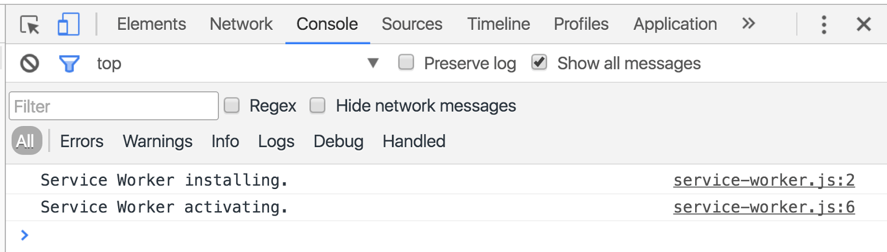

Let's update the code for the `service-worker.js` to watch it go through a lifecycle change.

* Update the comments in `service-worker.js` so they contain new messages

    self.addEventListener('install', function(event) {
      console.log('A *new* Service Worker is installing.');
    });
    
    self.addEventListener('activate', function(event) {
      console.log('Finally active. Ready to start serving content!');  
    });

* Refresh the page and open the console in DevTools

The console logs `A *new* Service Worker is installing.` but doesn't show the 2nd message about the new Service Worker being active.

* Switch to the Application tab in DevTools

In the Application tab there are now two status indicators, each representing the state of our two Service Workers.

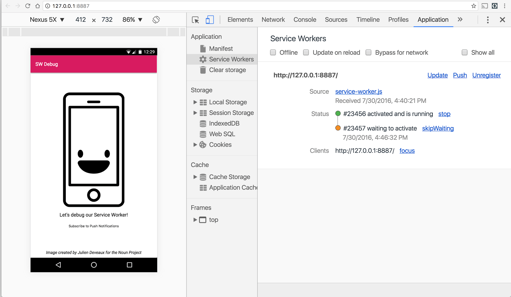

Note the ID of the first Service Worker. It should match the original Service Worker ID. When you install a new Service Worker, the previous worker remains active until the next time the user visits the page.

The second status indicator shows the new Service Worker we just edited. Right now it's in a waiting state.

<aside markdown="1" class="key-point">
<p><strong>Try it!</strong></p>
<p>If a user has multiple tabs open for the same page, it will continue using the old Service Worker until those tabs are closed. Try opening a few more tabs and visiting this same page and notice how the Application panel still shows the old Service Worker as active.</p>
</aside>


An easy way to force the new Service Worker to activate is with the __skipWaiting__ button.

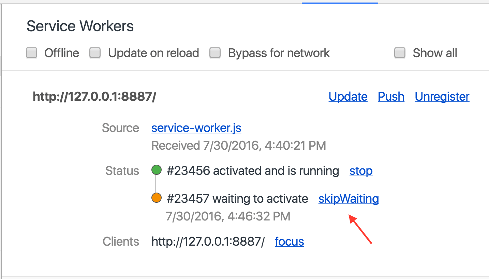

* Click the skipWaiting button and then switch to the Console

Note that the console now logs the message from the `activate` event handler:

`Finally active. Ready to start serving content!`

<aside markdown="1" class="key-point">
<p><strong>Skip waiting</strong></p>
<p>Having to click the <code>skipWaiting</code> button all the time can get a little annoying. If you'd like your Service Worker to force itself to become active you can include the line <code>self.skipWaiting()</code> in the <code>install</code> event handler. You can learn more about the <code>skipWaiting</code> method in  <a href="https://slightlyoff.github.io/ServiceWorker/spec/service_worker/index.html#service-worker-global-scope-skipwaiting">the Service Workers spec</a>.</p>
</aside>


## Exploring the cache


Managing your own offline file cache with a Service Worker is an incredible super power. The new __Application__ panel has a number of useful tools for exploring and modifying your stored resources which can be very helpful during development time.

### Add caching to your Service Worker

Before you can inspect the cache you'll need to write a little code to store some files. Pre-caching files during the Service Worker's install phase is a useful technique to guarantee that crucial resources are available to user if they happen to go offline. Let's start there.

* Before updating the `service-worker.js`, open the DevTools __Application__ panel, navigate to the __Service Workers__ menu, and check the box that says __Update on reload__

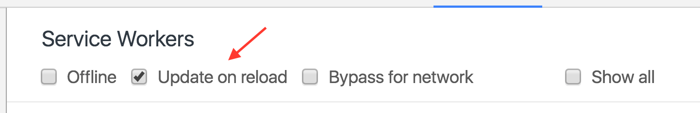

This useful trick will force the page to use whatever Service Worker is the latest, so you don't have to click the __skipWaiting__ option every time you want to make changes to your Service Worker.

* Next, update the code in `service-worker.js` so it looks like this

```
var CACHE_NAME = 'my-site-cache-v1';
var urlsToCache = [
  '/',
  '/styles/main.css',
  '/scripts/main.js',
  '/images/smiley.svg'
];

self.addEventListener('install', function(event) {
  // Perform install steps
  event.waitUntil(
    caches.open(CACHE_NAME)
      .then(function(cache) {
        return cache.addAll(urlsToCache);
      })
  );  
});

self.addEventListener('activate', function(event) {
  console.log('Finally active. Ready to start serving content!');  
});
```

* Refresh the page

In the Application panel you might notice a warning shows up. This seems scary but it's just telling you that your old Service Worker was forcibly updated. Since that was the intention, this is totally O.K., but it can serve as a useful warning so you don't forget to turn the checkbox off when you're done editing the `service-worker.js` file.

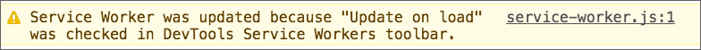

### Inspecting Cache Storage

Notice that the __Cache Storage__ menu item in the __Application__ panel now has a caret indicating it can be expanded. If you don't see it, right click on __Cache Storage__ and choose __Refresh Caches__ (this doesn't actually do anything to the caches, it just updates the DevTools UI).

* Click to expand the  __Cache Storage__ menu, then click on `my-site-cache-v1`

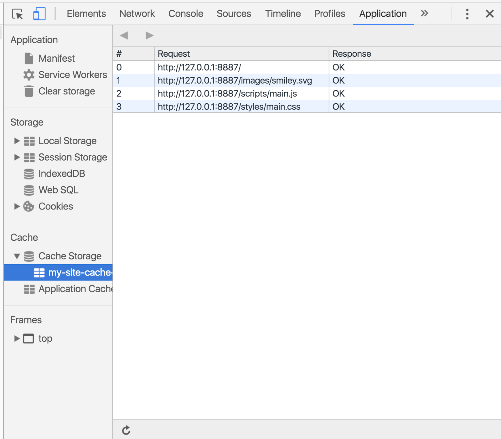

Here you can see all of the files cached by the Service Worker. If you need to remove a file from the cache you can right-click on it and select the __delete__ option from the context menu. Similarly, you can delete the entire cache by right-clicking on `my-site-cache-v1` and choosing delete.

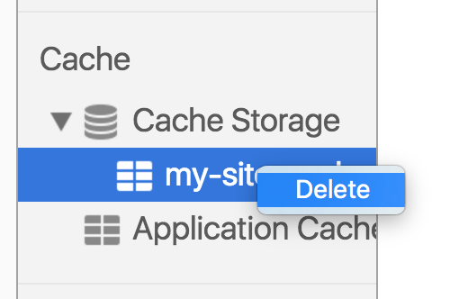

### Cleaning the slate

As you may have noticed, along with __Cache Storage__, there are a number of other menu items related to stored resources, including: Local Storage, Session Storage, IndexedDB, Web SQL, Cookies, and Application Cache ("AppCache"). Having granular control of each of these resources all in one panel is extremely useful! But if you were in a scenario where you wanted to delete all of the stored resources it would be pretty tedious to have to visit each menu item and delete their contents. Instead, you can use the __Clear storage__ option to clean the slate in one fell swoop (note that this will also unregister any Service Workers).

* Select the __Clear storage__ menu option
* Click the __Clear selected__ button to delete all stored resources

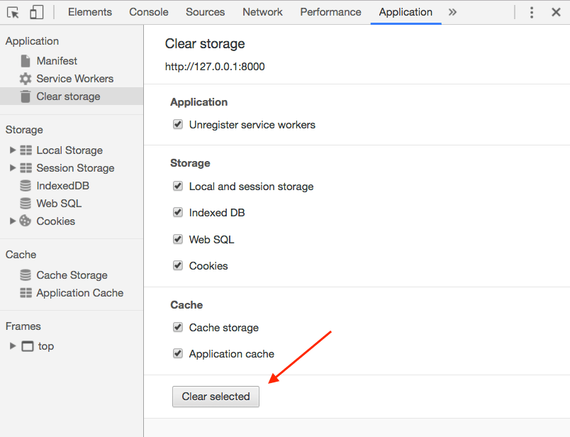

If you go back to __Cache Storage__ you'll now see that all the stored files have been deleted.

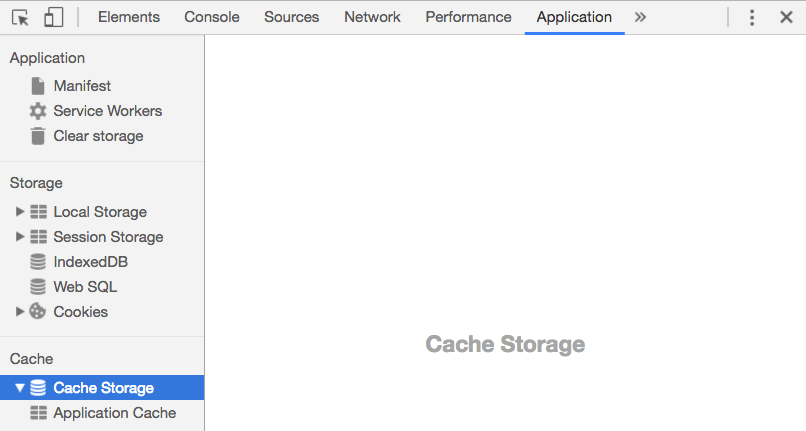

<aside markdown="1" class="key-point">
<p><strong>TIP:</strong> You can also use a new Incognito window for testing and debugging Service Workers. When the Incognito window is closed, Chrome will remove any cached data or installed Service Worker, ensuring that you always start from a clean state.</p>
</aside>


__What's with the gear?__

Because the Service Worker is able to make its own network requests, it can be useful to identify network traffic which originated from the worker itself.

* While `my-site-cache-v1` is still empty, switch over to the Network panel
* Refresh the page

In the Network panel, you should see an initial set of request for files like `main.css`, followed by a second round of requests, prefixed with a gear icon, which seem to fetch the same assets.

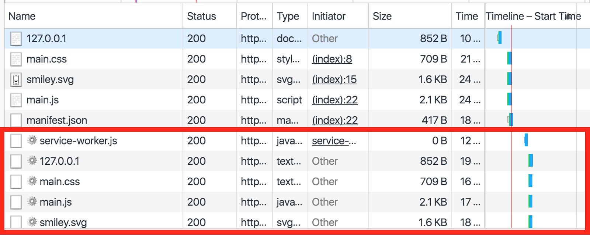

The gear icon signifies that these requests came from the Service Worker itself. Specifically, these are the requests being made by the Service Worker's `install` handler to populate the offline cache.

<aside markdown="1" class="key-point">
<p><strong>Learn More</strong>: For a deeper understanding of the Network panel identifies Service Worker traffic take a look at  <a href="http://stackoverflow.com/a/33655173/385997">this StackOverflow discussion</a>.</p>
</aside>


## Simulating different network conditions


One of the killer features of Service Workers is their ability to serve cached content to users even when they're offline. To verify everything works as planned, let's test out some of the network throttling tools that Chrome provides.

### Serving requests while offline

In order to serve offline content, you'll need to add a `fetch` handler to your `service-worker.js`

* Add the following code to `service-worker.js` just after the `activate` handler

```
self.addEventListener('fetch', function(event) {
  event.respondWith(
    caches.match(event.request)
      .then(function(response) {
        // Cache hit - return response
        if (response) {
          return response;
        }
        return fetch(event.request);
      }
    )
  );
});
```

* Switch to the __Application__ panel and verify that __Update on reload__ is still checked
* Refresh the page to install the new Service Worker
* Uncheck __Update on reload__
* Check __Offline__

Your __Application__ panel should look like this now:

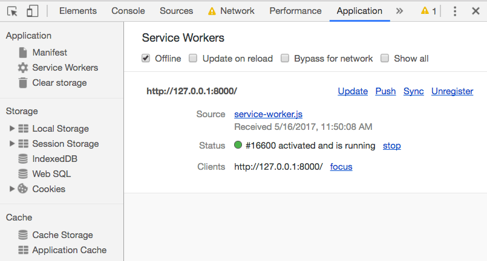

Notice the __Network__ panel now has a yellow warning sign to indicate that you're offline (and to remind you that you'll want to uncheck that checkbox if you want to continue developing with the network).

With your `fetch` handler in place, and your app set to __Offline__, now is the moment of truth. Refresh the page and if all goes well you should continue to see site content, even though nothing is coming from the network. You can switch to the __Network__ panel to verify that all of the resources are being served from Cache Storage. Notice in the __Size__ column it says these resources are coming `(from Service Worker)`. That's the signal that tells us the Service Worker intercepted the request, and served a response from the cache instead of hitting the network.

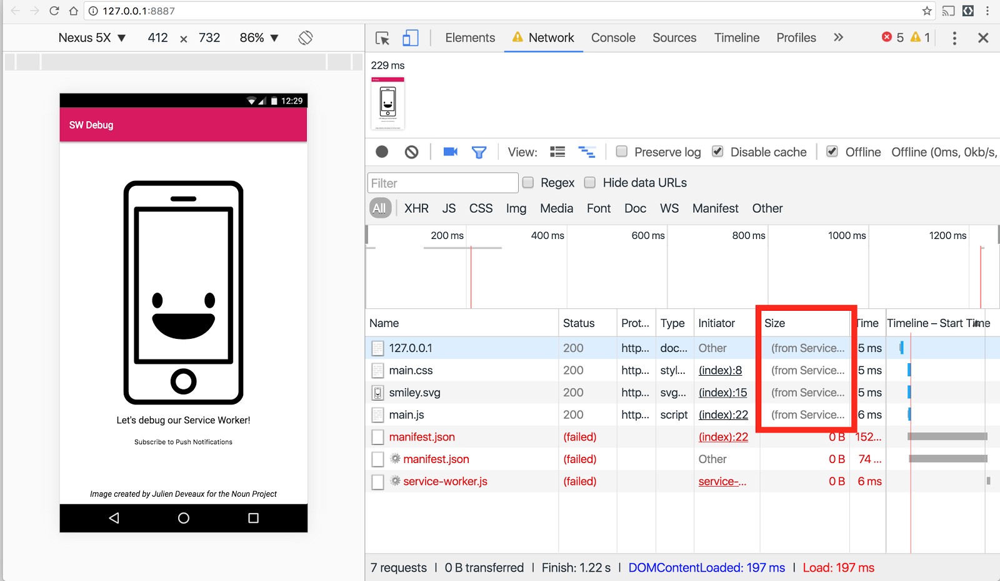

You'll notice that there are failed requests (like for a new Service Worker or `manifest.json`). That's totally fine and expected.

### Testing slow or flaky networks

Because we use our mobile devices in a plethora of different contexts, we're constantly moving between various states of connectivity. There are also many parts of the world where 3G and 2G speeds are the norm. To verify that our app works well for these consumers, we should test that it is performant even on a slower connection.

To start, let's simulate how the application works on a slow network when the Service Worker is not in play.

* From the __Application__ panel, uncheck __Offline__
* Check __Bypass for network__

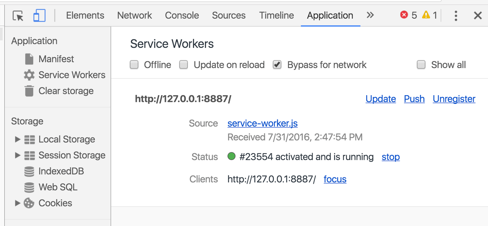

The __Bypass for network__ option will tell the browser to skip our service worker when it needs to make a network request. This means nothing will be able to come from Cache Storage, it will be as if we have no Service Worker installed at all.

* Next, switch to the __Network__ panel
* Use the __Network Throttle__ dropdown to set the network speed to `Regular 2G`

The __Network Throttle__ dropdown is located in the top right of the __Network__ panel, right next to the __Network__ panel's own __Offline__ checkbox. By default it is set to `No throttling`.

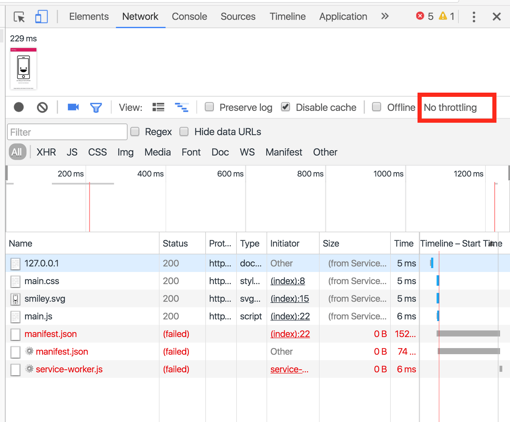

* With the speed set to `Regular 2G`, refresh the page

Notice the response times jump way up! Now each asset takes several hundred milliseconds to download.

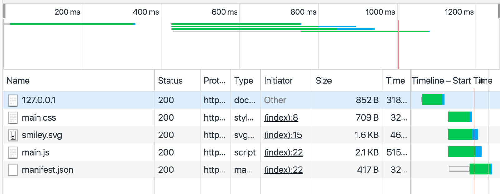

Let's see how things differ with our Service Worker back in play.

* With the network still set to `Regular 2G`, switch back to the __Application__ tab
* Uncheck the __Bypass for network__ checkbox
* Switch back to the __Network__ panel
* Refresh the page

Now our response times jump down to a blazing fast few milliseconds per resource. For users on slower networks this is a night and day difference!

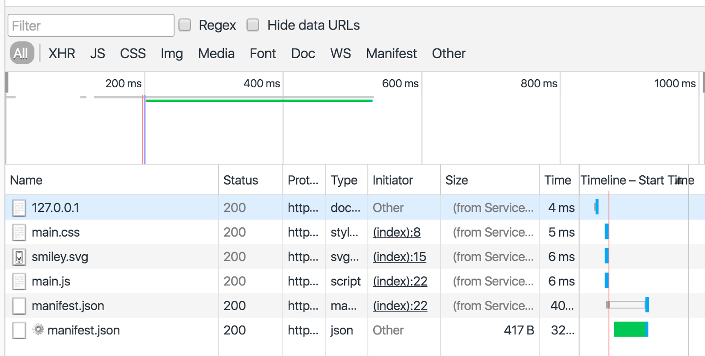

<aside markdown="1" class="warning">
<p>Before proceeding make sure you set the <strong>Network Throttle</strong> back to <code>No throttling</code></p>
</aside>


## Remember, it's just JavaScript


Service Workers can feel like magic, but under the hood they're really just regular JavaScript files. This means you can use existing tools like `debugger` statements and breakpoints to debug them.

### Working with the debugger

Many developers rely on good old `console.log()` when they have an issue in their app. But there's a much more powerful tool available in the toolbox: `debugger`.

Adding this one line to your code will pause execution and open up the __Sources__ panel in the DevTools. From here you can step through functions, inspect objects, and even use the console to run commands against the current scope. This can be especially useful for debugging a cranky Service Worker.

To test it out, let's debug our `install` handler.

* Add a `debugger` statement to the beginning of your `install` handler in `service-worker.js`

```
self.addEventListener('install', function(event) {
  debugger;
  // Perform install steps
  event.waitUntil(
    caches.open(CACHE_NAME)
      .then(function(cache) {
        return cache.addAll(urlsToCache);
      })
  );  
});
```

* Refresh the page

The application will pause execution and switch panels over to __Sources__ where the `debugger` statement is now highlighted in `service-worker.js`.

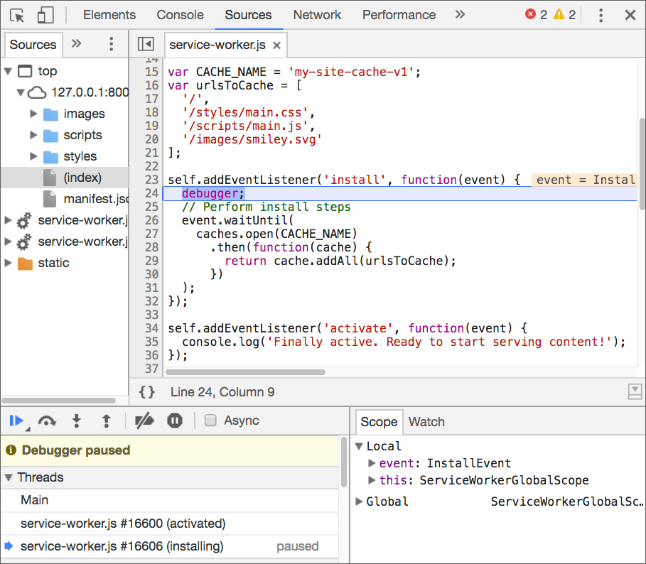

<aside markdown="1" class="key-point">
<p><strong>Learn More</strong>: A full explanation of the <strong>Sources</strong> panel is outside the scope of this codelab but you can  <a href="/web/tools/chrome-devtools/debug/?hl=en">learn more about the debugging capabilities of the DevTools</a> on the Google Developers site.</p>
</aside>


There are a ton of useful tools available in this view. One such tool is the __Scope__ inspector, which let's us see the current state of objects in the current function's scope.

* Click on the `event: InstallEvent` dropdown

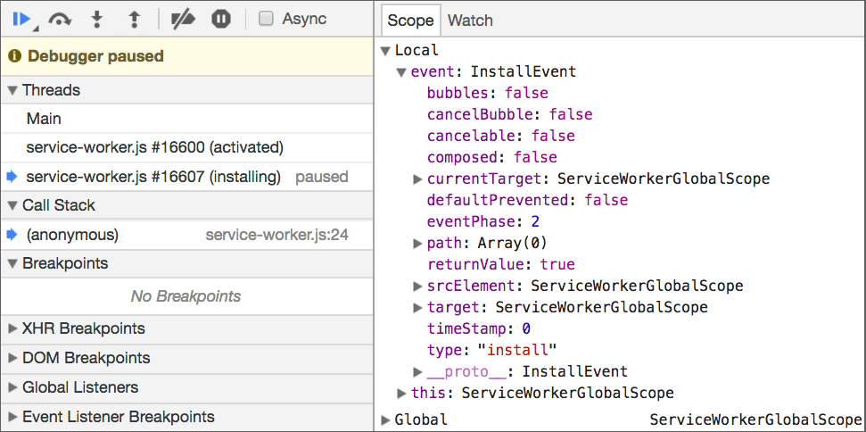

From here you can learn all sorts of useful information about the current in-scope objects. For instance, looking at the `type` field you can verify that the current event object is for the `install` event.

* when you've finished exploring the __Scope__ inspector, press the Resume button

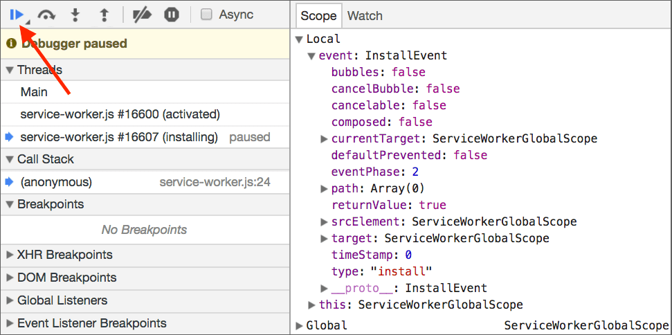

This allows the script to resume executing after the break. Finally, let's complete the activation of the new service worker.

* Return to the __Service Workers__ section of the __Application__ panel
* Click on __skipWaiting__ to activate the new Service Worker

### Using breakpoints instead

If you're already inspecting your code in the __Sources__ panel, you may find it easier to set a breakpoint, versus adding `debugger` statements to your actual files. A breakpoint serves a similar purpose (it freezes execution and lets you inspect the app) but it can be set from within DevTools itself.

To set a breakpoint you need to click the line number where you'd like the application to halt execution.

* From the __Sources__ panel, scroll down to line 39 of `service-worker.js` and click on the line number


This will set a breakpoint at the beginning of the `fetch` handler so you can inspect its event object.

* Refresh the page

Notice that, similar to when you used the `debugger` statement, execution has now stopped on the line with the breakpoint. This means you can now inspect the `FetchEvent` objects passing through your app and determine what resources they were requesting.

* In the __Scope__ inspector, expand the `event` object
* Expand the `request` object
* Note the `url` property

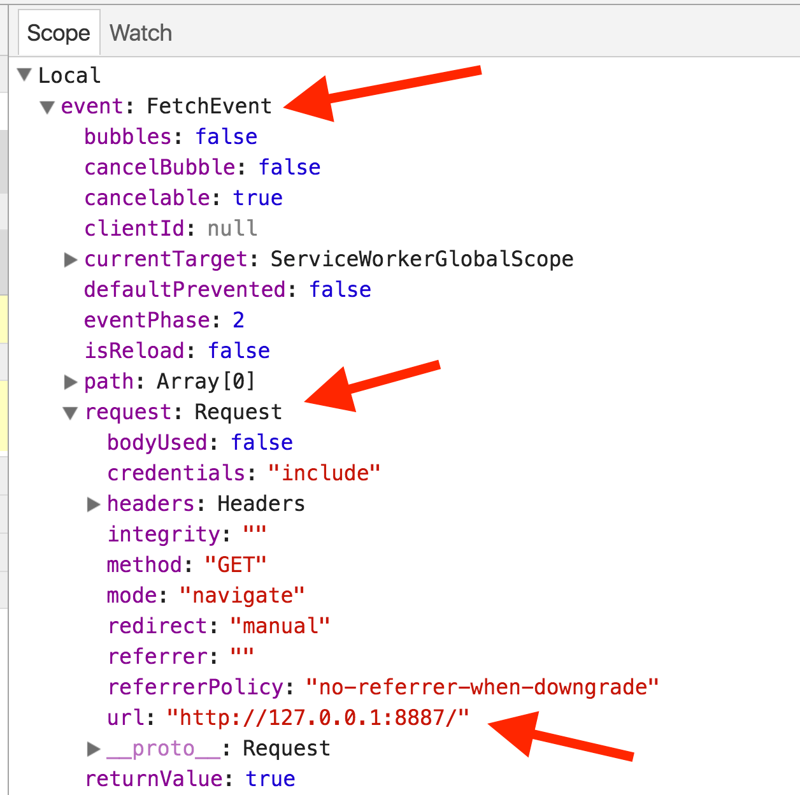

You can see that this `FetchEvent` was requesting the resource at `http://127.0.0.1:8887/`, which is our `index.html`. Because the app will handle many `fetch` requests, you can leave the breakpoint in place and resume execution. This will let you inspect each `FetchEvent` as it passes through the app. A very useful technique for getting a fine grained look at all the requests in your app.

* Press the __Resume__ button to allow script execution to continue

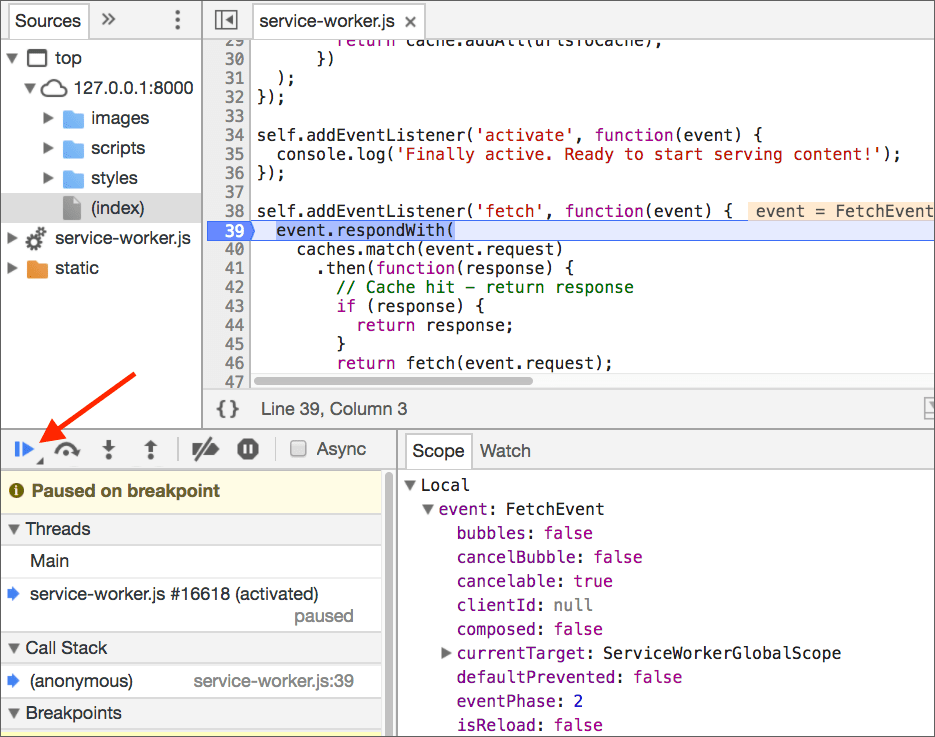

After a moment, execution will pause on the same breakpoint. Check the `event.request.url` property and note it now displays `http://127.0.0.1:8887/styles/main.css`. You can continue in this way to watch it request `smiley.svg`,  `main.js`, and finally the `manifest.json`.

When you are finished exploring, remove any breakpoints and comment out the `debugger` call so that they don't interfere with the rest of the lab.


## Testing Push notifications


Push notifications are an important part of creating an engaging experience. Because notifications require coordination between an application server, a messaging service (like Google Cloud Messaging), and your Service Worker, it can be useful to test the Service Worker in isolation first to verify it is setup properly.

### Adding Push support

You may have noticed a button in the center of the application asking for the user to __Subscribe for Push Notifications__. This button is already wired up to request the Push notification permission from the user when clicked.

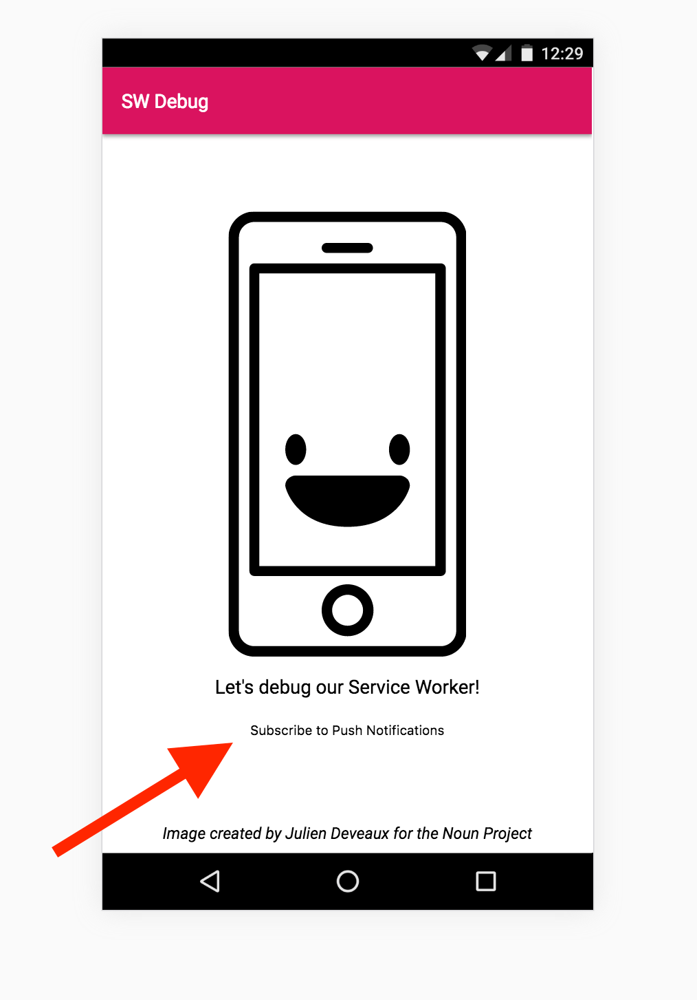

<aside markdown="1" class="warning">
<p>The code used to set up this Push subscription is just for demo purposes and should not be used in production. For a thorough guide on setting up Push notifications  <a href="/web/fundamentals/engage-and-retain/push-notifications/">see this post</a> on the Google Developers site.</p>
</aside>


The only remaining step is to add support for the `push` event to `service-worker.js`.

* Open `service-worker.js` and add the following lines after the `fetch` handler

```
self.addEventListener('push', function(event) {  
  var title = 'Yay a message.';  
  var body = 'We have received a push message.';  
  var icon = '/images/smiley.svg';  
  var tag = 'simple-push-example-tag';
  event.waitUntil(  
    self.registration.showNotification(title, {  
      body: body,  
      icon: icon,  
      tag: tag  
    })  
  );  
});
```

With the handler in place it's easy to simulate a Push event.

* Open the __Application__ panel
* Refresh the page, when you see the new Service Worker enter the `waiting` phase, click on the __skipWaiting__ button
* Click on the __Subscribe to Push Notifications__ button in the app
* Accept the permission prompt

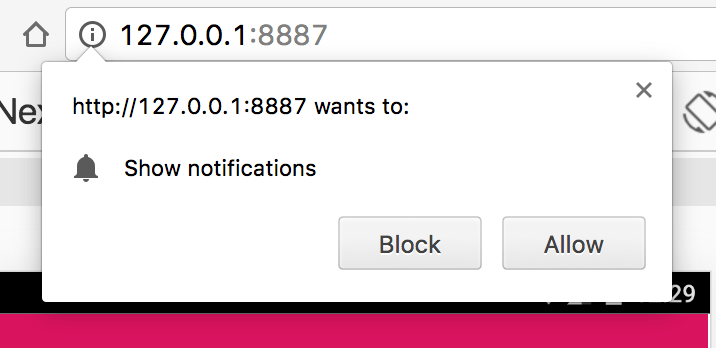

* Finally, click the __Push__ button, next to __Update__ and __Unregister__ back in the __Application__ tab

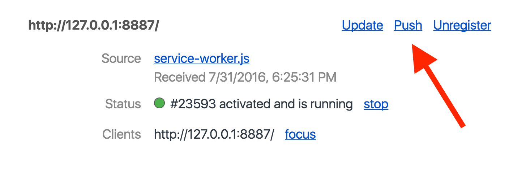

You should now see a Push notification appear in the top right of the screen, confirming that the Service Worker is handling `push` events as expected.

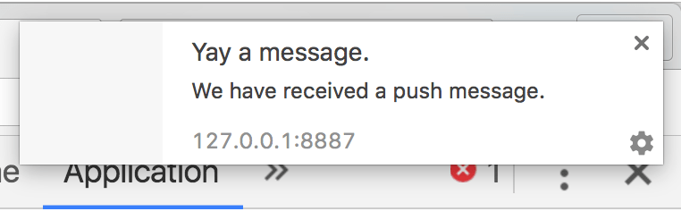

Nice work!

Now that you have some debugging tools in your toolbox, you should be well equipped to fix-up any issues that arise in your project. The only thing left is for you to get out there and build the next amazing Progressive Web App!


## Found an issue, or have feedback? {: .hide-from-toc }
Help us make our code labs better by submitting an 
[issue](https://github.com/googlecodelabs/debugging-service-workers/issues) today. And thanks!
