project_path: /web/fundamentals/_project.yaml
book_path: /web/fundamentals/_book.yaml
description: Learn how to integrate a service worker into an existing application to make the application work offline.

{# wf_auto_generated #}
{# wf_updated_on: 2016-11-09T18:31:19Z #}
{# wf_published_on: 2016-01-01 #}


# Adding a Service Worker and Offline into your Web App {: .page-title }




## Overview


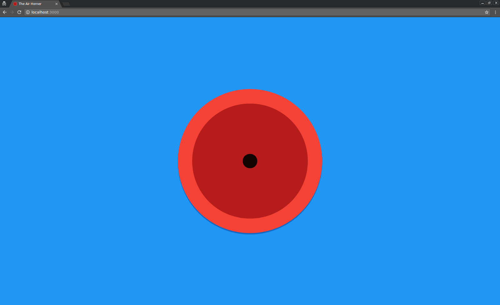

In this codelab, you learn how to integrate a service worker into an existing application to make the application work offline. The application is called  [Air Horner](https://airhorner.com). Click the horn and it makes a sound.

#### What you'll learn

* How to add a basic service worker to an existing project.
* How to simulate offline mode and inspect and debug a service worker with Chrome DevTools.
* A simple offline caching strategy.

#### What you'll need

* Chrome 52 or above.
* A basic understanding of  [Promises](/web/fundamentals/getting-started/primers/promises), Git, and Chrome DevTools.
* The sample code.
* A text editor.
* A local web server. If you want to use the web server described in this codelab, you need Python installed on your command line.


## Get the sample code


Clone the GitHub repository from the command line over SSH:

    $ git clone git@github.com:GoogleChrome/airhorn.git

Or HTTPS:

    $ git clone https://github.com/GoogleChrome/airhorn.git


## Run the sample app


First, let's see what the finished sample app looks like (hint: it's amazing). 

Make sure you are on the correct (final) branch by checking out the `master` branch.

    $ git checkout master

Run the site from a local web server.  You can use any web server, but for the rest of this codelab we'll assume that you're using Python's `SimpleHTTPServer` on port 3000, so the app will be available from `localhost:3000`.

    $ cd app
    $ python -m SimpleHTTPServer 3000

<aside markdown="1" class="key-point">
<p>This repository has one main folder <strong>"app"</strong>. This folder contains the static assets (HTML, CSS, and JavaScript) that you will use for this project.</p>
</aside>


Open up the site in Chrome. You should see: 


## Test the app


Click the horn. It should make a sound.

Now, you're going to simulate going offline using Chrome DevTools.

Open DevTools, go to the __Application__ panel, and enable the __Offline __checkbox. In the screenshot below the mouse is hovering over the checkbox. 

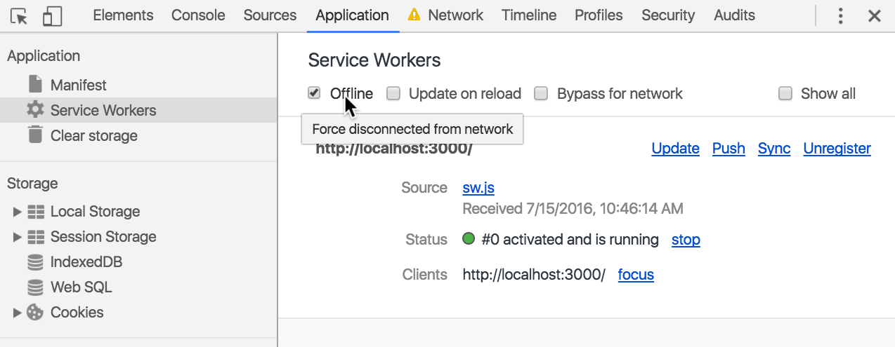

After clicking the checkbox note the warning icon (yellow triangle with exclamation mark) next to the __Network __panel tab. This indicates that you're offline. 

To prove that you're offline, go to  [https://google.com](https://google.com). You should see Chrome's "there is no Internet connection" error message. 

Now, go back to your app. Although you're offline, the page should still fully reload. You should be able to use the horn still.

The reason this works offline is the basis of this codelab: offline support with service worker.


## Build the starter app


You are now going to remove all offline support from the application and you are going to learn how to use a service worker to add the offline support back into the application

Check out the "broken" version of the app that does not have the service worker implemented.

    $ git checkout code-lab

Go back to the __Application __panel of DevTools and disable the __Offline __checkbox, so that you're back online.

Run the page. The app should work as expected.

Now, use DevTools to simulate offline mode again (by enabling the __Offline __checkbox in the __Application __panel). __Heads up!__ If you don't know much about service workers, you're about to see some unexpected behavior.

What do you expect to see? Well, because you're offline and because this version of the app has no service worker, you'd expect to see the typical "there is no Internet connection" error message from Chrome.

But what you actually see is... a fully-functional offline app!


What happened? Well, recall that when you began this codelab, you tried out the completed version of the app. When you ran that version, the app actually installed a service worker. That service worker is now automatically running every time that you run the app. Once a service worker is installed to a scope such as `localhost:3000` (you'll learn more about scope in the next section), that service worker automatically starts up every time that you access the scope, unless you programmatically or manually delete it. 

To fix this, go to the __Application __panel of DevTools, click on the __Service Workers __tab, and then click the __Unregister __button. In the screenshot below the mouse is hovering over the button. 

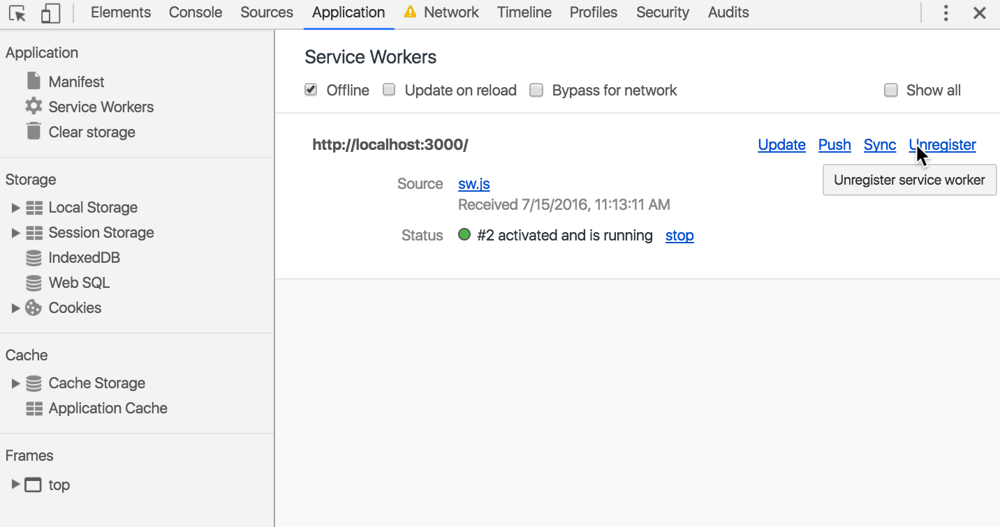

Now, before you reload the site, make sure that you're still using DevTools to simulate offline mode. Reload the page, and it should show you the "there is no Internet connection" error message as expected.

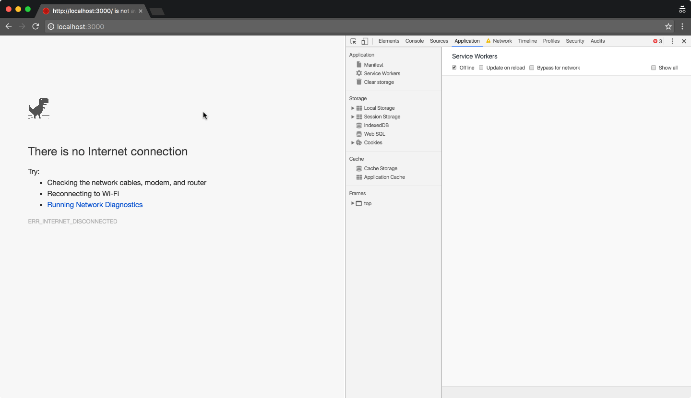


## Register a service worker on the site


Now it's time to add offline support back into the app. This consists of two steps:

1. Create a JavaScript file that will be the service worker.
2. Tell the browser to register the JavaScript file as the "service worker".

First, create a blank file called `sw.js` and place it in the `/app` folder. 

<aside markdown="1" class="key-point">
<p><strong>The location of the service worker is important! </strong>For security reasons, a service worker can only control the pages that are in its same directory or its subdirectories. This means that if you place the service worker file in a scripts directory it will only be able to interact with pages in the scripts directory or below.</p>
</aside>


Now open `index.html` and add the following code to the bottom of `<body>`.

```
<script>
if('serviceWorker' in navigator) {
  navigator.serviceWorker
           .register('/sw.js')
           .then(function() { console.log("Service Worker Registered"); });
}
</script>
```

The script checks if the browser supports service workers. If it does, then it registers our currently blank file `sw.js` as the service worker, and then logs to the Console.

Before you run your site again, go back to DevTools and look at the __Service Workers __tab of the __Application __panel. It should currently be empty, meaning the site has no service workers installed. 

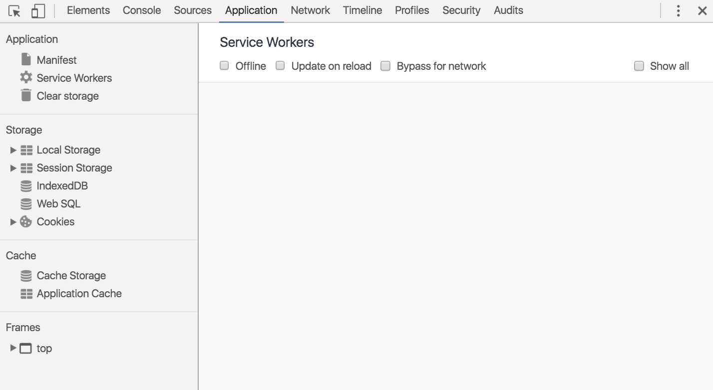

Make sure that the __Offline __checkbox in DevTools is disabled. Reload your page again. As the page loads, you can see that a service worker is registered.

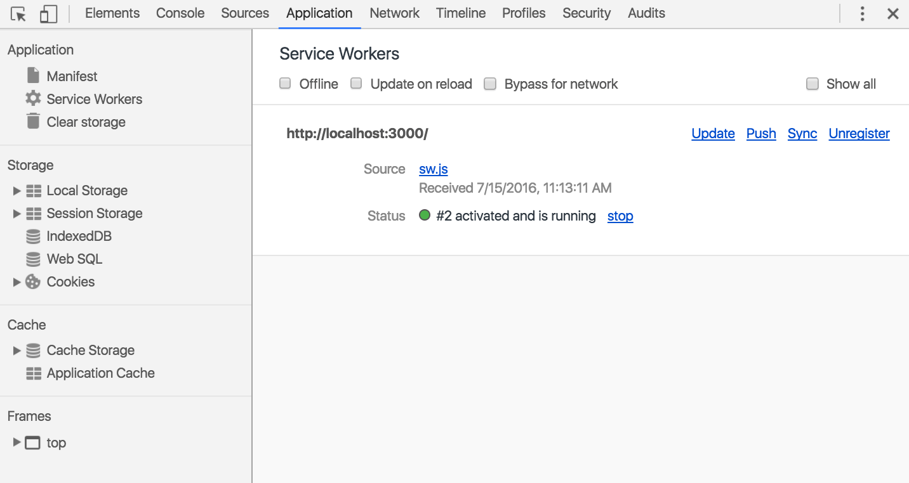

Next to the __Source __label you can see a link to the source code of the registered service worker. 

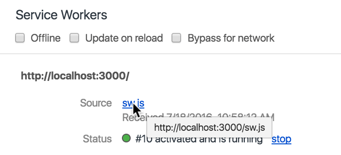

If you ever want to inspect the currently-installed service worker for a page, click on the link. This will show you the source code of the service worker in the __Sources __panel of DevTools. For example, click on the link now, and you should see an empty file. 

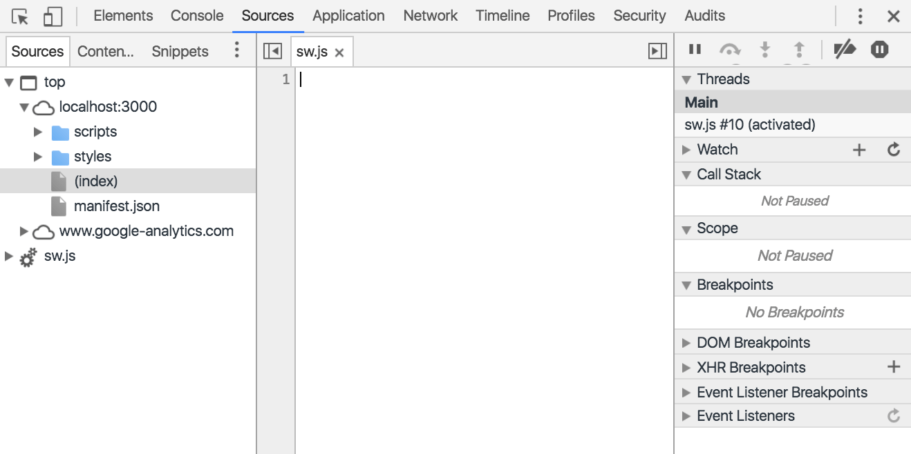


## Install the site assets


With the service worker registered, the first time a user hits the page an `install` event is triggered. This event is where you want to cache your page assets.

Add the following code to sw.js.

```
importScripts('/cache-polyfill.js');


self.addEventListener('install', function(e) {
 e.waitUntil(
   caches.open('airhorner').then(function(cache) {
     return cache.addAll([
       '/',
       '/index.html',
       '/index.html?homescreen=1',
       '/?homescreen=1',
       '/styles/main.css',
       '/scripts/main.min.js',
       '/sounds/airhorn.mp3'
     ]);
   })
 );
});
```

The first line adds the Cache polyfill. This polyfill is already included in the repository. We need to use the polyfill because the Cache API is not yet fully supported in all browsers. Next comes the `install` event listener. The `install` event listener opens the `caches` object and then populates it with the list of resources that we want to cache. One important thing about the `addAll` operation is that it's all or nothing. If one of the files is not present or fails to be fetched, the entire `addAll` operation fails. A good application will handle this scenario.

The next step is to program our service worker to return the intercept the requests to any of these resources and use the `caches` object to return the locally stored version of each resource.

<aside markdown="1" class="key-point">
<h4>Frequently Asked Questions</h4>
<ul>
<li>Where is the polyfill?</li>
<li><a href="https://github.com/coonsta/cache-polyfill">https://github.com/coonsta/cache-polyfill</a> </li>
<li>Why do I need to polyfill?</li>
<li>Currently Chrome and other browsers don't yet fully support the <code>addAll</code> method (<strong>note:</strong> Chrome 46 will be compliant).</li>
<li>Why do you have ?homescreen=1</li>
<li>
<p>URLs with query string parameters are treated as individual URLs and need to be cached separately.</p>
</aside>
</li>
</ul>


## Intercept the web page requests


One powerful feature of service workers is that, once a service worker controls a page, it can intercept every request that the page makes and decide what to do with the request. In this section you are going to program your service worker to intercept requests and return the cached versions of assets, rather than going to the network to retrieve them.

The first step is to attach an event handler to the `fetch` event. This event is triggered for every request that is made.

Add the following code to the bottom of your `sw.js` to log the requests made from the parent page.

<table markdown="1">
<tr><td colspan="1" rowspan="9">
<p><code>self.addEventListener('fetch', function(event) {</code></p>
<p><code>console.log(event.request.url);</code></p>
<p><code>});</code></p>
</td>
</tr>
<tr>
</tr>
<tr>
</tr>
<tr>
</tr>
<tr>
</tr>
<tr>
</tr>
<tr>
</tr>
<tr>
</tr>
<tr>
</tr></table>


Let's test this out. __Heads up!__ You're about to see some more unexpected service worker behavior. 

Open DevTools and go to the __Application__ panel. The __Offline __checkbox should be disabled. Press the `Esc` key to open the __Console __drawer at the bottom of your DevTools window. Your DevTools window should look similar to the following screenshot:

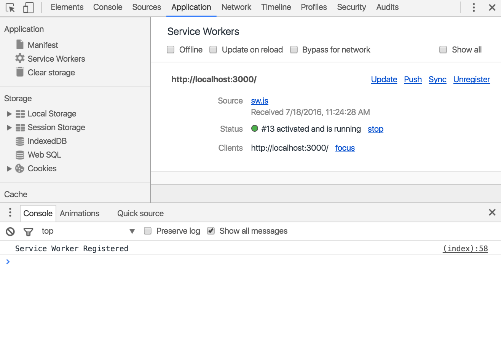

Reload your page now and look at the DevTools window again. For one, we're expecting to see a bunch of requests logged to the Console, but that's not happening. For two, in the __Service Worker __pane we can see that the __Status __has changed:

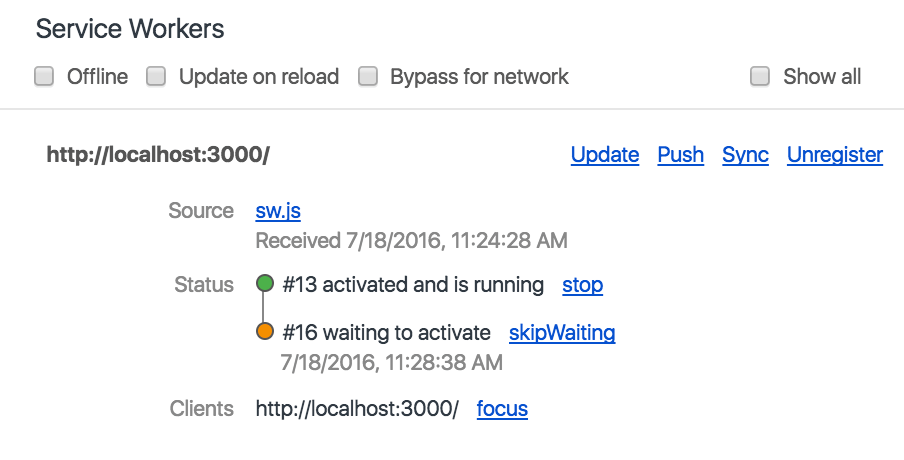

In the __Status __there's a new service worker that's waiting to activate. That must be the new service worker that includes the changes that we just made. So, for some reason, the old service worker that we installed (which was just a blank file) is still controlling the page. If you click on the `sw.js` link next to __Source __you can verify that the old service worker is still running. 

<aside markdown="1" class="key-point">
<p>This behavior is by design. Check out  <a href="/web/fundamentals/primers/service-worker/update-a-service-worker?hl=en">Update a Service Worker</a> to learn more about the service worker lifecycle.</p>
</aside>


To fix this inconvenience, enable the __Update on reload__ checkbox.

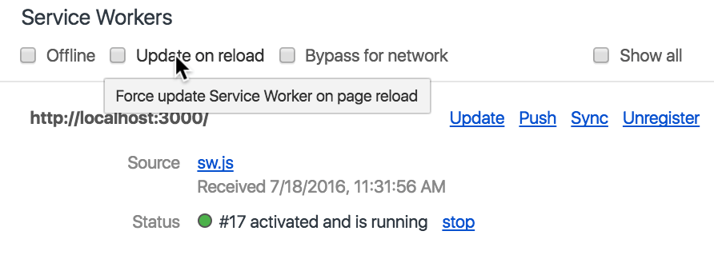

When this checkbox is enabled, DevTools always updates the service worker on every page reload. This is very useful when actively developing a service worker.

Reload the page now and you can see that a new service worker is installed and that the request URLs are being logged to the Console, as expected.

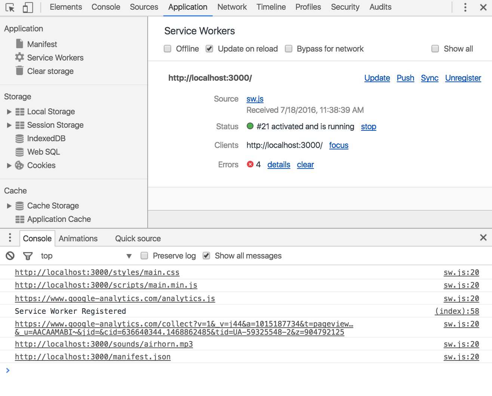

Now you need to decide what to do with all of those requests. By default, if you don't do anything, the request is passed to the network and the response is returned to the web page.

To make your application work offline you need to pull the request from the cache, if it is available.

Update your fetch event listener to match the code below.

<table markdown="1">
<tr><td colspan="1" rowspan="9">
<p><code>self.addEventListener('fetch', function(event) {</code></p>
<p><code>console.log(event.request.url);</code></p>
<p><code>event.respondWith(</code></p>
<p><code>caches.match(event.request).then(function(response) {</code></p>
<p><code>return response || fetch(event.request);</code></p>
<p><code>})</code></p>
<p><code>);</code></p>
<p><code>});</code></p>
</td>
</tr>
<tr>
</tr>
<tr>
</tr>
<tr>
</tr>
<tr>
</tr>
<tr>
</tr>
<tr>
</tr>
<tr>
</tr>
<tr>
</tr></table>


The `event.respondWith()` method tells the browser to evaluate the result of the event in the future. `caches.match(event.request)` takes the current web request that triggered the fetch event and looks in the cache for a resource that matches. The match is performed by looking at the URL string. The `match` method returns a promise that resolves even if the file is not found in the cache. This means that you get a choice about what you do. In your simple case, when the file is not found, you simply want to `fetch` it from the network and return it to the browser.

This is the simplest case; there are many other caching scenarios. For example, you could incrementally cache all responses for previously uncached requests, so in the future they are all returned from the cache. 


## Congratulations!


You now have offline support. Reload your page while still online to update your service worker to the latest version, and then use DevTools to go into offline mode. Reload your page again, and you should have a fully-functional offline air horn!

#### What we've covered

* How to add a basic service worker to an existing project.
* How to use Chrome DevTools to simulate offline mode and to inspect and debug service workers.
* A simple offline caching strategy.

#### Next Steps

* Learn how to easily add robust  [offline support with Polymer offline elements](https://codelabs.developers.google.com/codelabs/sw-precache/index.html?index=..%2F..%2Findex#0)
* Explore more  [advanced caching techniques](https://jakearchibald.com/2014/offline-cookbook/)

#### Learn More

*  [Introduction to service worker](/web/fundamentals/primers/service-worker/?hl=en)


## Found an issue, or have feedback? {: .hide-from-toc }
Help us make our code labs better by submitting an 
[issue](https://github.com/googlesamples/io2015-codelabs/issues) today. And thanks!
