project_path: /web/fundamentals/_project.yaml
book_path: /web/fundamentals/_book.yaml
description: In this codelab you'll how to add push notifications to your web app.

{# wf_auto_generated #}
{# wf_updated_on: 2017-07-24T20:50:03Z #}
{# wf_published_on: 2016-01-01 #}


# Adding Push Notifications to a Web App {: .page-title }




## Overview


Push messaging provides a simple and effective way to re-engage with your users and in this code lab you'll learn how to add push notifications to your web app.

### What you'll learn

* How to subscribe and unsubscribe a user for push messaging
* How to handle incoming push messages
* How to display a notification
* How to respond to notification clicks

### What you'll need

* Chrome 52 or above
*  [Web Server for Chrome](https://chrome.google.com/webstore/detail/web-server-for-chrome/ofhbbkphhbklhfoeikjpcbhemlocgigb), or your own web server of choice
* A text editor
* Basic knowledge of HTML, CSS, JavaScript, and Chrome DevTools
* The sample code, see Get setup


## Get Setup


### Download the sample code

You can get the sample code for this code by either downloading the zip here:

[Download source code](https://github.com/googlechrome/push-notifications/archive/master.zip)

or by cloning this git repo:

    git clone https://github.com/GoogleChrome/push-notifications.git

If you downloaded the source as a zip, unpacking it should give you a root folder `push-notifications-master`.

### Install and verify web server

While you're free to use your own web server, this codelab is designed to work well with the Chrome Web Server. If you don't have that app installed yet, you can install it from the Chrome Web Store.

[Install Web Server for Chrome](https://chrome.google.com/webstore/detail/web-server-for-chrome/ofhbbkphhbklhfoeikjpcbhemlocgigb)

After installing the Web Server for Chrome app, click on the Apps shortcut on the bookmarks bar: 

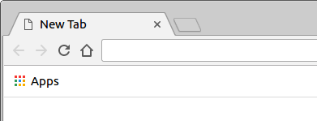

In the ensuing window, click on the Web Server icon: 

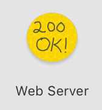

You'll see this dialog next, which allows you to configure your local web server:

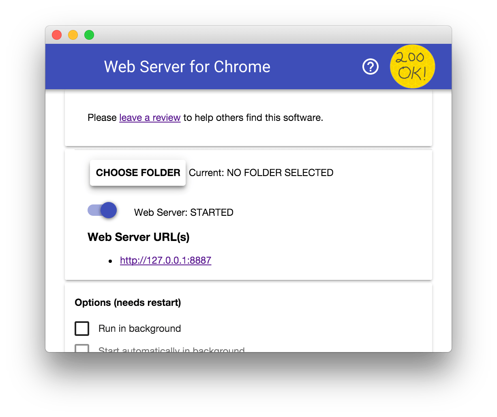

Click the __choose folder__ button, and select the app folder. This will enable you to serve your work in progress via the URL highlighted in the web server dialog (in the __Web Server URL(s)__ section).

Under Options, check the box next to "Automatically show index.html", as shown below:


Then stop and restart the server by sliding the toggle labeled "Web Server: STARTED" to the left and then back to the right.

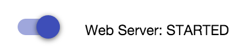

Now visit your site in your web browser (by clicking on the highlighted Web Server URL) and you should see a page that looks like this:

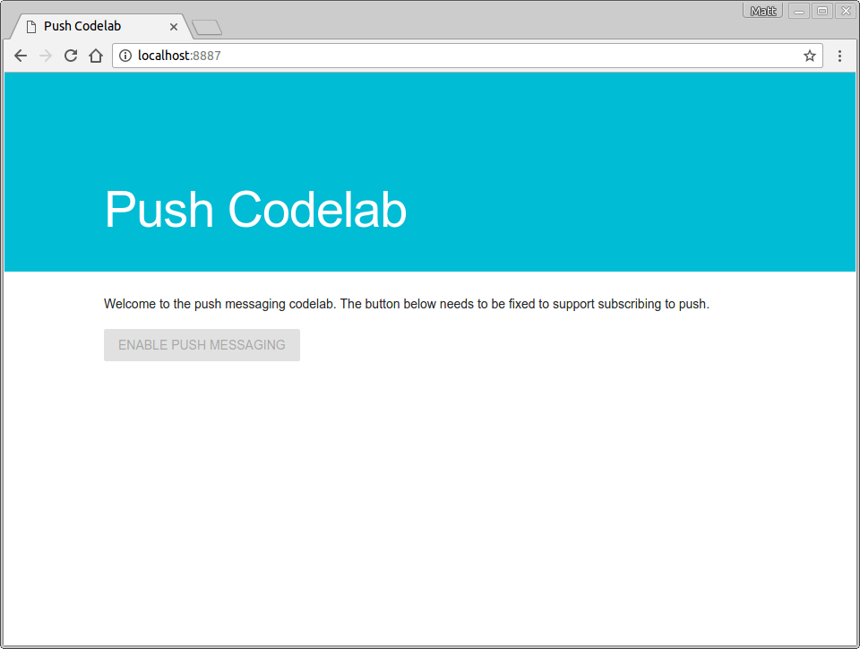

### Always update the service worker

During development it's helpful to ensure your service worker is always up to date and has the latest changes.

To set this up in Chrome, open DevTools (Right Click > Inspect) and go to the __Application__ panel, click the __Service Workers__ tab and check the __Update on Reload__ checkbox. When this checkbox is enabled the service worker is forcibly updated every time the page reloads.

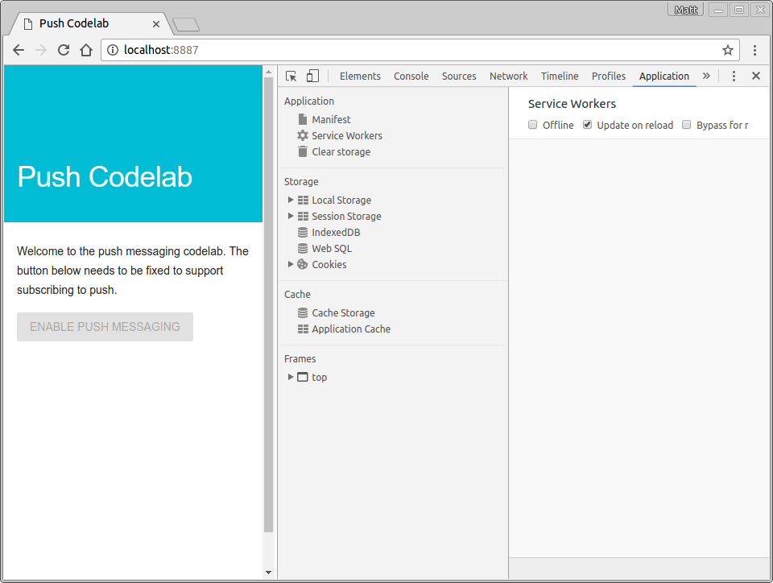


## Register a Service Worker


In your `app` directory, notice that you have an empty file named `sw.js`. This file will be your service worker, for now it can stay empty and we'll be adding code to it later.

First we need to register this file as our Service Worker.

Our `app/index.html` page loads `scripts/main.js` and it's in this JavaScript file that we'll register our service worker.

Add the following code to `scripts/main.js`:

```
if ('serviceWorker' in navigator && 'PushManager' in window) {
  console.log('Service Worker and Push is supported');

  navigator.serviceWorker.register('sw.js')
  .then(function(swReg) {
    console.log('Service Worker is registered', swReg);

    swRegistration = swReg;
  })
  .catch(function(error) {
    console.error('Service Worker Error', error);
  });
} else {
  console.warn('Push messaging is not supported');
  pushButton.textContent = 'Push Not Supported';
}
```

This code checks if service workers and push messaging is supported by the current browser and if it is, it registers our `sw.js` file.

#### Try it out

Check your changes by refreshing the app in the browser.

Check the console in Chrome DevTools for `Service Worker is registered`, like so:

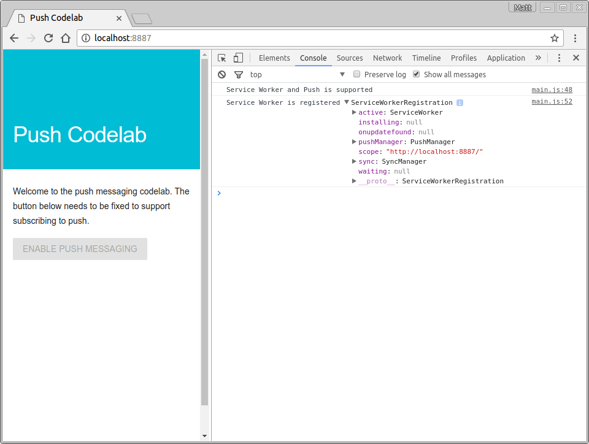

### Get Application Server Keys

To work with this code lab you need to generate some application server keys which we can do with this companion site:  [https://web-push-codelab.appspot.com/](https://web-push-codelab.appspot.com/)

Here you can generate a Public and Private key pair.

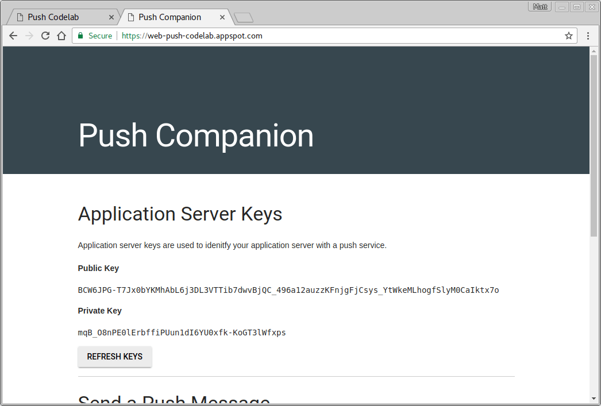

Copy your public key into `scripts/main.js` replacing the `<Your Public Key>` value:

```
const applicationServerPublicKey = '<Your Public Key>';
```

Note: You should never put your private key in your web app!


## Initialize State


At the moment the web app's button is disabled and can't be clicked. This is because it's good practice to disable the push button by default and enable it once you know push is supported and can know if the user is currently subscribed or not.

Let's create two functions in `scripts/main.js`, one called `initialiseUI`, which will check if the user is currently subscribed, and one called `updateBtn` which will enable our button and change the text if the user is subscribed or not.

We want our `initialiseUI` function to look like this:

```
function initialiseUI() {
  // Set the initial subscription value
  swRegistration.pushManager.getSubscription()
  .then(function(subscription) {
    isSubscribed = !(subscription === null);

    if (isSubscribed) {
      console.log('User IS subscribed.');
    } else {
      console.log('User is NOT subscribed.');
    }

    updateBtn();
  });
}
```

Our new method uses the `swRegistration` from the previous step and calls `getSubscription()` on it's `pushManager`. `getSubscription()` is a method that returns a promise that resolves with the current subscription if there is one, otherwise it'll return `null`. With this we can check if the user is already subscribed or not, set some state and then call `updateBtn()` so the button can be enabled with some helpful text.

Add the following code to implement the `updateBtn()` function.

```
function updateBtn() {
  if (isSubscribed) {
    pushButton.textContent = 'Disable Push Messaging';
  } else {
    pushButton.textContent = 'Enable Push Messaging';
  }

  pushButton.disabled = false;
}
```

This function simply changes the text depending on the whether the user is subscribed or not and then enables the button.

The last thing to do is call `initialiseUI()` when our service worker is registered.

```
navigator.serviceWorker.register('sw.js')
.then(function(swReg) {
  console.log('Service Worker is registered', swReg);

  swRegistration = swReg;
  initialiseUI();
})
```

#### Try it out

Refresh your web app and you should see the ‘Enable Push Messaging' button is now enabled (you can click it) and you should see ‘User is NOT subscribed.' in the console.

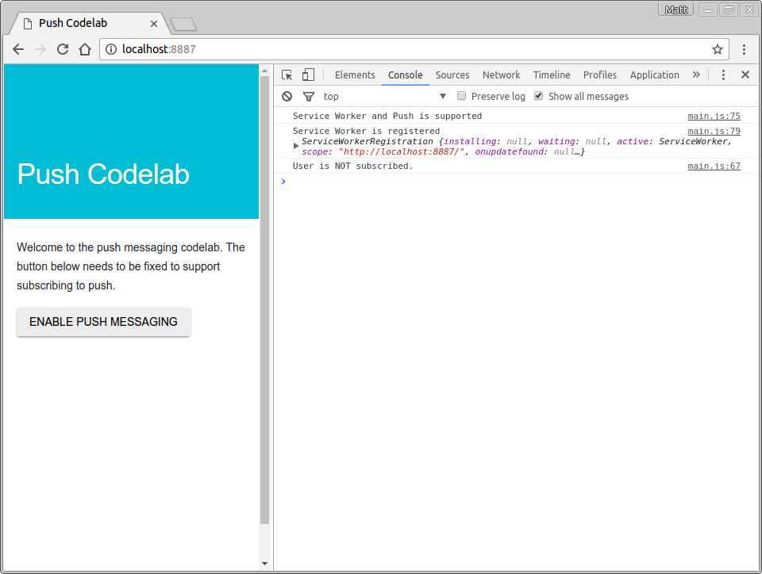

When we progress through the rest of the code lab you should see the button text change when the user subscribed / un-subscribed.


## Subscribe the user


At the moment our ‘Enable Push Messaging' button doesn't do too much, so let's fix that.

Add a click listener to our button in the `initialiseUI()` function, like so:

```
function initialiseUI() {
  pushButton.addEventListener('click', function() {
    pushButton.disabled = true;
    if (isSubscribed) {
      // TODO: Unsubscribe user
    } else {
      subscribeUser();
    }
  });

  // Set the initial subscription value
  swRegistration.pushManager.getSubscription()
  .then(function(subscription) {
    isSubscribed = !(subscription === null);

    updateSubscriptionOnServer(subscription);

    if (isSubscribed) {
      console.log('User IS subscribed.');
    } else {
      console.log('User is NOT subscribed.');
    }

    updateBtn();
  });
}
```

When the user clicks the push button, we first disable the button just to make sure the user can't click it a second time while we're subscribing to push as it can take some time.

Then we call `subscribeUser()` when we know the user isn't currently subscribed, so copy and paste the following code into `scripts/main.js`.

```
function subscribeUser() {
  const applicationServerKey = urlB64ToUint8Array(applicationServerPublicKey);
  swRegistration.pushManager.subscribe({
    userVisibleOnly: true,
    applicationServerKey: applicationServerKey
  })
  .then(function(subscription) {
    console.log('User is subscribed.');

    updateSubscriptionOnServer(subscription);

    isSubscribed = true;

    updateBtn();
  })
  .catch(function(err) {
    console.log('Failed to subscribe the user: ', err);
    updateBtn();
  });
}
```

Lets step through what this code is doing and how it's subscribing the user for push messaging.

First we take the application server's public key, which is base 64 URL safe encoded, and we convert it to a `UInt8Array` as this is the expected input of the subscribe call. We've already given you the function `urlB64ToUint8Array` at the top of `scripts/main.js`.

Once we've converted the value, we call the `subscribe()` method on our service worker's `pushManager`, passing in our application server's public key and the value `userVisibleOnly: true`.

```
const applicationServerKey = urlB64ToUint8Array(applicationServerPublicKey);
swRegistration.pushManager.subscribe({
  userVisibleOnly: true,
  applicationServerKey: applicationServerKey
})
```

The `userVisibleOnly` parameter is basically an admission that you will show a notification every time a push is sent. At the time of writing this value is required and must be true.

Calling `subscribe()` returns a promise which will resolve after the following steps:

1. The user has granted permission to display notifications.
2. The browser has sent a network request to a push service to get the details to generate a PushSubscription.

The `subscribe()` promise will resolve with a `PushSubscription` if these steps were successful. If the user doesn't grant permission or if there is any problem subscribing the user, the promise will reject with an error. This gives us the following promise chain in our codelab:

```
swRegistration.pushManager.subscribe({
  userVisibleOnly: true,
  applicationServerKey: applicationServerKey
})
.then(function(subscription) {
  console.log('User is subscribed.');

  updateSubscriptionOnServer(subscription);

  isSubscribed = true;

  updateBtn();

})
.catch(function(err) {
  console.log('Failed to subscribe the user: ', err);
  updateBtn();
});
```

With this, we get a subscription and treat the user as subscribed or we catch the error and print it to the console. In both scenarios we call `updateBtn()` to ensure the button is re-enabled and has the appropriate text.

The method `updateSubscriptionOnServer` is a method where in a real application we would send our subscription to a backend, but for our codelab we are going to print the subscription in our UI which will help us later on. Add this method to `scripts/main.js`:

```
function updateSubscriptionOnServer(subscription) {
  // TODO: Send subscription to application server

  const subscriptionJson = document.querySelector('.js-subscription-json');
  const subscriptionDetails =
    document.querySelector('.js-subscription-details');

  if (subscription) {
    subscriptionJson.textContent = JSON.stringify(subscription);
    subscriptionDetails.classList.remove('is-invisible');
  } else {
    subscriptionDetails.classList.add('is-invisible');
  }
}
```

#### Try it out

If you go back to your web app and try clicking the button you should see a permission prompt like this:

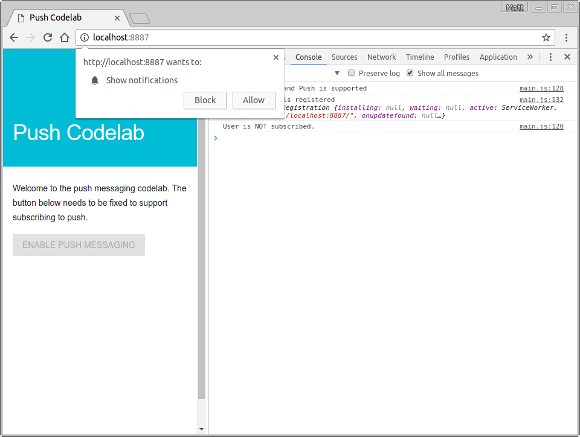

If you grant the permission you should see the console print "User is subscribed.", the button's text will change to ‘Disable Push Messaging'  and you'll be able to view the subscription as JSON at the bottom of the page.

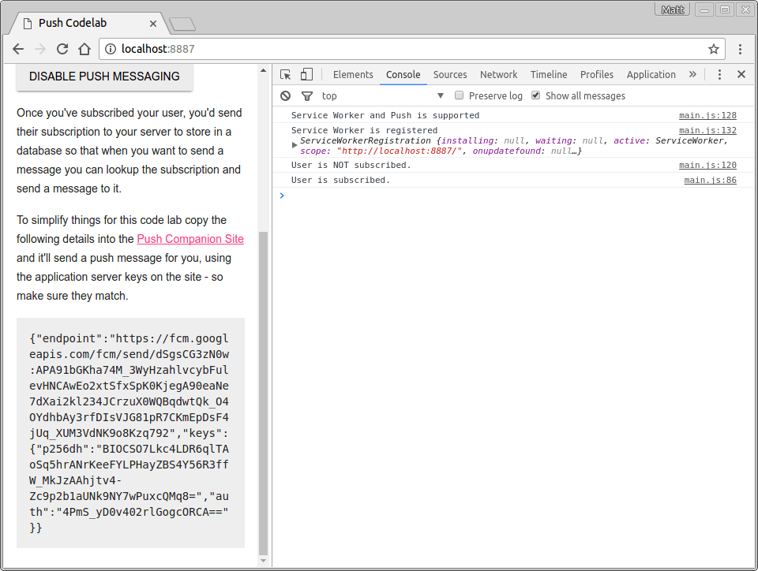


## Handle Permission Denied


One thing that we haven't handled yet is what happens if the user blocks the permission request. This needs some unique consideration because if the user blocks the permission, our web app will not be able to re-show the permission prompt and will not be able to subscribe the user, so we need to at least disable the push button so the user knows it can't be used.

The obvious place for us to handle this scenario is in the `updateBtn()` function. All we need to do is check the `Notification.permission` value, like so:

```
function updateBtn() {
  if (Notification.permission === 'denied') {
    pushButton.textContent = 'Push Messaging Blocked.';
    pushButton.disabled = true;
    updateSubscriptionOnServer(null);
    return;
  }

  if (isSubscribed) {
    pushButton.textContent = 'Disable Push Messaging';
  } else {
    pushButton.textContent = 'Enable Push Messaging';
  }

  pushButton.disabled = false;
}
```

We know that if the permission is `denied`, then the user can't be subscribed and there is nothing more we can do, so disabling the button for good is the best approach.

#### Try it out

Since we've already granted permission for our web app from the previous step we need to click the __i__ in a circle in the URL bar and change the notifications permission to  *Use global default (Ask)* .

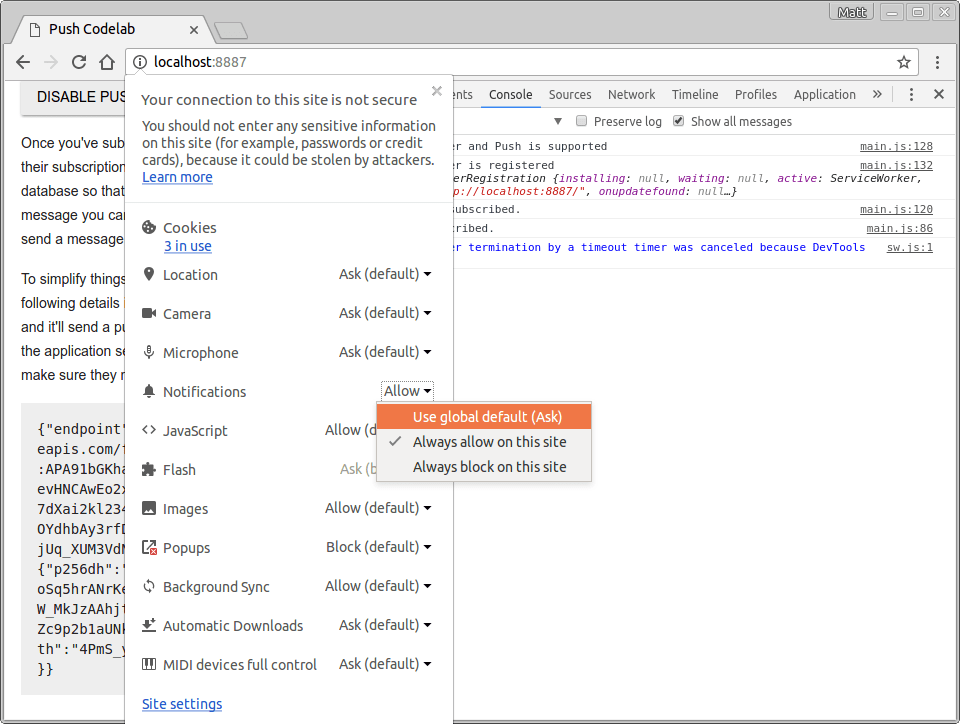

After you've changed this setting, refresh the page and click the  *Enable Push Messaging*  button and this time select  *Block*  on the permission dialog. The button text will now be  *Push Messaging Blocked*  and be disabled.

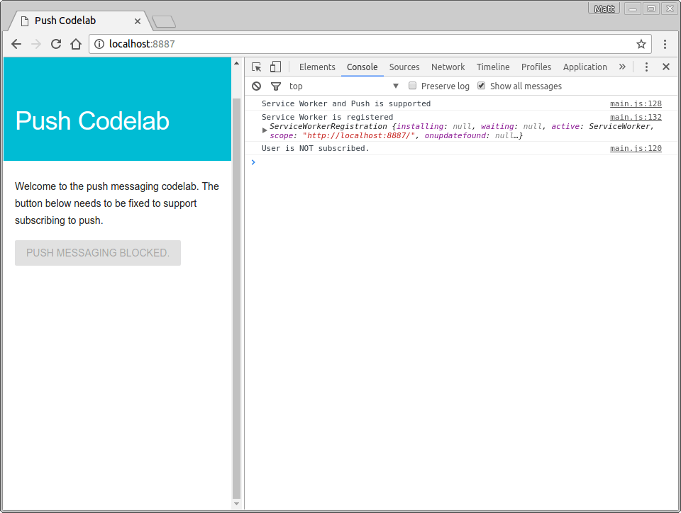

With this change we can now subscribe the user and we're taking care of the possible permission scenarios.


## Handle a Push Event


Before we cover how to send a push message from your backend, we need to consider what will actually happen when a subscribed user receives a push message.

When we trigger a push message, the browser receives the push message, figures out what service worker the push is for before waking up that service worker and dispatching a push event. We need to listen for this event and show a notification as a result.

Add the following code to your `sw.js` file:

```
self.addEventListener('push', function(event) {
  console.log('[Service Worker] Push Received.');
  console.log(`[Service Worker] Push had this data: "${event.data.text()}"`);

  const title = 'Push Codelab';
  const options = {
    body: 'Yay it works.',
    icon: 'images/icon.png',
    badge: 'images/badge.png'
  };

  event.waitUntil(self.registration.showNotification(title, options));
});
```

Let's step through this code. We are listening for push events in our service worker by adding an event listener to our service worker, which is this piece of code:

```
self.addEventListener('push', ...... );
```

Unless you've played with Web Workers before, `self` is probably new. `self` is referencing the service worker itself, so we are adding an event listener to our service worker.

When a push message is received, our event listener will be fired, and we create a notification by calling `showNotification()` on our registration. `showNotification()` expects a `title` and we can give it an `options` object. Here we are going to set a body message, icon and a badge  in the options (the badge is only used on Android at the time of writing).

```
const title = 'Push Codelab';
const options = {
  body: 'Yay it works.',
  icon: 'images/icon.png',
  badge: 'images/badge.png'
};
self.registration.showNotification(title, options);
```

The last thing to cover in our push event is `event.waitUntil()`. This method takes a promise and the browser will keep your service worker alive and running until the promise passed in has resolved.

To make the code above a little easier to understand we can re-write it like so:

```
const notificationPromise = self.registration.showNotification(title, options);
event.waitUntil(notificationPromise);
```

Now that we've stepped through the push event, let's test out a push event.

#### Try it out

With our push event in the service worker we can test what happens when a message is received by triggering a fake push event using DevTools.

In your web app, subscribe to push messaging, making sure you have  *User IS subscribed*  in your console, then go to the  *Application*  panel in DevTools and under the  *Service Workers*  tab click on the  *Push*  link under your service worker.

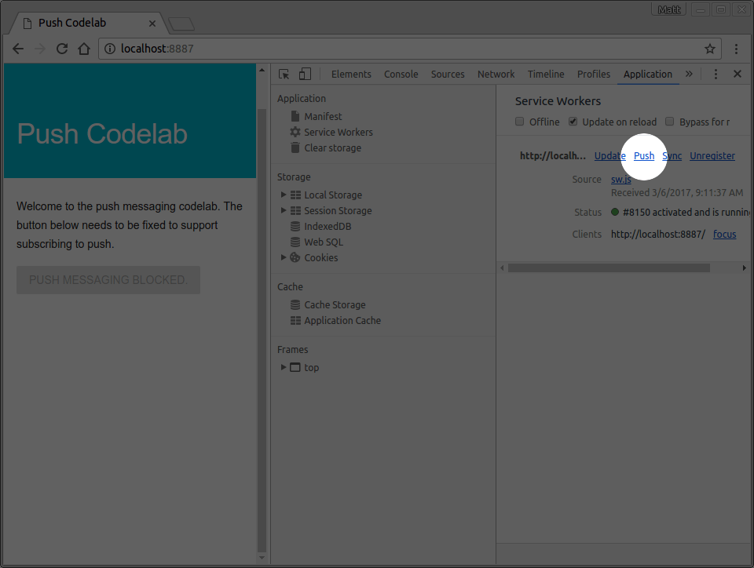

Once you've clicked it you should see a notification like this:

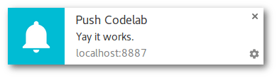

Note: If this step doesn't work, try unregistering your service work, via the  *Unregister*  link in the DevTools Application panel, wait for the service worker to be stopped, and then reload the page.


## Notification click


If you click on one of these notifications you'll notice nothing happens. We can handle notification clicks by listening for `notificationclick` events in your service worker.

Start by adding a `notificationclick` listener  in `sw.js` like so:

```
self.addEventListener('notificationclick', function(event) {
  console.log('[Service Worker] Notification click Received.');

  event.notification.close();

  event.waitUntil(
    clients.openWindow('https://developers.google.com/web/')
  );
});
```

When the user clicks on the notification, the `notificationclick` event listener will be called.

In this code lab we first close the notification that was clicked with:

```
event.notification.close();
```

Then we open a new window / tab loading the url ‘https://developers.google.com/web/' , feel free to change this :)

```
clients.openWindow('https://developers.google.com/web/')
```

We are calling `event.waitUntil()` again to ensure the browser doesn't terminate our service worker before our new window has been displayed.

#### Try it out

Try triggering a push message in DevTools again and click on the notification. You'll now see the notification close and open a new tab.


## Sending push messages


We've seen that our web app is capable of showing a notification using DevTools and looked at how to close the notification of a click. The next step is to send an actual push message.

Normally the process for this would be sending a subscription from a web page to a backend and the backend would then trigger a push message by making an API call to the endpoint in the subscription.

This is out of scope for this codelab, but you can use the companion site ( [https://web-push-codelab.appspot.com/](https://web-push-codelab.appspot.com/)) for this codelab to trigger an actual push message. Copy and paste the subscription at the bottom of your page:

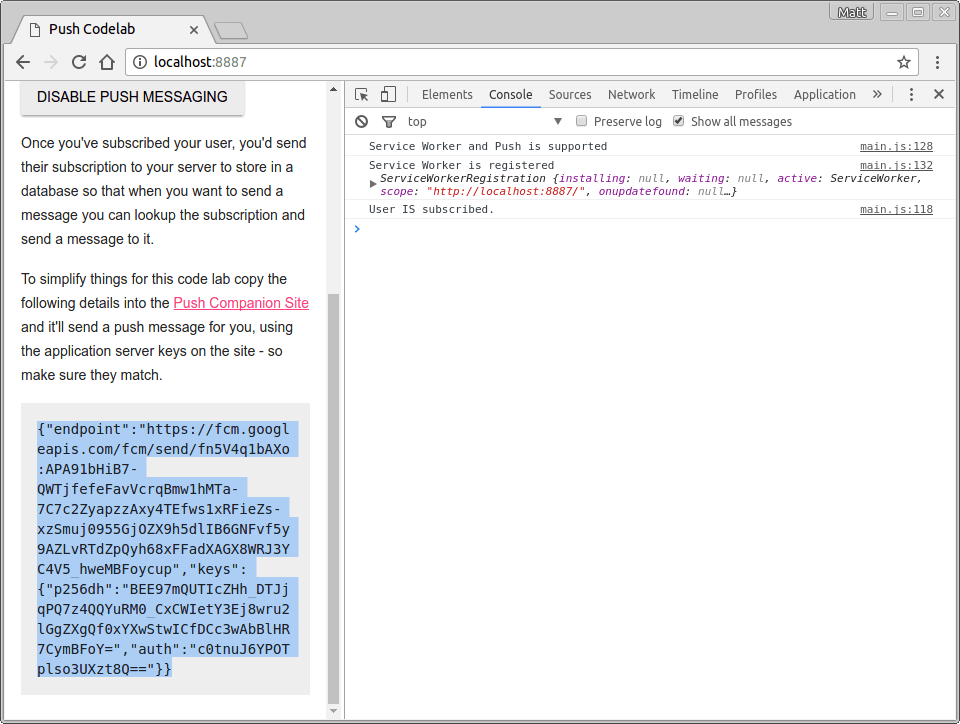

Then paste this into the companion site in the  *Subscription to Send To*  text area:

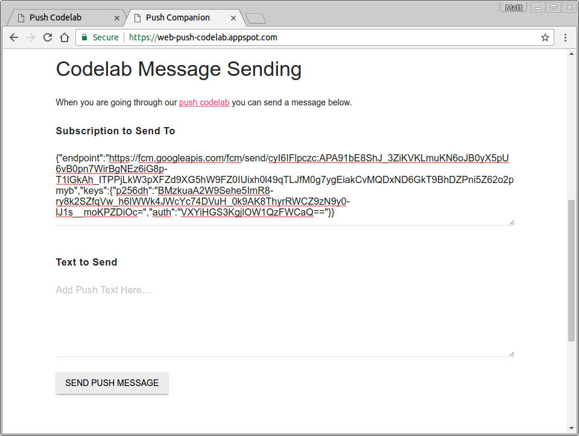

Then under  *Text to Send*  you can add any string you want to send with the push message and finally click the  *Send Push Message*  button.


You should then receive a push message and the text you included will be printed to the console.

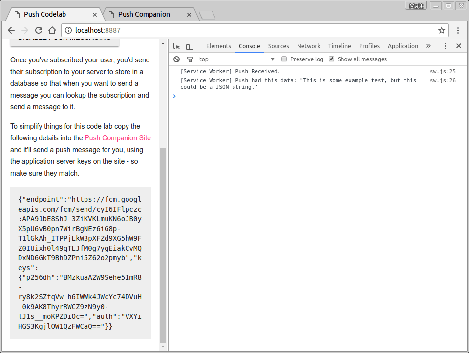

This should give you a chance to test out sending and receiving data and manipulate notifications as a result.

The companion app is actually just a node server that is using the  [web-push library](https://github.com/web-push-libs/web-push) to send messages. It's worthwhile checking out the  [web-push-libs org on Github](https://github.com/web-push-libs/) to see what libraries are available to send push messages for you (this handles a lot of the nitty gritty details to trigger push messages).


## Unsubscribe the user


The one thing we are missing is the ability to unsubscribe the user from push. To do this we need to call `unsubscribe()` on a `PushSubscription`.

Back in our `scripts/main.js` file, change the `pushButton`'s click listener in `initialiseUI()` to the following:

```
pushButton.addEventListener('click', function() {
  pushButton.disabled = true;
  if (isSubscribed) {
    unsubscribeUser();
  } else {
    subscribeUser();
  }
});
```

Notice we are now going to call a new function `unsubscribeUser()`. In this method we'll get the current subscription and called unsubscribe on it. Add the following code to `scripts/main.js`:

```
function unsubscribeUser() {
  swRegistration.pushManager.getSubscription()
  .then(function(subscription) {
    if (subscription) {
      return subscription.unsubscribe();
    }
  })
  .catch(function(error) {
    console.log('Error unsubscribing', error);
  })
  .then(function() {
    updateSubscriptionOnServer(null);

    console.log('User is unsubscribed.');
    isSubscribed = false;

    updateBtn();
  });
}
```

Let's step through this function.

First we get the current subscription by calling `getSubscription()`:

```
swRegistration.pushManager.getSubscription()
```

This returns a promise that resolves with a `PushSubscription` if one exists, otherwise it returns `null`. If there is a subscription, we call `unsubscribe()` on it, which makes the `PushSubscription` invalid.

```
swRegistration.pushManager.getSubscription()
.then(function(subscription) {
  if (subscription) {
    // TODO: Tell application server to delete subscription
    return subscription.unsubscribe();
  }
})
.catch(function(error) {
  console.log('Error unsubscribing', error);
})
```

Calling `unsubscribe()` returns a promise as it can take some time to complete, so we return that promise so the next `then()` in the chain waits for `unsubscribe()` to finish. We also add a catch handler in case calling `unsubscribe()` results in an error. After this we can update our UI.

```
.then(function() {
  updateSubscriptionOnServer(null);

  console.log('User is unsubscribed.');
  isSubscribed = false;

  updateBtn();
})
```

#### Try it out

You should be able to press the  *Enable Push Messaging*  /  *Disable Push Messaging*   in your web app and the logs will show the user being subscribed and unsubscribed.

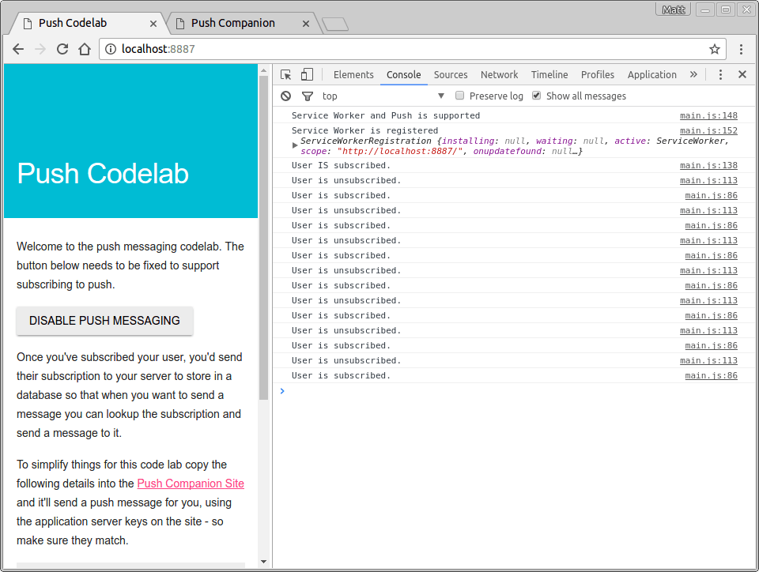


## Finished


Congratulations on completing this codelab!

This code lab has shown you how to get up and running with adding push to your web app. If you want to learn more about what web notifications can do,  [check out theses docs](/web/fundamentals/engage-and-retain/push-notifications/). 

If you are looking to deploy push on your site, you may be interested in adding support for older / non-standards compliant browsers which use GCM,  [learn more here](https://web-push-book.gauntface.com/chapter-06/01-non-standards-browsers/).

### Further Reading

*  [Web Push Notification](/web/fundamentals/engage-and-retain/push-notifications/) documentation on Web__Fundamentals__.
*  [Web Push Libraries](https://github.com/web-push-libs/) - Web Push libraries including Node.js, PHP, Java and Python.

#### Relevant blog posts

*  [Web Push Payload Encryption](/web/updates/2016/03/web-push-encryption)
*  [Application Server Keys and Web Push](/web/updates/2016/07/web-push-interop-wins)
*  [Notification Actions](/web/updates/2016/01/notification-actions)
*  [Icons, Close Events, Renotify Preferences and Timestamps](/web/updates/2016/03/notifications)


## Found an issue, or have feedback? {: .hide-from-toc }
Help us make our code labs better by submitting an 
[issue](https://github.com/googlechrome/push-notifications/issues) today. And thanks!
