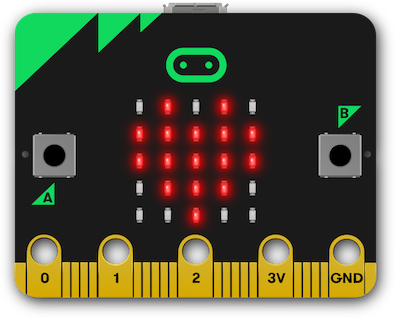
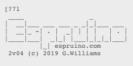
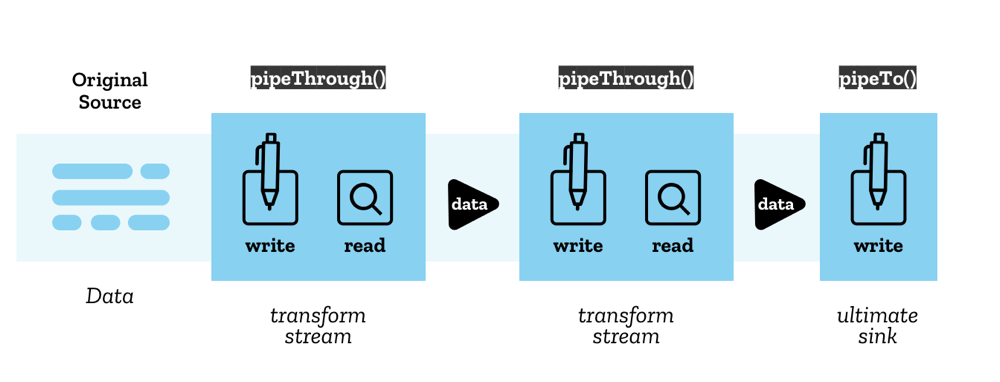
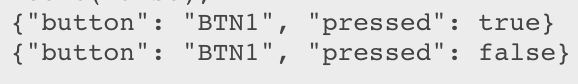

project_path: /web/fundamentals/_project.yaml
book_path: /web/fundamentals/_book.yaml
description: In this codelab, you'll build a web page that interacts with a micro:bit board to show different images on its 5x5 LED display. You'll learn about Web Serial, and how to use Readable, Writeable, and Transform Streams to communicate with serial devices in the browser.

{# wf_auto_generated #}
{# wf_updated_on: 2019-11-08 #}
{# wf_published_on: 2019-11-08 #}

# Getting Started with Web Serial {: .page-title }

## Introduction


__Last Updated:__ 2019-11-08

<aside markdown="1" class="key-point">
<p><strong>The first 300 people to finish this codelab at the 2019 Chrome Dev Summit will get a BBC micro:bit board to take home</strong>. To get your board, show the codelab staff your project with everything working, including checkboxes, on board buttons, and the connect/disconnect functionality.</p>
</aside>


### What you'll build

In this codelab, you'll build a web page that uses Web Serial interacts with a  [micro:bit](https://microbit.org/) board to show different images on its 5x5 LED matrix. You'll learn about Web Serial, and how to use Readable, Writeable, and Transform Streams to communicate with serial devices in the browser.



<aside markdown="1" class="warning">
<p><strong>Caution:</strong> The Web Serial API is currently under development and is not generally available yet. The API may change between the time this codelab was written, and the time the API ships!</p>
</aside>


### What you'll learn

* How to open and close a Web Serial port
* How to use a read loop to handle data from an input stream
* How to send data out via a write stream

### What you'll need

* A  [BBC micro:bit](https://microbit.org/) board with the  [latest Espruino firmware](https://www.espruino.com/Download#microbit)
* A recent version of Chrome (78 or later)
* Knowledge of HTML, CSS, JavaScript, and Chrome DevTools.

We chose to use the micro:bit for this codelab because it's easily affordable, offers a few inputs (buttons) and outputs (5x5 LED display), and can also provide additional inputs and outputs. See  [BBC micro:bit page](https://www.espruino.com/MicroBit) on the Espruino site for details on what the micro:bit is capable of.


## About the Web Serial API


The Serial API provides a way for websites to read and write from a serial device through script. The API bridges the web and the physical world, by allowing websites to communicate with devices such as microcontrollers, 3D printers, and other serial devices.

There are many examples of this control software being built using web technology. For example:

*  [Arduino Create](https://create.arduino.cc/)
*  [Betaflight Configurator](https://github.com/betaflight/betaflight-configurator)
*  [Espruino IDE](http://espruino.com/ide)
*  [MakeCode](https://www.microsoft.com/en-us/makecode)

In some cases these websites communicate with the device through a native agent application that is manually installed by the user. In others the application is delivered in a packaged native application through a framework such as Electron. In others the user is required to perform an additional step such as copying a compiled application to the device via a USB flash drive.

In any case, the user experience can be improved by providing direct communication between the site and the device that it is controlling.


## Getting set up


### Enable Web Serial

The Web Serial API is currently in development and is only available behind a flag. You must enable the `#enable-experimental-web-platform-features` flag in `chrome://flags`.

### Get the code

We've put everything you need for this project into a Glitch project. To get started, you'll need to remix the Glitch Web Serial code lab starter kit.

1. Open a new browser tab and go to  [https://web-serial-codelab-start.glitch.me/](https://web-serial-codelab-start.glitch.me/).
2. Click the Remix Glitch link to create your own version of the starter project.
3. Click the __Show__ button, then choose __In a New Window__ to see your code in action.


## Open a serial connection


### Check if Web Serial is supported

The first thing to do is check to see if Web Serial is supported in the current browser. To do that, check if `serial` is in `navigator`. In the `DOMContentLoaded` event, add the following code to your project.

`script.js - DOMContentLoaded`

```
// CODELAB: Add feature detection here.
if ('serial' in navigator) {
  const notSupported = document.getElementById('notSupported');
  notSupported.classList.add('hidden');
}
```

This will check if Web Serial is supported, if it is, it will hide the not supported banner.

#### Try it

If Web Serial is supported, the warning bar will go away.

1. Load the page
2. Verify the red not supported banner is not shown.

### Open the serial port

Next, we need to open the serial port. Like most other modern APIs, the Web Serial API is asynchronous. This prevents the UI from blocking when awaiting input, but is also important because serial data may be received by the web page at any time, and we need a way to listen for it.

Because a computer may have multiple serial devices, when the browser tries to request a port, it prompts the user with a chooser, allowing them to pick which device they want to connect with.

Add the following code to your project. Because a computer may have multiple serial devices, `requestPort` will prompt the user for which device they want to connect to, then calling `port.open` will open the port. We also need to provide the speed that we want to communicate with the serial device at. The BBC micro:bit uses a 9600 baud connection between the USB to serial chip and the main processor.

`script.js - connect()`

```
// CODELAB: Add code to request & open port here.
// - Request a port and open a connection.
port = await navigator.serial.requestPort();
// - Wait for the port to open.
await port.open({ baudrate: 9600 });
```

Let's also hook up the connect button and have it call `connect()` when the user clicks it. Add the following code to your project.

`script.js - clickConnect()`

```
// CODELAB: Add connect code here.
await connect();
```

#### Try it

Our project now has the bare minimum to get started. Clicking the connect button will prompt the user to select the serial device they want to connect to, then connect to the micro:bit.

1. Reload the page
2. Click the __Connect__ button
3. In the Serial Port chooser dialog, select the  *BBC micro:bit*  device, then hit __Connect__
4. On the tab, you should see an icon indicating you've connected to a serial device.


<aside markdown="1" class="key-point">
<p><strong>Tip:</strong> If the micro:bit is not appearing in the chooser, try resetting it by pushing the reset button located next to the USB port on the back of the device.</p>
</aside>


### Setup input stream to listen for data from the serial port

Once the connection has been established, we need to set up an input stream and a reader to read the data from the device. First, we'll get the readable stream from the port by calling `port.readable`. Since we know that we'll be getting text back from the device, we'll pipe it through a text decoder. Next, we'll get a reader, and start the read loop. Add the following code to your project.

`script.js - connect()`

```
// CODELAB: Add code to read the stream here.
let decoder = new TextDecoderStream();
inputDone = port.readable.pipeTo(decoder.writable);
inputStream = decoder.readable;

reader = inputStream.getReader();
readLoop();
```

The read loop is an asynchronous function that runs in a loop, and will patiently wait for content without blocking the main thread. When new data arrives, the reader returns two properties, the `value`, and a `done` boolean, if `done`, the port has been closed, or there is no more data coming in. Add the following code to your project.

`script.js - readLoop()`

```
// CODELAB: Add read loop here.
while (true) {
  const { value, done } = await reader.read();
  if (value) {
    log.textContent += value + '\n';
  }
  if (done) {
    console.log('[readLoop] DONE', done);
    reader.releaseLock();
    break;
  }
}
```

#### Try it

Our project can now connect to the device and will append any data received from the device to the log element.

1. Reload the page
2. Click the __Connect__ button
3. In the Serial Port chooser dialog, select the  *BBC micro:bit*  device, then hit __Connect__
4. You should see the Espruino logo printed on the page



<aside markdown="1" class="key-point">
<p><strong>Tip:</strong> This might be corrupted on Chrome OS and Linux because there is a system service which tries to talk to the device because it thinks it is a modem. It's safe to ignore but could look weird. This is also why it's important to send Ctrl-C as the first thing.</p>
</aside>


### Setup output stream to send data to the serial port

Serial communication is typically bi-directional, so in addition to receiving data from the serial port, we also want to send data to the port. Like the input stream, we'll only be sending text to the micro:bit. First, create a text encoder stream, then pipe the stream to `port.writeable`.

`script.js - connect()`

```
// CODELAB: Add code setup the output stream here.
const encoder = new TextEncoderStream();
outputDone = encoder.readable.pipeTo(port.writable);
outputStream = encoder.writable;
```

When connected via serial with the Espruino firmware, the BBC micro:bit board acts as JavaScript  [read-eval-print loop (REPL)](https://en.wikipedia.org/wiki/Read%E2%80%93eval%E2%80%93print_loop), similar to what you get in a Node shell. Next, we need to provide a method to actually send data to the stream. It gets a writer from the output stream, then uses write to send each line. Note, each line is appended by a new line character (\n), to tell the micro:bit to evaluate the command sent.

`script.js - writeToStream()`

```
// CODELAB: Write to output stream
const writer = outputStream.getWriter();
lines.forEach((line) => {
  console.log('[SEND]', line);
  writer.write(line + '\n');
});
writer.releaseLock();
```

To put it into a known state, and stop it from echoing back the characters that we send it, we need to send a CTRL-C and turn off the echo.

`script.js - connect()`

```
// CODELAB: Send CTRL-C and turn off echo on REPL
writeToStream('\x03', 'echo(false);');
```

#### Try it

Our project can now send and receive data from the micro:bit, let's verify we can properly send a command.

1. Reload the page
2. Click the __Connect__ button
3. In the Serial Port chooser dialog, select the  *BBC micro:bit*  device, then hit __Connect__
4. Open the  *Console*  tab in Chrome DevTools, and type
`writeToStream('console.log("yes")');`

You should see something like this printed on the page:


## Control the LED Matrix


### Build the matrix grid string

To control the LED matrix on the micro:bit, we need to call  [`show()`](https://www.espruino.com/MicroBit#-show-bitmap-). This method shows graphics on the built-in 5x5 LED screen. This takes a binary number or a string.

To do that, we'll iterate over the checkboxes and generate an array of 1's and 0's indicating which is checked and which isn't. We then need to reverse the array, because the ordering in our checkboxes is opposite of the LEDs in the matrix. Next, we convert the array to a string, and create the command to send to the micro:bit.

`script.js - sendGrid()`

```
// CODELAB: Generate the grid
const arr = [];
ledCBs.forEach((cb) => {
  arr.push(cb.checked === true ? 1 : 0);
});
writeToStream(`show(0b${arr.reverse().join('')})`);
```

### Hook up the checkboxes to update the matrix

Next, we need to listen for changes on the checkboxes, and if they change, send that to the micro:bit. In the feature detection code (`// CODELAB: Add feature detection here.`), add the following line.

`script.js - DOMContentLoaded`

```
initCheckboxes();
```

Let's also reset the grid when the micro:bit is first connected so that it shows a happy face. The `drawGrid()` function is already provided, and works similarly to `sendGrid()`, it takes an array of 1's and 0's, and checks the checkboxes as appropriate.

`script.js - clickConnect()`

```
// CODELAB: Reset the grid on connect here.
drawGrid(GRID_HAPPY);
sendGrid();
```

#### Try it

Now, when the page opens a connection to the micro:bit, it will send a happy face, and clicking the checkboxes will update the display on the LED matrix.

1. Reload the page
2. Click the __Connect__ button
3. In the Serial Port chooser dialog, select the  *BBC micro:bit*  device, then hit __Connect__
4. You should see a smile shown on the micro:bits LED matrix
5. Draw a different pattern on the LED matrix by changing the checkboxes.


## Hook up the micro:bit buttons


### Add a watch event on the micro:bit buttons

There are two buttons on the micro:bit, one on either side of the LED matrix. Espruino provides a `setWatch` function that will fire an event/callback when the button is pressed. Since we want to listen to both buttons, we'll make our function generic, and have it print the details of the event.

`script.js - watchButton()`

```
// CODELAB: Hook up the micro:bit buttons to print a string.
const cmd = `
  setWatch(function(e) {
    print('{"button": "${btnId}", "pressed": ' + e.state + '}');
  }, ${btnId}, {repeat:true, debounce:20, edge:"both"});
`;
writeToStream(cmd);
```

Next, we need to hook up both buttons (named BTN1 and BTN2 on the micro:bit board) each time the serial port is connected to the device.

`script.js - clickConnect()`

```
// CODELAB: Initialize micro:bit buttons.
watchButton('BTN1');
watchButton('BTN2');
```

#### Try it

In addition to showing a happy face when connected, pressing either of the buttons on the micro:bit will add text to the page indicating what button was pressed. Most likely, each character will be on it's own line.

1. Reload the page
2. Click the __Connect__ button
3. In the Serial Port chooser dialog, select the  *BBC micro:bit*  device, then hit __Connect__
4. You should see a smile shown on the micro:bits LED matrix
5. Press the buttons on the micro:bit, and verify it appends new text to the page with details of the button pressed.


## Use a TransformStream to parse incoming data


<aside markdown="1" class="key-point">
<p><strong>Tip:</strong> If streams are new to you, check out  <a href="https://developer.mozilla.org/en-US/docs/Web/API/Streams_API/Concepts">MDN's Streams API concepts</a>. This codelab only barely scratches the surface of streams and stream handling.</p>
</aside>


### Basic stream handling

When one of the micro:bit buttons is pushed, the micro:bit prints data to the serial port via a stream. Streams are super useful, but can also be a challenge since you won't necessarily get all of the data at once, and it may be arbitrarily chunked up.

The app currently prints the incoming stream as it arrives (in `readLoop`), in most cases, each character is on it's own line. But, that's not very helpful, ideally the stream should be parsed into individual lines, and each message shown as its own line.

### Transforming streams with TransformStream

To do that, we can use a  [`TransformStream`](https://developer.mozilla.org/en-US/docs/Web/API/TransformStream), which makes it possible to parse the incoming stream and return parsed data. A `TransformStream` can sit between the stream source (in this case, the micro:bit), and whatever is consuming the stream (in this case `readLoop`), and can apply an arbitrary transform before it's finally consumed. Think of it like an assembly line, as a widget come down the line, each step in the line modifies the widget, so that by the time it gets to its final destination, it's a fully functioning widget.



Image from  [MDN's Streams API concepts](https://developer.mozilla.org/en-US/docs/Web/API/Streams_API/Concepts)

### Transform the stream with a LineBreakTransformer

Let's create a `LineBreakTransformer` class, which will take a stream in, and chunk it based on line breaks (`\r\n`). It needs two methods, `transform`, and `flush`. The `transform` method is called every time new data is received by the stream. It can either enqueue the data, or save it for later. The `flush` method is called when the stream is closed, and handles any data that hasn't been processed yet.

In our `transform` method, we'll add new data to `container`, then check to see if there are any line breaks in `container`. If there are, split it into an array, and then iterate through the lines, calling `controller.enqueue()` to send the parsed lines out.

`script.js - LineBreakTransformer.transform()`

```
// CODELAB: Handle incoming chunk
this.container += chunk;
const lines = this.container.split('\r\n');
this.container = lines.pop();
lines.forEach(line => controller.enqueue(line));
```

When the stream is closed, we'll simply flush any remaining data in the container out using `enqueue`.

`script.js - LineBreakTransformer.flush()`

```
// CODELAB: Flush the stream.
controller.enqueue(this.container);
```

Finally, we need to pipe the incoming stream through the new `LineBreakTransformer`. Our original input stream was only piped through a `TextDecoderStream`, so we need to add an additional `pipeThrough` to pipe it through our new `LineBreakTransformer`.

`script.js - connect()`

```
// CODELAB: Add code to read the stream here.
let decoder = new TextDecoderStream();
inputDone = port.readable.pipeTo(decoder.writable);
inputStream = decoder.readable
  .pipeThrough(new TransformStream(new LineBreakTransformer()));
```

#### Try it

Now, when you press one of the micro:bit buttons, the data printed should be returned on a single line.

1. Reload the page
2. Click the __Connect__ button
3. In the Serial Port chooser dialog, select the  *BBC micro:bit*  device, then hit __Connect__
4. You should see a smile shown on the micro:bits LED matrix
5. Press the buttons on the micro:bit, and verify you see something like the below.



### Transform the stream with a JSONTransformer

We could try to parse the string into JSON in the readLoop, but instead, let's create a very simple JSON Transformer that will transform the data into a JSON object. If the data isn't valid JSON, simply return what came in.

`script.js - JSONTransformer.transform`

```
// CODELAB: Attempt to parse JSON content
try {
  controller.enqueue(JSON.parse(chunk));
} catch (e) {
  controller.enqueue(chunk);
}
```

Next pipe the stream through the `JSONTransformer`, after it's gone through the `LineBreakTransformer`. This allows us to keep our `JSONTransformer` simple, since we know the JSON will only ever be sent on a single line.

`script.js - connect`

```
// CODELAB: Add code to read the stream here.
let decoder = new TextDecoderStream();
inputDone = port.readable.pipeTo(decoder.writable);
inputStream = decoder.readable
  .pipeThrough(new TransformStream(new LineBreakTransformer()))
  .pipeThrough(new TransformStream(new JSONTransformer()));
```

#### Try it

Now, when you press one of the micro:bit buttons, you should see `[object Object]` printed on the page.

1. Reload the page
2. Click the __Connect__ button
3. In the Serial Port chooser dialog, select the  *BBC micro:bit*  device, then hit __Connect__
4. You should see a smile shown on the micro:bits LED matrix
5. Press the buttons on the micro:bit, and verify you see something like the below.

### Responding to button presses

To respond to micro:bit button presses, update `readLoop` to check if the data it's received is an `object` with a `button` property. Then, call `buttonPushed`, to handle the button push.

`script.js - readLoop()`

```
const { value, done } = await reader.read();
if (value && value.button) {
  buttonPushed(value);
} else {
  log.textContent += value + '\n';
}
```

When a micro:bit button is pushed, we want to change the display on the LED matrix. Use the code below to set the matrix.

`script.js - buttonPushed()`

```
// CODELAB: micro:bit button press handler
if (butEvt.button === 'BTN1') {
  divLeftBut.classList.toggle('pressed', butEvt.pressed);
  if (butEvt.pressed) {
    drawGrid(GRID_HAPPY);
    sendGrid();
  }
  return;
}
if (butEvt.button === 'BTN2') {
  divRightBut.classList.toggle('pressed', butEvt.pressed);
  if (butEvt.pressed) {
    drawGrid(GRID_SAD);
    sendGrid();
  }
}
```

#### Try it

Now, when you press one of the micro:bit buttons, you the LED matrix should change to either a happy face or a sad face.

1. Reload the page
2. Click the __Connect__ button
3. In the Serial Port chooser dialog, select the  *BBC micro:bit*  device, then hit __Connect__
4. You should see a smile shown on the micro:bits LED matrix
5. Press the buttons on the micro:bit, and verify the LED matrix changes.


## Closing the serial port


The final step is to hook up the disconnect functionality to close the port when the user is done.

### Close the port when the user clicks on the connect/disconnect button

When the user clicks the connect/disconnect button, we need to close the connection. If the port is already open, call `disconnect()`, then update the UI to indicate the page is no longer connected to the serial device.

`script.js - clickConnect()`

```
// CODELAB: Add disconnect code here.
if (port) {
  await disconnect();
  toggleUIConnected(false);
  return;
}
```

### Close the streams and the port

In the disconnect function, we need to close the input stream, the output stream, and finally close the port. To close the input stream, call `reader.cancel()`. The call to `cancel` is asynchronous, so we need to `await` for it to complete.

`script.js - disconnect()`

```
// CODELAB: Close the input stream (reader).
if (reader) {
  await reader.cancel();
  await inputDone;
  reader = null;
  inputDone = null;
}
```

To close the output stream, get a `writer`, and call `close()`, and wait for the `outputDone` object to be closed.

`script.js - disconnect()`

```
// CODELAB: Close the output stream.
if (outputStream) {
  await outputStream.getWriter().close();
  await outputDone;
  outputStream = null;
  outputDone = null;
}
```

And finally, close the serial port, and wait for it to close.

`script.js - disconnect()`

```
// CODELAB: Close the port.
await port.close();
port = null;
```

#### Try it

Now, you can open and close the serial port at will.

1. Reload the page
2. Click the __Connect__ button
3. In the Serial Port chooser dialog, select the  *BBC micro:bit*  device, then hit __Connect__
4. You should see a smile shown on the micro:bits LED matrix
5. Press the __Disconnect__ button and verify the LED matrix turn off, and there are no errors in the console.


## Congratulations


Congratulations, you've successfully built your first web app that uses Web Serial!

<aside markdown="1" class="key-point">
<p><strong>The first 300 people to finish this codelab at the 2019 Chrome Dev Summit will get a BBC micro:bit board to take home</strong>. To get your board, show the codelab staff your project with everything working, including checkboxes, on board buttons, and the connect/disconnect functionality.</p>
</aside>


Keep an eye on  [https://goo.gle/fugu-api-tracker](https://goo.gle/fugu-api-tracker) for the latest on the Web Serial API and all of the other exciting new web capabilities the Chrome team is working on.
