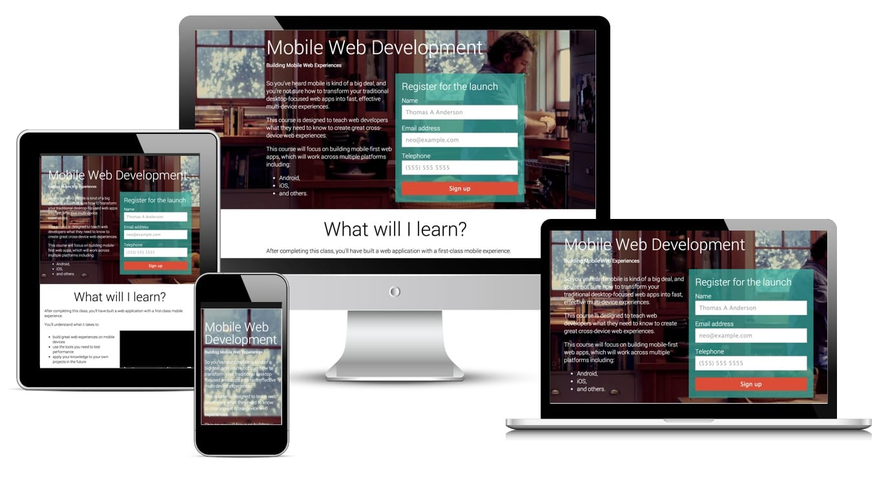
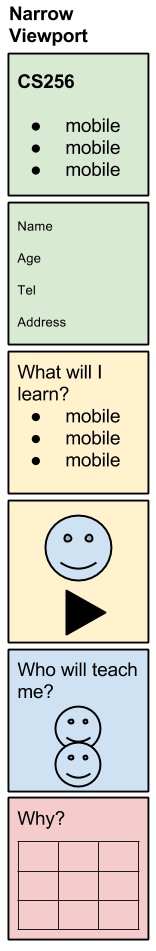
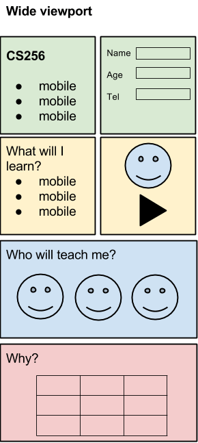
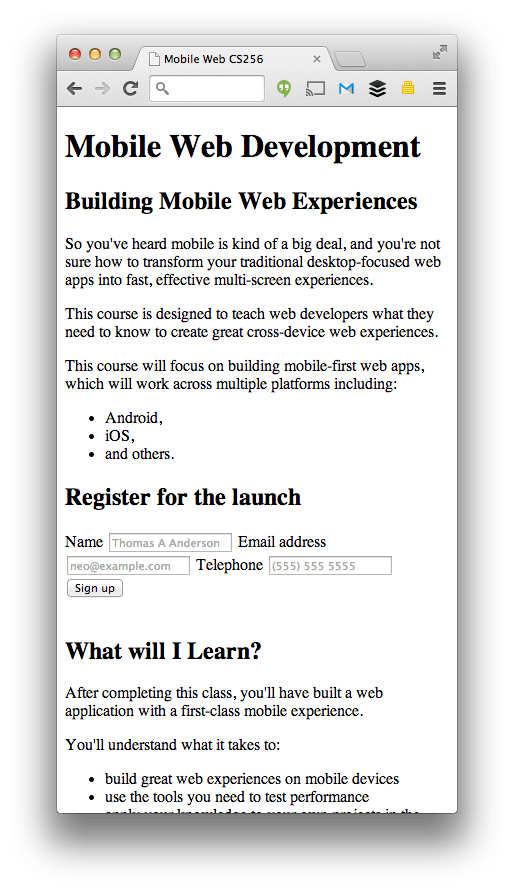
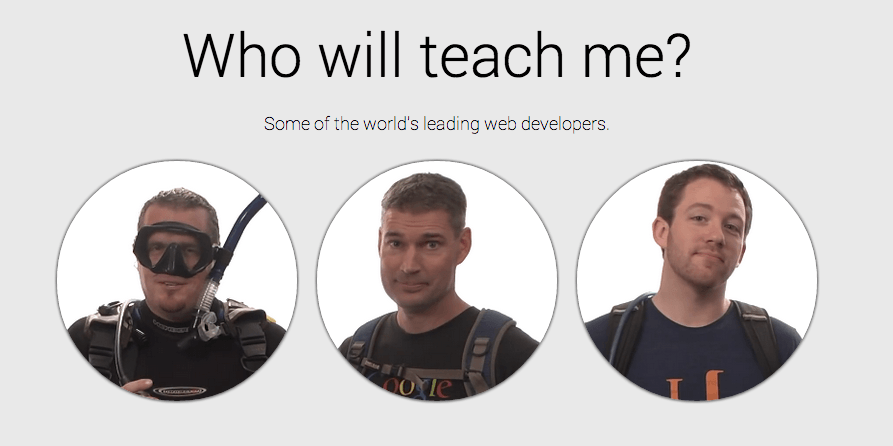

project_path: /web/fundamentals/_project.yaml
book_path: /web/fundamentals/_book.yaml
description: The web is accessible on a huge range of devices, from small-screen phones to big-screen televisions. Each device presents its own benefits and constraints. As a web developer, you are expected to support a full ranges of devices.

{# wf_updated_on: 2015-10-05 #}
{# wf_published_on: 2013-12-31 #}

# Your First Multi-Device Site {: .page-title }

Caution: This article has not been updated in a while and may not reflect reality. Instead, check out the free [Responsive Web Design](https://www.udacity.com/course/responsive-web-design-fundamentals--ud893) course on Udacity.



Creating multi-device experiences is not as hard as it might seem. 
In this guide, we will build a product landing page for the 
[CS256 Mobile Web Development course](https://www.udacity.com/course/mobile-web-development--cs256)
that works well across different device types.

Building for multiple devices with differing capabilities, vastly different
screen sizes and interaction methods can seem daunting, if not impossible
to get started.

It is not as hard to build fully responsive sites as you think, and to show
you, this guide takes you through the steps that you can use to get started. 
We have broken it into two simple steps:

1.  Defining the information architecture (commonly known as IA) and structure of the page,
2.  Adding design elements to make it responsive and look good across all devices.

## Create your content and structure

Content is the most important aspect of any site. So let’s design for the
content and not let the design dictate the content. In this guide, we identify
the content we need first, create a page structure based on this content, and
then present the page in a simple linear layout that works well on narrow
and wide viewports.

### Create the page structure

We have identified we need:

1.  An area that describes at a high-level our product "CS256: Mobile web development" course
2.  A form to collect information from users who are interested in our product
3.  An in depth description and video
4.  Images of the product in action
5.  A data table with information to back the claims up

#### TL;DR {: .hide-from-toc }
- Identify the content you need first.
- Sketch out Information Architecture (IA) for narrow and wide viewports.
- Create a skeleton view of the page with content but without styling.

We have also come up with a rough information architecture and layout for both
the narrow and wide viewports.

  <figure>
    
    <figcaption>
      Narrow Viewport IA
     </figcaption>
  </figure>

  <figure>
    
    <figcaption>
      Wide Viewport IA
     </figcaption>
  </figure>

This can be converted easily into the rough sections of a skeleton page that
we will use for the rest of this project.

<pre class="prettyprint">

</pre>

[Try it](https://googlesamples.github.io/web-fundamentals/fundamentals/getting-started/your-first-multi-screen-site/addstructure.html){: target="_blank" .external }

### Add content to the page

The basic structure of the site is complete. We know the sections we need, the
content to display in those sections, and where to position it in the overall
information architecture. We can now start to build out the site.

Note: We'll add the styling later

### Create the headline and form

The headline and request notification form are the critical components of
our page. These must be presented to the user immediately.

In the headline, add simple text to describe the course:

<pre class="prettyprint">

</pre>

[Try it](https://googlesamples.github.io/web-fundamentals/fundamentals/getting-started/your-first-multi-screen-site/addheadline.html){: target="_blank" .external }

We need to also fill out the form.
It will be a simple form that collects the users' name, email address,
and phone number.

All forms should have labels and placeholders to make it easy for users to
focus elements, understand what is supposed to go in them, and to also help
accessibility tools understand the structure of the form.  The name attribute
not only sends the form value to the server, it is also used to give important
hints to the browser about how to automatically fill in the form for the user.

We will add semantic types to make it quick and simple for users to be able to
enter content on a mobile device.  For example, when entering a telephone
number, the user should just see a dial pad.

<pre class="prettyprint">

</pre>

[Try it](https://googlesamples.github.io/web-fundamentals/fundamentals/getting-started/your-first-multi-screen-site/addform.html){: target="_blank" .external }

#### Create the Video and Information section

The Video and Information section of content will contain a little more depth.
It will have a bulleted list of features of our products and will also contain
a video placeholder that shows our product working for the user.

<pre class="prettyprint">

</pre>

[Try it](https://googlesamples.github.io/web-fundamentals/fundamentals/getting-started/your-first-multi-screen-site/addvideo.html){: target="_blank" .external }

Videos are often used to describe content in a more interactive manner and are
frequently used to show a demonstration of a product or a concept.

By following the best practices, you can easily integrate video into your site:

*  Add a `controls` attribute to make it easy for people to play the video.
*  Add a `poster` image to give people a preview of the content.
*  Add multiple `<source>` elements based on supported video formats.
*  Add fall-back text to let people download the video if they can't play it in the window.

<pre class="prettyprint">

</pre>

[Try it](https://googlesamples.github.io/web-fundamentals/fundamentals/getting-started/your-first-multi-screen-site/addvideo.html){: target="_blank" .external }

#### Create the Images Section

Sites without images can be a little boring. There are two types of images:

*  Content images &mdash; images that are in-line in the document and are used
   to convey extra information about the content.
*  Stylistic images &mdash; images that are used to make the site look
   better; often these are background images, patterns and gradients.  We will
   cover this in the [next section](#make-it-responsive).

The Images section in our page is a collection of content images.

Content images are critical to conveying the meaning of the page. Think of
them like the images used in newspaper articles.  The images we are using are
pictures of the tutors on the project:  Chris Wilson, Peter Lubbers and Sean
Bennet.

<pre class="prettyprint">

</pre>

[Try it](https://googlesamples.github.io/web-fundamentals/fundamentals/getting-started/your-first-multi-screen-site/addimages.html){: target="_blank" .external }

The images are set to scale to 100% of the width of the screen. This works
well on devices with a narrow viewport, but less well on those with a
wide viewport (like desktop).  We will manage this in the responsive design
section.

Many people don't have the ability to view images and often use an assistive
technology such as a screen reader that will parse the data on the page and
relay that to the user verbally.  You should ensure that all your content
images  have a descriptive `alt` tag that the screen reader can speak out to
the user.

When adding `alt` tags make sure that you keep the alt text as concise as
possible to fully describe  the image.  For example in our demo we simply
format the attribute to be "Name: Role", this presents enough information
to the user to understand that this section is about the authors and what
their job is.

#### Add the Tabulated Data Section

The final section is a simple table that is used to show specific product stats
about the product.

Tables should only be used for tabular data, i.e, matrices of information.

<pre class="prettyprint">

</pre>

[Try it](https://googlesamples.github.io/web-fundamentals/fundamentals/getting-started/your-first-multi-screen-site/addtable.html){: target="_blank" .external }

#### Add a Footer

Most sites need a footer to display content such as Terms and Conditions,
disclaimers, and other content that isn't meant to be in the main navigation
or in the main content area of the page.

In our site, we'll just create a simple placeholder footer.

<pre class="prettyprint">

</pre>

[Try it](https://googlesamples.github.io/web-fundamentals/fundamentals/getting-started/your-first-multi-screen-site/addcontent.html){: target="_blank" .external }

### Summary

We have created the outline of the site and we have identified all the main
structural elements.  We have also made sure that we have all the relevant
content ready and in-place to satisfy our business needs.

  <figure>
    
    <figcaption>
      <a href="https://googlesamples.github.io/web-fundamentals/fundamentals/getting-started/your-first-multi-screen-site/content-without-styles.html">Content and structure</a>
    </figcaption>
  </figure>

  <figure>
    
    <figcaption>
      <a href="https://googlesamples.github.io/web-fundamentals/fundamentals/getting-started/your-first-multi-screen-site/content-with-styles.html">Final site</a>
    </figcaption>
  </figure>

You will notice that the page looks terrible right now; this is intentional.
Content is the most important aspect of any site and we needed to make sure we
had a good solid information architecture and density. This guide has given us
an excellent base to build upon. We will style our content in the next guide.

## Make it responsive {: #make-it-responsive }

The web is accessible on a huge range of devices from small-screen phones
through to huge-screen televisions. Each device presents its own unique
benefits and also constraints. As a web developer, you are expected to
support all ranges of devices.

We are building a site that works across multiple screen sizes and device
types. We've crafted the Information Architecture of the page and created a 
basic structure. In this section, we will take our basic structure with
content and turn it into a beautiful page that is responsive across a large 
number of screen sizes.

Following the principles of Mobile First web development, we start with a 
narrow viewport &mdash; similar to a mobile phone &mdash; and build for 
that experience first. Then we scale up to larger device classes. We can do
this by making our viewport wider and making a judgment call on whether the
design and layout look right.

Earlier we created a couple of different high-level designs for how our content
should be displayed. Now we need to make our page adapt to those different layouts.
We do this by making a decision on where to place our breakpoints &mdash; a point
where the layout and styles change &mdash; based on how the content fits the
screen-size.

### TL;DR {: .hide-from-toc }
- Always use a viewport.
- Always start with a narrow viewport first and scale out.
- Base your breakpoints off when you need to adapt the content.
- Create a high-level vision of your layout across major breakpoints.

### Add a viewport

Even for a basic page, you **must** always include a viewport meta tag.
The viewport is the most critical component you need for building multi-device
experiences. Without it, your site will not work well on a mobile device.

The viewport indicates to the browser that the page needs to be scaled to fit
the screen. There are many different configurations that you can specify for
your viewport to control the display of the page.  As a default, we recommend:

<pre class="prettyprint">

</pre>

[Try it](https://googlesamples.github.io/web-fundamentals/fundamentals/getting-started/your-first-multi-screen-site/viewport.html){: target="_blank" .external }

The viewport lives in the head of the document and only needs to be declared once.

### Apply simple styling

Our product and company already has a very specific branding and font guide-lines supplied
in a style guide.

#### Style guide

A style guide is a useful way to get a high-level understanding of the visual representation
of the page and it helps you ensure that you are consistent throughout the design.

#### Colors

  
#39b1a4

  
#ffffff

  
#f5f5f5

  
#e9e9e9

  
#dc4d38

#### Add stylistic images

In the previous guide, we added images called "content images".  These were
images that were important to the narrative of our product.  Stylistic images
are images that are not needed as part of the core content but add visual flare
or help guide the user's attention to a specific piece of content.

A good example of this is a headline image for the 'above the fold' content.  It
is often used to entice the user to read more about the product.

They can be very simple to include. In our case, it will be the background to the
header and we will apply it via some simple CSS.

    #headline {
      padding: 0.8em;
      color: white;
      font-family: Roboto, sans-serif;
      background-image: url(backgroundimage.jpg);
      background-size: cover;
    }
    

We have chosen a simple background image that is blurred so it doesn't take away
from the content and we have set it to `cover` the entire element; that way it
always stretches whilst maintaining the correct aspect ratio.

### Set your first breakpoint

The design starts to look bad at about 600px wide.  In our case, the length of
the line is going above 10 words (the optimal reading length) and that is
where we want to change it.

<video controls poster="images/firstbreakpoint.png" style="width: 100%;">
  <source src="videos/firstbreakpoint.mov" type="video/mov"></source>
  <source src="videos/firstbreakpoint.webm" type="video/webm"></source>
  
Sorry your browser doesn't support video.
     <a href="videos/firstbreakpoint.mov">Download the video</a>.
  

</video>

600px appears to be a good place to create our first breakpoint as it will 
give us scope to reposition elements to make them fit the screen better. 
We can do this using a technology called [Media Queries](/web/fundamentals/design-and-ux/responsive/#use-media-queries).

    @media (min-width: 600px) {
    
    }
    
There is more space on a larger screen so there is more flexibility with how
content can be displayed.

Note: You don't have to move all the elements at once, you can make smaller adjustments if needed.

In the context of our product page, it looks like we will
need to:

*  Constrain the maximum width of the design.
*  Alter the padding of elements and reduce the text size.
*  Move the form to float in-line with the heading content.
*  Make the video float around the content.
*  Reduce the size of the images and have them appear in a nicer grid.

### Constrain the maximum width of the design

We have chosen to have only two major layouts: a narrow viewport and a wide
viewport, which greatly simplifies our build process.

We have also decided to create full-bleed sections on the narrow viewport that
stay full-bleed on the wide viewport.  This means we should constrain the
maximum width of the screen so that the text and paragraphs don't extend into one
long, single line on ultra-wide screens.  We have chosen this point to be
about 800px.

To achieve this, we need to constrain the width and center the elements.  We
need  to create a container around each major section and apply a `margin:
auto`.  This will allow the screen to grow but the content remain centered
and at a maximum size of 800px.

The container will be a simple `div` in the following form:

    
...

<pre class="prettyprint">

</pre>

<pre class="prettyprint">

</pre>

[Try it](https://googlesamples.github.io/web-fundamentals/fundamentals/getting-started/your-first-multi-screen-site/constrainwidth.html){: target="_blank" .external }

### Alter the padding and reduce text size

On the narrow viewport, we don't have a lot of space to display content so
the size and weight of the typography is often drastically reduced to fit the
screen.

With a larger viewport, we need to consider that the user is more likely to be
on a larger screen but further away.  To increase the readability of the
content, we can increase the size and weight of the typography and we can also
alter the padding to make distinct areas stand out more.

In our product page, we will increase the padding of the section elements by
setting it to remain at 5% of the width.  We will also increase the size of
the headers for each of the sections.

<pre class="prettyprint">

</pre>

[Try it](https://googlesamples.github.io/web-fundamentals/fundamentals/getting-started/your-first-multi-screen-site/alterpadding.html){: target="_blank" .external }

### Adapt elements to wide viewport

Our narrow viewport was a stacked linear display.  Each major section and the content
inside them was displayed in order from top to bottom.

A wide viewport gives us extra space to use to display the content in an optimal way
for that screen.  For our product page, this means that according to our IA we can:

*  Move the form around the header information.
*  Position the video to the right of the key points.
*  Tile the images.
*  Expand the table.

#### Float the Form element

The narrow viewport means that we have a lot less horizontal space available for
us to comfortably position elements on the screen.

To make more effective use of the horizontal screen space, we need to break out
of the linear flow of the header and move the form and list to be next
to each other.

<pre class="prettyprint">

</pre>

[Try it](https://googlesamples.github.io/web-fundamentals/fundamentals/getting-started/your-first-multi-screen-site/floattheform.html){: target="_blank" .external }

<video controls poster="images/floatingform.png" style="width: 100%;">
  <source src="videos/floatingform.mov" type="video/mov"></source>
  <source src="videos/floatingform.webm" type="video/webm"></source>
  
Sorry your browser doesn't support video.
     <a href="videos/floatingform.mov">Download the video</a>.
  

</video>

#### Float the Video element

The video in the narrow viewport interface is designed  to be the full width of
the screen and positioned after the list of key features. On a wide viewport,
the video will scale up to be too large and look incorrect when placed next
to our list of features.

The video element needs to be moved out of the vertical flow of the narrow
viewport and should be displayed side-by-side with the bulleted list of content on a wide viewport.

<pre class="prettyprint">

</pre>

[Try it](https://googlesamples.github.io/web-fundamentals/fundamentals/getting-started/your-first-multi-screen-site/floatthevideo.html){: target="_blank" .external }

#### Tile the Images

The images in the narrow viewport (mobile devices mostly) interface are set to
be  the full width of the screen and stacked vertically.  This doesn't scale
well on a wide viewport.

To make the images look correct on a wide viewport, they are scaled to 30%
of the container width and laid out horizontally (rather than vertically in
the narrow view). We will also add some border radius and box-shadow to make
the images look more appealing.

<pre class="prettyprint">

</pre>

[Try it](https://googlesamples.github.io/web-fundamentals/fundamentals/getting-started/your-first-multi-screen-site/tiletheimages.html){: target="_blank" .external }

#### Make images responsive to DPI

When using images, take the size of the viewport and the density of the
display into consideration.

The web was built for 96dpi screens.  With the introduction of mobile devices,
we have seen a huge increase in the pixel density of screens not to mention
Retina class displays on laptops.  As such, images that are encoded to 96dpi
often look terrible on a hi-dpi device.

We have a solution that is not widely adopted yet. For browsers that support
it, you can display a high density image on a high density display.

    
    

#### Tables

Tables are very hard to get right on devices that have a narrow viewport and need
special consideration.

We recommend on a narrow viewport that you transform your table by changing
each row into a block of key-value pairs (where the key is what was
previously the column header, and the value is still the cell value).
Fortunately, this isn't too difficult. First, annotate each `td` element with
the corresponding heading as a data attribute. (This won't have any visible
effect until we add some more CSS.)

<pre class="prettyprint">

</pre>

[Try it](https://googlesamples.github.io/web-fundamentals/fundamentals/getting-started/your-first-multi-screen-site/updatingtablehtml.html){: target="_blank" .external }

Now we just need to add the CSS to hide the original `thead` and instead show
the `data-th` labels using a `:before` pseudoelement. This will result in
the multi-device experience seen in the following video.

<video controls poster="images/responsivetable.png" style="width: 100%;">
  <source src="videos/responsivetable.mov" type="video/mov"></source>
  <source src="videos/responsivetable.webm" type="video/webm"></source>
  
Sorry your browser doesn't support video.
     <a href="videos/responsivetable.mov">Download the video</a>.
  

</video>

In our site, we had to create an extra breakpoint just for the table content.
When you build for a mobile device first, it is harder to undo applied styles,
so we must section off the narrow viewport table CSS from the wide viewport css.
This gives us a clear and consistent break.

<pre class="prettyprint">

</pre>

[Try it](https://googlesamples.github.io/web-fundamentals/fundamentals/getting-started/your-first-multi-screen-site/content-with-styles.html){: target="_blank" .external }

## Wrapping up

Success: By the time you read this, you will have created your
first simple product landing page that works across a large range of devices,
form-factors, and screen sizes.

If you follow these guidelines, you will be off to a good start:

1.  Create a basic IA and understand your content before you code.
2.  Always set a viewport.
3.  Create your base experience around mobile-first approach.
4.  Once you have your mobile experience, increase the width of the display until it doesn't look right and set your breakpoint there.
5.  Keep iterating.
