project_path: /web/fundamentals/_project.yaml
book_path: /web/fundamentals/_book.yaml
description: In this codelab, you'll build an installable, Progressive Web App, which loads quickly, even on flaky networks, and when launched looks like any other installed app.

{# wf_auto_generated #}
{# wf_updated_on: 2019-04-19 #}
{# wf_published_on: 2016-01-01 #}

# Your First Progressive Web App {: .page-title }



## Introduction

### What makes a web app, a Progressive Web App?

Progressive Web Apps provide an installable, app-like experience on desktop and mobile that are built and delivered directly via the web. They're web apps that are fast and reliable. And most importantly, they're web apps that work in any browser. If you're building a web app today, you're already on the path towards building a Progressive Web App.

#### Fast & Reliable

Every web experience must be fast, and this is especially true for Progressive Web Apps. Fast refers to the time it takes to get meaningful content on screen, and provide an interactive experience in less than 5 seconds.

And, it must be __reliably fast__. It's hard to stress enough how much better reliable performance is. Think of it this way: the first load of a native app is frustrating. It's gated by an app store and a huge download, but once you get to a point where the app is installed, that up-front cost is amortized across all app starts, and none of those starts have a variable delay. Each application start is as fast as the last, no variance. A Progressive Web App must deliver this reliable performance that users have come to expect from any installed experience.

#### Installable

Progressive Web Apps can run in a browser tab, but are also installable. Bookmarking a site just adds a shortcut, but an installed Progressive Web App looks and behaves like all of the other installed apps. It launches from the same place as other apps launch. You can control the launch experience, including a customized splash screen, icons and more. It runs as an app, in an app window without an address bar or other browser UI. And like all other installed apps, it's a top level app in the task switcher.

Remember, it's critical that an installable PWA is fast and reliable. Users who install a PWA expect that their apps work, no matter what kind of network connection they're on. It's a baseline expectation that must be met by every installed app.

#### Mobile & Desktop

Using responsive design techniques, Progressive Web Apps work on both mobile __and__ desktop, using a single code base between platforms. If you're considering writing a native app, take a look at the benefits that a PWA offers.

### What you'll build

In this codelab, you're going to build a weather web app using Progressive Web App techniques. Your app will:

* Use responsive design, so it works on desktop or mobile.
* Be fast, using a service worker to precache the app resources (HTML, CSS, JavaScript, images) needed to run, and cache the weather data at runtime to improve performance.
* Be installable, using a web app manifest and the `beforeinstallprompt` event to notify the user it's installable.

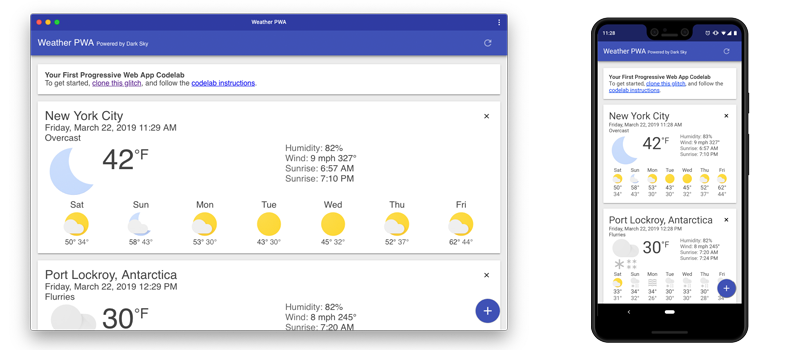

Warning: To simplify this codelab, and explain the fundamentals of providing an offline experience, we're using vanilla JavaScript. In a production app, we strongly recommend using tools like [Workbox](/web/tools/workbox/) to build your service worker. It removes many of the sharp edges and dark corners you may run into.

### What you'll learn

* How to create and add a web app manifest
* How to provide a simple offline experience
* How to provide a full offline experience
* How to make your app installable

This codelab is focused on Progressive Web Apps. Non-relevant concepts and code blocks are glossed over and are provided for you to simply copy and paste.

### What you'll need

* A recent version of Chrome (74 or later)
PWAs are just web apps, and work in all browsers, but we'll be using a few features of the Chrome DevTools to better understand what's happening at the browser level, and use it to test the install experience.
* Knowledge of HTML, CSS, JavaScript, and  [Chrome DevTools](https://developer.chrome.com/devtools).

## Getting set up

### Get a key for the Dark Sky API

Our weather data comes from the  [Dark Sky API](https://darksky.net/dev). In order to use it, you'll need to request an API key. It's easy to use, and free for non-commercial projects.

[Register for API Key](https://darksky.net/dev/register)

Note: You can still complete this codelab without a Dark Sky API key. If our server is unable to get real data from the Dark Sky API, it will return fake data instead.

#### Verify your API key is working properly

To test that your API Key is working properly, make an HTTP request to the DarkSky API. Update the URL below to replace `DARKSKY_API_KEY` with your API key. If everything works, you should see the latest weather forecast for New York City.

`https://api.darksky.net/forecast/DARKSKY_API_KEY/40.7720232,-73.9732319`

### Get the code

We've put everything you need for this project into a Git repo. To get started, you'll need to grab the code and open it in your favorite dev environment. For this codelab, we recommend using Glitch.

#### Strongly Recommended: Use Glitch to import the repo

Using Glitch is the recommended method for working through this codelab.

1. Open a new browser tab and go to  [https://glitch.com](https://glitch.com).
2. If you don't have an account, you'll need to sign up.
3. Click __New Project__, then __Clone from Git Repo.__
4. Clone __https://github.com/googlecodelabs/your-first-pwapp.git__ and click OK.
5. Once the repo has loaded, edit the `.env` file, and update it with your DarkSky API key.
6. Click the __Show Live__ button to see the PWA in action.

#### Alternative: Download code & work locally

If you want to download the code and work locally, you'll need to have a recent version of Node, and code editor setup and ready to go.

Caution: If you work locally, some of the Lighthouse audits won't pass, and installation may not be available because the local server doesn't serve the content over a secure context.

[Download source code](https://github.com/googlecodelabs/your-first-pwapp/archive/master.zip)

1. Unpack the downloaded zip file.
2. Run `npm install` to install the dependencies required to run the server.
3. Edit `server.js` and set your DarkSky API key.
4. Run `node server.js` to start the server on port 8000.
5. Open a browser tab to  [http://localhost:8000](http://localhost:8000)

## Establish a baseline

### What's our starting point?

Our starting point is a basic weather app designed for this codelab. The code has been overly simplified to show the concepts in this codelab, and it has little error handling. If you choose to reuse any of this code in a production app, make sure that you handle any errors and fully test all code.

Some things to try...

1. Add a new city with the blue plus button in the bottom right corner.
2. Refresh the data with the refresh button in the upper right corner.
3. Delete a city using the x on the upper right of each city card.
4. See how it works on desktop and mobile.
5. See what happens when you go offline.
6. Using Chrome's Network panel, see what happens when the network is throttled to Slow 3G.
7. Add a delay to the forecast server by changing `FORECAST_DELAY` in `server.js`

### Audit with Lighthouse

[Lighthouse](/web/tools/lighthouse/#devtools) is an easy to use tool to help improve the quality of your sites and pages. It has audits for performance, accessibility, progressive web apps, and more. Each audit has a reference doc explaining why the audit is important, as well as how to fix it.


We'll use Lighthouse to audit our Weather app, and verify the changes we've made.

Note: You can run Lighthouse in Chrome DevTools, from the command line, or as a Node module. Consider [adding Lighthouse](https://github.com/GoogleChromeLabs/lighthousebot) to your build process to make sure your web app doesn't regress.

### Let's run Lighthouse

1. Open your project in a new tab.
2. Open Chrome DevTools and switch to the __Audits__ tab, DevTools shows a list of audit categories, leave them all enabled.
3. Click __Run audits__, after 60-90 seconds, Lighthouse gives you a report on the page.

### The Progressive Web App Audit

We're going to focus on the results of the Progressive Web App audit.

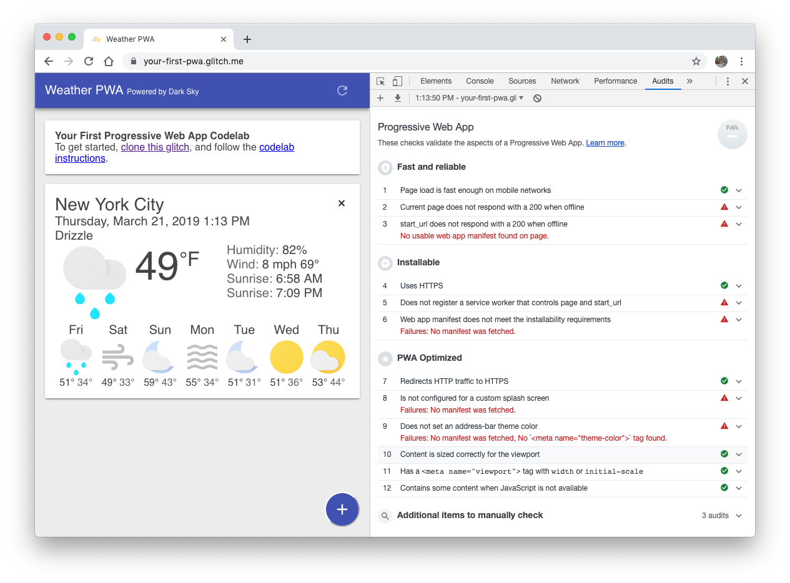

And there's a lot of red to focus on:

* __❗FAILED:__ Current page does not respond with a 200 when offline.
* __❗FAILED:__ `start_url` does not respond with a 200 when offline.
* __❗FAILED:__ Does not register a service worker that controls page and `start_url.`
* __❗FAILED:__ Web app manifest does not meet the installability requirements.
* __❗FAILED:__ Is not configured for a custom splash screen.
* __❗FAILED:__ Does not set an address-bar theme color.

Let's jump in and start fixing some of these issues!

## Add a web app manifest

By the end of this section, our weather app will pass the following audits:

* Web app manifest does not meet the installability requirements.
* Is not configured for a custom splash screen.
* Does not set an address-bar theme color.

### Create the web app manifest

The  [web app manifest](/web/fundamentals/web-app-manifest) is a simple JSON file that gives you, the developer, the ability to control how your app appears to the user.

Using the web app manifest, your web app can:

* Tell the browser you want your app to open in a standalone window (`display`).
* Define what page is opened when the app is first launched (`start_url`).
* Define what the app should look like on the dock or app launcher (`short_name`, `icons`).
* Create a splash screen (`name`, `icons`, `colors`).
* Tell the browser to open the window in landscape, or portrait mode (`orientation`).
* And  [plenty more](https://developer.mozilla.org/en-US/docs/Web/Manifest#Members).

Create a file named `public/manifest.json` in your project and copy/paste the following contents:

`public/manifest.json`

```json
{
  "name": "Weather",
  "short_name": "Weather",
  "icons": [{
    "src": "/images/icons/icon-128x128.png",
      "sizes": "128x128",
      "type": "image/png"
    }, {
      "src": "/images/icons/icon-144x144.png",
      "sizes": "144x144",
      "type": "image/png"
    }, {
      "src": "/images/icons/icon-152x152.png",
      "sizes": "152x152",
      "type": "image/png"
    }, {
      "src": "/images/icons/icon-192x192.png",
      "sizes": "192x192",
      "type": "image/png"
    }, {
      "src": "/images/icons/icon-256x256.png",
      "sizes": "256x256",
      "type": "image/png"
    }, {
      "src": "/images/icons/icon-512x512.png",
      "sizes": "512x512",
      "type": "image/png"
    }],
  "start_url": "/index.html",
  "display": "standalone",
  "background_color": "#3E4EB8",
  "theme_color": "#2F3BA2"
}
```

The manifest supports an array of icons, intended for different screen sizes. For this code lab, we've included a few others since we needed them for our iOS integration.

Note: To be installable, Chrome requires that you provide at least a 192x192px icon and a 512x512px icon. But you can also provide other sizes. Chrome uses the icon closest to 48dp, for example, 96px on a 2x device or 144px for a 3x device.

### Add a link to the web app manifest

Next, we need to tell the browser about our manifest by adding a `<link rel="manifest"...`  to each page in our app. Add the following line to the `<head>` element in your `index.html` file.

#### [public/index.html](https://github.com/googlecodelabs/your-first-pwapp/blob/master/public/index.html#L30)

```html
<!-- CODELAB: Add link rel manifest -->
<link rel="manifest" href="/manifest.json">
```

#### DevTools Detour

DevTools provides a quick, easy way to check your `manifest.json` file. Open up the __Manifest__ pane on the __Application__ panel. If you've added the manifest information correctly, you'll be able to see it parsed and displayed in a human-friendly format on this pane.

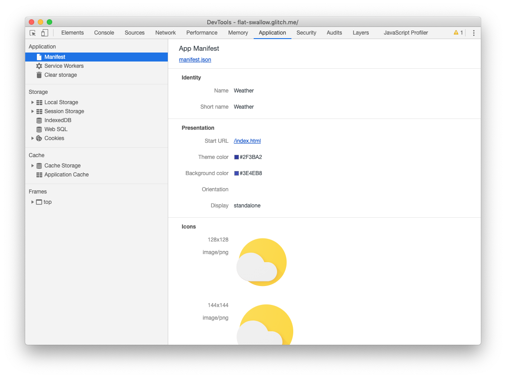

### Add iOS meta tags & icons

Safari on iOS doesn't support the web app manifest ([yet](https://webkit.org/status/#specification-web-app-manifest)), so you'll need to add the  [traditional `meta` tags](https://developer.apple.com/library/archive/documentation/AppleApplications/Reference/SafariWebContent/ConfiguringWebApplications/ConfiguringWebApplications.html) to the `<head>` of your `index.html` file:

#### [public/index.html](https://github.com/googlecodelabs/your-first-pwapp/blob/master/public/index.html#L31)

```html
<!-- CODELAB: Add iOS meta tags and icons -->
<meta name="apple-mobile-web-app-capable" content="yes">
<meta name="apple-mobile-web-app-status-bar-style" content="black">
<meta name="apple-mobile-web-app-title" content="Weather PWA">
<link rel="apple-touch-icon" href="/images/icons/icon-152x152.png">
```

### Bonus: Easy Lighthouse fixes

Our Lighthouse audit called out a few other things that are pretty easy to fix, so let's take care of those while we're here.

#### Set the meta description

Under the SEO audit, Lighthouse noted our " [Document does not have a meta description.](/web/tools/lighthouse/audits/description)" Descriptions can be displayed in Google's search results. High-quality, unique descriptions can make your results more relevant to search users and can increase your search traffic.

To add a description, add the following `meta` tag to the `<head>` of your document:

#### [public/index.html](https://github.com/googlecodelabs/your-first-pwapp/blob/master/public/index.html#L32)

```html
<!-- CODELAB: Add description here -->
<meta name="description" content="A sample weather app">
```

#### Set the address bar theme color

In the PWA audit, Lighthouse noted our app " [Does not set an address-bar theme color](/web/tools/lighthouse/audits/address-bar)". Theming the browser's address bar to match your brand's colors provides a more immersive user experience.

To set the theme color on mobile, add the following `meta` tag to the `<head>` of your document:

#### [public/index.html](https://github.com/googlecodelabs/your-first-pwapp/blob/master/public/index.html#L33)

```html
<!-- CODELAB: Add meta theme-color -->
<meta name="theme-color" content="#2F3BA2" />
```

### Verify changes with Lighthouse

Run Lighthouse again (by clicking on the + sign in the upper left corner of the Audits pane) and verify your changes.

__SEO Audit__

* __✅ PASSED:__ Document has a meta description.

__Progressive Web App Audit__

* __❗FAILED:__ Current page does not respond with a 200 when offline.
* __❗FAILED:__ `start_url` does not respond with a 200 when offline.
* __❗FAILED:__ Does not register a service worker that controls page and `start_url.`
* __✅ PASSED:__ Web app manifest meets the installability requirements.
* __✅ PASSED:__ Configured for a custom splash screen.
* __✅ PASSED:__ Sets an address-bar theme color.

## Provide a basic offline experience

There is an expectation from users that installed apps will always have a baseline experience if they're offline. That's why it's critical for installable web apps to never show Chrome's offline dinosaur. The offline experience can range from a simple, offline page, to a read-only experience with previously cached data, all the way to a fully functional offline experience that automatically syncs when the network connection is restored.

In this section, we're going to add a simple offline page to our weather app. If the user tries to load the app while offline, it'll show our custom page, instead of the typical offline page that the browser shows. By the end of this section, our weather app will pass the following audits:

* Current page does not respond with a 200 when offline.
* `start_url` does not respond with a 200 when offline.
* Does not register a service worker that controls page and `start_url.`

In the next section, we'll replace our custom offline page with a full offline experience. This will improve the offline experience, but more importantly, it'll significantly improve our performance, because most of our assets (HTML, CSS and JavaScript) will be stored and served locally, eliminating the network as a potential bottleneck.

### Service workers to the rescue

If you're unfamiliar with service workers, you can get a basic understanding by reading  [Introduction To Service Workers](/web/fundamentals/primers/service-worker/) about what they can do, how their lifecycle works and more. Once you've completed this code lab, be sure to check out the  [Debugging Service Workers code lab](http://goo.gl/jhXCBy) for a more in-depth look at how to work with service workers.

Features provided via service workers should be considered a progressive enhancement, and added only if supported by the browser. For example, with service workers you can cache the  [app shell](/web/fundamentals/architecture/app-shell) and data for your app, so that it's available even when the network isn't. When service workers aren't supported, the offline code isn't called, and the user gets a basic experience. Using feature detection to provide progressive enhancement has little overhead and it won't break in older browsers that don't support that feature.

Warning: Service worker functionality is only available on pages that are accessed via HTTPS (http://localhost and equivalents will also work to facilitate testing).

### Register the service worker

The first step is to register the service worker. Add the following code to your `index.html` file:

#### [public/index.html](https://github.com/googlecodelabs/your-first-pwapp/blob/master/public/index.html#L206)

```js
// CODELAB: Register service worker.
if ('serviceWorker' in navigator) {
  window.addEventListener('load', () => {
    navigator.serviceWorker.register('/service-worker.js')
        .then((reg) => {
          console.log('Service worker registered.', reg);
        });
  });
}
```

This code checks to see if the service worker API is available, and if it is, the service worker at `/service-worker.js` is registered once the page is  [loaded](/web/fundamentals/primers/service-workers/registration).

Note, the service worker is served from the root directory, not from a `/scripts/` directory. This is the easiest way to set the __`scope`__ of your service worker. The `scope` of the service worker determines which files the service worker controls, in other words, from which path the service worker will intercept requests. The default `scope` is the location of the service worker file, and extends to all directories below. So if `service-worker.js` is located in the root directory, the service worker will control requests from all web pages at this domain.

### Precache offline page

First, we need to tell the service worker what to cache. We've already created a simple  [offline page](https://your-first-pwa.glitch.me/offline.html) (`public/offline.html`) that we'll display any time there's no network connection.

In your `service-worker.js`, add `'/offline.html',` to the `FILES_TO_CACHE` array, the final result should look like this:

#### [public/service-worker.js](https://github.com/googlecodelabs/your-first-pwapp/blob/master/public/service-worker.js#L23)

```js
// CODELAB: Update cache names any time any of the cached files change.
const FILES_TO_CACHE = [
  '/offline.html',
];
```

Next, we need to update the `install` event to tell the service worker to pre-cache the offline page:

#### [public/service-worker.js](https://github.com/googlecodelabs/your-first-pwapp/blob/master/public/service-worker.js#L29)

```js
// CODELAB: Precache static resources here.
evt.waitUntil(
    caches.open(CACHE_NAME).then((cache) => {
      console.log('[ServiceWorker] Pre-caching offline page');
      return cache.addAll(FILES_TO_CACHE);
    })
);
```

Note: Service worker events and life cycle is covered in the next section.

Our `install` event now opens the cache with `caches.open()` and provides a cache name. Providing a cache name allows us to version files, or separate data from the cached resources so that we can easily update one but not affect the other.

Once the cache is open, we can then call `cache.addAll()`, which takes a list of URLs, fetches them from the server and adds the response to the cache. Note that `cache.addAll()` will reject if any of the individual requests fail. That means you're guaranteed that, if the install step succeeds, you cache will be in a consistent state. But, if it fails for some reason, it will automatically try again the next time the service worker starts up.

#### DevTools Detour

Let's take a look at how you can use DevTools to understand and debug service workers. Before reloading your page, open up DevTools, go the __Service Workers__ pane on the __Application__ panel. It should look like this:

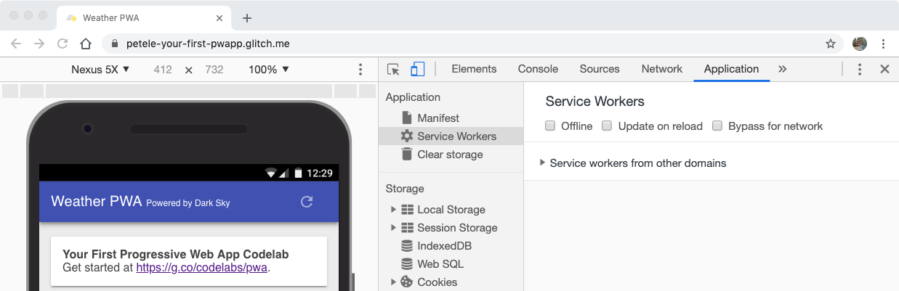

When you see a blank page like this, it means that the currently open page does not have any registered service workers.

Now, reload your page. The Service Workers pane should now look like this:

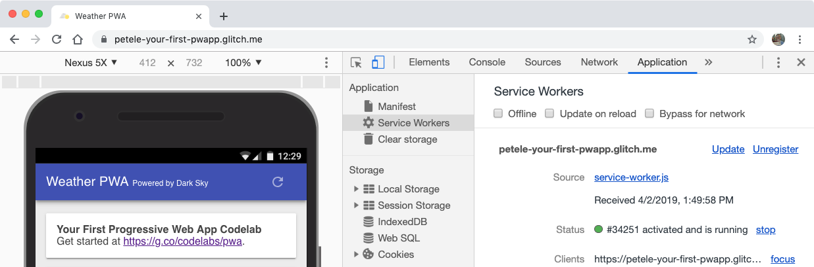

When you see information like this, it means the page has a service worker running.

Next to the Status label, there's a number (*34251*  in this case), keep an eye on that number as you're working with service workers. It's an easy way to tell if your service worker has been updated.

### Clean-up old offline pages

We'll use the `activate` event to clean up any old data in our cache. This code ensures that your service worker updates its cache whenever any of the app shell files change. In order for this to work, you'd need to increment the `CACHE_NAME` variable at the top of your service worker file.

Add the following code to your `activate` event:

#### [public/service-worker.js](https://github.com/googlecodelabs/your-first-pwapp/blob/master/public/service-worker.js#L36)

```js
// CODELAB: Remove previous cached data from disk.
evt.waitUntil(
    caches.keys().then((keyList) => {
      return Promise.all(keyList.map((key) => {
        if (key !== CACHE_NAME) {
          console.log('[ServiceWorker] Removing old cache', key);
          return caches.delete(key);
        }
      }));
    })
);
```

#### DevTools Detour

With the Service Workers pane open, refresh the page, you'll see the new service worker installed, and the status number increment.

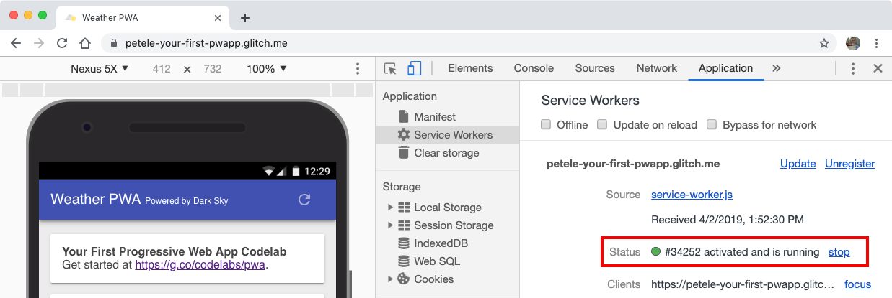

The updated service worker takes control immediately because our `install` event finishes with `self.skipWaiting()`, and the `activate` event finishes with `self.clients.claim()`. Without those, the old service worker would continue to control the page as long as there is a tab open to the page.

### Handle failed network requests

And finally, we need to handle `fetch` events. We're going to use a  [network, falling back to cache strategy](/web/fundamentals/instant-and-offline/offline-cookbook/#network-falling-back-to-cache). The service worker will first try to fetch the resource from the network, if that fails, it will return the offline page from the cache.


#### [public/service-worker.js](https://github.com/googlecodelabs/your-first-pwapp/blob/master/public/service-worker.js#L43)

```js
// CODELAB: Add fetch event handler here.
if (evt.request.mode !== 'navigate') {
  // Not a page navigation, bail.
  return;
}
evt.respondWith(
    fetch(evt.request)
        .catch(() => {
          return caches.open(CACHE_NAME)
              .then((cache) => {
                return cache.match('offline.html');
              });
        })
);
```

The `fetch` handler only needs to handle page navigations, so other requests can be dumped out of the handler and will be dealt with normally by the browser.  But, if the request `.mode` is `navigate`, use `fetch` to try to get the item from the network. If it fails, the `catch` handler opens the cache with `caches.open(CACHE_NAME)` and uses `cache.match('offline.html')` to get the precached offline page. The result is then passed back to the browser using `evt.respondWith()`.

Key Point: Wrapping the `fetch` call in  [`evt.respondWith()`](https://developer.mozilla.org/en-US/docs/Web/API/FetchEvent/respondWith) prevents the browsers default fetch handling and tells the browser we want to handle the response ourselves. If you don't call `evt.respondWith()` inside of a `fetch` handler, you'll just get the default network behavior.
</aside>

#### DevTools Detour

Let's check to make sure everything works as we expect it. With the Service Workers pane open, refresh the page, you'll see the new service worker installed, and the status number increment.

We can also check to see what's been cached. Go to the __Cache Storage__ pane on the __Application__ panel of DevTools. Right click __Cache Storage__, pick __Refresh Caches__, expand the section and you should see the name of your static cache listed on the left-hand side. Clicking on the cache name shows all of the files that are cached.

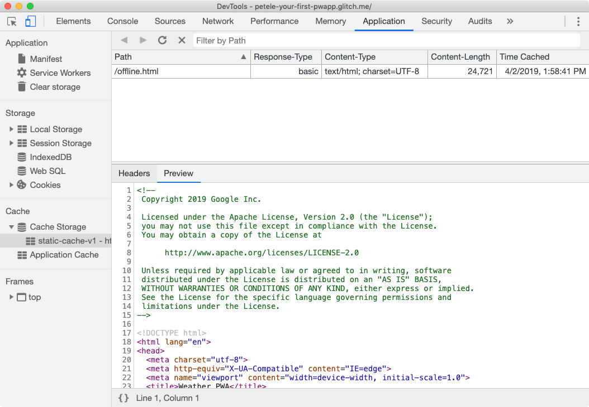

Now, let's test out offline mode. Go back to the __Service Workers__ pane of DevTools and check the __Offline__ checkbox. After checking it, you should see a little yellow warning icon next to the __Network__ panel tab. This indicates that you're offline.

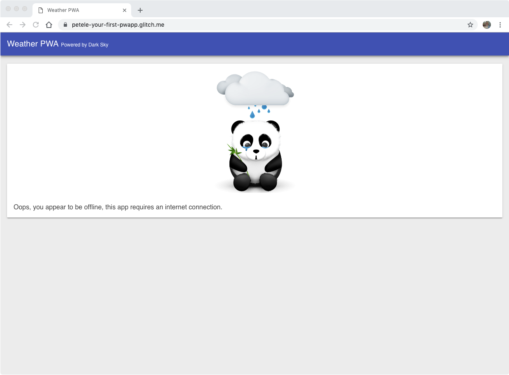

Reload your page and... it works! We get __our__ offline panda, instead of Chrome's offline dino!

### Tips for testing service workers

Debugging service workers can be a challenge, and when it involves caching, things can become even more of a nightmare if the cache isn't updated when you expect it. Between the typical service worker lifecycle and a bug in your code, you may become quickly frustrated. __But don't.__

#### Use DevTools

In the Service Workers pane of the Application panel, there are a few checkboxes that will make your life much easier.

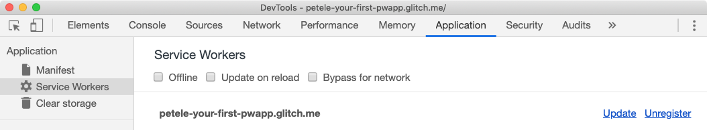

* __Offline__ - When checked simulates an offline experience and prevents any requests from going to the network.
* __Update on reload__ - When checked will get the latest service worker, install it, and immediately activate it.
* __Bypass for network__ - When checked requests bypass the service worker and are sent directly to the network.

#### Start Fresh

In some cases, you may find yourself loading cached data or that things aren't updated as you expect. To clear all saved data (localStorage, indexedDB data, cached files) and remove any service workers, use the Clear storage pane in the Application tab. Alternatively, you can also work in an Incognito window.

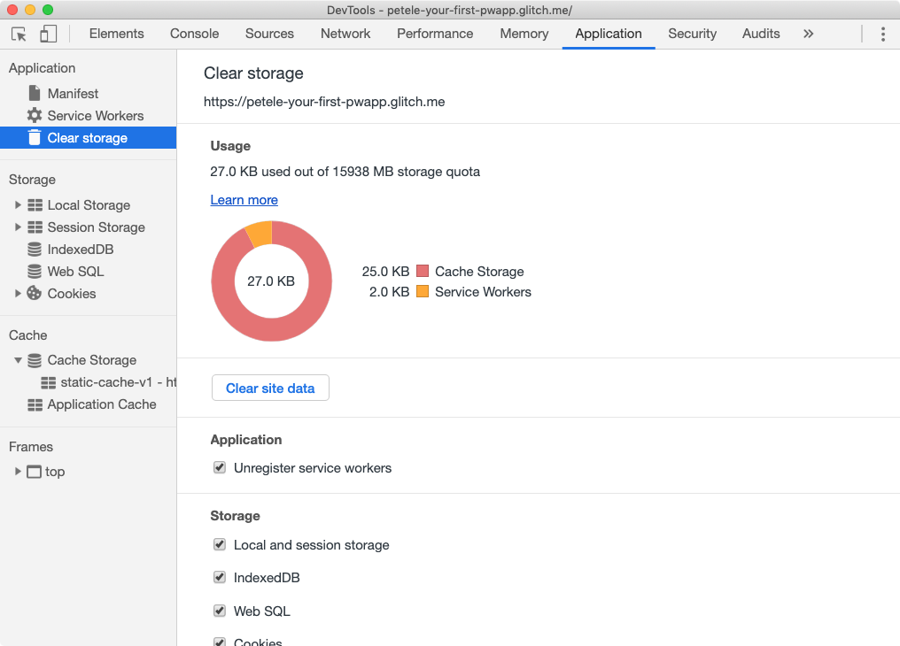

Additional tips:

* Once a service worker has been unregistered, it may remain listed until its containing browser window is closed.
* If multiple windows to your app are open, a new service worker will not take effect until all windows have been reloaded and updated to the latest service worker.
* Unregistering a service worker does not clear the cache!
* If a service worker exists and a new service worker is registered, the new service worker won't take control until the page is reloaded, unless you  [take immediate control](/web/fundamentals/primers/service-workers/lifecycle#clientsclaim).

### Verify changes with Lighthouse

Run Lighthouse again and verify your changes. Don't forget to uncheck the Offline checkbox before you verify your changes!

__SEO Audit__

* __✅ PASSED:__ Document has a meta description.

__Progressive Web App Audit__

* __✅ PASSED:__ Current page responds with a 200 when offline.
* __✅ PASSED:__ `start_url` responds with a 200 when offline.
* __✅ PASSED:__ Registers a service worker that controls page and `start_url.`
* __✅ PASSED:__ Web app manifest meets the installability requirements.
* __✅ PASSED:__ Configured for a custom splash screen.
* __✅ PASSED:__ Sets an address-bar theme color.

## Provide a full offline experience

Take a moment and put your phone into airplane mode, and try running some of your favorite apps. In almost all cases, they provide a fairly robust offline experience. Users expect that robust experience from their apps. And the web should be no different. Progressive Web Apps should be designed with offline as a core scenario.

Key Point: Designing for offline-first can drastically improve the performance of your web app by reducing the number of network requests made by your app, instead resources can be precached and served directly from the local cache. Even with the fastest network connection, serving from the local cache will be faster!

### Service worker life cycle

The life cycle of the service worker is the most complicated part. If you don't know what it's trying to do and what the benefits are, it can feel like it's fighting you. But once you know how it works, you can deliver seamless, unobtrusive updates to users, mixing the best of the web and native patterns.

Key Point: This codelab only covers the very basics of the service worker life cycle. To dive deeper, refer to [The Service Worker Lifecycle](/web/fundamentals/primers/service-workers/lifecycle) article on WebFundamentals.

#### `install` event

The first event a service worker gets is `install`. It's triggered as soon as the worker executes, and it's only called once per service worker. __If you alter your service worker script the browser considers it a different service worker__, and it'll get its own `install` event.

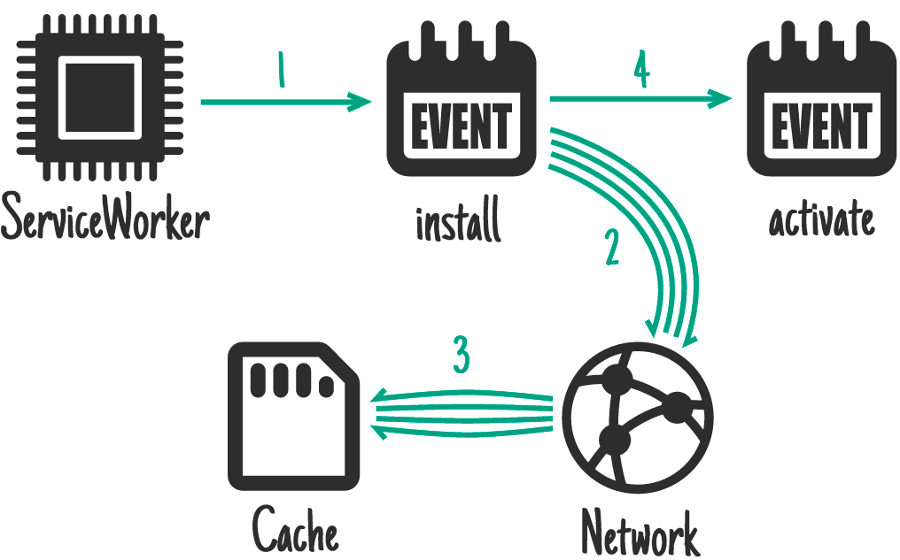

Typically the `install` event is used to cache everything you need for your app to run.

#### `activate` event

The service worker will receive an `activate` event every time it starts up. The main purpose of the `activate` event is to configure the service worker's behavior, clean up any resources left behind from previous runs (e.g. old caches), and get the service worker ready to handle network requests (for example the `fetch` event described below).

#### `fetch` event

The fetch event allows the service worker to intercept any network requests and handle requests. It can go to the network to get the resource, it can pull it from its own cache, generate a custom response or any number of different options. Check out the  [Offline Cookbook](/web/fundamentals/instant-and-offline/offline-cookbook/) for different strategies that you can use.

#### Updating a service worker

The browser checks to see if there is a new version of your service worker on each page load. If it finds a new version, the new version is downloaded and installed in the background, but it is not activated. It's sits in a waiting state, until there are no longer any pages open that use the old service worker. Once all windows using the old service worker are closed, the new service worker is activated and can take control. Refer to the  [Updating the service worker](/web/fundamentals/primers/service-workers/lifecycle#updates) section of the Service Worker Lifecycle doc for further details.

### Choosing the right caching strategy

Choosing the right  [caching strategy](/web/fundamentals/instant-and-offline/offline-cookbook/) depends on the type of resource you're trying to cache and how you might need it later. For our weather app, we'll split the resources we need to cache into two categories: resources we want to precache and the data that we'll cache at runtime.

#### Caching static resources

Precaching your resources is a similar concept to what happens when a user installs a desktop or mobile app. The key resources needed for the app to run are installed, or cached on the device so that they can be loaded later whether there's a network connection or not.

For our app, we'll precache all of our static resources when our service worker is installed so that everything we need to run our app is stored on the user's device. To ensure our app loads lightning fast, we'll use the  [cache-first](/web/fundamentals/instant-and-offline/offline-cookbook/#cache-falling-back-to-network) strategy; instead of going to the network to get the resources, they're pulled from the local cache; only if it's not available there will we try to get it from the network.

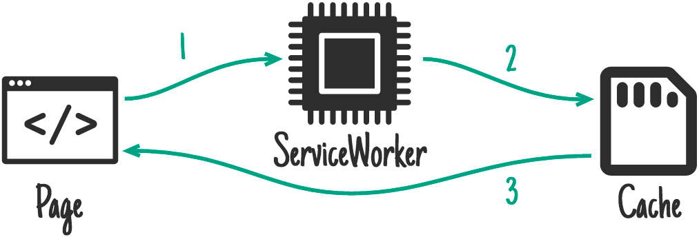

Pulling from the local cache eliminates any network variability. No matter what kind of network the user is on (WiFi, 5G, 3G, or even 2G), the key resources we need to run are available almost immediately.

Caution: In this sample, static resources are served using a  [`cache-first`](/web/fundamentals/instant-and-offline/offline-cookbook/#cache-falling-back-to-network) strategy, which results in a copy of any cached content being returned without consulting the network. While a `cache-first` strategy is easy to implement, it can cause challenges in the future.

#### Caching the app data

The  [stale-while-revalidate strategy](/web/fundamentals/instant-and-offline/offline-cookbook/#stale-while-revalidate) is ideal certain types of data and works well for our app. It gets data on screen as quickly as possible, then updates that once the network has returned the latest data. Stale-while-revalidate means we need to kick off two asynchronous requests, one to the cache and one to the network.

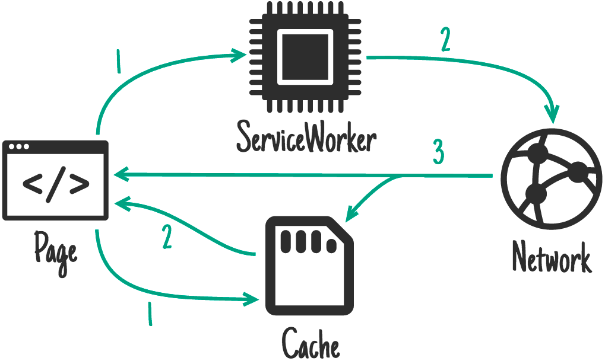

Under normal circumstances, the cached data will be returned almost immediately providing the app with recent data it can use. Then, when the network request returns, the app will be updated using the latest data from the network.

For our app, this provides a better experience than the network, falling back to cache strategy because the user does not have to wait until the network request times out to see something on screen. They may initially see older data, but once the network request returns, the app will be updated with the latest data.

### Update app logic

As mentioned previously, the app needs to kick off two asynchronous requests, one to the cache and one to the network. The app uses the `caches` object available in `window` to access the cache and retrieve the latest data. This is an excellent example of progressive enhancement as the `caches` object may not be available in all browsers, and if it's not the network request should still work.

Update the `getForecastFromCache()` function, to check if the `caches` object is available in the global `window` object, and if it is, request the data from the cache.

#### [public/scripts/app.js](https://github.com/googlecodelabs/your-first-pwapp/blob/master/public/scripts/app.js#L164)

```js
// CODELAB: Add code to get weather forecast from the caches object.
if (!('caches' in window)) {
  return null;
}
const url = `${window.location.origin}/forecast/${coords}`;
return caches.match(url)
    .then((response) => {
      if (response) {
        return response.json();
      }
      return null;
    })
    .catch((err) => {
      console.error('Error getting data from cache', err);
      return null;
    });
```

Then, we need to modify  [`updateData()`](https://github.com/googlecodelabs/your-first-pwapp/blob/master/public/scripts/app.js#L196) so that it makes two calls, one to `getForecastFromNetwork()` to get the forecast from the network, and one to `getForecastFromCache()` to get the latest cached forecast:

#### [public/scripts/app.js](https://github.com/googlecodelabs/your-first-pwapp/blob/master/public/scripts/app.js#L200)

```js
// CODELAB: Add code to call getForecastFromCache.
getForecastFromCache(location.geo)
    .then((forecast) => {
      renderForecast(card, forecast);
    });
```

Our weather app now makes two asynchronous requests for data, one from the cache and one via a `fetch`. If there's data in the cache, it'll be returned and rendered extremely quickly (tens of milliseconds). Then, when the `fetch` responds, the card will be updated with the freshest data direct from the weather API.

Notice how the cache request and the `fetch` request both end with a call to update the forecast card. How does the app know whether it's displaying the latest data? This is handled in the following code from `renderForecast()`:

#### [public/scripts/app.js](https://github.com/googlecodelabs/your-first-pwapp/blob/master/public/scripts/app.js#L85)

```js
// If the data on the element is newer, skip the update.
if (lastUpdated >= data.currently.time) {
  return;
}
```

Every time that a card is updated, the app stores the timestamp of the data on a hidden attribute on the card. The app just bails if the timestamp that already exists on the card is newer than the data that was passed to the function.

### Pre-cache our app resources

In the service worker, let's add a `DATA_CACHE_NAME` so that we can separate our applications data from the app shell. When the app shell is updated and older caches are purged, our data will remain untouched, ready for a super fast load. Keep in mind, if your data format changes in the future, you'll need a way to handle that and ensure the app shell and content stay in sync.

#### [public/service-worker.js](https://github.com/googlecodelabs/your-first-pwapp/blob/master/public/service-worker.js#L21)

```js
// CODELAB: Update cache names any time any of the cached files change.
const CACHE_NAME = 'static-cache-v2';
const DATA_CACHE_NAME = 'data-cache-v1';
```

Don't forget to also update the `CACHE_NAME`; we'll be changing all of our static resources as well.

In order for our app to work offline, we need to precache all of the resources it needs. This will also help our performance. Instead of having to get all of the resources from the network, the app will be able to load all of them from the local cache, eliminating any network instability.

Update the `FILES_TO_CACHE` array with the list of files:

#### [public/service-worker.js](https://github.com/googlecodelabs/your-first-pwapp/blob/master/public/service-worker.js#L23)

```js
// CODELAB: Add list of files to cache here.
const FILES_TO_CACHE = [
  '/',
  '/index.html',
  '/scripts/app.js',
  '/scripts/install.js',
  '/scripts/luxon-1.11.4.js',
  '/styles/inline.css',
  '/images/add.svg',
  '/images/clear-day.svg',
  '/images/clear-night.svg',
  '/images/cloudy.svg',
  '/images/fog.svg',
  '/images/hail.svg',
  '/images/install.svg',
  '/images/partly-cloudy-day.svg',
  '/images/partly-cloudy-night.svg',
  '/images/rain.svg',
  '/images/refresh.svg',
  '/images/sleet.svg',
  '/images/snow.svg',
  '/images/thunderstorm.svg',
  '/images/tornado.svg',
  '/images/wind.svg',
];
```

Since we are manually generating the list of files to cache, every time we update a file we __must update the `CACHE_NAME`__. We were able to remove `offline.html` from our list of cached files because our app now has all the necessary resources it needs to work offline, and won't ever show the offline page again.

Caution: In this sample, we hand-rolled our own service worker. Each time we update any of the static resources, we need to re-roll the service worker and update the cache, otherwise the old content will be served. In addition, when one file changes, the entire cache is invalidated and needs to be re-downloaded. That means fixing a simple single character spelling mistake will invalidate the cache and require everything to be downloaded again—not exactly efficient.  [Workbox](/web/tools/workbox/) handles this gracefully, by integrating it into your build process, only changed files will be updated, saving bandwidth for users and easier maintenance for you!

#### Update the activate event handler

To ensure our `activate` event doesn't accidentally delete our data, in the `activate` event of `service-worker.js`, replace `if (key !== CACHE_NAME) {` with:

#### public/service-worker.js

```js
if (key !== CACHE_NAME && key !== DATA_CACHE_NAME) {
```

#### Update the fetch event handler

We need to modify the service worker to intercept requests to the weather API and store their responses in the cache, so we can easily access them later. In the stale-while-revalidate strategy, we expect the network response to be the ‘source of truth', always providing us with the most recent information. If it can't, it's OK to fail because we've already retrieved the latest cached data in our app.

Update the `fetch` event handler to handle requests to the data API separately from other requests.

#### [public/service-worker.js](https://github.com/googlecodelabs/your-first-pwapp/blob/master/public/service-worker.js#L42)

```js
// CODELAB: Add fetch event handler here.
if (evt.request.url.includes('/forecast/')) {
  console.log('[Service Worker] Fetch (data)', evt.request.url);
  evt.respondWith(
      caches.open(DATA_CACHE_NAME).then((cache) => {
        return fetch(evt.request)
            .then((response) => {
              // If the response was good, clone it and store it in the cache.
              if (response.status === 200) {
                cache.put(evt.request.url, response.clone());
              }
              return response;
            }).catch((err) => {
              // Network request failed, try to get it from the cache.
              return cache.match(evt.request);
            });
      }));
  return;
}
evt.respondWith(
    caches.open(CACHE_NAME).then((cache) => {
      return cache.match(evt.request)
          .then((response) => {
            return response || fetch(evt.request);
          });
    })
);
```

The code intercepts the request and checks if it is for a weather forecast. If it is, use `fetch` to make the request. Once the response is returned, open the cache, clone the response, store it in the cache, and return the response to the original requestor.

We need to remove the `evt.request.mode !== 'navigate'` check because we want our service worker to handle all requests (including images, scripts, CSS files, etc), not just navigations. If we left that check in, only the HTML would be served from the service worker cache, everything else would be requested from the network.

### Try it out

The app should be completely offline-functional now. Refresh the page to ensure that you've got the latest service worker installed, then save a couple of cities and press the refresh button on the app to get fresh weather data.

Then go to the __Cache Storage__ pane on the __Application__ panel of DevTools. Expand the section and you should see the name of your static cache and data cache listed on the left-hand side. Opening the data cache should show the data stored for each city.

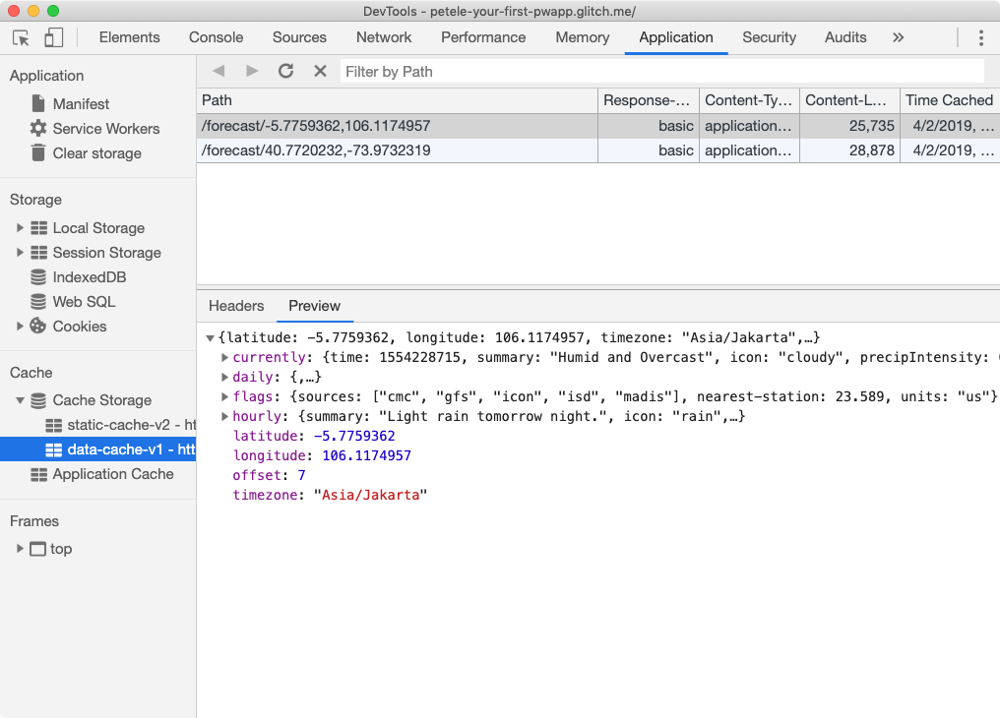

Then, open DevTools and switch to the Service Workers pane, and check the Offline checkbox, then try reloading the page, and then go offline and reload the page.

If you're on a fast network and want to see how weather forecast data is updated on a slow connection, set the `FORECAST_DELAY` property in `server.js` to `5000`. All requests to the forecast API will be delayed by 5000ms.

### Verify changes with Lighthouse

It's also a good idea to run Lighthouse again.

__SEO Audit__

* __✅ PASSED:__ Document has a meta description.

__Progressive Web App Audit__

* __✅ PASSED:__ Current page responds with a 200 when offline.
* __✅ PASSED:__ `start_url` responds with a 200 when offline.
* __✅ PASSED:__ Registers a service worker that controls page and `start_url.`
* __✅ PASSED:__ Web app manifest meets the installability requirements.
* __✅ PASSED:__ Configured for a custom splash screen.
* __✅ PASSED:__ Sets an address-bar theme color.

## Add install experience

When a Progressive Web App is installed, it looks and behaves like all of the other installed apps. It launches from the same place as other apps launch. It runs in an app without an address bar or other browser UI. And like all other installed apps, it's a top level app in the task switcher.

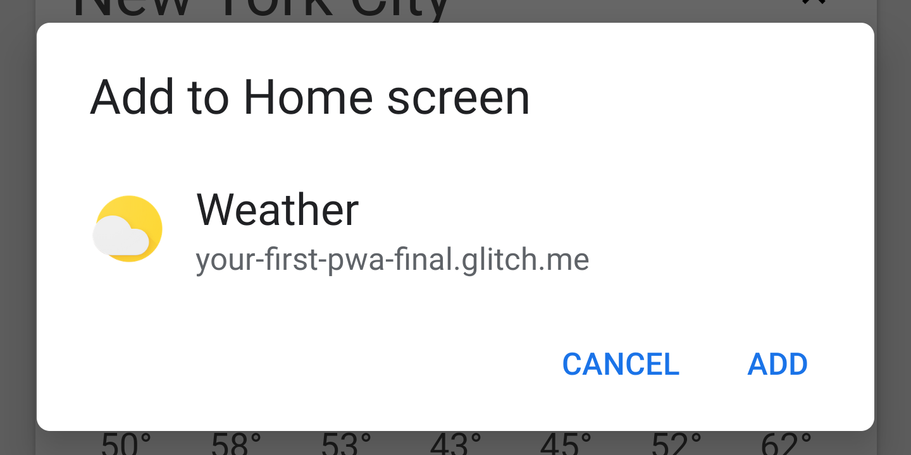

In Chrome, a Progressive Web App can either be installed through the three-dot context menu, or you can provide a button or other UI component to the user that will prompt them to install your app.

Success: Since the install experience in Chrome's three-dot context menu is somewhat buried, we recommend that you provide some indication within your app to notify the user your app can be installed, and an install button to complete the install process.

### Audit with Lighthouse

In order for a user to be able to install your Progressive Web App, it needs to meet  [certain criteria](/web/fundamentals/app-install-banners/#criteria). The easiest way to check is to use Lighthouse and make sure it meets the installable criteria.

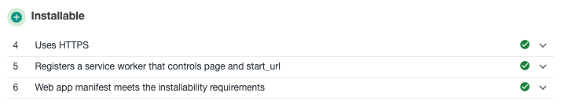

If you're worked through this codelab, your PWA should already meet these criteria.

Key Point: For this section, enable the **Bypass for network** checkbox in the **Service Workers** pane of the **Application** panel in DevTools. When checked, requests bypass the service worker and are sent directly to the network. This simplifies our development process since we don't have to update our service worker while working through this section.

### Add install.js to index.html

First, let's add the `install.js` to our `index.html` file.

#### [public/index.html](https://github.com/googlecodelabs/your-first-pwapp/blob/master/public/index.html#L204)

```html
<!-- CODELAB: Add the install script here -->
<script src="/scripts/install.js"></script>
```

### Listen for `beforeinstallprompt` event

If the add to home screen  [criteria](/web/fundamentals/app-install-banners/#criteria) are met, Chrome will fire a `beforeinstallprompt` event, that you can use to indicate your app can be 'installed', and then prompt the user to install it. Add the code below to listen for the `beforeinstallprompt` event:

#### [public/scripts/install.js](https://github.com/googlecodelabs/your-first-pwapp/blob/master/public/scripts/install.js#L24)

```js
// CODELAB: Add event listener for beforeinstallprompt event
window.addEventListener('beforeinstallprompt', saveBeforeInstallPromptEvent);
```

### Save event and show install button

In our `saveBeforeInstallPromptEvent` function, we'll save a reference to the `beforeinstallprompt` event so that we can call `prompt()` on it later, and update our UI to show the install button.

#### [public/scripts/install.js](https://github.com/googlecodelabs/your-first-pwapp/blob/master/public/scripts/install.js#L34)

```js
// CODELAB: Add code to save event & show the install button.
deferredInstallPrompt = evt;
installButton.removeAttribute('hidden');
```

### Show the prompt / hide the button

When the user clicks the install button, we need to call `.prompt()` on the saved `beforeinstallprompt` event. We also need to hide the install button, because `.prompt()` can only be called once on each saved event.

#### [public/scripts/install.js](https://github.com/googlecodelabs/your-first-pwapp/blob/master/public/scripts/install.js#L45)

```js
// CODELAB: Add code show install prompt & hide the install button.
deferredInstallPrompt.prompt();
// Hide the install button, it can't be called twice.
evt.srcElement.setAttribute('hidden', true);
```

Calling `.prompt()` will show a modal dialog to the user, asking them to add your app to their home screen.

### Log the results

You can check to see how the user responded to the install dialog by listening for the promise returned by the `userChoice` property of the saved `beforeinstallprompt` event. The promise returns an object with an `outcome` property after the prompt has shown and the user has responded to it.

#### [public/scripts/install.js](https://github.com/googlecodelabs/your-first-pwapp/blob/master/public/scripts/install.js#L47)

```js
// CODELAB: Log user response to prompt.
deferredInstallPrompt.userChoice
    .then((choice) => {
      if (choice.outcome === 'accepted') {
        console.log('User accepted the A2HS prompt', choice);
      } else {
        console.log('User dismissed the A2HS prompt', choice);
      }
      deferredInstallPrompt = null;
    });
```

One comment about `userChoice`, the  [spec defines it as a property](https://w3c.github.io/manifest/#beforeinstallpromptevent-interface), not a function as you might expect.

#### Log all install events

In addition to any UI you add to install your app, users can also install your PWA through other methods, for example Chrome's three-dot menu. To track these events, listen for the appinstalled event.

#### [public/scripts/install.js](https://github.com/googlecodelabs/your-first-pwapp/blob/master/public/scripts/install.js#L51)

```js
// CODELAB: Add event listener for appinstalled event
window.addEventListener('appinstalled', logAppInstalled);
```

Then, we'll need to update the `logAppInstalled` function, for this codelab, we'll just use `console.log`, but in a production app, you probably want to log this as an event with your analytics software.

#### [public/scripts/install.js](https://github.com/googlecodelabs/your-first-pwapp/blob/master/public/scripts/install.js#L60)

```js
// CODELAB: Add code to log the event
console.log('Weather App was installed.', evt);
```

### Update the service worker

Don't forget to update the `CACHE_NAME` in your `service-worker.js` file since you've made changes to files that are already cached. Enabling the __Bypass for network__ checkbox in the Service Workers pane of the Application panel in DevTools will work in development, but won't help in the real world.

### Try it out

Let's see how our install step went. To be safe, use the __Clear site data__ button in the Application panel of DevTools to clear everything away and make sure we're starting fresh. If you previously installed the app, be sure to uninstall it, otherwise the install icon won't show up again.

#### Verify the install button is visible

First, let's verify our install icon shows up properly, be sure to try this on both desktop and mobile.

1. Open the URL in a new Chrome tab.
2. Open Chrome's three-dot menu (next to the address bar).
▢ Verify you see "*Install Weather...*" in the menu.
3. Refresh the weather data using the refresh button in the upper right corner to ensure we meet the  [user engagement heuristics](/web/fundamentals/app-install-banners/#criteria).
▢ Verify the install icon is visible in the app header.

#### Verify the install button works

Next, let's make sure everything installs properly, and our events are properly fired. You can do this either on desktop or mobile. If you want to test this on mobile, be sure you're using remote debugging so you can see what's logged to the console.

1. Open Chrome, and in a new browser tab, navigate to your Weather PWA.
2. Open DevTools and switch to the Console pane.
3. Click the install button in the upper right corner.
▢ Verify the install button disappears
▢ Verify the install modal dialog is shown.
4. Click Cancel.
▢ Verify "*User dismissed the A2HS prompt*" is shown in the console output.
▢ Verify the install button reappears.
5. Click the install button again, then click the install button in the modal dialog.
▢ Verify "*User accepted the A2HS prompt*" is shown in the console output.
▢ Verify "*Weather App was installed*" is shown in the console output.
▢ Verify the Weather app is added to the place where you'd typically find apps.
6. Launch the Weather PWA.
▢ Verify the app opens as a standalone app, either in an app window on desktop, or full screen on mobile.

Note, if you're running on desktop from localhost, your installed PWA may show an address banner because localhost isn't considered a secure host.

#### Verify iOS installation works properly

Let's also check the behavior on iOS. If you have an iOS device, you can use that, or if you're on a Mac, try the iOS Simulator available with Xcode.

1. Open Safari and in a new browser tab, navigate to your Weather PWA.
2. Click the  *Share*   button.
3. Scroll right and click on the  *Add to Home Screen*  button.
▢ Verify the title, URL and icon are correct.
4. Click  *Add.*
▢ Verify the app icon is added to the home screen.
5. Launch the Weather PWA from the home screen.
▢ Verify the app launches full screen.

### Bonus: Detecting if your app is launched from the home screen

The `display-mode` media query makes it possible to apply styles depending on how the app was launched, or determine how it was launched with JavaScript.

```css
@media all and (display-mode: standalone) {
  body {
    background-color: yellow;
  }
}
```

You can also check the `display-mode` media query in  [JavaScript to see if you're running in standalone](/web/fundamentals/app-install-banners/#detect-mode).

### Bonus: Uninstalling your PWA

Remember, the `beforeinstallevent` doesn't fire if the app is already installed, so during development you'll probably want to install and uninstall your app several times to make sure everything is working as expected.

#### Android

On Android, PWAs are uninstalled in the same way other installed apps are uninstalled.

* Open the app drawer.
* Scroll down to find the Weather icon.
* Drag the app icon to the top of the screen.
* Choose  *Uninstall.*

#### ChromeOS

On ChromeOS, PWAs are easily uninstalled from the launcher search box.

* Open the launcher.
* Type " *Weather* " into the search box, your Weather PWA should appear in the results.
* Right click (alt-click) on the Weather PWA.
* Click  *Remove from Chrome...*

#### macOS and Windows

On Mac and Windows, PWAs must be uninstalled through Chrome.

* In a new browser tab, open chrome://apps.
* Right click (alt-click) on the Weather PWA.
* Click  *Remove from Chrome...*

## Congratulations

Congratulations, you've successfully built your first Progressive Web App!

You added a web app manifest to enable it to be installed, and you added a service worker to ensure that your PWA is always fast, and reliable. You learned how to use DevTools to audit an app and how it can help you improve your user experience.

You now know the key steps required to turn any web app into a Progressive Web App.

### Further reading

* [High-performance service worker loading](/web/fundamentals/primers/service-workers/high-performance-loading)
* [Service Worker Caching Strategies Based on Request Types](https://medium.com/dev-channel/service-worker-caching-strategies-based-on-request-types-57411dd7652c)

### Reference docs

* [Web App Manifest docs](/web/fundamentals/web-app-manifest)
* [Web App Manifest properties (MDN)](https://developer.mozilla.org/en-US/docs/Web/Manifest#Members)
* [Install & Add to Home Screen](/web/fundamentals/app-install-banners/)
* [Service Worker Overview](/web/fundamentals/primers/service-workers/)
* [Service Worker Lifecycle](/web/fundamentals/primers/service-workers/lifecycle)
* [High-performance service worker loading](/web/fundamentals/primers/service-workers/high-performance-loading)
* [Offline Cookbook](/web/fundamentals/instant-and-offline/offline-cookbook/#generic-fallback)

## Found an issue, or have feedback? {: .hide-from-toc }

Help us make our code labs better by submitting an [issue](https://github.com/googlecodelabs/your-first-pwapp/issues) today. And thanks!
