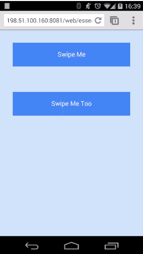
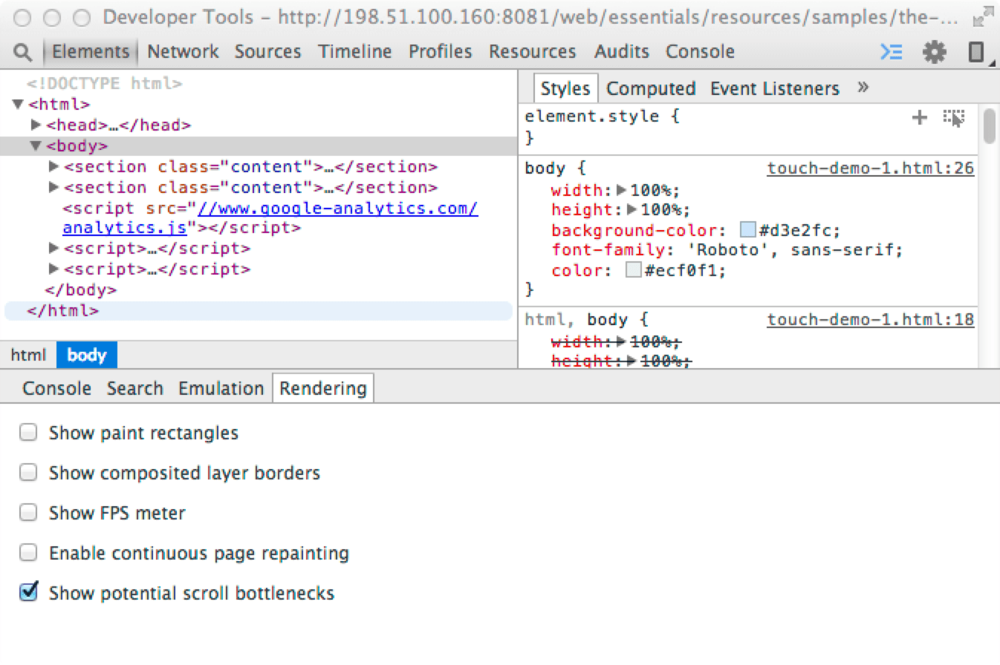

project_path: /web/_project.yaml
book_path: /web/fundamentals/_book.yaml
description: Touchscreens are available on more and more devices,  from phones up to desktop screens. Your app should respond to their touch  in intuitive and beautiful ways.

{# wf_updated_on: 2014-01-06 #}
{# wf_published_on: 2014-01-01 #}

# Add Touch to Your Site {: .page-title }



  <iframe class="devsite-embedded-youtube-video" data-video-id="Rwc4fHUnGuU"
          data-autohide="1" data-showinfo="0" frameborder="0" allowfullscreen>
  </iframe>

Touchscreens are available on more and more devices, ranging from phones up to desktop screens. When your users choose to interact with your UI, your app should respond to their touch in intuitive and beautiful ways.

## Stateful elements respond to touch 

Touchscreens are available on more and more devices, ranging from phones up to desktop screens. When your users choose to interact with your UI, your app should respond to their touch in intuitive and beautiful ways.

### Add Touch States

Have you ever touched or clicked an element on a web page and questioned
whether the site actually detected it?

Simply altering the color of elements as users touch parts of your UI gives a basic reassurance that your site is working. Not only does this alleviate frustation, but can also give a snappy and responsive feel to your site.

#### Use Pseudo Classes to Change UI for each Touch State

The fastest way to support touch is to change the UI in response to a DOM
element’s change in state.

### TL;DR {: .hide-from-toc }
- Make your site feel snappy and responsive: change the UI for each state <code>:hover</code>, <code>:active</code> and <code>:focus</code>.
- Don’t override a browser’s default responses to touch and focus unless you are implementing your own UI changes.
- Disable text selection on elements users will touch, unless there’s a good reason why users might need to copy / select the text.

DOM elements can be in one of the following states, default, focus, hover, and active. To change
our UI for each of these states, we need to apply styles to the following
pseudo classes `:hover`, `:focus` and `:active` as shown below:

<pre class="prettyprint">

</pre>

[Try it](https://googlesamples.github.io/web-fundamentals/fundamentals/design-and-ui/input/touch/states-example.html){: target="_blank" .external }

See [Pseudo classes for touch states](#pseudo-classes-for-touch-states):

#### Hover and Focus Stickiness

On most mobile browsers *hover* and/or *focus* states will apply to an element
after it's been tapped.

Consider carefully what styles you set and how they will look to the user after
they finish their touch.

Bear in mind that anchor tags and buttons may have different behaviour in
different browsers, so assume in some cases *hover* will remain and in others
**focus** will remain.

#### Enabling Active State Support on iOS

Unfortunately, Safari on iOS does not apply the *active* state by default, to
get it working you need to add a `touchstart` event listener to the *document
body* or to each element.

You should do this behind a user agent test so it's only run on iOS devices.

Adding a touch start to the body has the advantage of applying to all elements
in the DOM, however this may have performance issues when scrolling the page.

    window.onload = function() {
      if(/iP(hone|ad)/.test(window.navigator.userAgent)) {
        document.body.addEventListener('touchstart', function() {}, false);
      }
    };
    

The alternative is to add the touch start listeners to all the interactable
elements in the page, alleviating some of the performance concerns.

    window.onload = function() {
      if(/iP(hone|ad)/.test(window.navigator.userAgent)) {
        var elements = document.querySelectorAll('button');
        var emptyFunction = function() {};
        for(var i = 0; i < elements.length; i++) {
          elements[i].addEventListener('touchstart', emptyFunction, false);
        }
      }
    };
    

#### Override Default Browser Styles for Touch States

Once you add styles for the different states, you'll notice that most browsers
implement their own styles to respond to a user’s touch, you should override
these defaults when you've added your own styles.

Caution: Only override browser styles if you are implementing your own!

##### Override Tap Highlight Styles

When mobile devices first launched, a number of sites didn’t have styling for
the active state. As a result, many browsers add a highlight color or style to elements when a user touches them.

Safari and Chrome add a tap highlight color which can be prevented with the
`-webkit-tap-highlight-color` CSS property:

<pre class="prettyprint">

</pre>

[Try it](https://googlesamples.github.io/web-fundamentals/fundamentals/design-and-ui/input/touch/states-example.html){: target="_blank" .external }

Internet Explorer on Windows Phone has a similar behavior, but is suppressed
via a meta tag:

    <meta name="msapplication-tap-highlight" content="no">
    

##### Override FirefoxOS Button State Styles

The Firefox `-moz-focus-inner` pseudo class includes an outline on touchable elements.
You can remove this outline by setting the `border: 0`.

If you are using a `<button>` element, you get a gradient applied to your
button which you can remove by setting `background-image: none`.

<pre class="prettyprint">

</pre>

[Try it](https://googlesamples.github.io/web-fundamentals/fundamentals/design-and-ui/input/touch/states-example.html){: target="_blank" .external }

##### Override Element Outline in Focus State

Suppress the outline color when an element is focused using `outline: 0`.

    .btn:focus {
      outline: 0;
    
      // Add replacement focus styling here (i.e. border)
    }
    

#### Disable user-select on UI which Responds to Touch

Some mobile browsers will select text if the user long presses on the screen.
This can result in a bad user experience if the user accidentally presses down
on a button for too long. You can prevent this from happening using the
`user-select` CSS property.

    -moz-user-select: none;
    -webkit-user-select: none;
    -ms-user-select: none;
    user-select: none;
    

Caution: You should be cautious not to disable user selection if the information on the element may be useful to the user (phone number, e-mail address, and so on).

### Reference

#### Pseudo Classes for Touch States

<table>
  <thead>
    <tr>
      <th>Class</th>
      <th>Example</th>
      <th>Description</th>
    </tr>
  </thead>
  <tbody>
    <tr>
      <td data-th="Class">:hover</td>
      <td data-th="Example"></td>
      <td data-th="Description">
        This state is entered when a is cursor placed over an element.
        Changes in UI on hover are helpful to encourage users to interact
        with elements.
      </td>
    </tr>
    <tr>
      <td data-th="Class">:focus</td>
      <td data-th="Example">
        
      </td>
      <td data-th="Description">
        When you tab through elements on a page, you are moving the focus
        from one element to the next. The focus state allows the user to
        know what element they are currently interacting with; also allows
        users to navigate your UI easily using a keyboard.
      </td>
    </tr>
    <tr>
      <td data-th="Class">:active</td>
      <td data-th="Example">
        
      </td>
      <td data-th="Description">
        This is the state an element has when it's being selected, for
        example a user clicking or touching an element.
      </td>
    </tr>
  </tbody>
</table>

## Implement custom gestures

If you have an idea for custom interactions and gestures for your site, there
are two topics to keep in mind: how to support the range of mobile browsers
and how to keep your frame rate high. In this article, we'll look at exactly
these topics.

### Respond to Touch Input Using Events

Depending on what you would like to do with touch, you’re likely to fall into
one of two camps:

- I want the user to interact with one particular element.
- I want the user to interact with multiple elements at the same time.

There are trade offs to be had with both.

{: .attempt-right }

If the user will only be able to interact with one element, you might want
all touch events to be given to that one element, as long as the gesture
initially started on the element itself. For example, moving a finger off
the swipable element can still control the element.

{: .attempt-right }

If, however, you expect users to interact with multiple elements at the same
time (using multi-touch), you should restrict the touch to the specific
element.

### TL;DR {: .hide-from-toc }
- For full device support, handle touch, mouse and Pointer Events.
- Always bind start event listeners to the element itself.
- If you want the user to interact with one particular element, bind your move and end listeners to the document in the touchstart method; ensure you unbind them from the document in the end listener.
- If you want to support multi-touch, either restrict move and end touch events to the element itself or handle all the touches on an element.

### Add Event Listeners

Touch events and mouse events are implemented on most mobile browsers.

The event names you need to implement are `touchstart`, `touchmove`,
`touchend` and `touchcancel`.

For some situations, you may find that you would like to support mouse
interaction as well; which you can do with the mouse events:
`mousedown`, `mousemove`, and `mouseup`.

For Windows Touch devices, you need to support Pointer Events which are a
new set of events. Pointer Events merge mouse and touch events into one set of
callbacks. This is currently only supported in Internet Explorer 10+ with
the prefixed events `MSPointerDown`, `MSPointerMove`, and `MSPointerUp` and
in IE 11+ the unprefixed events `pointerdown`, `pointermove`, and `pointerup`.

Touch, mouse and Pointer Events are the building blocks for adding new
gestures into your application (see 
[Touch, mouse and Pointer events](#touch-mouse-and-pointer-events)).

Include these event names in the `addEventListener()` method, along with the
event’s callback function and a boolean. The boolean determines whether you
should catch the event before or after other elements have had the
opportunity to catch and interpret the events (`true` means we want the event
before other elements).

<pre class="prettyprint">

</pre>

[Try it](https://googlesamples.github.io/web-fundamentals/fundamentals/design-and-ui/input/touch/touch-demo-1.html){: target="_blank" .external }

This code first checks to see if Pointer Events are supported by testing for
`window.PointerEventsSupport`, if Pointer Events aren’t supported, we add listeners for
touch and mouse events instead.

The value `window.PointerEventSupport` is determined by looking for the
existence of `window.PointerEvent` or the now deprecated
`window.navigator.msPointerEnabled` objects. If they are supported we use
varibles for event names, which use the prefixed or unprefixed versions depending
on the existence of `window.PointerEvent`.

<pre class="prettyprint">

</pre>

[Try it](https://googlesamples.github.io/web-fundamentals/fundamentals/design-and-ui/input/touch/touch-demo-1.html){: target="_blank" .external }

### Handle Single-Element Interaction

In the short snippet of code above you may have noticed that we only add the starting event listener, this is a conscious decision.

By adding the move and end event listeners once the gesture has
started on the element itself, the browser can check if the touch occured in a
region with a touch event listener and if it’s not, can handle it faster
by not having to run any additional javascript.

The steps taken to implement this are:

1. Add the start events listener to an element.
1. Inside your touch start method, bind the move and end elements to the
   document. The reason for binding the move and end events to the
   document is so that we receive all events regardless of whether they
   occur on the original element or not.
1. Handle the move events.
1. On the end event, remove the move and end listeners from the document.

Below is a snippet of our `handleGestureStart` method which adds the move
and end events to the document:

<pre class="prettyprint">

</pre>

[Try it](https://googlesamples.github.io/web-fundamentals/fundamentals/design-and-ui/input/touch/touch-demo-1.html){: target="_blank" .external }

The end callback we add is `handleGestureEnd` which removes the move
and end events from the document when the gesture has finished:

<pre class="prettyprint">

</pre>

[Try it](https://googlesamples.github.io/web-fundamentals/fundamentals/design-and-ui/input/touch/touch-demo-1.html){: target="_blank" .external }

Mouse events follow this same pattern since it’s easy for a user to
accidentally move the mouse outside of the element, which results in the move
events no longer firing. By adding the move event to the document, we'll continue to get mouse movements regardless of where they are on the page.

You can use the
[Show potential scroll bottlenecks](https://developer.chrome.com/devtools/docs/rendering-settings#show-potential scroll bottlenecks)
feature in Chrome DevTools to show how the touch events behave:

{: .attempt-right }

With this enabled you can see where touch events are bound and ensure your logic for adding
and removing listeners is working as you'd expect.

### Handle Multi-Element Interaction

If you expect your users to use multiple elements at once, you can add the
move and end events listeners directly to the elements themselves. This
applies to touch only, for mouse interactions you should continue to apply
the `mousemove` and `mouseup` listeners to the document.

Since we only wish to track touches on a particular element, we can add the
move and end listeners for touch and pointer events to the element straight away:

<pre class="prettyprint">

</pre>

[Try it](https://googlesamples.github.io/web-fundamentals/fundamentals/design-and-ui/input/touch/touch-demo-2.html){: target="_blank" .external }

In our `handleGestureStart` and `handleGestureEnd` function, we add and
remove the mouse event listeners to the document.

<pre class="prettyprint">

</pre>

[Try it](https://googlesamples.github.io/web-fundamentals/fundamentals/design-and-ui/input/touch/touch-demo-2.html){: target="_blank" .external }

### Responding to Touch Efficiently

Now that we have the start and end events taken care of we can actually respond to the touch events.

#### Get and Store Touch Event Coordinates

For any of the start and move events, you can easily extract `x` and `y`
from an event.

The following code snippet checks whether the event is from a touch event by looking for `targetTouches`, if it is then it extracts the `clientX` and `clientY` from the first touch. If the event is a mouse or pointer event then we extract `clientX` and `clientY` directly from the event itself.

<pre class="prettyprint">

</pre>

[Try it](https://googlesamples.github.io/web-fundamentals/fundamentals/design-and-ui/input/touch/touch-demo-2.html){: target="_blank" .external }

Each touch event has three lists containing touch data
(see also [Touch lists](#touch-lists)):

* `touches`: list of all current touches on the screen, regardless of DOM element they are on.
* `targetTouches`: list of touches currently on the DOM element the event is bound to.
* `changedTouches`: list of touches which changed resulting in the event being fired.

In most cases, `targetTouches` gives you everything you need.

#### requestAnimationFrame

Since the event callbacks are fired on the main thread, we want to run as
little code as possible in the callback to keep our frame rate high,
preventing jank.

Use `requestAnimationFrame` to change the UI in response to
an event. This gives you an opportunity to update the UI when the browser is intending to draw a frame and will help you move some work out of your callback.

If you are unfamiliar with request animation frames, you can [learn more here](/web/fundamentals/performance/rendering/optimize-javascript-execution#use-requestanimationframe-for-visual-changes).

A typical implementation is to save the `x` and `y` coordinates from the
start and move events and request an animation frame in the move event
callback.

In our demo, we store the initial touch position in `handleGestureStart`:

<pre class="prettyprint">

</pre>

[Try it](https://googlesamples.github.io/web-fundamentals/fundamentals/design-and-ui/input/touch/touch-demo-1.html){: target="_blank" .external }

The `handleGestureMove` method stores the `y` position before requesting an
animation frame if we need to, passing in our `onAnimFrame` function as the
callback:

<pre class="prettyprint">

</pre>

[Try it](https://googlesamples.github.io/web-fundamentals/fundamentals/design-and-ui/input/touch/touch-demo-2.html){: target="_blank" .external }

It’s in the `onAnimFrame` function that we change our UI to move the
elements around. Initially we check to see if the gesture is still
on-going to determine whether we should still animate or not, if so we use
our initial and last y positions to calculate the new transform for our
element.

Once we’ve set the transform, we set the `isAnimating` variable to `false` so
the next touch event will request a new animation frame.

<pre class="prettyprint">

</pre>

[Try it](https://googlesamples.github.io/web-fundamentals/fundamentals/design-and-ui/input/touch/touch-demo-2.html){: target="_blank" .external }

### Control Gestures using Touch Actions

The CSS property `touch-action` allows you to control the default touch
behavior of an element. In our examples, we use `touch-action: none` to
prevent the browser from doing anything with a users' touch, allowing us
to intercept all of the touch events.

<pre class="prettyprint">

</pre>

[Try it](https://googlesamples.github.io/web-fundamentals/fundamentals/design-and-ui/input/touch/touch-demo-1.html){: target="_blank" .external }

`touch-action` allows you to disable gestures implemented by a browser.
For example, IE10+ supports a double-tap to zoom gesture. By setting a touch-action
of `pan-x | pan-y | manipulation` you prevent the default double-tap
behavior.

This allows you to implement a double-tap gesture yourself.
In the case of IE10+, it also eliminates the 300ms click delay.

Below is a list of the available parameters for *touch-action*.

<table class="responsive">
  <thead>
    <tr>
      <th colspan="2">Touch Action Parameters</th>
    </tr>
  </thead>
  <tbody>
    <tr>
      <td data-th="Property"><code>touch-action: auto</code></td>
      <td data-th="Description">
        The browser will add the normal touch interactions which it supports. For example, scrolling in the x-axis, scrolling in the y-axis, pinch zoom and double tap.
      </td>
    </tr>
    <tr>
      <td data-th="Property"><code>touch-action: none</code></td>
      <td data-th="Description">No touch interactions will be handled by the browser.</td>
    </tr>
    <tr>
      <td data-th="Property"><code>touch-action: pan-x</code></td>
      <td data-th="Description">Only horizontal scrolling will be handled by the browser; vertical scrolling and gestures will be disabled.</td>
    </tr>
    <tr>
      <td data-th="Property"><code>touch-action: pan-y</code></td>
      <td data-th="Description">Only vertical scrolling will be handled by the browser; horizontal scrolling and gestures will be disabled.</td>
    </tr>
    <tr>
      <td data-th="Property"><code>touch-action: manipulation</code></td>
      <td data-th="Description">Scrolling in both directions and pinch zooming will be handled by the browser; all other gesture will be ignored by the browser.</td>
    </tr>
  </tbody>
</table>

Note: Using <code>touch-action&colon; pan-x</code> or <code>touch-action&colon; pan-y</code> are great for being explicit in your intention that a user should only ever scroll vertically or horizontally on an element.

### Reference

The definitive touch events reference can be found here:
[w3 Touch Events](http://www.w3.org/TR/touch-events/).

#### Touch, Mouse, and Pointer events

These events are the building blocks for adding new gestures into your
application:

<table class="responsive">
  <thead>
    <tr>
      <th colspan="2">Touch, Mouse, Pointer Events</th>
    </tr>
  </thead>
  <tbody>
    <tr>
      <td data-th="Event Names">
        <code>touchstart</code>,
        <code>mousedown</code>,
        <code>pointerdown</code>
      </td>
      <td data-th="Description">
        This is called when a finger first touches an element or when the
        user clicks down on the mouse.
      </td>
    </tr>
    <tr>
      <td data-th="Event Names">
        <code>touchmove</code>,
        <code>mousemove</code>,
        <code>pointermove</code>
      </td>
      <td data-th="Description">
        This is called when the user moves their finger across the screen or
        drags with the mouse.
      </td>
    </tr>
    <tr>
      <td data-th="Event Names">
        <code>touchend</code>,
        <code>mouseup</code>,
        <code>pointerup</code>
      </td>
      <td data-th="Description">
        This is called when the user lifts their finger off of the screen
        or releases the mouse.
      </td>
    </tr>
    <tr>
      <td data-th="Event Names">
        <code>touchcancel</code>
      </td>
      <td data-th="Description">
        This is called when the browser cancels the touch gestures.
      </td>
    </tr>
  </tbody>
</table>

#### Touch Lists

Each touch event includes three list attributes:

<table class="responsive">
  <thead>
    <tr>
      <th colspan="2">Touch Event Attributes</th>
    </tr>
  </thead>
  <tbody>
    <tr>
      <td data-th="Attribute"><code>touches</code></td>
      <td data-th="Description">
        List of all current touches on the screen, regardless of elements
        being touched.
      </td>
    </tr>
    <tr>
      <td data-th="Attribute"><code>targetTouches</code></td>
      <td data-th="Description">
        List of touches that started on the element that is the target of
        the current event. For example, if you bind to a <code>&lt;button&gt;</code>,
        you'll only get touches currently on that button. If you bind to the
        document, you'll get all touches currently on the document.
      </td>
    </tr>
    <tr>
      <td data-th="Attribute"><code>changedTouches</code></td>
      <td data-th="Description">
        List of touches which changed resulting in the event being fired:
        <ul>
          <li>
            For the <code><a href="http://www.w3.org/TR/touch-events/#dfn-touchstart">touchstart</a></code>
            event-- list of the touch points that just became active with the
            current event.
          </li>
          <li>
            For the <code><a href="http://www.w3.org/TR/touch-events/#dfn-touchmove">touchmove</a></code>
            event-- list of the touch points that have moved since the last
            event.
          </li>
          <li>
            For the <code><a href="http://www.w3.org/TR/touch-events/#dfn-touchend">touchend</a></code>
            and <code><a href="http://www.w3.org/TR/touch-events/#dfn-touchcancel">touchcancel</a></code>
            events-- list of the touch points that have just been removed
            from the surface.
          </li>
        </ul>
      </td>
    </tr>
  </tbody>
</table>

