project_path: /web/fundamentals/_project.yaml
book_path: /web/fundamentals/_book.yaml
description: A step-by-step guide to the basics of UX design.

{# wf_updated_on: 2017-07-24 #}
{# wf_published_on: 2016-10-01 #}

# Basics of UX {: .page-title }



This article introduces a workflow that can help teams, products, startups and
companies create a robust and meaningful process for developing a better user
experience for their customers. You could use different parts of the process
separately but they ideally work best as a series of steps.

This guide borrows heavily from the Design Sprint methodology that multiple
teams across Google use to troubleshoot and solve challenges such as the
[Self Driving Car](https://www.google.com/selfdrivingcar/ "Self Driving Car"){:target="_blank" .external}
and [Project Loon](https://www.solveforx.com/loon/ "Project Loon"){:target="_blank" .external}.

### Double Diamond

This flow work is based on what we in UX circles call the double diamond, made
popular by the [British Design Council](https://www.designcouncil.org.uk/ "British Design Council"){:target="_blank" .external},
where your team diverges to understand an idea through research and then
converges to define the challenge, diverges to sketch it individually, share the
ideas, decide on what the best way forward, test and validate.

<figure>
  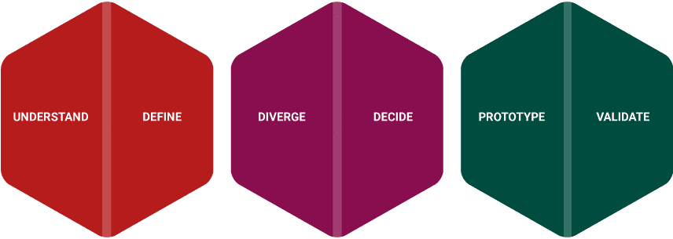
  <figcaption>The 'double diamond' design process model pioneered by the British Design Council, the steps involve these phases of a project; <em>Understand</em>, <em>Define</em>, <em>Diverge</em>, <em>Decide</em>, <em>Prototype</em> and <em>Validate</em>.</figcaption>
</figure>

## Setting the stage

First thing is to start with the underlying challenge at hand and write it out
like a proposal, asking yourself, “what is the problem I’m actually trying to
solve?”.  The challenge statement is the brief you are setting for the project
that includes your goal.

This challenge could be for an existing product feature that needs to be refined
or a completely new product altogether. Whatever your task may be, simply adjust
the language to fit the goal you are trying to achieve. A statement should be
tied to your team goals, focused on your audience, inspiring and concise.

These are some real life examples of products that I have worked with in the
past;

* Design a system to manage the treatment and follow-up care of patients with
  clubfoot.

* Create an app that simplifies complex financial systems and pare them down to
  the essentials.

* Design consistent mobile app across different platforms without sacrificing
  the brand.

### Updating your challenge statement

Once you have written several variations of the goal, present it to your team to
get a consensus. You may want to include a deadline as this will help the team
focus on the problem. So with the added an adjustments to the list above could
be:

* Design a system to manage the treatment and follow-up care of children under
  the age of 2 with clubfoot for launch in Q1 this year.
* Create a simple financial app that allows you to buy and sell shares at the tap
  of a button without prior knowledge of the financial world, with initial launch
  July 2017.
* Produce a design guide that is flexible across multiple platforms and positions
  the company's brand effectively on each platform by the end of this year.

When the challenge statement is finished, display it in a prominent place so
that you can see it while you work. You will need to refer back to it
constantly, perhaps even updating or modifying it throughout your project.

## Validating the problem

The next step is to research the challenge and learn about the problem. What you
need to discover is whether your team's understanding of the problem is valid.
Quite often we look at problems from our own point of view, which is dangerous
as most of us in tech are actually power users and are in fact a minority of
users. We are a vocal minority and can be fooled into thinking something is
actually a problem when it isn’t.

There are various methods of collecting data to validate the challenge. Each one
depends on your team and if you have access to users. The objective is to have a
better understanding of the problem at hand.

### Internal interviews with stakeholders

<figure>
  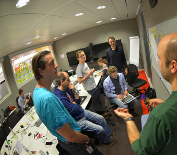
  <figcaption>Interviews with stakeholders can be informative for discovering insights across a company or team.</figcaption>
</figure>

The interviewing process involves interviewing each team member and stakeholder
at your company, from marketing to accounts. This will help you find what they
think the real challenges are and what they think potential solutions could be.
When I say solution I am not speaking about technical solutions here, but rather
what would be the best case scenario and end goal for the company or product.
For example using the challenges above “having our clubfoot software in 80% of
medical facilities by the end of the year” would be a great goal to aim for.

There is one caveat. This method of validation is the least favoured as it
prevents team discussion and collaboration, potentially creating a siloed
atmosphere in an organization. Nevertheless it can yield some good information
about the clients and the design challenge that you could otherwise miss.

### Lightning talks

<figure>
  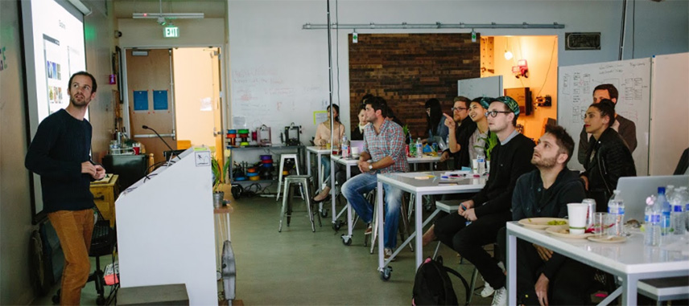
  <figcaption>A lightning talk is a very short presentation lasting only a few minutes.</figcaption>
</figure>

This is similar to the internal interviews, but this time you get every
stakeholder into a single room. Then you Elect five or six of those stakeholders
(marketing, sales, design, accounts, research etc.) to give a talk, each
focusing on the challenge from their perspective for a maximum of 10 minutes.
The topics they must cover in their presentation should be:

* Goals of the business
* Challenges of the project from their point of view (these could be technical,
  research gathering, design creation etc..)
* User research that you have currently

Leave 5 minutes at the end for questions, with an elected person taking notes
throughout. Once you are done you might want to update the challenge to reflect
new learnings. The goal is to collect a list of bullet points that can drive a
feature or flow that helps your achieve your products goal.

### User interviews
<figure>
  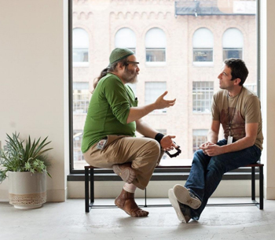
  <figcaption>User interviews are a great way to learn about a person's pain points in any given task.</figcaption>
</figure>

This is perhaps the best way of learning about the user's journey, pain points,
and flow. Arrange at least five user interviews, more if you have access to
them. The sorts of questions you ask them should include:

- How do they complete an existing task? For example, say you want to solve the
  challenge for the financial app above, you could ask them “how do you buy shares
  and stocks at the moment?”
- What do they like about this flow?
- What do they dislike about this flow?
- What similar products does the user currently use?
    *  What do they like?
    *  What do they dislike?
- If they had a magic wand and could change one thing about this process what
  would it be?

The idea of interviewing is to get the user to speak about the challenges they
have. It is not a discussion point for you, which is why you must remain as
quiet as possible. This is even true when a user stops speaking, always wait a
moment as they could be gathering their thoughts. You would be surprised at how
much someone will continue to speak after they have stopped for a few seconds.

Take notes throughout and if possible record the conversation to help you
capture anything you might have missed. The goal is to compare the challenge to
the user insights that you gather. Do they align? Did you learn anything that
helps you update your challenge statement?

### Ethnographic field research

<figure>
  
  <figcaption>Seeing users in their natural environment is a great way to understand how they solve their own challenges.</figcaption>
</figure>

This is where you observe the user in the field, in context while doing
something something like how they do their shopping, how they travel to work,
how they send SMS messages etc.. The reason is in some cases people will tell
you what they think you want to hear. But if you watch users perform actions and
tasks on their own it can be insightful. Basically you are observing without
interfering, noting things which they find easy or difficult and things may have
they have missed. The goal is to immerse yourself in the user's environment to
better empathize with their pain points.

This technique usually involves some work done over a longer period of time and
requires a researcher to lead this part of the project. But it is perhaps the
most insightful as you get to see a group of people that you are studying in
their natural environments.

### Gathering it altogether

Once you have completed the learnings phase of your project you need to take one
last look at your challenge. Are you on the right path? Is there anything you
need to adjust? Write down all of the things you have learnt and group them into
categories. These could become the basis of a feature or a flow, depending on
the problem you are solving. They could also be used to update and revise the
challenge.

Once you have enough feedback and insight it is time to apply that knowledge to
creating a project map.

## Project Map

The problem you are trying to solve is usually made up of different types of
people (or players), each with a stake in the project's flow. Based on your
learnings you need to list out the possible players. It could be a user type or
stakeholder, for example, “a doctor who treats clubfoot”, “a patient who has
clubfoot”, “a care giver who looks after patient”, etc.. Write down each player
on a the left hand side of a sheet of paper or if you have access to one, on a
whiteboard. On the right hand side write each player's goals.

Finally for each player, write down the number of steps required for them to
reach their goal. For example for "a doctor who treats clubfoot” the goal would
be “cure a patient with clubfoot”, so the steps could be “register the patient
in the system”, “start them on medical a plan”, “create a review cycle of their
medical health” and “perform medical procedure”.

<figure>
  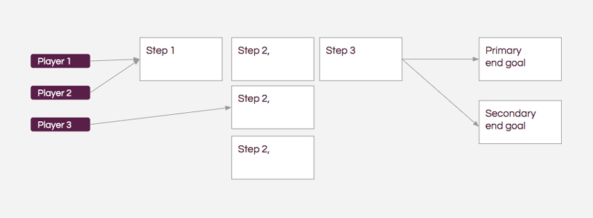
  <figcaption>Project maps plot out the main steps for each user or player in a flow.</figcaption>
</figure>

The result is a project map with the main steps in the process. Think of it as
an overview of the project without too many details. It also lets team members
judge whether the map matches the challenge statement. Later, when you break
down each step, there will be more details. But for now a project map gives you
a high level breakdown of the steps a user will take to complete their end goal.

## Wireframing and storyboarding

### Crazy 8s

For this, I recommend a method called crazy 8s that involves folding a piece of
paper twice over so that you have eight panels. Then in each panel you draw out
an idea based on all that you have learnt so far. Give yourself ten minutes to
come up with ideas to fill all eight panels. If you give yourself more than 20
minutes you may start to procrastinate, go make yourself a coffee, check email,
have a general chat with your team and essentially avoid doing the work. You
want to create a sense of urgency in this step as it forces you to work quickly
and more effectively.

If you are working with a team get everyone to do their own as well. This
process will kick start your brain and get you thinking about the challenge.
Generally the sketch will be an interface design wireframe.

Afterwards, you and everyone on your team presents their ideas to the group.
Everyone must explain each of their eight ideas in detail and why they chose to
go down a specific path. Remind each team member to use the learnings for
justification of their ideas. Once everyone has presented it's time to vote on
the ideas. Each person gets two sticky dots and can vote on any idea. They can
give both votes to a single idea if they really like it.

<!-- <figure>
  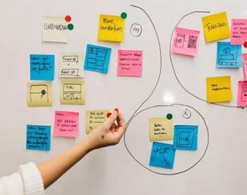
  <figcaption>You can take notes on post-its and vote on concepts or the sketches themselves.</figcaption>
</figure> -->

<figure  class="attempt-left">
  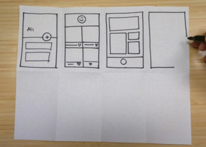
  <figcaption>Crazy 8s are a great way to get all of your ideas out onto page.</figcaption>
</figure>

<figure class="attempt-right">
  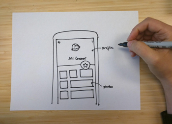
  <figcaption>Now you need to do a detailed design based on what you have learned.</figcaption>
</figure>

### Refine your design

After the voting take the idea with the most votes and sketch out a final idea.
You can borrow from the other ideas that you heard from your colleagues as well.
Give yourself another ten minutes to complete this task. Once you are done,
again present the ideas to your team and vote like before.

### Storyboard the idea

<figure>
  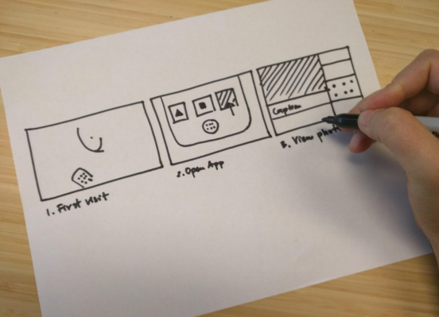
  <figcaption>The storyboard involves combining your sketches and ideas into a comprehensive flow.</figcaption>
</figure>

With your design in hand, it's time to storyboard it's engagement with the user.
By this point you should have already thought about the different steps a user
takes. It's quite common to incorporate one of your colleagues' designs into the
flow as well. You want to have a clear step-by-step process with some points
where the user might diverge. Refer back to the project map to validate your
design against the goal.

## Creating a prototype

Creating a prototype is not about molding the perfect piece of code but to make
something that is believable when used by someone. Tools used to create a
prototype vary from person to person. Some like Keynote or Powerpoint as it
forces you to think of the flow and not design details. You might want to invest
time into learning tools like Balsamiq, Marvel or Framer which can give you more
behavioral controls. Whatever tool you use make sure it is one that makes you
focus on the flow and looks real. You need to test the prototype on real people
so it needs to be as believable as possible but at the same time it shouldn’t
take weeks of work to create.

<figure>
  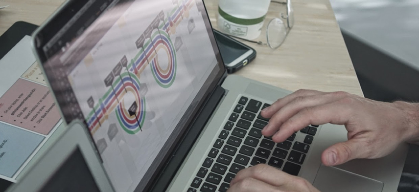
  <figcaption>Prototypes need to be real enough to be believable.</figcaption>
</figure>

Creating a prototype is a balance between time and realness, so be careful not
to sway to much into either extreme. Either way, you could end up wasting time.

## Usability-test your designs

It's great if you have a testing lab. If you don't, creating one isn't difficult
as long as you're mindful of creating a comfortable environment for your users
that isn't distracting. Testing usually involves the user and two people from
your team, one taking notes and the other asking questions. A good set up is to
use an app like Hangouts and record their actions, this is also handy if you
want the rest of the team to observe from a different room. This can be quite
scary for us as app makers to do as we are seeing our designs out in the wild.
It can be both a refreshing and sobering experience.

<figure>
  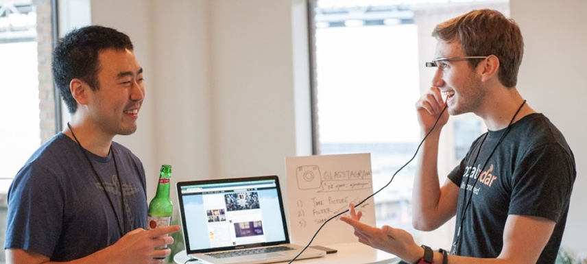
  <figcaption>The storyboard involves putting all of your sketches and ideas together into a comprehensive flow.</figcaption>
</figure>

### Questions to ask

When testing your design, ask the user to perform tasks in your app and get them
to speak aloud and verbalize what they're doing and why. This is an odd thing to
do but it helps you hear what they're thinking. Try not to interrupt or tell
them what they should do when they get stuck. Simply ask them why they took a
particular flow after they have completed (or NOT completed).

What you need to find out is:

- What do they like about the prototype?
- What do they dislike about the prototype?
- What are the pain points?
      * Why did a flow work
      * Why did a flow not work
- What would they like to improve?
- Does the overall design/flow meet their needs?

## Revisit designs and another round of testing

You have a working prototype with feedback. Now it’s time to revise your
designs, and analyze what worked and what didn’t. Don't be afraid to create a
completely new wireframe storyboard and make a new prototype. Starting over can
create a better flow than trying to move things on your earlier prototype. Try
not to be too precious of it because it is just a prototype.

Once you are happy with your designs you can test it again and refine it some
more. In cases where the prototype didn’t hit the mark at all, well you might
think the project has failed. In actual fact it hasn’t. You've likely spent less
development time than if you had actually built the design and you know more
bout what user's actually like. With design sprints we have a philosophy where
you either win or you learn, so don’t beat yourself up too much if the idea
didn't work as planned.

## Make it!

You have tested your ideas. The user likes them. The stakeholders are invested
because they've been involved since the beginning. Now it's time to make the
thing. By now you should have a clear idea of what needs to be made and what the
priorities of the experience are. At each milestone of the project you may want
to introduce usability testing to help validate your work and keeping you on
track.

I can’t stress how important it is to find out as much as possible before you
commit to a lot of work, time and energy on something that might not be the
right solution.

This article should now give you a basic grounding in UX and its importance. UX
isn’t something that should be looked upon as a role for a designer or
researcher. It is actually the responsibility of everyone involved in a project
so I would recommend involvement at every opportunity.
