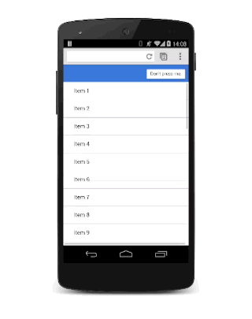

project_path: /web/fundamentals/_project.yaml
book_path: /web/fundamentals/_book.yaml
description: Learn how to animate modal views in your apps.

{# wf_updated_on: 2016-08-24 #}
{# wf_published_on: 2014-08-08 #}

# Animating Modal Views {: .page-title }



  <figure>
    
    <figcaption>
      <a href="https://googlesamples.github.io/web-fundamentals/fundamentals/design-and-ux/animations/modal-view-animation.html" target="_blank" class="external">Try it</a>
    </figcaption>
  </figure>

Modal views are for important messages, and for which you have very good reasons to block the user interface. Use them carefully, because they're disruptive and can easily ruin the user’s experience if overused. But, in some circumstances, they’re the right views to use, and adding some animation will bring them to life.

### TL;DR {: .hide-from-toc }
* Use modal views sparingly; users get frustrated if you interrupt their experience unnecessarily.
* Adding scale to the animation gives a nice "drop on" effect.
* Get rid of the modal view quickly when the user dismisses it. However, bring the modal view onto the screen a little more slowly so that it doesn't surprise the user.

The modal overlay should be aligned to the viewport, so set its `position` to `fixed`:

    .modal {
      position: fixed;
      top: 0;
      left: 0;
      width: 100%;
      height: 100%;
    
      pointer-events: none;
      opacity: 0;
    
      will-change: transform, opacity;
    }
    

It has an initial `opacity` of 0, so it's hidden from view, but then it also needs `pointer-events` set to `none` so that clicks and touches pass through. Without that, it blocks all interactions, rendering the whole page unresponsive. Finally, because it animates its `opacity` and `transform`, those need to be marked as changing with `will-change` (see also [Using the will-change property](animations-and-performance#using-the-will-change-property)).

When the view is visible, it needs to accept interactions and have an `opacity` of 1:

    .modal.visible {
      pointer-events: auto;
      opacity: 1;
    }
    

Now whenever the modal view is required, you can use JavaScript to toggle the "visible" class:

    modal.classList.add('visible');
    

At this point, the modal view appears without any animation, so you can now add that in
(see also [Custom Easing](custom-easing)):

    .modal {
      -webkit-transform: scale(1.15);
      transform: scale(1.15);
    
      -webkit-transition:
        -webkit-transform 0.1s cubic-bezier(0.465, 0.183, 0.153, 0.946),
        opacity 0.1s cubic-bezier(0.465, 0.183, 0.153, 0.946);
    
      transition:
        transform 0.1s cubic-bezier(0.465, 0.183, 0.153, 0.946),
        opacity 0.1s cubic-bezier(0.465, 0.183, 0.153, 0.946);
    
    }
    

Adding `scale` to the transform makes the view appear to drop onto the screen slightly, which is a nice effect. The default transition applies to both transform and opacity properties with a custom curve and a duration of 0.1 seconds.

The duration is pretty short, though, but it's ideal for when the user dismisses the view and wants to get back to your app. The downside is that it’s probably too aggressive for when the modal view appears. To fix this, override the transition values for the `visible` class:

    .modal.visible {
    
      -webkit-transform: scale(1);
      transform: scale(1);
    
      -webkit-transition:
        -webkit-transform 0.3s cubic-bezier(0.465, 0.183, 0.153, 0.946),
        opacity 0.3s cubic-bezier(0.465, 0.183, 0.153, 0.946);
    
      transition:
        transform 0.3s cubic-bezier(0.465, 0.183, 0.153, 0.946),
        opacity 0.3s cubic-bezier(0.465, 0.183, 0.153, 0.946);
    
    }
    

Now the modal view takes 0.3 seconds to come onto the screen, which is a bit less aggressive, but it is dismissed quickly, which the user will appreciate.

