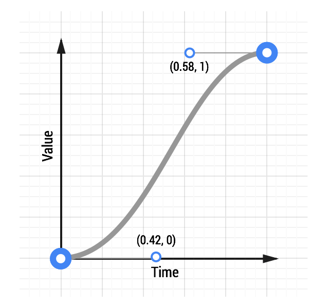
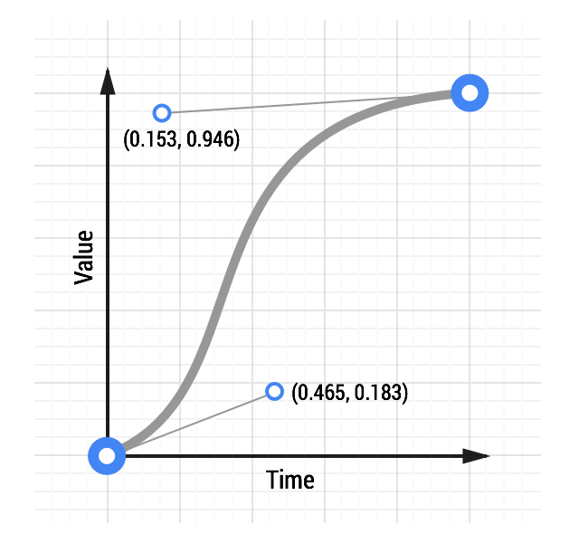

project_path: /web/fundamentals/_project.yaml
book_path: /web/fundamentals/_book.yaml
description: Go offroad and create totally custom animations for your projects.

{# wf_updated_on: 2016-08-23 #}
{# wf_published_on: 2014-08-08 #}

# Custom Easing {: .page-title }




Sometimes you won't want to use the easing keywords that are included with CSS, or you will be using Web Animations or a JavaScript framework. In these cases, you can typically define your own curves (or equations), and this provides a lot of control over the feel of your project's animations.

### TL;DR {: .hide-from-toc }
* Custom easing allows you to give more personality to your projects.
* You can create cubic Bézier curves that resemble the default animation curves (ease-out, ease-in, etc.), but with emphasis in different places.
* Use JavaScript when you need more control over the animation timing and behavior, for example, elastic or bounce animations.

If you're animating with CSS, you'll find that you can define cubic Bézier curves to define the timing. In fact, the keywords `ease`, `ease-in`, `ease-out`, and `linear` map to predefined Bézier curves, which are detailed in the [CSS transitions specification](http://www.w3.org/TR/css3-transitions/) and the [Web Animations specification](https://w3c.github.io/web-animations/#scaling-using-a-cubic-bezier-curve).

These Bézier curves take four values, or two pairs of numbers, with each pair describing the X and Y coordinates of a cubic Bézier curve’s control points. The starting point of the Bézier curve has a coordinate of (0, 0) and the end coordinate is (1, 1); you get to set the X and Y values of the two control points. The X values for the two control points must be between 0 and 1, and each control point’s Y value can exceed the [0, 1] limit, although the spec isn’t clear by how much.

Changing the X and Y value of each control point gives you a vastly different curve, and therefore a vastly different feel to your animation. For example, if the first control point is in the lower right area, the animation will be slow to start. If it’s in the top left area, it’s going to be fast to start. Conversely, if the second control point is in the bottom right area of the grid, it’s going to be fast at the end; if it’s in the top left, it will be slow to end.

For comparison, here are two curves: a typical ease-in-out curve and a custom curve:

  <figure>
    
  </figure>

  <figure>
    
  </figure>

[See an animation with custom easing](https://googlesamples.github.io/web-fundamentals/fundamentals/design-and-ux/animations/box-move-custom-curve.html){: target="_blank" .external }

The CSS for the custom curve is:

    transition: transform 500ms cubic-bezier(0.465, 0.183, 0.153, 0.946);
    

The first two numbers are the X and Y coordinates of the first control point, and the second two numbers are the X and Y coordinates of the second control point.

Making a custom curve is a lot of fun, and it gives you significant control over the feel of the animation. For example, given the above curve, you can see that the curve resembles a classic ease-in-out curve, but with a shortened ease-in, or "getting started," portion, and an elongated slowdown at the end.

Experiment with this [animation curve tool](https://googlesamples.github.io/web-fundamentals/fundamentals/design-and-ux/animations/curve-playground.html){: target="_blank" .external } and see how the curve affects the feel of an animation.

## Use JavaScript frameworks for more control

Sometimes you need even more control than a cubic Bézier curve can provide. If you wanted an elastic bounce feel, you might consider using a JavaScript framework, because this is a difficult effect to achieve with either CSS or Web Animations.

### TweenMax

One powerful framework is [GreenSock’s TweenMax](https://github.com/greensock/GreenSock-JS/tree/master/src/minified) (or TweenLite if you want to keep things really lightweight), because you get a lot of control from it in a small JavaScript library, and it’s a very mature codebase.

[See an elastic ease animation](https://googlesamples.github.io/web-fundamentals/fundamentals/design-and-ux/animations/box-move-elastic.html){: target="_blank" .external }

To use TweenMax, include this script in your page:

    
    

After the script is in place, you can call TweenMax against your element and tell it which properties you’d like, along with any easing you’d like. There are many easing options that you can use; the code below uses an elastic ease-out:

    var box = document.getElementById('my-box');
    var animationDurationInSeconds = 1.5;
    
    TweenMax.to(box, animationDurationInSeconds, {
      x: '100%',
      ease: 'Elastic.easeOut'
    });
    

The [TweenMax documentation](https://greensock.com/docs/#/HTML5/GSAP/TweenMax/) highlights all the options you have here, so it's well worth a read.

