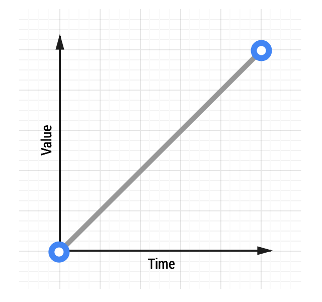
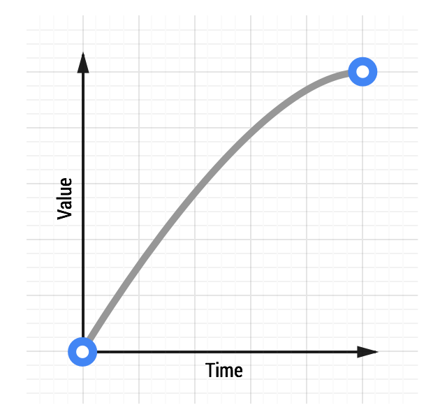
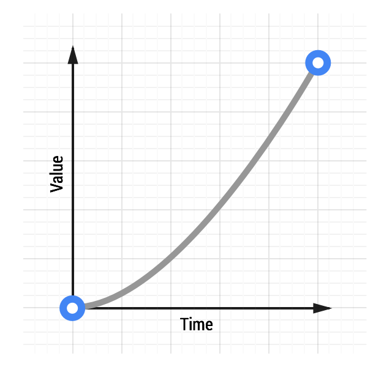
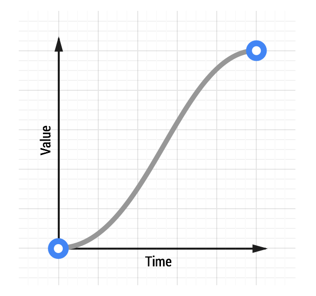

project_path: /web/fundamentals/_project.yaml
book_path: /web/fundamentals/_book.yaml
description: Learn how to soften and give weighting to your animations.

{# wf_updated_on: 2016-08-23 #}
{# wf_published_on: 2014-08-08 #}

# The Basics of Easing {: .page-title }



Nothing in nature moves linearly from one point to another. In reality, things tend to accelerate or decelerate as they move. Our brains are wired to expect this kind of motion, so when animating you should use this to your advantage. Natural motion makes your users feel more comfortable with your apps, which in turn leads to a better overall experience.

### TL;DR {: .hide-from-toc }
* Easing makes your animations feel more natural.
* Choose ease-out animations for UI elements.
* Avoid ease-in or ease-in-out animations unless you can keep them short; they tend to feel sluggish to end users.

In classic animation, the term for motion that starts slowly and accelerates is "slow in," and for motion that starts quickly and decelerates is "slow out." The terminology most commonly used on the web for these are “ease in” and “ease out,” respectively. Sometimes the two are combined, which is called "ease in out." Easing, then, is really the process of making the animation less severe or pronounced.

## Easing keywords

CSS transitions and animations both let you [choose the kind of easing you want to use for your animations](choosing-the-right-easing). You can use keywords that affect the easing (or `timing`, as it's sometimes called) of the animation in question. You can also [go completely custom with your easing](custom-easing), which gives you a lot more freedom to express your app's personality.

Here are some of the keywords that you can use in CSS:

* `linear`
* `ease-in`
* `ease-out`
* `ease-in-out`

Source: [CSS Transitions, W3C](http://www.w3.org/TR/css3-transitions/#transition-timing-function-property)

You can also use a `steps` keyword, which allows you to create transitions that have discrete steps, but the keywords listed above are the most useful for creating animations that feel natural.

## Linear animations

  <figure>
    
  </figure>

Animations without any kind of easing are referred to as **linear**. A graph of a linear transition looks like this:

As time moves along, the value increases in equal amounts. With linear motion, things tend to feel robotic and unnatural, and this is something that users find jarring. Generally speaking, you should avoid linear motion.

Whether you’re coding your animations using CSS or JavaScript, you’ll find that there is always an option for linear motion. 

[See a linear animation](https://googlesamples.github.io/web-fundamentals/fundamentals/design-and-ux/animations/box-move-linear.html){: target="_blank" .external }

To achieve the effect above with CSS, the code would look something like this:

    transition: transform 500ms linear;
    

## Ease-out animations

  <figure>
    
  </figure>

Easing out causes the animation to start more quickly than linear ones, and it also has deceleration at the end.

Easing out is typically the best for user interface work, because the fast start gives your animations a feeling of responsiveness, while still allowing for a natural slowdown at the end.

[See an ease-out animation](https://googlesamples.github.io/web-fundamentals/fundamentals/design-and-ux/animations/box-move-ease-out.html){: target="_blank" .external }

There are many ways to achieve an ease out effect, but the simplest is the `ease-out` keyword in CSS:

    transition: transform 500ms ease-out;
    

## Ease-in animations

  <figure>
    
  </figure>

Ease-in animations start slowly and end fast, which is the opposite of ease-out animations.

This kind of animation is like a heavy stone falling, where it starts slowly and hits the ground quickly with a deadening thump.

From an interaction point of view, however, ease-ins can feel a little unusual because of their abrupt end; things that move in the real world tend to decelerate rather than simply stopping suddenly. Ease-ins also have the detrimental effect of feeling sluggish when starting, which negatively impacts the perception of responsiveness in your site or app.

[See an ease-in animation](https://googlesamples.github.io/web-fundamentals/fundamentals/design-and-ux/animations/box-move-ease-in.html){: target="_blank" .external }

To use an ease-in animation, similarly to ease-out and linear animations, you can use its keyword:

    transition: transform 500ms ease-in;
    

## Ease-in-out animations

  <figure>
    
  </figure>

Easing both in and out is akin to a car accelerating and decelerating and, used judiciously, can provide a more dramatic effect than just easing out.

Do not use an overly long animation duration, because of the sluggishness of an ease-in start to the animation. Something in the range of 300-500ms is typically suitable, but the exact number depends heavily on the feel of your project. That said, because of the slow start, fast middle, and slow end, there is increased contrast in the animation, which can be quite satisfying for users.

[See an ease-in-out animation](https://googlesamples.github.io/web-fundamentals/fundamentals/design-and-ux/animations/box-move-ease-in-out.html){: target="_blank" .external }

To get an ease-in-out animation, you can use the `ease-in-out` CSS keyword:

    transition: transform 500ms ease-in-out;
    

