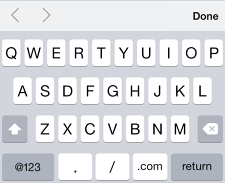
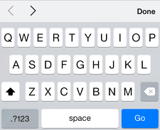
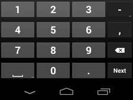
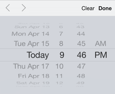
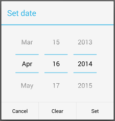
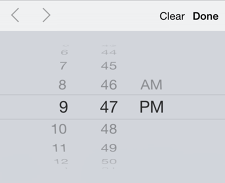
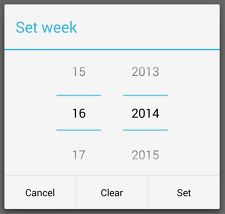
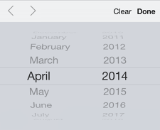

project_path: /web/fundamentals/_project.yaml
book_path: /web/fundamentals/_book.yaml
description: Forms are hard to fill out on mobile. The best forms are the ones with the fewest inputs.

{# wf_updated_on: 2017-07-24 #}
{# wf_published_on: 2014-04-30 #}

# Create Amazing Forms {: .page-title }



  <iframe class="devsite-embedded-youtube-video" data-video-id="iYYHRwLqrKM"
          data-autohide="1" data-showinfo="0" frameborder="0" allowfullscreen>
  </iframe>

Forms are hard to fill out on mobile. The best forms are the ones with the fewest inputs. Good forms provide semantic input types. Keys should change to match the user's input type; users pick a date in a calendar. Keep your user informed. Validation tools should tell the user what they need to do before submitting the form.

## Design efficient forms

Design efficient forms by avoiding repeated actions, asking for only the necessary information and guide users by showing them how far along they are in multi-part forms.

### TL;DR {: .hide-from-toc }
- Use existing data to pre-populate fields and be sure to enable auto-fill.
- Use clearly-labeled progress bars to help users get through multi-part forms.
- Provide visual calendar so users don’t have to leave your site and jump to the calendar app on their smartphones.

### Minimize repeated actions and fields

<figure class="attempt-right">
  
  <figcaption>
    On the Progressive.com website, users are asked first for their ZIP code, which is then pre-populated into the next part of the form.
  </figcaption>
</figure>

Make sure your forms have no repeated actions, only as many fields as 
necessary, and take advantage of 
[autofill](/web/fundamentals/design-and-ux/input/forms/#use-metadata-to-enable-auto-complete),
so that users can easily complete forms with pre-populated data.

Look for opportunities to pre-fill information you already know, or may 
anticipated to save the user from having to provide it.  For example, 
pre-populate the shipping address with the last shipping address supplied by 
the user.

### Show users how far along they are

<figure class="attempt-right">
  
  <figcaption>
    Use clearly-labeled progress bars to help users get through multi-part forms.
  </figcaption>
</figure>

Progress bars and menus should accurately convey overall progress through 
multi-step forms and processes.

If you place a disproportionately complex form in an earlier step, users 
are more likely to abandon your site before they go through the entire process. 

### Provide visual calendars when selecting dates

<figure class="attempt-right">
  
  <figcaption>
    Hotel booking website with easy to use calendar widget for picking dates.
  </figcaption>
</figure>

Users often need more context when scheduling appointments and travel dates, 
to make things easier and prevent them from leaving your site to check their 
calendar app, provide a visual calendar with clear labeling for selecting 
start and end dates. 

## Choose the best input type

Streamline information entry by using the right input type. Users appreciate
websites that automatically present number pads for entering phone numbers, or
automatically advance fields as they entered them. Look for opportunities to
eliminate wasted taps in your forms.

### TL;DR {: .hide-from-toc }
- Choose the most appropriate input type for your data to simplify input.
- Offer suggestions as the user types with the <code>datalist</code> element.

### HTML5 input types

HTML5 introduced a number of new input types. These new input types give hints
to the browser about what type of keyboard layout to display for on-screen
keyboards.  Users are more easily able to enter the required information without
having to change their keyboard and only see the appropriate keys for that input
type.

<table class="responsive">
  <thead>
    <tr>
      <th colspan="2">Input <code>type</code></th>
    </tr>
  </thead>
  <tbody>
    <tr>
      <td data-th="Input type">
        <code>url</code>  For entering a URL. It must start with a valid URI scheme,
        for example <code>http://</code>, <code>ftp://</code> or <code>mailto:</code>.
      </td>
      <td data-th="Typical keyboard">
        
      </td>
    </tr>
    <tr>
      <td data-th="Input type">
        <code>tel</code> For entering phone numbers. It does <b>not</b>
        enforce a particular syntax for validation, so if you want to ensure
        a particular format, you can use pattern.
      </td>
      <td data-th="Typical keyboard">
        
      </td>
    </tr>
    <tr>
      <td data-th="Input type">
        <code>email</code> For entering email addresses, and hints that
        the @ should be shown on the keyboard by default. You can add the
        multiple attribute if more than one email address will be provided.
      </td>
      <td data-th="Typical keyboard">
        
      </td>
    </tr>
    <tr>
      <td data-th="Input type">
        <code>search</code> A text input field styled in a way that is
        consistent with the platform's search field.
      </td>
      <td data-th="Typical keyboard">
        
      </td>
    </tr>
    <tr>
      <td data-th="Input type">
        <code>number</code> For numeric input, can be any rational
        integer or float value.
      </td>
      <td data-th="Typical keyboard">
        
      </td>
    </tr>
    <tr>
      <td data-th="Input type">
        <code>range</code> For number input, but unlike the number input
        type, the value is less important. It is displayed to the user as a
        slider control.
      </td>
      <td data-th="Typical keyboard">
        
      </td>
    </tr>
    <tr>
      <td data-th="Input type">
        <code>datetime-local</code> For entering a date and time value
        where the time zone provided is the local time zone.
      </td>
      <td data-th="Typical keyboard">
        
      </td>
    </tr>
    <tr>
      <td data-th="Input type">
        <code>date</code> For entering a date (only) with no time zone
        provided.
      </td>
      <td data-th="Typical keyboard">
        
      </td>
    </tr>
    <tr>
      <td data-th="Input type">
        <code>time</code> For entering a time (only) with no time zone
        provided.
      </td>
      <td data-th="Typical keyboard">
        
      </td>
    </tr>
    <tr>
      <td data-th="Input type">
        <code>week</code> For entering a week (only) with no time zone
        provided.
      </td>
      <td data-th="Typical keyboard">
        
      </td>
    </tr>
    <tr>
      <td data-th="Input type">
        <code>month</code> For entering a month (only) with no time zone
        provided.
      </td>
      <td data-th="Typical keyboard">
        
      </td>
    </tr>
    <tr>
      <td data-th="Input type">
        <code>color</code> For picking a color.
      </td>
      <td data-th="Typical keyboard">
        
      </td>
    </tr>
  </tbody>
</table>

Caution: Remember to keep localization in mind when choosing an input type,
some locales use a dot (.) as a separator instead of a comma (,)

### Offer suggestions during input with datalist

The `datalist` element isn't an input type, but a list of suggested input values
to associated with a form field. It lets the browser suggest autocomplete
options as the user types. Unlike select elements where users must scan long
lists to find the value they're looking for, and limiting them only to those
lists, `datalist` element provides hints as the user types.

<pre class="prettyprint">

</pre>

[Try it](https://googlesamples.github.io/web-fundamentals/fundamentals/design-and-ux/input/forms/order.html){: target="_blank" .external }

Note: The <code>datalist</code> values are provided as suggestions, and users are not restricted to the suggestions provided.

## Label and name inputs properly

Forms are hard to fill out on mobile. The best forms are the ones with the fewest inputs. Good forms provide semantic input types. Keys should change to match the user's input type; users pick a date in a calendar. Keep your user informed. Validation tools should tell the user what they need to do before submitting the form.

### TL;DR {: .hide-from-toc }
- Always use <code>label</code>s on form inputs, and ensure they're visible when the field is in focus.
- Use <code>placeholder</code>s to provide guidance about what you expect.
- To help the browser auto-complete the form, use established <code>name</code>'s for elements and include the <code>autocomplete</code> attribute.

### The importance of labels

The `label` element provides direction to the user, telling them what
information is needed in a form element.  Each `label` is associated with an
input element by placing it inside the `label` element, or by using the "`for`"
attribute.  Applying labels to form elements also helps to improve the touch
target size: the user can touch either the label or the input in order to place
focus on the input element.

<pre class="prettyprint">

</pre>

[Try it](https://googlesamples.github.io/web-fundamentals/fundamentals/design-and-ux/input/forms/order.html){: target="_blank" .external }

### Label sizing and placement

Labels and inputs should be large enough to be easy to press.  In portrait
viewports, field labels should be above input elements, and beside them in
landscape.  Ensure field labels and the corresponding input boxes are visible at
the same time.  Be careful with custom scroll handlers that may scroll input
elements to the top of the page hiding the label, or labels placed below input
elements may be covered by the virtual keyboard.

### Use placeholders

The placeholder attribute provides a hint to the user about what's expected in
the input, typically by displaying the value as light text until the the user
starts typing in the element.

<input type="text" placeholder="MM-YYYY">

    <input type="text" placeholder="MM-YYYY" ...>

Caution: Placeholders disappear as soon as the user starts typing in an element, thus they are not a replacement for labels.  They should be used as an aid to help guide users on the required format and content.

### Use metadata to enable auto-complete

Users appreciate when websites save them time by automatically filling common
fields like names, email addresses and other frequently used fields, plus it
helps to reduce potential input errors -- especially on virtual keyboards and
small devices.

Browsers use many heuristics to determine which fields they can
[auto-populate](https://support.google.com/chrome/answer/142893)
[based on previously specified data by the user](https://support.google.com/chrome/answer/142893),
and you can give hints to the browser by providing both the `name` attribute 
and the `autocomplete` attribute on each input element.

Note: Chrome requires `input` elements to be wrapped in a `<form>` tag to enable
auto-complete. If they're not wrapped in a `form` tag, Chrome will offer
suggestions, but will **not** complete the form.

For example, to hint to the browser that it should auto-complete the form with
the users name, email address and phone number, you should use:

<pre class="prettyprint">

</pre>

[Try it](https://googlesamples.github.io/web-fundamentals/fundamentals/design-and-ux/input/forms/order.html){: target="_blank" .external }

### Recommended input `name` and `autocomplete` attribute values

`autocomplete` attribute values are part of the current [WHATWG HTML Standard](https://html.spec.whatwg.org/multipage/forms.html#autofill). The most commonly used `autocomplete` attributes are shown below.

The `autocomplete` attributes can be accompanied with a section name, such as **`shipping `**`given-name` or **`billing `**`street-address`. The browser will auto-complete different sections separately, and not as a continuous form.

<table>
  <thead>
    <tr>
      <th data-th="Content type">Content type</th>
      <th data-th="name attribute"><code>name</code> attribute</th>
      <th data-th="autocomplete attribute"><code>autocomplete</code> attribute</th>
    </tr>
  </thead>
  <tbody>
    <tr>
      <td data-th="Content type">Name</td>
      <td data-th="name attribute">
        <code>name</code>
        <code>fname</code>
        <code>mname</code>
        <code>lname</code>
      </td>
      <td data-th="autocomplete attribute">
        <ul>
          <li><code>name</code> (full name)</li>
          <li><code>given-name</code> (first name)</li>
          <li><code>additional-name</code> (middle name)</li>
          <li><code>family-name</code> (last name)</li>
        </ul>
      </td>
    </tr>
    <tr>
      <td data-th="Content type">Email</td>
      <td data-th="name attribute"><code>email</code></td>
      <td data-th="autocomplete attribute"><code>email</code></td>
    </tr>
    <tr>
      <td data-th="Content type">Address</td>
      <td data-th="name attribute">
        <code>address</code>
        <code>city</code>
        <code>region</code>
        <code>province</code>
        <code>state</code>
        <code>zip</code>
        <code>zip2</code>
        <code>postal</code>
        <code>country</code>
      </td>
      <td data-th="autocomplete attribute">
        <ul>
          <li>For one address input:
            <ul>
              <li><code>street-address</code></li>
            </ul>
          </li>
          <li>For two address inputs:
            <ul>
              <li><code>address-line1</code></li>
              <li><code>address-line2</code></li>
            </ul>
          </li>
          <li><code>address-level1</code> (state or province)</li>
          <li><code>address-level2</code> (city)</li>
          <li><code>postal-code</code> (zip code)</li>
          <li><code>country</code></li>
        </ul>
      </td>
    </tr>
    <tr>
      <td data-th="Content type">Phone</td>
      <td data-th="name attribute">
        <code>phone</code>
        <code>mobile</code>
        <code>country-code</code>
        <code>area-code</code>
        <code>exchange</code>
        <code>suffix</code>
        <code>ext</code>
      </td>
      <td data-th="autocomplete attribute"><code>tel</code></td>
    </tr>
    <tr>
      <td data-th="Content type">Credit Card</td>
      <td data-th="name attribute">
        <code>ccname</code>
        <code>cardnumber</code>
        <code>cvc</code>
        <code>ccmonth</code>
        <code>ccyear</code>
        <code>exp-date</code>
        <code>card-type</code>
      </td>
      <td data-th="autocomplete attribute">
        <ul>
          <li><code>cc-name</code></li>
          <li><code>cc-number</code></li>
          <li><code>cc-csc</code></li>
          <li><code>cc-exp-month</code></li>
          <li><code>cc-exp-year</code></li>
          <li><code>cc-exp</code></li>
          <li><code>cc-type</code></li>
        </ul>
      </td>
    </tr>
    <tr>
      <td data-th="Content type">Usernames</td>
      <td data-th="name attribute">
        <code>username</code>
      </td>
      <td data-th="autocomplete attribute">
        <ul>
          <li><code>username</code></li>
        </ul>
      </td>
    </tr>
    <tr>
      <td data-th="Content type">Passwords</td>
      <td data-th="name attribute">
        <code>password</code>
      </td>
      <td data-th="autocomplete attribute">
        <ul>
          <li><code>current-password</code> (for sign-in forms)</li>
          <li><code>new-password</code> (for sign-up and password-change forms)</li>
        </ul>
      </td>
    </tr>
  </tbody>
</table>

Note: Use either only <code>street-address</code> or both <code>address-line1</code> and <code>address-line2</code>. <code>address-level1</code> and <code>address-level2</code> are only necessary if they're required for your address format.

### The `autofocus` attribute

On some forms, for example the Google home page where the only thing you want
the user to do is fill out a particular field, you can add the `autofocus`
attribute.  When set, desktop browsers immediately move the focus to the input
field, making it easy for users to quickly begin using the form.  Mobile
browsers ignore the `autofocus` attribute, to prevent the keyboard from randomly
appearing.

Be careful using the autofocus attribute because it will steal keyboard focus
and potentially preventing the backspace character from being used for
navigation.

    <input type="text" autofocus ...>
    

## Provide real-time validation

Real-time data validation doesn't just help to keep your data clean, but it also helps improve the user experience.  Modern browsers have several built-in tools to help provide real-time data validation and may prevent the user from submitting an invalid form.  Visual cues should be used to indicate whether a form has been completed properly.

### TL;DR {: .hide-from-toc }
- Leverage the browser's built-in validation attributes like <code>pattern</code>, <code>required</code>, <code>min</code>, <code>max</code>, etc.
- Use JavaScript and the Constraints Validation API for more complex validation requirements.
- Show validation errors in real time, and if the user tries to submit an invalid form, show all fields they need to fix.

### Use these attributes to validate input

#### The `pattern` attribute

The `pattern` attribute specifies a [regular expression](https://en.wikipedia.org/wiki/Regular_expression)
used to validate an input field. For example, to validate a US Zip code
(5 digits, sometimes followed by a dash and an additional 4 digits), we would
set the `pattern` like this:

    <input type="text" pattern="^\d{5,6}(?:[-\s]\d{4})?$" ...>
    

##### Common regular expression patterns

<table class="responsive">
  <thead>
    <tr>
      <th colspan="2">Regular expression</th>
    </tr>
  </thead>
  <tbody>
    <tr>
      <td data-th="Description">Postal address</td>
      <td data-th="Regular expression"><code>[a-zA-Z\d\s\-\,\#\.\+]+</code></td>
    </tr>
    <tr>
      <td data-th="Description">Zip Code (US)</td>
      <td data-th="Regular expression"><code>^\d{5,6}(?:[-\s]\d{4})?$</code></td>
    </tr>
    <tr>
      <td data-th="Description">IP Address (IPv4)</td>
      <td data-th="Regular expression"><code>^(?:(?:25[0-5]|2[0-4][0-9]|[01]?[0-9][0-9]?)\.){3}(?:25[0-5]|2[0-4][0-9]|[01]?[0-9][0-9]?)$</code></td>
    </tr>
    <tr>
      <td data-th="Description">IP Address (IPv6)</td>
      <td data-th="Regular expression"><code>^(([0-9a-fA-F]{1,4}:){7,7}[0-9a-fA-F]{1,4}|([0-9a-fA-F]{1,4}:){1,7}:|([0-9a-fA-F]{1,4}:){1,6}:[0-9a-fA-F]{1,4}|([0-9a-fA-F]{1,4}:){1,5}(:[0-9a-fA-F]{1,4}){1,2}|([0-9a-fA-F]{1,4}:){1,4}(:[0-9a-fA-F]{1,4}){1,3}|([0-9a-fA-F]{1,4}:){1,3}(:[0-9a-fA-F]{1,4}){1,4}|([0-9a-fA-F]{1,4}:){1,2}(:[0-9a-fA-F]{1,4}){1,5}|[0-9a-fA-F]{1,4}:((:[0-9a-fA-F]{1,4}){1,6})|:((:[0-9a-fA-F]{1,4}){1,7}|:)|fe80:(:[0-9a-fA-F]{0,4}){0,4}%[0-9a-zA-Z]{1,}|::(ffff(:0{1,4}){0,1}:){0,1}((25[0-5]|(2[0-4]|1{0,1}[0-9]){0,1}[0-9]).){3,3}(25[0-5]|(2[0-4]|1{0,1}[0-9]){0,1}[0-9])|([0-9a-fA-F]{1,4}:){1,4}:((25[0-5]|(2[0-4]|1{0,1}[0-9]){0,1}[0-9]).){3,3}(25[0-5]|(2[0-4]|1{0,1}[0-9]){0,1}[0-9]))$</code></td>
    </tr>
    <tr>
      <td data-th="Description">IP Address (both)</td>
      <td data-th="Regular expression"><code>^(?:(?:25[0-5]|2[0-4][0-9]|[01]?[0-9][0-9]?)\.){3}(?:25[0-5]|2[0-4][0-9]|[01]?[0-9][0-9]?)|(([0-9a-fA-F]{1,4}:){7,7}[0-9a-fA-F]{1,4}|([0-9a-fA-F]{1,4}:){1,7}:|([0-9a-fA-F]{1,4}:){1,6}:[0-9a-fA-F]{1,4}|([0-9a-fA-F]{1,4}:){1,5}(:[0-9a-fA-F]{1,4}){1,2}|([0-9a-fA-F]{1,4}:){1,4}(:[0-9a-fA-F]{1,4}){1,3}|([0-9a-fA-F]{1,4}:){1,3}(:[0-9a-fA-F]{1,4}){1,4}|([0-9a-fA-F]{1,4}:){1,2}(:[0-9a-fA-F]{1,4}){1,5}|[0-9a-fA-F]{1,4}:((:[0-9a-fA-F]{1,4}){1,6})|:((:[0-9a-fA-F]{1,4}){1,7}|:)|fe80:(:[0-9a-fA-F]{0,4}){0,4}%[0-9a-zA-Z]{1,}|::(ffff(:0{1,4}){0,1}:){0,1}((25[0-5]|(2[0-4]|1{0,1}[0-9]){0,1}[0-9]).){3,3}(25[0-5]|(2[0-4]|1{0,1}[0-9]){0,1}[0-9])|([0-9a-fA-F]{1,4}:){1,4}:((25[0-5]|(2[0-4]|1{0,1}[0-9]){0,1}[0-9]).){3,3}(25[0-5]|(2[0-4]|1{0,1}[0-9]){0,1}[0-9]))$</code></td>
    </tr>
    <tr>
      <td data-th="Description">Credit Card Number</td>
      <td data-th="Regular expression"><code>^(?:4[0-9]{12}(?:[0-9]{3})?|5[1-5][0-9]{14}|3[47][0-9]{13}|3(?:0[0-5]|[68][0-9])[0-9]{11}|6(?:011|5[0-9]{2})[0-9]{12}|(?:2131|1800|35\d{3})\d{11})$</code></td>
    </tr>
    <tr>
      <td data-th="Description">Social Security Number</td>
      <td data-th="Regular expression"><code>^\d{3}-\d{2}-\d{4}$</code></td>
    </tr>
    <tr>
      <td data-th="Description">North American Phone Number</td>
      <td data-th="Regular expression"><code>^(?:(?:\+?1\s*(?:[.-]\s*)?)?(?:\(\s*([2-9]1[02-9]|[2-9][02-8]1|[2-9][02-8][02-9])\s*\)|([2-9]1[02-9]|[2-9][02-8]1|[2-9][02-8][02-9]))\s*(?:[.-]\s*)?)?([2-9]1[02-9]|[2-9][02-9]1|[2-9][02-9]{2})\s*(?:[.-]\s*)?([0-9]{4})(?:\s*(?:#|x\.?|ext\.?|extension)\s*(\d+))?$</code></td>
    </tr>
  </tbody>
</table>

#### The `required` attribute

If the `required` attribute is present, then the field must contain a value before
the form can be submitted. For example, to make the zip code required, we'd
simply add the required attribute:

    <input type="text" required pattern="^\d{5,6}(?:[-\s]\d{4})?$" ...>
    

#### The `min`, `max` and `step` attributes

For numeric input types like number or range as well as date/time inputs, you
can specify the minimum and maximum values, as well as how much they should each
increment/decrement when adjusted by the slider or spinners.  For example, a
shoe size input would set a minimum size of 1 and a maximum size 13, with a step
of 0.5

    <input type="number" min="1" max="13" step="0.5" ...>
    

#### The `maxlength` attribute

The `maxlength` attribute can be used to specify the maximum length of an input or
textbox and is useful when you want to limit the length of information that the
user can provide. For example, if you want to limit a filename to 12 characters,
you can use the following.

    <input type="text" id="83filename" maxlength="12" ...>
    

#### The `minlength` attribute

The `minlength` attribute can be used to specify the minimum length of an input or
textbox and is useful when you want to specify a minimum length the user must
provide. For example, if you want to specify that a file name requires at least
8 characters, you can use the following.

    <input type="text" id="83filename" minlength="8" ...>
    

#### The `novalidate` attribute

In some cases, you may want to allow the user to submit the form even if it
contains invalid input. To do this, add the `novalidate` attribute to the form
element, or individual input fields. In this case, all pseudo classes and
JavaScript APIs will still allow you to check if the form validates.

    <form role="form" novalidate>
      <label for="inpEmail">Email address</label>
      <input type="email" ...>
    </form>
    

Success: Even with client-side input validation, it is always important to validate data on the server to ensure consistency and security in your data.

### Use JavaScript for more complex real-time validation

When the built-in validation plus regular expressions aren't enough, you can use
the [Constraint Validation API](http://dev.w3.org/html5/spec-preview/constraints.html#constraint-validation),
a powerful tool for handling custom validation.  The API allows you to do things
like set a custom error, check whether an element is valid, and determine the
reason that an element is invalid:

<table class="responsive">
  <thead>
    <tr>
      <th colspan="2">Constraint Validation</th>
    </tr>
  </thead>
  <tbody>
    <tr>
      <td data-th="API"><code>setCustomValidity()</code></td>
      <td data-th="Description">Sets a custom validation message and the <code>customError</code> property of the <code>ValidityState</code> object to <code>true</code>.</td>
    </tr>
    <tr>
      <td data-th="API"><code>validationMessage</code></td>
      <td data-th="Description">Returns a string with the reason the input failed the validation test.</td>
    </tr>
    <tr>
      <td data-th="API"><code>checkValidity()</code></td>
      <td data-th="Description">Returns <code>true</code> if the element satisfies all of its constraints, and <code>false</code> otherwise. Deciding how the page responds when the check returns <code>false</code> is left up to the developer.</td>
    </tr>
    <tr>
      <td data-th="API"><code>reportValidity()</code></td>
      <td data-th="Description">Returns <code>true</code> if the element satisfies all of its constraints, and <code>false</code> otherwise. When the page responds <code>false</code>, constraint problems are reported to the user.</td>
    </tr>
    <tr>
      <td data-th="API"><code>validity</code></td>
      <td data-th="Description">Returns a <code>ValidityState</code> object representing the validity states of the element.</td>
    </tr>
  </tbody>
</table>

### Set custom validation messages

If a field fails validation, use `setCustomValidity()` to mark the field invalid
and explain why the field didn't validate.  For example, a sign up form might
ask the user to confirm their email address by entering it twice.  Use the blur
event on the second input to validate the two inputs and set the appropriate
response.  For example:

<pre class="prettyprint">

</pre>

[Try it](https://googlesamples.github.io/web-fundamentals/fundamentals/design-and-ux/input/forms/order.html){: target="_blank" .external }

### Prevent form submission on invalid forms

Because not all browsers will prevent the user from submitting the form if there
is invalid data, you should catch the submit event, and use the `checkValidity()`
on the form element to determine if the form is valid.  For example:

<pre class="prettyprint">

</pre>

[Try it](https://googlesamples.github.io/web-fundamentals/fundamentals/design-and-ux/input/forms/order.html){: target="_blank" .external }

### Show feedback in real-time

It's helpful to provide a visual indication on each field that indicates whether
the user has completed the form properly before they've submitted the form.
HTML5 also introduces a number of new pseudo-classes that can be used to style
inputs based on their value or attributes.

<table class="responsive">
  <thead>
    <tr>
      <th colspan="2">Real-time Feedback</th>
    </tr>
  </thead>
  <tbody>
    <tr>
      <td data-th="Pseudo-class"><code>:valid</code></td>
      <td data-th="Use">Explicitly sets the style for an input to be used when the value meets all of the validation requirements.</td>
    </tr>
    <tr>
      <td data-th="Pseudo-class"><code>:invalid</code></td>
      <td data-th="Use">Explicitly sets the style for an input to be used when the value does not meet all of the validation requirements.</td>
    </tr>
    <tr>
      <td data-th="Pseudo-class"><code>:required</code></td>
      <td data-th="Use">Explicitly sets the style for an input element that has the required attribute set.</td>
    </tr>
    <tr>
      <td data-th="Pseudo-class"><code>:optional</code></td>
      <td data-th="Use">Explicitly sets the style for an input element that does not have the required attribute set.</td>
    </tr>
    <tr>
      <td data-th="Pseudo-class"><code>:in-range</code></td>
      <td data-th="Use">Explicitly sets the style for a number input element where the value is in range.</td>
    </tr>
    <tr>
      <td data-th="Pseudo-class"><code>:out-of-range</code></td>
      <td data-th="Use">Explicitly sets the style for a number input element where the value is out of range.</td>
    </tr>
  </tbody>
</table>

Validation happens immediately which means that when the page is loaded, fields
may be marked as invalid, even though the user hasn't had a chance to fill them
in yet.  It also means that as the user types, and it's possible they'll see the
invalid style while typing. To prevent this, you can combine the CSS with
JavaScript to only show invalid styling when the user has visited the field.

<pre class="prettyprint">

</pre>
<pre class="prettyprint">

</pre>

[Try it](https://googlesamples.github.io/web-fundamentals/fundamentals/design-and-ux/input/forms/order.html){: target="_blank" .external }

Success: You should show the user all of the issues on the form at once, rather than showing them one at a time.

