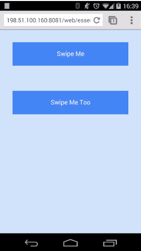
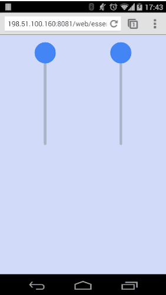
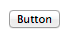
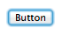
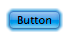

project_path: /web/fundamentals/_project.yaml
book_path: /web/fundamentals/_book.yaml
description: Touchscreens are available on more and more devices,  from phones up to desktop screens. Your app should respond to their touch  in intuitive and beautiful ways.

{# wf_updated_on: 2014-01-06 #}
{# wf_published_on: 2014-01-01 #}

# Add Touch to Your Site {: .page-title }



  <iframe class="devsite-embedded-youtube-video" data-video-id="Rwc4fHUnGuU"
          data-autohide="1" data-showinfo="0" frameborder="0" allowfullscreen>
  </iframe>

Touchscreens are available on more and more devices, ranging from phones to
desktop screens. When your users choose to interact with your UI, your app
should respond to their touch in intuitive ways.

## Respond to element states

Have you ever touched or clicked an element on a web page and questioned
whether the site actually detected it?

Simply altering the color of an element as users touch or interact with parts
of your UI gives a basic reassurance that your site is working. Not only does
this alleviate frustration, it can also give a snappy and responsive feel.

DOM elements can inherit any of the following states: default, focus, hover
and active. To change our UI for each of these states, we need to apply styles
to the following pseudo classes `:hover`, `:focus` and `:active` as shown below:

<pre class="prettyprint">

</pre>

[Try it](https://googlesamples.github.io/web-fundamentals/fundamentals/design-and-ux/input/touch/states-example.html){: target="_blank" .external }

On most mobile browsers *hover* and/or *focus* states will apply to an element
after it's been tapped.

Consider carefully what styles you set and how they will look to the user after
they finish their touch.

Note: Anchor tags and buttons may have different behavior
in different browsers, so assume in some cases **hover**
will remain and in others **focus** will remain.

### Suppressing default browser styles

Once you add styles for the different states, you'll notice that most browsers
implement their own styles in response to a user’s touch. This is largely
because when mobile devices first launched, a number of sites didn’t
have styling for the `:active` state. As a result, many browsers added
additional highlight color or style to give the user feedback.

Most browsers use the `outline` CSS property to display a ring around an
element when an element is focused. You can suppress it with:

    .btn:focus {
      outline: 0;

      // Add replacement focus styling here (i.e. border)
    }

Safari and Chrome add a tap highlight color which can be prevented with the
`-webkit-tap-highlight-color` CSS property:

<pre class="prettyprint">

</pre>

[Try it](https://googlesamples.github.io/web-fundamentals/fundamentals/design-and-ux/input/touch/states-example.html){: target="_blank" .external }

Internet Explorer on Windows Phone has a similar behavior, but is suppressed
via a meta tag:

    <meta name="msapplication-tap-highlight" content="no">

Firefox has two side effects to handle.

The `-moz-focus-inner` pseudo class, which adds an outline on
touchable elements, you can remove by setting `border: 0`.

If you are using a `<button>` element on Firefox, you get a gradient
applied, which you can remove by setting `background-image: none`.

<pre class="prettyprint">

</pre>

[Try it](https://googlesamples.github.io/web-fundamentals/fundamentals/design-and-ux/input/touch/states-example.html){: target="_blank" .external }

Caution: Only suppress the default styles mentioned above if you have pseudo
classes for `:hover`, `:active` and `:focus`!

### Disabling user-select

When you're creating your UI there may be scenarios where you want users
to interact with your elements but you want to suppress the default behavior
of selecting text on long press or dragging a mouse over your UI.

You can do this with the `user-select` CSS property, but beware that
doing this on content can be **extremely** infuriating
for users if they *want* to select the text in the element.
So make sure you use it with caution and sparingly.

    user-select: none;

## Implement custom gestures

If you have an idea for custom interactions and gestures for your site, there
are two topics to keep in mind:

1. How to support all browsers.
1. How to keep your frame rate high.

In this article, we'll look at exactly these topics covering the API's we need
to support to hit all browsers and then cover how we use these events
efficiently.

Depending on what you would like your gesture to do, you likely want the
user to interact with one element at a time *or* you'll want them to be able
to interact with multiple elements at the same time.

Caution: Don't forget that some users will want keyboard input and users
running assistive technology on a touchscreen device may not be able to
perform gestures because they're intercepted / consumed by the assistive
technology.

We are going to look at two examples in this article, both demonstrating
support for all browsers and how to keep the frame rate high.

{: .attempt-right }

The first example will allow the user to interact with one element. In this
case you might want all touch events to be given to that one element, as long
as the gesture initially started on the element itself. For example, moving a
finger off the swipe-able element can still control the element.

This is useful as it provides a great deal of flexibility for the user, but
enforces a restriction on how the user can interact with your UI.

{: .attempt-right }

If, however, you expect users to interact with multiple elements at the same
time (using multi-touch), you should restrict the touch to the specific
element.

This is more flexible for users, but complicates the logic for manipulating
the UI and is less resilient to user error.

### Add event listeners

In Chrome (version 55 and later), Internet Explorer & Edge,
`PointerEvents` are the recommended approach for implementing custom gestures.

In other browsers `TouchEvents` and `MouseEvents` are the correct approach.

The great feature of `PointerEvents` is that it merges multiple types of input,
including mouse, touch and pen events, into one set of
callbacks. The events to listen for are `pointerdown`, `pointermove`,
`pointerup` and `pointercancel`.

The equivalents in other browsers are `touchstart`, `touchmove`,
`touchend` and `touchcancel` for touch events and if you wanted to implement
the same gesture for mouse input you'd need to implement `mousedown`,
`mousemove`, and `mouseup`.

If you have questions about which events to use, check out this table of
[Touch, mouse and pointer events](#touch-mouse-and-pointer-events)).

Using these events requires calling the `addEventListener()` method on a DOM
element, along with the name of an event, a callback function and a boolean.
The boolean determines whether you should catch the event before or after
other elements have had the opportunity to catch and interpret the
events. (`true` means you want the event before other elements.)

Here's an example of listening for the start of an interaction.

<pre class="prettyprint">

</pre>

[Try it](https://googlesamples.github.io/web-fundamentals/fundamentals/design-and-ux/input/touch/touch-demo-1.html){: target="_blank" .external }

Note: Because of the design of the API, PointerEvents only need a single
`pointerdown` event to handle both mouse and touch events.

#### Handle single-element interaction

In the short snippet of code above we only added the starting event listener
for mouse events. The reason for this is that mouse events will only trigger
when the cursor is hovering *over* the element the event listener is added to.

`TouchEvents` will track a gesture after it's started regardless of where the
touch occurs and `PointerEvents` will track events regardless of where the touch
occurs after we call `setPointerCapture` on a DOM element.

For mouse move and end events we add the event listeners *in* the
gesture start method and add the listeners to the document, meaning it can
track the cursor until the gesture is complete.

The steps taken to implement this are:

1. Add all TouchEvent and PointerEvent listeners. For MouseEvents add **only**
   the start event.
1. Inside the start gesture callback, bind the mouse move and end events to
   the document. This way all mouse events are received regardless of whether
   the event occurs on the original element or not. For PointerEvents we
   need to call `setPointerCapture()` on our original element to receive
   all further events. Then handle the start of the gesture.
1. Handle the move events.
1. On the end event, remove the mouse move and end listeners from the document
   and end the gesture.

Below is a snippet of our `handleGestureStart()` method which adds the move
and end events to the document:

<pre class="prettyprint">

</pre>

[Try it](https://googlesamples.github.io/web-fundamentals/fundamentals/design-and-ux/input/touch/touch-demo-1.html){: target="_blank" .external }

The end callback we add is `handleGestureEnd()`, which removes the move
and end event listeners from the document and releases the pointer capture
when the gesture has finished like so:

<pre class="prettyprint">

</pre>

[Try it](https://googlesamples.github.io/web-fundamentals/fundamentals/design-and-ux/input/touch/touch-demo-1.html){: target="_blank" .external }

  
By following this pattern of adding the move event to the document, if the
  user starts interacting with an element and moves their gesture outside of
  the element, we'll continue to get mouse movements regardless of where they
  are on the page, because the events are being received from the document.

  
This diagram shows what the touch events are doing as we add the
  move and end events to the document once a gesture begins.

### Responding to touch efficiently

Now that we have the start and end events taken care of we can actually
respond to the touch events.

For any of the start and move events, you can easily extract `x` and `y`
from an event.

The following example checks whether the event is from a `TouchEvent` by
checking if `targetTouches` exists. If it does, then it extracts the
`clientX` and `clientY` from the first touch.
If the event is a `PointerEvent` or `MouseEvent` it extracts `clientX` and
`clientY` directly from the event itself.

<pre class="prettyprint">

</pre>

[Try it](https://googlesamples.github.io/web-fundamentals/fundamentals/design-and-ux/input/touch/touch-demo-2.html){: target="_blank" .external }

A `TouchEvent` has three lists containing touch data:

* `touches`: list of all current touches on the screen, regardless of
DOM element they are on.
* `targetTouches`: list of touches currently on the DOM element the event
is bound to.
* `changedTouches`: list of touches which changed resulting in the event
being fired.

In most cases, `targetTouches` gives you everything you need and want. (For
more info on these lists see [Touch lists](#touch-lists)).

#### Use requestAnimationFrame

Since the event callbacks are fired on the main thread, we want to run as
little code as possible in the callbacks for our events, keeping our frame
rate high and preventing jank.

Using `requestAnimationFrame()` we have an opportunity to update the UI just
before the browser is intending to draw a frame and will help us move some
work out of our event callbacks.

If you are unfamiliar with `requestAnimationFrame()`, you
can [learn more here](/web/fundamentals/performance/rendering/optimize-javascript-execution#use-requestanimationframe-for-visual-changes).

A typical implementation is to save the `x` and `y` coordinates from the
start and move events and request an animation frame inside the move event
callback.

In our demo, we store the initial touch position in `handleGestureStart()` (look for `initialTouchPos`):

<pre class="prettyprint">

</pre>

The `handleGestureMove()` method stores the position of it's event
before requesting an animation frame if we need to, passing in our
`onAnimFrame()` function as the callback:

<pre class="prettyprint">

</pre>

The `onAnimFrame` value is a function that when called, changes our UI
to move it around. By passing this function into `requestAnimationFrame()`, we
tell the browser to call it just before it's about to update the page
(i.e. paint any changes to the page).

In the `handleGestureMove()` callback we initially check if `rafPending` is false,
which indicates if `onAnimFrame()` has been called by `requestAnimationFrame()`
since the last move event. This means we only have one `requestAnimationFrame()`
waiting to run at any one time.

When our `onAnimFrame()` callback is executed, we set the transform on any
elements we want to move before updating `rafPending` to `false`, allowing the
the next touch event to request a new animation frame.

<pre class="prettyprint">

</pre>

### Control gestures using touch actions

The CSS property `touch-action` allows you to control the default touch
behavior of an element. In our examples, we use `touch-action: none` to
prevent the browser from doing anything with a users' touch, allowing us
to intercept all of the touch events.

<pre class="prettyprint">

</pre>

Using `touch-action: none` is somewhat a nuclear option as it prevents all
the default browser behaviors. In many cases one of the options
below is a better solution.

`touch-action` allows you to disable gestures implemented by a browser.
For example, IE10+ supports a double-tap to zoom gesture. By setting a
touch-action of `manipulation` you prevent the default double-tap
behavior.

This allows you to implement a double-tap gesture yourself.

Below is a list of commonly used touch-action values:

<table class="responsive">
  <thead>
    <tr>
      <th colspan="2">Touch Action Parameters</th>
    </tr>
  </thead>
  <tbody>
    <tr>
      <td data-th="Property"><code>touch-action: none</code></td>
      <td data-th="Description">No touch interactions will be handled by
      the browser.</td>
    </tr>
    <tr>
      <td data-th="Property"><code>touch-action: pinch-zoom</code></td>
      <td data-th="Description">Disables all browser interactions like
      `touch-action: none` apart from `pinch-zoom`, which is still handled by
      the browser.</td>
    </tr>
    <tr>
      <td data-th="Property"><code>touch-action: pan-y pinch-zoom</code></td>
      <td data-th="Description">Handle horizontal scrolls in JavaScript without
      disabling vertical scrolling or pinch-zooming (eg. image carousels).</td>
    </tr>
    <tr>
      <td data-th="Property"><code>touch-action: manipulation</code></td>
      <td data-th="Description">Disables double-tap gesture which avoids any
      click delay by the browser. Leaves scrolling and pinch-zoom up to the
      browser.</td>
    </tr>
  </tbody>
</table>

## Supporting older versions of IE

If you want to support IE10, you'll need to handle vendor prefixed versions of
`PointerEvents`.

To check for support of `PointerEvents` you'd typically look for
`window.PointerEvent`, but in IE10, you'd look for
`window.navigator.msPointerEnabled`.

The event names with vendor prefixes are: 'MSPointerDown', 'MSPointerUp' and
'MSPointerMove'.

The example below shows you how to check for support and switch
the event names.

<pre class="prettyprint">

</pre>

For more information, checkout this [updates article from
Microsoft](https://msdn.microsoft.com/en-us/library/dn304886(v=vs.85).aspx).

## Reference

### Pseudo classes for touch states

<table>
  <thead>
    <tr>
      <th>Class</th>
      <th>Example</th>
      <th>Description</th>
    </tr>
  </thead>
  <tbody>
    <tr>
      <td data-th="Class">:hover</td>
      <td data-th="Example"></td>
      <td data-th="Description">
        Entered when a cursor is placed over an element.
        Changes in the UI on hover are helpful to encourage users to interact
        with elements.
      </td>
    </tr>
    <tr>
      <td data-th="Class">:focus</td>
      <td data-th="Example">
        
      </td>
      <td data-th="Description">
        Entered when the user tabs through elements on a page. The focus state
        allows the user to know what element they are currently interacting
        with; also allows users to navigate your UI easily using a keyboard.
      </td>
    </tr>
    <tr>
      <td data-th="Class">:active</td>
      <td data-th="Example">
        
      </td>
      <td data-th="Description">
        Entered when an element is being selected, for
        example, when a user is clicking or touching an element.
      </td>
    </tr>
  </tbody>
</table>

The definitive touch events reference can be found here:
[w3 Touch Events](http://www.w3.org/TR/touch-events/).

### Touch, mouse, and pointer events

These events are the building blocks for adding new gestures into your
application:

<table class="responsive">
  <thead>
    <tr>
      <th colspan="2">Touch, Mouse, Pointer Events</th>
    </tr>
  </thead>
  <tbody>
    <tr>
      <td data-th="Event Names">
        <code>touchstart</code>,
        <code>mousedown</code>,
        <code>pointerdown</code>
      </td>
      <td data-th="Description">
        This is called when a finger first touches an element or when the
        user clicks down on the mouse.
      </td>
    </tr>
    <tr>
      <td data-th="Event Names">
        <code>touchmove</code>,
        <code>mousemove</code>,
        <code>pointermove</code>
      </td>
      <td data-th="Description">
        This is called when the user moves their finger across the screen or
        drags with the mouse.
      </td>
    </tr>
    <tr>
      <td data-th="Event Names">
        <code>touchend</code>,
        <code>mouseup</code>,
        <code>pointerup</code>
      </td>
      <td data-th="Description">
        This is called when the user lifts their finger off of the screen
        or releases the mouse.
      </td>
    </tr>
    <tr>
      <td data-th="Event Names">
        <code>touchcancel</code>
        <code>pointercancel</code>
      </td>
      <td data-th="Description">
        This is called when the browser cancels the touch gestures. For example,
        a user touch a web app and then change tabs.
      </td>
    </tr>
  </tbody>
</table>

### Touch lists

Each touch event includes three list attributes:

<table class="responsive">
  <thead>
    <tr>
      <th colspan="2">Touch Event Attributes</th>
    </tr>
  </thead>
  <tbody>
    <tr>
      <td data-th="Attribute"><code>touches</code></td>
      <td data-th="Description">
        List of all current touches on the screen, regardless of elements
        being touched.
      </td>
    </tr>
    <tr>
      <td data-th="Attribute"><code>targetTouches</code></td>
      <td data-th="Description">
        List of touches that started on the element that is the target of
        the current event. For example, if you bind to a <code>&lt;button&gt;</code>,
        you'll only get touches currently on that button. If you bind to the
        document, you'll get all touches currently on the document.
      </td>
    </tr>
    <tr>
      <td data-th="Attribute"><code>changedTouches</code></td>
      <td data-th="Description">
        List of touches which changed resulting in the event being fired:
        <ul>
          <li>
            For the <code>
            <a href="http://www.w3.org/TR/touch-events/#dfn-touchstart">
            touchstart</a></code>
            event-- list of the touch points that just became active with the
            current event.
          </li>
          <li>
            For the <code>
            <a href="http://www.w3.org/TR/touch-events/#dfn-touchmove">
            touchmove</a></code>
            event-- list of the touch points that have moved since the last
            event.
          </li>
          <li>
            For the <code>
            <a href="http://www.w3.org/TR/touch-events/#dfn-touchend">
            touchend</a></code>
            and <code>
            <a href="http://www.w3.org/TR/touch-events/#dfn-touchcancel">
            touchcancel</a></code>
            events-- list of the touch points that have just been removed
            from the surface.
          </li>
        </ul>
      </td>
    </tr>
  </tbody>
</table>

### Enabling active state support on iOS

Unfortunately, Safari on iOS does not apply the *active* state by default, to
get it working you need to add a `touchstart` event listener to the *document
body* or to each element.

You should do this behind a user agent test so it's only run on iOS devices.

Adding a touch start to the body has the advantage of applying to all elements
in the DOM, however this may have performance issues when scrolling the page.

    window.onload = function() {
      if(/iP(hone|ad)/.test(window.navigator.userAgent)) {
        document.body.addEventListener('touchstart', function() {}, false);
      }
    };

The alternative is to add the touch start listeners to all the interactable
elements in the page, alleviating some of the performance concerns.

    window.onload = function() {
      if(/iP(hone|ad)/.test(window.navigator.userAgent)) {
        var elements = document.querySelectorAll('button');
        var emptyFunction = function() {};
        for(var i = 0; i < elements.length; i++) {
          elements[i].addEventListener('touchstart', emptyFunction, false);
        }
      }
    };
