project_path: /web/fundamentals/_project.yaml
book_path: /web/fundamentals/_book.yaml
description: Google and AnswerLab undertook a study examining how users interact with a diverse set of mobile sites. The goal was to answer the question, 'What makes a good mobile site?'

{# wf_published_on: 2014-08-08 #}
{# wf_updated_on: 2015-09-17 #}

# What Makes a Good Mobile Site? {: .page-title }



Google and AnswerLab conducted a [research study](https://www.google.com/think/multiscreen/whitepaper-sitedesign.html?utm_source=web-fundamentals&utm_term=chrome&utm_content=ux-landing&utm_campaign=web-fundamentals) to answer this question. 

> Mobile users are very goal-oriented. They expect to be able to get what they
> need, immediately, and on their own terms. 

The study was held through 119 hour-long, in-person usability sessions with
participants in the US. Participants were asked to perform key tasks across a
diverse set of mobile sites. iOS and Android users were included, and users
tested the sites on their own phones. For each site, participants were asked
to voice their thoughts aloud as they completed conversion-focused tasks like
making a purchase or booking a reservation.

The study uncovered 25 mobile site design principles, grouped into five
categories.

## Home page and site navigation

Success: Focus your mobile homepage on connecting users to the content they’re looking for.

### Keep calls to action front and center

Make secondary tasks available through [menus](/web/fundamentals/design-and-ux/responsive/)
or “below the fold” (the part of the webpage that can’t be seen without scrolling down).

  <figure id="fig1">
    
    <figcaption class="success">
      <b>DO</b>: Make all of your users’ most common tasks easily available.
     </figcaption>
  </figure>

  <figure id="fig1">
    
    <figcaption class="warning">
      <b>DON'T</b>: Waste precious above-the-fold space with vague calls-to-action like “learn more”.
     </figcaption>
  </figure>

### Keep menus short and sweet

  <figure id="fig1">
    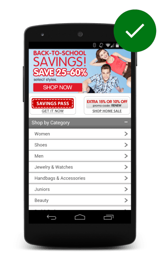
    <figcaption class="success">
      <b>DO</b>: Keep menus short and sweet.
     </figcaption>
  </figure>

Mobile users don’t have the patience to scroll through a long list of options
to find what they want. Reorganize your menu to use as few items as possible,
without sacrificing usability.

### Make it easy to get back to the home page

  <figure id="fig1">
    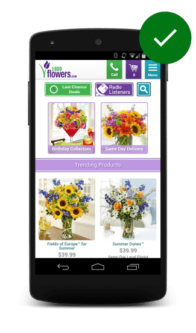
    <figcaption class="success">
      <b>DO</b>: Make it easy to get back to the home page.
     </figcaption>
  </figure>

Users expect to go back to the homepage when they tap the logo in the top-left
of a mobile page, and they become frustrated when it isn’t available or doesn’t work.

### Don't let promotions steal the show

Large app install interstitials (e.g., full-page promotions that hide content
and prompt users to install an app) annoy users and make it difficult to
perform tasks. In addition to annoying users, [sites that use interstitials
may see a negative impact to their search rankings](https://webmasters.googleblog.com/2016/08/helping-users-easily-access-content-on.html).

  <figure id="fig1">
    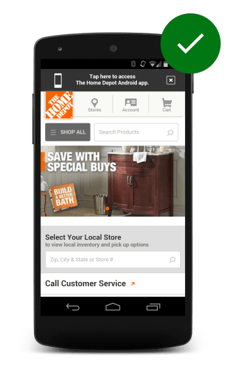
    <figcaption class="success">
      <b>DO</b>: Promotions should be easily dismissable and not distract from the experience.
     </figcaption>
  </figure>

  <figure id="fig1">
    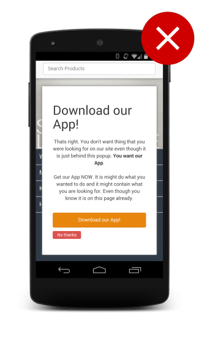
    <figcaption class="warning">
      <b>DON'T</b>: Interstitials (sometimes called door slams) often annoy users and make using the site a pain.
     </figcaption>
  </figure>

## Site search

Success: Help mobile users find what they’re looking for in a hurry.

### Make site search visible

Users looking for information usually turn to search, so the search field
should be one of the first things they see on your pages. Don’t hide the search
box in a menu.

  <figure id="fig1">
    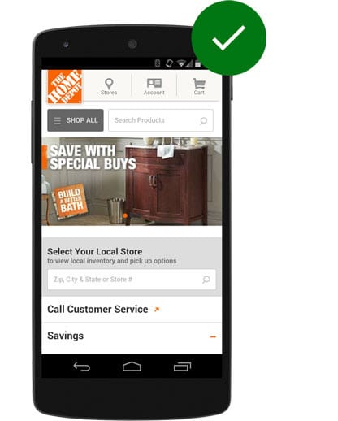
    <figcaption class="success">
      <b>DO</b>: Make search visible
     </figcaption>
  </figure>

  <figure id="fig1">
    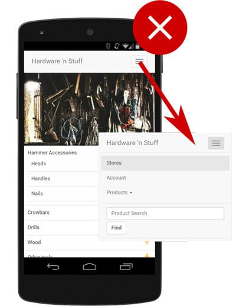
    <figcaption class="warning">
      <b>DON'T</b>: Hide search in overflow menus
     </figcaption>
  </figure>

### Ensure site search results are relevant

Users don’t scan through multiple pages of results to find what they’re looking
for. Make life easier on users by auto-completing queries, correcting
misspellings, and suggesting related queries. Rather than reinventing the
wheel, consider robust products like [Google Custom Search](https://cse.google.com/cse/){: .external }.

  <figure id="fig1">
    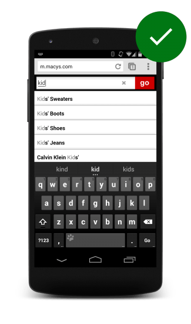
    <figcaption class="success">
      <b>DO</b>: Macy's only returns kids items.
     </figcaption>
  </figure>

  <figure id="fig1">
    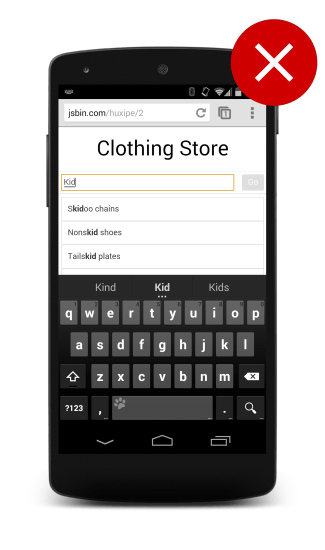
    <figcaption class="warning">
      <b>DON'T</b>: Return results for anything with the word kid in it.
     </figcaption>
  </figure>

### Implement filters to narrow results

Study participants rely on [filters](/custom-search/docs/structured_search)
to find what they’re looking for, and abandon sites that do not have effective
filters. Place filters above search results, and help users by displaying how
many results will be returned when a specific filter is applied.

  <figure id="fig1">
    
    <figcaption class="success">
      <b>DO</b>: Make it easy to filter.
     </figcaption>
  </figure>

  <figure id="fig1">
    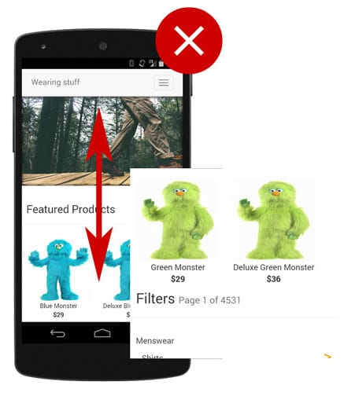
    <figcaption class="warning">
      <b>DON'T</b>: Hide filter functionality.
     </figcaption>
  </figure>

### Guide users to better site search results

  <figure id="fig1">
    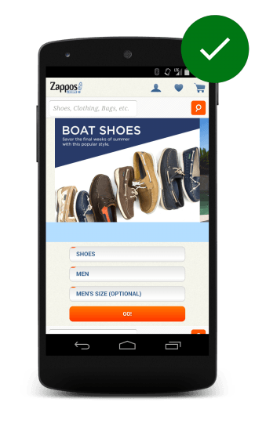
    <figcaption class="success">
      <b>DO</b>: Help users to find what they're looking for by guiding them in the right direction.
     </figcaption>
  </figure>

For sites with diverse customer segments, ask a few questions before presenting
the search box, and use the customer’s responses as search query filters to
ensure that users get results from the most relevant segment.

## Commerce and conversion

Success: Understand your customer journeys and let users convert on their own terms. 

### Let users explore before they commit

Study participants were frustrated by sites that require upfront registrations
to view the site, especially when the brand was unfamiliar. Although customer
information may be integral to your business, asking for it too early may
result in fewer registrations.

  <figure id="fig1">
    
    <figcaption class="success">
      <b>DO</b>: Allow users to browse the site without requiring sign in.
     </figcaption>
  </figure>

  <figure id="fig1">
    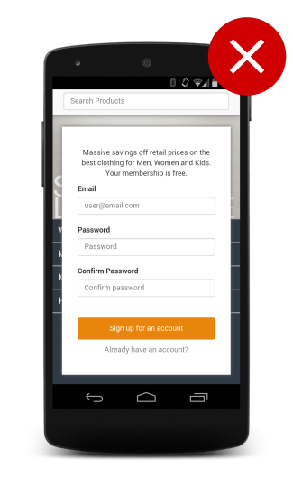
    <figcaption class="warning">
      <b>DON'T</b>: Place login or registration too early in a site.
     </figcaption>
  </figure>

### Let users purchase as guests

  <figure id="fig1">
    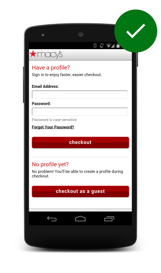
    <figcaption class="success">
      <b>DO</b>: Allow users to purchase with a guest account.
     </figcaption>
  </figure>

Study participants viewed guest checkouts as “convenient”, “simple”, “easy”,
and “quick”. Users are annoyed by sites that force them to register for an
account when making a purchase, especially when the benefit of an account is
unclear.

### Use existing information to maximize convenience

Remember and
[pre-fill preferences](/web/fundamentals/design-and-ux/input/forms/#label-and-name-inputs-properly)
for registered users. Offer familiar, third-party checkout services for new users.

### Use click-to-call buttons for complex tasks

On devices with calling capabilities,
[click-to-call links](/web/fundamentals/native-hardware/click-to-call/) enable
users to make a phone call by simply tapping a link. On most mobile devices the
user receives a confirmation before the number is dialed, or a menu is presented
asking the user how the number should be handled.

### Make it easy to finish on another device

  <figure id="fig1">
    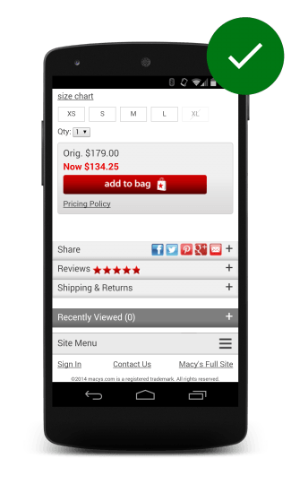
    <figcaption class="success">
      <b>DO</b>: Provide easy ways for users to continue browsing or shopping on another device.
     </figcaption>
  </figure>

Users frequently want to finish tasks on other devices. For instance, they
might wish to view an item on a larger screen. Or they might get busy and need
to finish later. Support these customer journeys by enabling users to
[share items on social networks](/web/fundamentals/discovery-and-monetization/social-discovery/),
or by letting users email themselves links from directly within the site.

## Form entry

Success: Provide a seamless, frictionless conversion experience with usable forms.

### Streamline information entry

Automatically advance to the next field when a user presses Return. In general,
the less taps the user must perform, the better.

### Choose the simplest input

Use the most [appropriate input type](/web/fundamentals/design-and-ux/input/forms/choose-the-best-input-type)
for each scenario. Use elements like
[`datalist`](/web/fundamentals/design-and-ux/input/forms/choose-the-best-input-type#offer-suggestions-during-input-with-datalist)
to provide suggested values for a field.

### Provide visual calendar for date selection

  <figure id="fig1">
    
    <figcaption class="success">
      <b>DO</b>: use calendar widgets when possible.
     </figcaption>
  </figure>

Clearly label start and end dates. Users should not need to leave a site and
check a calendar app just to schedule a date.

### Minimize form errors with labeling and real-time validation

  <figure id="fig1">
    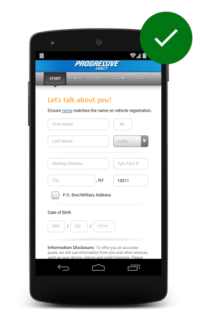
    <figcaption class="success">
      <b>DO</b>: Prepopulate content where possible.
     </figcaption>
  </figure>

Label inputs properly and validate input in real-time.

### Design efficient forms

Take advantage of [autofill](/web/fundamentals/design-and-ux/input/forms/#label-and-name-inputs-properly#use-metadata-to-enable-auto-complete)
so that users can easily complete forms with pre-populated data. Pre-fill
fields with information you already know. For example, when retrieving shipping
and billing addresses, try to use
[`requestAutocomplete`](/web/fundamentals/design-and-ux/input/forms/use-request-auto-complete)
or enable users to copy their shipping address to their billing address (or vice versa). 

## Usability and form factor

Success: Delight your mobile users with small things that enhance their experiences.

### Optimize your entire site for mobile

Use a [responsive layout](/web/fundamentals/design-and-ux/responsive/) that
changes based on the size and capabilities of the user’s device. Study
participants found sites with a mix of desktop and mobile-optimized pages even
harder to use than desktop-only sites.

### Don't make users pinch-to-zoom

Users are comfortable with scrolling sites vertically, but not horizontally. 
Avoid large, fixed-width elements. Use
[CSS media queries](/web/fundamentals/design-and-ux/responsive/#use-css-media-queries-for-responsiveness)
to apply different stylings for different screens. Don’t create content that
only displays well at a particular
[viewport width](/web/fundamentals/design-and-ux/responsive/#set-the-viewport).
Sites that force users to horizontally scroll fail the
[Google Mobile-Friendly Test](https://search.google.com/test/mobile-friendly),
which may negatively impact their search rankings.

### Make product images expandable

  <figure id="fig1">
    
    <figcaption class="success">
      <b>DO</b>: Make product images expandable and easy to see detail.
     </figcaption>
  </figure>

Retail customers expect sites to let them
[view high resolution closeups](/web/fundamentals/design-and-ux/responsive/images#make-product-images-expandable)
of products. Study participants got frustrated when they weren’t able to see
what they were buying.

### Tell users which orientation works best

  <figure id="fig1">
    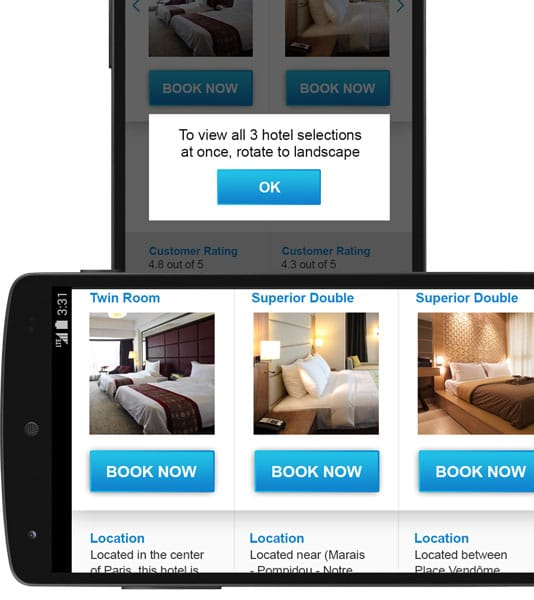
    <figcaption class="success">
      <b>DO</b>: Tell the user which orientation works best.
     </figcaption>
  </figure>

Study participants tended to stay in the same screen orientation until
something prompted them to switch. Design for both landscape and portrait,
or encourage users to switch to the optimal orientation. Make sure that your
important calls-to-action can be completed even if the users ignore the
suggestion to switch orientations.

### Keep your user in a single browser window

  <figure id="fig1">
    
    <figcaption class="success">
      <b>DO</b>: Macy's keeps their users on their site by providing coupons on site.
     </figcaption>
  </figure>

Users may have trouble switching between windows and might not be able to find
their way back to the site. Avoid calls-to-action that launch new windows.
Identify any journeys that might cause a user to look outside your site and
provide features to keep them on your site. For example, if you accept coupons,
offer them directly on the site, rather than forcing users to search other
sites for deals.

### Avoid "full site" labeling

When study participants saw an option for a "full site" (i.e., desktop site)
versus a "mobile site", they thought the mobile site lacked content and chose
the "full" one instead, directing them to the desktop site.

### Be clear why you need a user's location

Users should always understand why you’re asking for their
[location](/web/fundamentals/native-hardware/user-location/). Study
participants trying to book a hotel in another city became confused when a
travel site detected their location and offered hotels in their current city
instead. Leave location fields blank by default, and let users choose to
populate them through a clear call-to-action like “Find Near Me”.

  <figure id="fig1">
    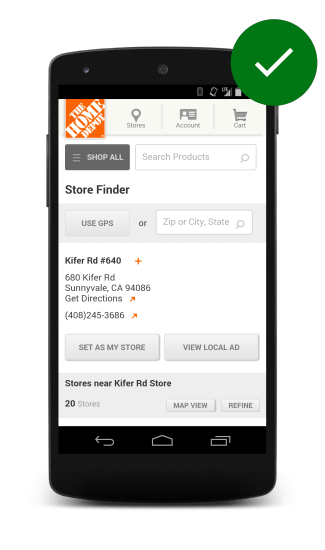
    <figcaption class="success">
      <b>DO</b>: Always request access to location on a user gesture.
     </figcaption>
  </figure>

  <figure id="fig1">
    
    <figcaption class="warning">
      <b>DON'T</b>: Asking for it immediately on the homepage as the site loads results in a poor user experience.
     </figcaption>
  </figure>

