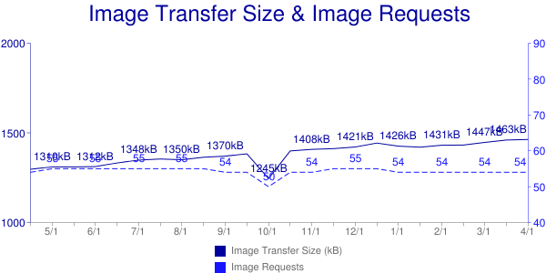
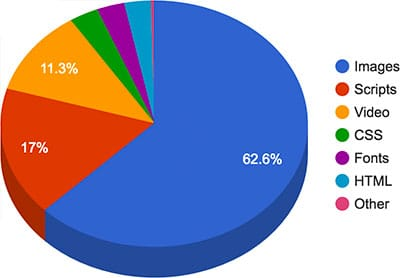
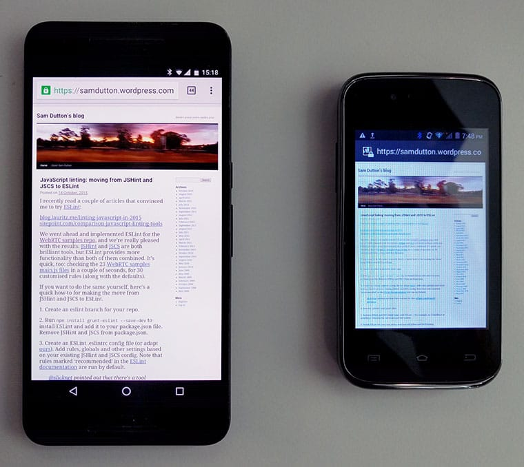
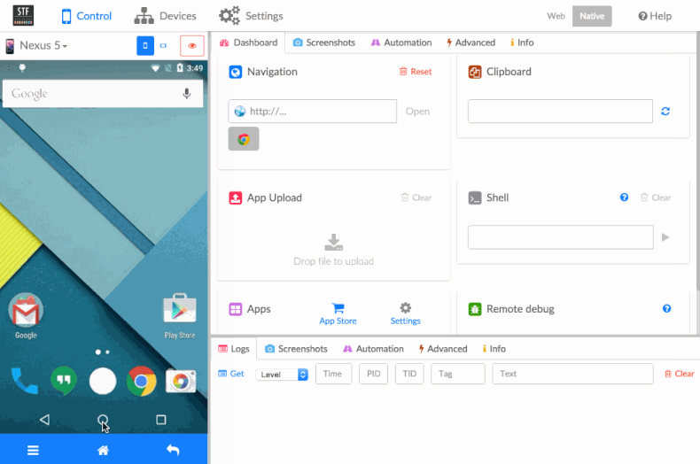
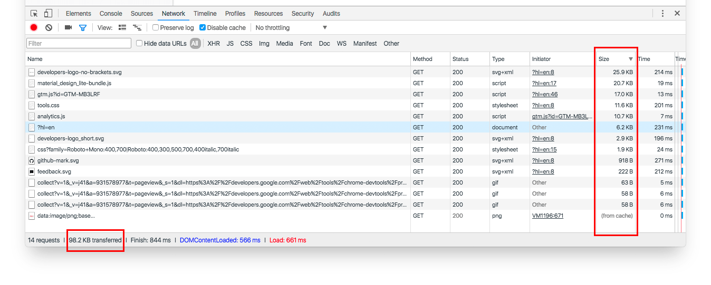
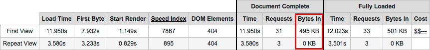
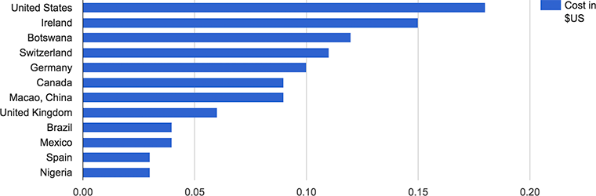

project_path: /web/fundamentals/_project.yaml
book_path: /web/fundamentals/_book.yaml
description: Consider content as well as layout and graphic design when building for a range of users and devices.

{# wf_updated_on: 2016-05-10 #}
{# wf_published_on: 2016-05-10 #}

# Multi-Device Content {: .page-title }



## How people read on the web

The [US government writing guide](http://www.usability.gov/how-to-and-tools/methods/writing-for-the-web.html) summarizes what people want from writing on the web:

> When writing for the web, using plain language allows users to find what they need, understand what they have found, and then use it to meet their needs.
>
> It should also be actionable, findable, and shareable.

Research shows that [people don't read web pages, they scan](https://www.nngroup.com/articles/concise-scannable-and-objective-how-to-write-for-the-web/). On average, [people only read 20–28% of web page content](https://www.nngroup.com/articles/how-little-do-users-read/). Reading from screens is much slower than reading from paper. People will give up and leave your site unless information is easy to access and understand.

## How to write for mobile

Focus on the subject at hand and tell the story upfront. For writing to work across a range of devices and viewports, make sure to get your main points across at the start: as a rule, ideally [in the first four paragraphs, in around 70 words](http://www.bbc.co.uk/academy/journalism/article/art20130702112133610).

Ask yourself what people want from your site. Are they trying to find something out? If people visit your site for information, make sure that all your text is oriented to helping them achieve their goal. Write in the [active voice](https://learnenglish.britishcouncil.org/en/english-grammar/verbs/active-and-passive-voice), offer actions and solutions.

Publish only what your visitors want, and nothing more.

[UK government research](https://www.gov.uk/guidance/content-design/writing-for-gov-uk) also shows that:

> 80% of people preferred sentences written in clear English — and the more
>complex the issue, the greater that preference (e.g., 97% preferred "among
> other things" over the Latin "inter alia").
>
> The more educated the person and the more specialist their knowledge, the
> greater their preference for plain English.

In other words: use plain language, shorter words and simple sentence structures — even for a literate, technical audience. Unless there's a good reason not to, keep your tone of voice conversational. An old rule of journalism is to write as if you are speaking to an intelligent 11 year old.

## The next billion users

The pared-down approach to writing is particularly important for readers on mobile devices, and is crucial when creating content for low-cost phones with small viewports that require more scrolling and may have lower quality displays and less responsive screens.

Most of the next billion users coming online will have cheap devices. They will not want to spend their data budget on navigating long-winded content, and may not be reading in their first language. Trim your text: use short sentences, minimal punctuation, paragraphs five lines or less, and single line headings. Consider responsive text (for example, using shorter headlines for smaller viewports) but [beware of the downsides](https://www.smashingmagazine.com/2012/02/ever-justification-for-responsive-text/).

A minimalist attitude to text will also make your content easier to localize and internationalize — and make it more likely that your content gets quoted in social media.

The bottom line:

* Keep it simple
* Reduce clutter
* Get to the point

## Eliminate unnecessary content

In terms of byte size, web pages are [big and getting bigger](http://httparchive.org/trends.php#bytesTotal&reqTotal).

[Responsive design techniques](/web/fundamentals/design-and-ux/responsive/) make it possible to serve different content for smaller viewports, but it's always sensible to start by streamlining text, images and other content.

> Web users are often action oriented, "leaning forward" in the hunt for answers to their current question, rather than leaning back to absorb a good book.
>
> — [Jakob Nielsen](https://www.nngroup.com/articles/concise-scannable-and-objective-how-to-write-for-the-web/)

Ask yourself: what are people are trying to achieve when they visit my site?

Does every page component help users achieve their goal?

### Remove redundant page elements

HTML files constitute nearly 70k and more than nine requests for the average web page, according to [HTTP Archive](http://httparchive.org/trends.php#bytesHtml&reqHtml).

Many popular sites use several thousand HTML elements per page, and several thousand lines of code, even on mobile. Excessive HTML file size [may not make pages load more slowly](http://jsbin.com/zofavunapo/1/edit?html,js,output), but a heavy HTML payload can be a sign of content bloat: larger .html files mean more elements, more text content, or both.

Reducing HTML complexity will also reduce page weight, help enable localization and internationalization and make responsive design easier to plan and debug. For information about writing more efficient HTML, see [High performance HTML](https://samdutton.wordpress.com/2015/04/02/high-performance-html/).

> Every step you make a user perform before they get value out of your app will cost you 20% of users
>
>— [Gabor Cselle, Twitter](http://blog.gaborcselle.com/2012/10/every-step-costs-you-20-of-users.html)

The same applies to content: help users get to what they want as quickly as possible.

Don't just hide content from mobile users. Aim for [content parity](http://bradfrost.com/blog/mobile/content-parity/), since guessing what features your mobile users won't miss is bound to fail for someone. If you have the resources, create alternative versions of the same content for different viewport sizes — even if only for high priority page elements.

Consider content management and workflow: are legacy systems resulting in legacy content?

### Simplify text

As the web goes mobile, you need to change the way you write. Keep it simple, reduce clutter and get to the point.

### Remove redundant images

  <figure>
    
    <figcaption>According to <a href="http://httparchive.org/trends.php#bytesImg&reqImg">HTTP Archive data</a>, the average web page makes 54 requests for images.</figcaption>
  </figure>

Images can be beautiful, fun and informative — but they also use page real estate, add to page weight, and increase the number of file requests. [Latency gets worse as connectivity gets worse](https://www.igvita.com/2012/07/19/latency-the-new-web-performance-bottleneck/), meaning that an excess of image file requests is an increasing problem as the web goes mobile.

  <figure>
    
    <figcaption>Images constitute over 60% of page weight.</figcaption>
  </figure>

Images also consume power. After the screen, radio is the second biggest drain on your battery. More image requests, more radio usage, more flat batteries. Even just to render images takes power – and this is proportional to size and number. Check out the Stanford report [Who Killed My Battery?](http://cdn.oreillystatic.com/en/assets/1/event/79/Who%20Killed%20My%20Battery_%20Analyzing%20Mobile%20Browser%20Energy%20Consumption%20Presentation.pdf)

If you can, get rid of images!

Here are some suggestions:

* Consider designs that avoid images altogether, or use images sparingly. [Text-only can be beautiful](https://onepagelove.com/tag/text-only)! Ask yourself, "What are visitors to my site trying to achieve? Do images help that process?"
* In the old days, it was commonplace to save headings and other text as graphics. That approach does not respond well to viewport size changes, and adds to page weight and latency. Using text as a graphic also means the text can't be found by search engines, and isn't accessible by screenreaders and other assistive technologies. Use "real" text where possible — Web Fonts and CSS can enable beautiful typography.
* Use CSS rather than images for gradients, shadows, rounded corners, and [background textures](http://lea.verou.me/css3patterns/){: .external }, features [supported by all modern browsers](http://caniuse.com/#search=shadows). Bear in mind, however, that CSS may be better than images, but there can still be a [processing and rendering penalty](http://www.smashingmagazine.com/2013/04/03/build-fast-loading-mobile-website/), especially significant on mobile.
* Background images rarely work well on mobile. You can [use media queries](http://udacity.github.io/responsive-images/examples/2-06/backgroundImageConditional/) to avoid background images on small viewports.
* Avoid splash screen images.
* [Use CSS for UI animations](/web/fundamentals/design-and-ux/animations/).
* Get to know your glyphs; use [Unicode symbols and icons](https://en.wikipedia.org/wiki/List_of_Unicode_characters) instead of images, with Web Fonts if necessary.
* Consider [icon fonts](http://weloveiconfonts.com/#zocial); they are vector graphics that can be infinitely scaled, and an entire set of images can be downloaded in one font. (Be aware of [these concerns](https://sarasoueidan.com/blog/icon-fonts-to-svg/), however.)
* The `<canvas>` element can be used to build images in JavaScript from lines, curves, text, and other images.
* [Inline SVG or Data URI images](http://udacity.github.io/responsive-images/examples/2-11/svgDataUri/) will not reduce page weight, but they can reduce latency by reducing the number of resource requests. Inline SVG has [great support on mobile and desktop browsers](http://caniuse.com/#feat=svg-html5), and [optimization tools](http://petercollingridge.appspot.com/svg-optimiser) can significantly reduce SVG size. Likewise, Data URIs are [well supported](http://caniuse.com/datauri). Both can be inlined in CSS.
* Consider using `<video>` instead of animated GIFs. [The video element is supported by all browsers on mobile](http://caniuse.com/video) (apart from Opera Mini).

For more information see [Image Optimization](/web/fundamentals/performance/optimizing-content-efficiency/image-optimization) and [Eliminating and replacing images](/web/fundamentals/performance/optimizing-content-efficiency/image-optimization#eliminating-and-replacing-images).

## Design content to work well across different viewport sizes {: #viewport }

> "Create a product, don't re-imagine one for small screens. Great mobile
> products are created, never ported."
>
>— <a href="https://goo.gl/KBAXj0">Mobile Design and Development</a>, Brian Fling

Great designers don't "optimize for mobile" — they think responsively to build sites that work across a range of devices. The structure of text and other page content is critical to cross-device success.

Many of the next billion users coming online use low-cost devices with small viewports. Reading on a low resolution 3.5" or 4" screen can be hard work.

Here is a photograph of the two together:

On the larger screen, text is small but readable.

On the smaller screen the browser renders the layout correctly, but the text is unreadable, even when zoomed in. The display is blurry and has a 'color cast' — white doesn't look white — making content less legible.

### Design content for mobile

When building for a range of viewports, consider content as well as layout and graphic design,
[design with real text and images, not dummy content](http://uxmyths.com/post/718187422/myth-you-dont-need-the-content-to-design-a-website).

> "Content precedes design. Design in the absence of content is not design, it's decoration."
>
>— Jeffrey Zeldman

* Put your most important content at the top, since [users tend to read web pages in an F-shaped pattern](https://www.nngroup.com/articles/f-shaped-pattern-reading-web-content/).
* Users visit your site to achieve a goal. Ask yourself what they need to achieve that goal and get rid of everything else. Get tough on visual and textual embellishments, legacy content, excessive links, and other clutter.
* Be careful with social sharing icons; they can clutter layouts, and the code for them can slow down page loading.
* Design [responsive layouts](/web/fundamentals/design-and-ux/responsive/) for content, not fixed device sizes.

### Test content

Success: Whatever you do — **test**!

* Check readability on smaller viewports using Chrome DevTools and other [emulation tools](/web/fundamentals/performance/poor-connectivity/).
* [Test your content under conditions of low bandwidth and high latency](/web/fundamentals/performance/poor-connectivity/); try out content in a variety of connectivity scenarios.
* Try reading and interacting with your content on a low-cost phone.
* Ask friends and colleagues to try out your app or site.
* Build a simple device test lab. The [GitHub repo](https://github.com/GoogleChrome/MiniMobileDeviceLab) for Google's Mini Mobile Device Lab has instructions on how to build your own. [OpenSTF](https://github.com/openstf/stf) is a simple web application for testing websites on multiple Android devices.

Here is OpenSTF in action:

Mobile devices are increasingly used to consume content and obtain information — not just as devices for communication, games and media.

This makes it increasingly import to plan content to work well on a range of viewports, and to prioritize content when considering cross-device layout, interface and interaction design.

## Understand data cost

Web pages are getting bigger.   According to <a href="http://httparchive.org/trends.php#bytesTotal&reqTotal">HTTP Archive</a>, the average page weight for the <a href="http://httparchive.org/about.php#listofurls">top one million sites</a> is now over 2MB.

Users avoid sites or apps perceived to be slow or expensive, so it's crucial to understand the cost of loading page and app components.

Reducing page weight can also be profitable. [Chris Zacharias from YouTube](http://blog.chriszacharias.com/page-weight-matters) found that when they reduced the watch-page size from 1.2MB to 250KB:

> Large numbers of people who were previously unable to use YouTube before were suddenly able to.

In other words, reducing page weight **can open up whole new markets**.

### Calculate page weight {: #weight }

There are a number of tools for calculating page weight. The Chrome DevTools Network panel shows the total byte size for all resources, and can be used to ascertain weights for individual asset types. You can also check which items have been retrieved from the browser cache.

Firefox and other browsers offer similar tools.

[WebPagetest](http://webpagetest.org) provides the ability to test first and subsequent page loads. You can automate testing with [scripts](https://sites.google.com/a/webpagetest.org/docs/using-webpagetest/scripting) (for example, to log in to a site) or by using their [RESTful APIs](https://sites.google.com/a/webpagetest.org/docs/advanced-features/webpagetest-restful-apis). The following example (loading [developers.google.com/web](/web/)) shows that caching was successful and that subsequent page loads required no additional resources.

WebPagetest also gives a size and request breakdown by MIME type.

### Calculate page cost

For many users, data doesn't just cost bytes and performance — it costs money.

The site [What Does My Site Cost?](https://whatdoesmysitecost.com/){: .external } enables you to estimate the actual financial cost of loading your site. The histogram below shows how much it costs (using a prepaid data plan) to load [amazon.com](https://www.amazon.com/).

Bear in mind that this doesn't take into account affordability relative to income. Data from [blog.jana.com](https://blog.jana.com/2015/05/21/the-data-trap-affordable-smartphones-expensive-data/) shows the cost of data.

<table>
  <tr>
    <td></td>
    <td><strong>500MB data plan cost (USD)</strong></td>
    <td><strong>Hourly minimum wage (USD)</strong></td>
    <td><strong>Hours of work to pay for 500MB data plan</strong></td>
  </tr>
  <tr>
    <td>India</td>
    <td>$3.38</td>
    <td>$0.20</td>
    <td>17 hours</td>
  </tr>
  <tr>
    <td>Indonesia</td>
    <td>$2.39</td>
    <td>$0.43</td>
    <td>6 hours</td>
  </tr>
  <tr>
    <td>Brazil</td>
    <td>$13.77</td>
    <td>$1.04</td>
    <td>13 hours</td>
  </tr>
</table>

Page weight isn't just a problem for emerging markets. In many countries, people use mobile plans with limited data, and will avoid your site or app if they perceive it to be heavy and expensive. Even "unlimited" cell and wifi data plans generally have a data limit beyond which they are blocked or throttled.

The bottom line: page weight affects performance and costs money. [Optimizing content efficiency](/web/fundamentals/performance/optimizing-content-efficiency/) shows how to reduce that cost.
