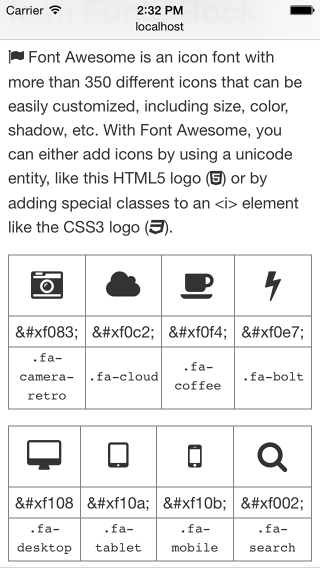

project_path: /web/fundamentals/_project.yaml
book_path: /web/fundamentals/_book.yaml
description: A picture is worth 1000 words, and images play an integral part of every page. But they also often account for most of the downloaded bytes.  With responsive web design not only can our layouts change based on device characteristics, but images as well.

{# wf_updated_on: 2017-07-24 #}
{# wf_published_on: 2014-04-29 #}

# Images {: .page-title }



Responsive web design means that not only can our layouts change based on device
characteristics, but content can change as well.  For example, on high
resolution (2x) displays, high resolution graphics ensure sharpness. An image
that  is 50% width may work just fine when the browser is 800px wide, but uses
too much real estate on a narrow phone, and requires the same bandwidth overhead
when scaled down to fit a smaller screen.

## Art direction

Other times the image may need to be changed more drastically: changing the
proportions, cropping, and even replacing the entire image.  In this case,
changing the image is usually referred to as art direction.  See
[responsiveimages.org/demos/](https://responsiveimages.org/demos/) for more
examples.



## Images in markup

The `img` element is powerful&mdash;it downloads, decodes, and renders
content&mdash;and modern browsers support a range of image  formats.  Including
images that work across devices is no different than for desktop, and only
requires a few minor tweaks to create a good experience.

### TL;DR {: .hide-from-toc }

- Use relative sizes for images to prevent them from accidentally overflowing
  the container.
- Use the `picture` element when you want to specify different images depending
  on device characteristics (a.k.a. art direction).
- Use `srcset` and the `x` descriptor in the  `img` element to give hints to
  the browser about the best  image to use when choosing from different densities.
- If your page only has one or two images and these are not used elsewhere on
  your site, consider using inline images to reduce file requests.

### Use relative sizes for images

Remember to use relative units when specifying widths for images to prevent them
from accidentally overflowing the viewport.  For example, `width: 50%;`  causes
the image width to be 50% of the containing element (not 50% of the viewport or
50% of actual pixel size).

Because CSS allows content to overflow its container, you may need to use max-
width: 100% to prevent images and other content from overflowing.  For example:

    img, embed, object, video {
      max-width: 100%;
    }
    

Be sure to provide meaningful descriptions via the `alt` attribute on `img`
elements; these help make your site more accessible by giving context to screen
readers and other assistive technologies.

### Enhance `img`s with `srcset` for high DPI devices

  <iframe class="devsite-embedded-youtube-video" data-video-id="Pzc5Dly_jEM"
          data-autohide="1" data-showinfo="0" frameborder="0" allowfullscreen>
  </iframe>

The `srcset` attribute enhances the behavior of the
`img` element, making it easy to provide multiple image files
for different device characteristics. Similar to the `image-set`
[CSS function](#use-image-set-to-provide-high-res-images)
native to CSS, `srcset` allows the browser to choose the best
image depending on the characteristics of the device, for example using
a 2x image on a 2x display, and potentially in the future, a 1x image on
a 2x device when on a limited bandwidth network.

    
    

On browsers that don't support `srcset`, the browser simply uses the default
image file specified by the `src` attribute.  This is why it is important to
always include a 1x image that can be displayed on any device, regardless of
capabilities.  When `srcset` is supported, the  comma-separated list of
image/conditions is parsed prior to making any requests, and only the most
appropriate image is downloaded and displayed.

While the conditions can include everything from pixel density to width and
height, only pixel density is well-supported today.  To balance current
behavior with future features, stick with simply providing the 2x image in
the attribute.

### Art direction in responsive images with `picture`

To change images based on device characteristics, also known as art
direction, use the `picture` element.  The
`picture` element defines a declarative solution for
providing multiple versions of an image based on different
characteristics, like device size, device resolution, orientation,
and more.

Dogfood: The `picture` element is beginning to land in browsers. Although it's
not available in every browser yet, we recommend its use because of the strong
backward compatibility and potential use of the
[Picturefill polyfill](http://picturefill.responsiveimages.org/). See the
[ResponsiveImages.org](http://responsiveimages.org/#implementation) site for
further details.

  <iframe class="devsite-embedded-youtube-video" data-video-id="QINlm3vjnaY"
          data-autohide="1" data-showinfo="0" frameborder="0" allowfullscreen>
  </iframe>

Use the <code>picture</code> element when an image source
exists in multiple densities, or when a responsive design dictates a
somewhat different image on some types of screens.  Similar to the
<code>video</code> element, multiple <code>source</code> elements can
be included, making it possible to specify different image files
depending on media queries or image format.

<pre class="prettyprint">

</pre>

[Try it](https://googlesamples.github.io/web-fundamentals/fundamentals/media/media.html){: target="_blank" .external }

In the above example, if the browser width is at least 800px then either
`head.jpg` or `head-2x.jpg` is used, depending on the device resolution. If the
browser is between 450px and 800px, then either `head-small.jpg` or `head-small-
2x.jpg` is used, again, depending on the device resolution. For screen widths
less than 450px and backward compatibility where the `picture` element isn’t
supported, the browser renders the `img` element instead, and should always be
included.

#### Relative sized images

When the final size of the image isn’t known, it can be difficult to specify a
density descriptor for the image sources.  This is especially true for images
that span a proportional width of the browser and are fluid, depending on the
size of the browser.

Instead of supplying fixed image sizes and densities, you can specify the size
of each supplied image by adding a width descriptor along with the size of the
image element, allowing the browser to automatically calculate the effective
pixel density and choose the best image to download.

<pre class="prettyprint">

</pre>

[Try it](https://googlesamples.github.io/web-fundamentals/fundamentals/media/sizes.html){: target="_blank" .external }

The above example renders an image that is half the viewport width
(`sizes="50vw"`), and depending on the width of the browser and its device pixel
ratio, allows the browser to choose the correct image regardless of how large
the browser window is. For example, the table below shows which image the
browser would choose:

<table class="">
  <thead>
    <tr>
      <th data-th="Browser width">Browser width</th>
      <th data-th="Device pixel ratio">Device pixel ratio</th>
      <th data-th="Image used">Image used</th>
      <th data-th="Effective resolution">Effective resolution</th>
    </tr>
  </thead>
  <tbody>
    <tr>
      <td data-th="Browser width">400px</td>
      <td data-th="Device pixel ratio">1</td>
      <td data-th="Image used"><code>200.png</code></td>
      <td data-th="Effective resolution">1x</td>
    </tr>
    <tr>
      <td data-th="Browser width">400px</td>
      <td data-th="Device pixel ratio">2</td>
      <td data-th="Image used"><code>400.png</code></td>
      <td data-th="Effective resolution">2x</td>
    </tr>
    <tr>
      <td data-th="Browser width">320px</td>
      <td data-th="Device pixel ratio">2</td>
      <td data-th="Image used"><code>400.png</code></td>
      <td data-th="Effective resolution">2.5x</td>
    </tr>
    <tr>
      <td data-th="Browser width">600px</td>
      <td data-th="Device pixel ratio">2</td>
      <td data-th="Image used"><code>800.png</code></td>
      <td data-th="Effective resolution">2.67x</td>
    </tr>
    <tr>
      <td data-th="Browser width">640px</td>
      <td data-th="Device pixel ratio">3</td>
      <td data-th="Image used"><code>1000.png</code></td>
      <td data-th="Effective resolution">3.125x</td>
    </tr>
    <tr>
      <td data-th="Browser width">1100px</td>
      <td data-th="Device pixel ratio">1</td>
      <td data-th="Image used"><code>1400.png</code></td>
      <td data-th="Effective resolution">1.27x</td>
    </tr>
  </tbody>
</table>

#### Account for breakpoints in responsive images

In many cases, the image size may change depending on the site’s layout
breakpoints.  For example, on a small screen, you might want the image to
span the full width of the viewport, while on larger screens, it should only
take a small proportion.

<pre class="prettyprint">

</pre>

[Try it](https://googlesamples.github.io/web-fundamentals/fundamentals/media/breakpoints.html){: target="_blank" .external }

The `sizes` attribute, in the above example, uses several media queries to
specify the size of the image. When the browser width is greater than
600px, the image is 25% of the viewport width; when it is between 500px
and 600px, the image is 50% of the viewport width; and below 500px, it
is full width.

### Make product images expandable

<figure class="attempt-right">
  
  <figcaption class="success">
    J. Crew's website with expandable product image.
  </figcaption>
</figure>

Customers want to see what they're buying.  On retail sites, users expect to be
able to view high resolution closeups of products to get a better look at
details, and
[study participants](/web/fundamentals/getting-started/principles/#make-product-images-expandable)
got frustrated if they weren't able to.

A good example of tappable, expandable images is provided by the J. Crew site.
A disappearing overlay indicates that an image is tappable, providing a zoomed
in image with fine detail visible.

### Other image techniques

#### Compressive images

The
[compressive image technique](http://www.html5rocks.com/en/mobile/high-dpi/#toc-tech-overview)
serves a highly compressed 2x image to all devices, no matter the actual
capabilities of the device.  Depending on the type of image and level of
compression, image quality may not appear to change, but the file size drops
significantly.

[Try it](https://googlesamples.github.io/web-fundamentals/fundamentals/media/compressive.html){: target="_blank" .external }

Caution: Use caution with the compressive technique because of the increased
memory and decoding costs it requires. Resizing large images to fit on smaller
screens is expensive and can be particularly painful on low-end devices where
both memory and processing is limited.

#### JavaScript image replacement

JavaScript image replacement checks the capabilities of the device and "does the
right thing." You can determine device pixel ratio via
`window.devicePixelRatio`, get screen width and height, and even potentially do
some network connection sniffing via `navigator.connection` or issuing a fake
request. When you've collected all of this information, you can decide which
image to load.

One big drawback to this approach is that using JavaScript means that you will
delay image loading until at least the look-ahead parser has finished. This
means that images won't even start downloading until after the `pageload` event
fires. In addition, the browser will most likely download both the 1x and 2x
images, resulting in increased page weight.

#### Inlining images: raster and vector

There are two fundamentally different ways to create and store images&mdash;and
this affects how you deploy images responsively.

**Raster images&mdash;such as photographs and other images&mdash;are represented
**as a grid of individual dots of color. Raster images might come from a camera
**or scanner, or be created with the HTML canvas element. Formats like PNG,
**JPEG, and WebP are used to store raster images.

**Vector images&mdash;such as logos and line art&mdash;are defined as a set of
**curves, lines, shapes, fill colors and gradients. Vector images can be created
**with programs like Adobe Illustrator or Inkscape, or handwritten in code using
**a vector format such as SVG.

##### SVG

SVG makes it possible to include responsive vector graphics in a web page. The
advantage of vector file formats over raster file formats is that the browser
can render a vector image at any size. Vector formats describe the geometry of
the image&mdash;how it's constructed from lines, curves, and colors and so on.
Raster formats, on the other hand, only have information about individual dots
of color, so the browser has to guess how to fill in the blanks when scaling.

Below are two versions of the same image: a PNG image on the left and an SVG on
the right. The SVG looks great at any size, whereas the PNG next to it starts to
look blurry at larger display sizes.

If you want to reduce the number of file requests your page makes, you can code
images inline using SVG or Data URI format. If you view the source of this page,
you'll see that both logos below are declared inline: a Data URI and an SVG.

<img class="side-by-side" src="data:image/svg+xml;base64,PD94bWwgdmVyc2lvbj0iMS4wIiBlbmNvZGluZz0idXRmLTgiPz4NCjwhLS0gR2VuZXJhdG9yOiB
      BZG9iZSBJbGx1c3RyYXRvciAxNi4wLjAsIFNWRyBFeHBvcnQgUGx1Zy1JbiAuIFNWRyBWZXJzaW
      9uOiA2LjAwIEJ1aWxkIDApICAtLT4NCjwhRE9DVFlQRSBzdmcgUFVCTElDICItLy9XM0MvL0RUR
      CBTVkcgMS4xLy9FTiIgImh0dHA6Ly93d3cudzMub3JnL0dyYXBoaWNzL1NWRy8xLjEvRFREL3N2
      ZzExLmR0ZCI+DQo8c3ZnIHZlcnNpb249IjEuMSIgaWQ9IkxheWVyXzEiIHhtbG5zPSJodHRwOi8
      vd3d3LnczLm9yZy8yMDAwL3N2ZyIgeG1sbnM6eGxpbms9Imh0dHA6Ly93d3cudzMub3JnLzE5OT
      kveGxpbmsiIHg9IjBweCIgeT0iMHB4Ig0KCSB3aWR0aD0iMzk2Ljc0cHgiIGhlaWdodD0iNTYwc
      HgiIHZpZXdCb3g9IjI4MS42MyAwIDM5Ni43NCA1NjAiIGVuYWJsZS1iYWNrZ3JvdW5kPSJuZXcg
      MjgxLjYzIDAgMzk2Ljc0IDU2MCIgeG1sOnNwYWNlPSJwcmVzZXJ2ZSINCgk+DQo8Zz4NCgk8Zz4
      NCgkJPGc+DQoJCQk8cG9seWdvbiBmaWxsPSIjRTQ0RDI2IiBwb2ludHM9IjQwOS43MzcsMjQyLj
      UwMiA0MTQuMjc2LDI5My4zNjIgNDc5LjgyOCwyOTMuMzYyIDQ4MCwyOTMuMzYyIDQ4MCwyNDIuN
      TAyIDQ3OS44MjgsMjQyLjUwMiAJCQkNCgkJCQkiLz4NCgkJCTxwYXRoIGZpbGw9IiNFNDREMjYi
      IGQ9Ik0yODEuNjMsMTEwLjA1M2wzNi4xMDYsNDA0Ljk2OEw0NzkuNzU3LDU2MGwxNjIuNDctNDU
    uMDQybDM2LjE0NC00MDQuOTA1SDI4MS42M3ogTTYxMS4yODMsNDg5LjE3Ng0KCQkJCUw0ODAsNT
    I1LjU3MlY0NzQuMDNsLTAuMjI5LDAuMDYzTDM3OC4wMzEsNDQ1Ljg1bC02Ljk1OC03Ny45ODVoM
    jIuOThoMjYuODc5bDMuNTM2LDM5LjYxMmw1NS4zMTUsMTQuOTM3bDAuMDQ2LTAuMDEzdi0wLjAw
    NA0KCQkJCUw0ODAsNDIyLjM1di03OS4zMmgtMC4xNzJIMzY4Ljg1M2wtMTIuMjA3LTEzNi44NzF
    sLTEuMTg5LTEzLjMyNWgxMjQuMzcxSDQ4MHYtNDkuNjY4aDE2Mi4xN0w2MTEuMjgzLDQ4OS4xNz
    Z6Ii8+DQoJCQk8cG9seWdvbiBmaWxsPSIjRjE2NTI5IiBwb2ludHM9IjQ4MCwxOTIuODMzIDYwN
    C4yNDcsMTkyLjgzMyA2MDMuMDU5LDIwNi4xNTkgNjAwLjc5NiwyMzEuMzM4IDU5OS44LDI0Mi41
    MDIgNTk5LjY0LDI0Mi41MDIgDQoJCQkJNDgwLDI0Mi41MDIgNDgwLDI5My4zNjIgNTgxLjg5Niw
    yOTMuMzYyIDU5NS4yOCwyOTMuMzYyIDU5NC4wNjgsMzA2LjY5OSA1ODIuMzk2LDQzNy40NTggNT
    gxLjY0OSw0NDUuODUgNDgwLDQ3NC4wMjEgDQoJCQkJNDgwLDQ3NC4wMyA0ODAsNTI1LjU3MiA2M
    TEuMjgzLDQ4OS4xNzYgNjQyLjE3LDE0My4xNjYgNDgwLDE0My4xNjYgCQkJIi8+DQoJCQk8cG9s
    eWdvbiBmaWxsPSIjRjE2NTI5IiBwb2ludHM9IjU0MC45ODgsMzQzLjAyOSA0ODAsMzQzLjAyOSA
    0ODAsNDIyLjM1IDUzNS4yMjQsNDA3LjQ0NSAJCQkiLz4NCgkJCTxwb2x5Z29uIGZpbGw9IiNFQk
    VCRUIiIHBvaW50cz0iNDE0LjI3NiwyOTMuMzYyIDQwOS43MzcsMjQyLjUwMiA0NzkuODI4LDI0M
    i41MDIgNDc5LjgyOCwyNDIuMzggNDc5LjgyOCwyMjMuNjgyIA0KCQkJCTQ3OS44MjgsMTkyLjgz
    MyAzNTUuNDU3LDE5Mi44MzMgMzU2LjY0NiwyMDYuMTU5IDM2OC44NTMsMzQzLjAyOSA0NzkuODI
    4LDM0My4wMjkgNDc5LjgyOCwyOTMuMzYyIAkJCSIvPg0KCQkJPHBvbHlnb24gZmlsbD0iI0VCRU
    JFQiIgcG9pbnRzPSI0NzkuODI4LDQ3NC4wNjkgNDc5LjgyOCw0MjIuNCA0NzkuNzgyLDQyMi40M
    TMgNDI0LjQ2Nyw0MDcuNDc3IDQyMC45MzEsMzY3Ljg2NCANCgkJCQkzOTQuMDUyLDM2Ny44NjQg
    MzcxLjA3MiwzNjcuODY0IDM3OC4wMzEsNDQ1Ljg1IDQ3OS43NzEsNDc0LjA5NCA0ODAsNDc0LjA
    zIDQ4MCw0NzQuMDIxIAkJCSIvPg0KCQkJPHBvbHlnb24gcG9pbnRzPSIzNDMuNzg0LDUwLjIyOS
    AzNjYuODc0LDUwLjIyOSAzNjYuODc0LDc1LjUxNyAzOTIuMTE0LDc1LjUxNyAzOTIuMTE0LDAgM
    zY2Ljg3MywwIDM2Ni44NzMsMjQuOTM4IA0KCQkJCTM0My43ODMsMjQuOTM4IDM0My43ODMsMCAz
    MTguNTQ0LDAgMzE4LjU0NCw3NS41MTcgMzQzLjc4NCw3NS41MTcgCQkJIi8+DQoJCQk8cG9seWd
    vbiBwb2ludHM9IjQyNS4zMDcsMjUuMDQyIDQyNS4zMDcsNzUuNTE3IDQ1MC41NDksNzUuNTE3ID
    Q1MC41NDksMjUuMDQyIDQ3Mi43NzksMjUuMDQyIDQ3Mi43NzksMCA0MDMuMDg1LDAgDQoJCQkJN
    DAzLjA4NSwyNS4wNDIgNDI1LjMwNiwyNS4wNDIgCQkJIi8+DQoJCQk8cG9seWdvbiBwb2ludHM9
    IjUwOC41MzcsMzguMDg2IDUyNS45MTQsNjQuOTM3IDUyNi4zNDksNjQuOTM3IDU0My43MTQsMzg
    uMDg2IDU0My43MTQsNzUuNTE3IDU2OC44NTEsNzUuNTE3IDU2OC44NTEsMCANCgkJCQk1NDIuNT
    IyLDAgNTI2LjM0OSwyNi41MzQgNTEwLjE1OSwwIDQ4My44NCwwIDQ4My44NCw3NS41MTcgNTA4L
    jUzNyw3NS41MTcgCQkJIi8+DQoJCQk8cG9seWdvbiBwb2ludHM9IjY0Mi4xNTYsNTAuNTU1IDYw
    Ni42Niw1MC41NTUgNjA2LjY2LDAgNTgxLjQxMiwwIDU4MS40MTIsNzUuNTE3IDY0Mi4xNTYsNzU
    uNTE3IAkJCSIvPg0KCQkJPHBvbHlnb24gZmlsbD0iI0ZGRkZGRiIgcG9pbnRzPSI0ODAsNDc0Lj
    AyMSA1ODEuNjQ5LDQ0NS44NSA1ODIuMzk2LDQzNy40NTggNTk0LjA2OCwzMDYuNjk5IDU5NS4yO
    CwyOTMuMzYyIDU4MS44OTYsMjkzLjM2MiANCgkJCQk0ODAsMjkzLjM2MiA0NzkuODI4LDI5My4z
    NjIgNDc5LjgyOCwzNDMuMDI5IDQ4MCwzNDMuMDI5IDU0MC45ODgsMzQzLjAyOSA1MzUuMjI0LDQ
    wNy40NDUgNDgwLDQyMi4zNSA0NzkuODI4LDQyMi4zOTYgDQoJCQkJNDc5LjgyOCw0MjIuNCA0Nz
    kuODI4LDQ3NC4wNjkgCQkJIi8+DQoJCQk8cG9seWdvbiBmaWxsPSIjRkZGRkZGIiBwb2ludHM9I
    jQ3OS44MjgsMjQyLjM4IDQ3OS44MjgsMjQyLjUwMiA0ODAsMjQyLjUwMiA1OTkuNjQsMjQyLjUw
    MiA1OTkuOCwyNDIuNTAyIDYwMC43OTYsMjMxLjMzOCANCgkJCQk2MDMuMDU5LDIwNi4xNTkgNjA
    0LjI0NywxOTIuODMzIDQ4MCwxOTIuODMzIDQ3OS44MjgsMTkyLjgzMyA0NzkuODI4LDIyMy42OD
    IgCQkJIi8+DQoJCTwvZz4NCgk8L2c+DQo8L2c+DQo8L3N2Zz4NCg==">
<svg class="side-by-side" version="1.1" id="Layer_1" xmlns="http://www.w3.org/2000/svg" xmlns:xlink="http://www.w3.org/1999/xlink" x="0px" y="0px"
  width="396.74px" height="560px" viewBox="281.63 0 396.74 560" enable-background="new 281.63 0 396.74 560" xml:space="preserve"><g><g><g><polygon fill="#E44D26" points="409.737,242.502 414.276,293.362 479.828,293.362 480,293.362 480,242.502 479.828,242.502"/><path fill="#E44D26" d="M281.63,110.053l36.106,404.968L479.757,560l162.47-45.042l36.144-404.905H281.63z M611.283,489.176 L480,525.572V474.03l-0.229,0.063L378.031,445.85l-6.958-77.985h22.98h26.879l3.536,39.612l55.315,14.937l0.046-0.013v-0.004 L480,422.35v-79.32h-0.172H368.853l-12.207-136.871l-1.189-13.325h124.371H480v-49.668h162.17L611.283,489.176z"/><polygon fill="#F16529" points="480,192.833 604.247,192.833 603.059,206.159 600.796,231.338 599.8,242.502 599.64,242.502 480,242.502 480,293.362 581.896,293.362 595.28,293.362 594.068,306.699 582.396,437.458 581.649,445.85 480,474.021 480,474.03 480,525.572 611.283,489.176 642.17,143.166 480,143.166       "/><polygon fill="#F16529" points="540.988,343.029 480,343.029 480,422.35 535.224,407.445      "/><polygon fill="#EBEBEB" points="414.276,293.362 409.737,242.502 479.828,242.502 479.828,242.38 479.828,223.682 479.828,192.833 355.457,192.833 356.646,206.159 368.853,343.029 479.828,343.029 479.828,293.362       "/><polygon fill="#EBEBEB" points="479.828,474.069 479.828,422.4 479.782,422.413 424.467,407.477 420.931,367.864 394.052,367.864 371.072,367.864 378.031,445.85 479.771,474.094 480,474.03 480,474.021       "/><polygon points="343.784,50.229 366.874,50.229 366.874,75.517 392.114,75.517 392.114,0 366.873,0 366.873,24.938 343.783,24.938 343.783,0 318.544,0 318.544,75.517 343.784,75.517      "/><polygon points="425.307,25.042 425.307,75.517 450.549,75.517 450.549,25.042 472.779,25.042 472.779,0 403.085,0 403.085,25.042 425.306,25.042       "/><polygon points="508.537,38.086 525.914,64.937 526.349,64.937 543.714,38.086 543.714,75.517 568.851,75.517 568.851,0 542.522,0 526.349,26.534 510.159,0 483.84,0 483.84,75.517 508.537,75.517      "/><polygon points="642.156,50.555 606.66,50.555 606.66,0 581.412,0 581.412,75.517 642.156,75.517      "/><polygon fill="#FFFFFF" points="480,474.021 581.649,445.85 582.396,437.458 594.068,306.699 595.28,293.362 581.896,293.362 480,293.362 479.828,293.362 479.828,343.029 480,343.029 540.988,343.029 535.224,407.445 480,422.35 479.828,422.396 479.828,422.4 479.828,474.069       "/><polygon fill="#FFFFFF" points="479.828,242.38 479.828,242.502 480,242.502 599.64,242.502 599.8,242.502 600.796,231.338 603.059,206.159 604.247,192.833 480,192.833 479.828,192.833 479.828,223.682       "/></g></g></g></svg>

SVG has [great support](http://caniuse.com/svg-html5) on mobile and desktop,
and [optimization tools](https://sarasoueidan.com/blog/svgo-tools/) can
significantly reduce SVG size. The following two inline SVG logos look
identical, but one is around 3KB and the other only 2KB:

<svg class="side-by-side" version="1.1" id="Layer_1" xmlns="http://www.w3.org/2000/svg" xmlns:xlink="http://www.w3.org/1999/xlink" x="0px" y="0px" width="396.74px" height="560px" viewBox="281.63 0 396.74 560" enable-background="new 281.63 0 396.74 560" xml:space="preserve"><g><g><g><polygon fill="#E44D26" points="409.737,242.502 414.276,293.362 479.828,293.362 480,293.362 480,242.502 479.828,242.502"/><path fill="#E44D26" d="M281.63,110.053l36.106,404.968L479.757,560l162.47-45.042l36.144-404.905H281.63z M611.283,489.176 L480,525.572V474.03l-0.229,0.063L378.031,445.85l-6.958-77.985h22.98h26.879l3.536,39.612l55.315,14.937l0.046-0.013v-0.004 L480,422.35v-79.32h-0.172H368.853l-12.207-136.871l-1.189-13.325h124.371H480v-49.668h162.17L611.283,489.176z"/><polygon fill="#F16529" points="480,192.833 604.247,192.833 603.059,206.159 600.796,231.338 599.8,242.502 599.64,242.502 480,242.502 480,293.362 581.896,293.362 595.28,293.362 594.068,306.699 582.396,437.458 581.649,445.85 480,474.021 480,474.03 480,525.572 611.283,489.176 642.17,143.166 480,143.166       "/><polygon fill="#F16529" points="540.988,343.029 480,343.029 480,422.35 535.224,407.445      "/><polygon fill="#EBEBEB" points="414.276,293.362 409.737,242.502 479.828,242.502 479.828,242.38 479.828,223.682 479.828,192.833 355.457,192.833 356.646,206.159 368.853,343.029 479.828,343.029 479.828,293.362       "/><polygon fill="#EBEBEB" points="479.828,474.069 479.828,422.4 479.782,422.413 424.467,407.477 420.931,367.864 394.052,367.864 371.072,367.864 378.031,445.85 479.771,474.094 480,474.03 480,474.021       "/><polygon points="343.784,50.229 366.874,50.229 366.874,75.517 392.114,75.517 392.114,0 366.873,0 366.873,24.938 343.783,24.938 343.783,0 318.544,0 318.544,75.517 343.784,75.517      "/><polygon points="425.307,25.042 425.307,75.517 450.549,75.517 450.549,25.042 472.779,25.042 472.779,0 403.085,0 403.085,25.042 425.306,25.042       "/><polygon points="508.537,38.086 525.914,64.937 526.349,64.937 543.714,38.086 543.714,75.517 568.851,75.517 568.851,0 542.522,0 526.349,26.534 510.159,0 483.84,0 483.84,75.517 508.537,75.517      "/><polygon points="642.156,50.555 606.66,50.555 606.66,0 581.412,0 581.412,75.517 642.156,75.517      "/><polygon fill="#FFFFFF" points="480,474.021 581.649,445.85 582.396,437.458 594.068,306.699 595.28,293.362 581.896,293.362 480,293.362 479.828,293.362 479.828,343.029 480,343.029 540.988,343.029 535.224,407.445 480,422.35 479.828,422.396 479.828,422.4 479.828,474.069       "/><polygon fill="#FFFFFF" points="479.828,242.38 479.828,242.502 480,242.502 599.64,242.502 599.8,242.502 600.796,231.338 603.059,206.159 604.247,192.833 480,192.833 479.828,192.833 479.828,223.682       "/></g></g></g></svg><svg class="side-by-side" xmlns="http://www.w3.org/2000/svg" xmlns:xlink="http://www.w3.org/1999/xlink" version="1.1" x="0px" y="0px" width="50%" height="560px" viewBox="281.63 0 396.74 560" enable-background="new 281.63 0 396.74 560" xml:space="preserve"><g><g><g><polygon fill="#E44D26" points="409.7,242.5 414.3,293.4 479.8,293.4 480,293.4 480,242.5 479.8,242.5"/><path fill="#E44D26" d="M281.63 110.053l36.106 404.968L479.757 560l162.47-45.042l36.144-404.905H281.63z M611.283 489.2 L480 525.572V474.03l-0.229 0.063L378.031 445.85l-6.958-77.985h22.98h26.879l3.536 39.612l55.315 14.937l0.046-0.013v-0.004 L480 422.35v-79.32h-0.172H368.853l-12.207-136.871l-1.189-13.325h124.371H480v-49.668h162.17L611.283 489.176z"/><polygon fill="#F16529" points="480,192.8 604.2,192.8 603.1,206.2 600.8,231.3 599.8,242.5 599.6,242.5 480,242.5 480,293.4 581.9,293.4 595.3,293.4 594.1,306.7 582.4,437.5 581.6,445.9 480,474 480,474 480,525.6 611.3,489.2 642.2,143.2 480,143.2"/><polygon fill="#F16529" points="541,343 480,343 480,422.4 535.2,407.4"/><polygon fill="#EBEBEB" points="414.3,293.4 409.7,242.5 479.8,242.5 479.8,242.4 479.8,223.7 479.8,192.8 355.5,192.8 356.6,206.2 368.9,343 479.8,343 479.8,293.4"/><polygon fill="#EBEBEB" points="479.8,474.1 479.8,422.4 479.8,422.4 424.5,407.5 420.9,367.9 394.1,367.9 371.1,367.9 378,445.9 479.8,474.1 480,474 480,474"/><polygon points="343.8,50.2 366.9,50.2 366.9,75.5 392.1,75.5 392.1,0 366.9,0 366.9,24.9 343.8,24.9 343.8,0 318.5,0 318.5,75.5 343.8,75.5"/><polygon points="425.3,25 425.3,75.5 450.5,75.5 450.5,25 472.8,25 472.8,0 403.1,0 403.1,25 425.3,25"/><polygon points="508.5,38.1 525.9,64.9 526.3,64.9 543.7,38.1 543.7,75.5 568.9,75.5 568.9,0 542.5,0 526.3,26.5 510.2,0 483.8,0 483.8,75.5 508.5,75.5"/><polygon points="642.2,50.6 606.7,50.6 606.7,0 581.4,0 581.4,75.5 642.2,75.5"/><polygon fill="#FFFFFF" points="480,474 581.6,445.9 582.4,437.5 594.1,306.7 595.3,293.4 581.9,293.4 480,293.4 479.8,293.4 479.8,343 480,343 541,343 535.2,407.4 480,422.4 479.8,422.4 479.8,422.4 479.8,474.1"/><polygon fill="#FFFFFF" points="479.8,242.4 479.8,242.5 480,242.5 599.6,242.5 599.8,242.5 600.8,231.3 603.1,206.2 604.2,192.8 480,192.8 479.8,192.8 479.8,223.7"/></g></g></g></svg>

##### Data URI

Data URIs provide a way to include a file, such as an image, inline by setting
the src of an <code>img</code> element as a Base64 encoded string using the
following format:

    
    

The start of the code for the HTML5 logo above looks like this:

    
    

(The full version is over 5000 characters in length!)

Drag 'n' drop tool such as
[jpillora.com/base64-encoder](https://jpillora.com/base64-encoder) are
available to convert binary files such as images to Data URIs. Just like SVGs,
Data URIs are [well supported](http://caniuse.com/datauri) on mobile and
desktop browsers.

##### Inlining in CSS

Data URIs and SVGs can also be inlined in CSS&mdash;and this is supported on
both mobile and desktop. Here are two identical-looking images implemented as
background images in CSS; one Data URI, one SVG:

##### Inlining pros & cons

Inline code for images can be verbose&mdash;especially Data URIs&mdash;so why
would you want to use it? To reduce HTTP requests! SVGs and Data URIs can enable
an entire web page, including images, CSS and JavaScript, to be retrieved with
one single request.

On the downside:

* On mobile, Data URIs can be
  [significantly slower](https://www.mobify.com/blog/data-uris-are-slow-on-mobile/)
  to display on mobile than images from an external <code>src</code>.
* Data URIs can considerably increase the size of an HTML request.
* They add complexity to your markup and your workflow.
* The Data URI format is considerably bigger than binary (up to 30%) and
  therefore doesn't reduce total download size.
* Data URIs cannot be cached, so must be downloaded for every page they're used on.
* They're not supported in IE 6 and 7, incomplete support in IE8.
* With HTTP/2, reducing the number of asset requests will become less of a priority.

As with all things responsive, you need to test what works best. Use developer
tools to measure download file size, the number of requests, and the total
latency. Data URIs can sometimes be useful for raster images&mdash;for example,
on a homepage that only has one or two photos that aren't used elsewhere. If you
need to inline vector images, SVG is a much better option.

## Images in CSS

The CSS `background` property is a powerful tool for adding complex images
to elements, making it easy to add multiple images, and causing them to repeat,
and more.  When combined with media queries, the background property becomes
even more powerful, enabling conditional image loading based on screen
resolution, viewport size, and more.

### TL;DR {: .hide-from-toc }
- Use the best image for the characteristics of the display, consider screen
  size, device resolution, and page layout.
- Change the `background-image` property in CSS for high DPI displays using
  media queries with `min-resolution` and `-webkit-min-device-pixel-ratio`.
- Use srcset to provide high resolution images in addition to the 1x image in
  markup.
- Consider the performance costs when using JavaScript image replacement
  techniques or when serving highly compressed high resolution images to
  lower resolution devices.

### Use media queries for conditional image loading or art direction

Media queries not only affect the page layout; you can also use them to
conditionally load images or to provide art direction depending on the viewport
width.

For example, in the sample below, on smaller screens only `small.png` is
downloaded and applied to the content `div`, while on larger screens
`background-image: url(body.png)` is applied to the body and `background-image:
url(large.png)` is applied to the content `div`.

<pre class="prettyprint">

</pre>

[Try it](https://googlesamples.github.io/web-fundamentals/fundamentals/media/conditional-mq.html){: target="_blank" .external }

### Use image-set to provide high res images

The `image-set()` function in CSS enhances the behavior `background` property,
making it easy to provide multiple image files for different device
characteristics.  This allows the browser to choose the best image depending on
the characteristics of the device, for example using a 2x image on a 2x display,
or a 1x image on a 2x device when on a limited bandwidth network.

    background-image: image-set(
      url(icon1x.jpg) 1x,
      url(icon2x.jpg) 2x
    );
    

In addition to loading the correct image, the browser also scales it
accordingly. In other words, the browser assumes that 2x images are twice as
large as 1x images, and so scales the 2x image down by a factor of 2, so
that the image appears to be the same size on the page.

Support for `image-set()` is still new and is only supported in Chrome and
Safari with the `-webkit` vendor prefix.  Take care to include a
fallback image for when `image-set()` is not supported; for example:

<pre class="prettyprint">

</pre>

[Try it](https://googlesamples.github.io/web-fundamentals/fundamentals/media/image-set.html){: target="_blank" .external }

The above loads the appropriate asset in browsers that support image-set;
otherwise it falls back to the 1x asset. The obvious caveat is that while
`image-set()` browser support is low, most browsers get the 1x asset.

### Use media queries to provide high res images or art direction

Media queries can create rules based on the 
[device pixel ratio](http://www.html5rocks.com/en/mobile/high-dpi/#toc-bg), 
making it possible to specify different images for 2x versus 1x displays.

    @media (min-resolution: 2dppx),
    (-webkit-min-device-pixel-ratio: 2)
    {
      /* High dpi styles & resources here */
    }
    

Chrome, Firefox, and Opera all support the standard `(min-resolution: 2dppx)`,
while the Safari and Android browsers both require the older vendor prefixed
syntax without the `dppx` unit.  Remember, these styles are only loaded if the
device matches the media query, and you must specify styles for the base case.
This also provides the benefit of ensuring something is rendered if the browser
doesn't support resolution-specific media queries.

<pre class="prettyprint">

</pre>

[Try it](https://googlesamples.github.io/web-fundamentals/fundamentals/media/media-query-dppx.html){: target="_blank" .external }

You can also use the min-width syntax to display alternative images depending on
the viewport size.  This technique has the advantage that the image is not
downloaded if the media query doesn't match.  For example, `bg.png` is only
downloaded and applied to the `body` if the browser width is 500px or greater:

    @media (min-width: 500px) {
      body {
        background-image: url(bg.png);
      }
    }
    

## Use SVG for icons 

When adding icons to your page, use SVG icons where possible or in some
cases, unicode characters.

### TL;DR {: .hide-from-toc }
- Use SVG or unicode for icons instead of raster images.

### Replace simple icons with unicode

Many fonts include support for the myriad of unicode glyphs, which can be used
instead of images. Unlike images, unicode fonts scale well and look good no
matter how small or large they appear on screen.

Beyond the normal character set, unicode may include symbols for 
arrows (&#8592;), math operators (&#8730;), geometric shapes
(&#9733;), control pictures (&#9654;), music notation (&#9836;),
Greek letters (&#937;), even chess pieces (&#9822;).

Including a unicode character is done in the same way named entities are:
`&#XXXX`, where `XXXX` represents the unicode character number. For example:

    You're a super &#9733;
    

You're a super &#9733;

### Replace complex icons with SVG

For more complex icon requirements, SVG icons are generally lightweight, 
easy to use, and can be styled with CSS. SVG have a number of advantages over
raster images:

* They're vector graphics that can be infinitely scaled.
* CSS effects such as color, shadowing, transparency, and animations are 
  straightforward.
* SVG images can be inlined right in the document.
* They are semantic.
* They provide better accessibility with the appropriate attributes.

<pre class="prettyprint">

</pre>

[Try it](https://googlesamples.github.io/web-fundamentals/fundamentals/media/icon-svg.html){: target="_blank" .external }

### Use icon fonts with caution

<figure class="attempt-right">
  
  <figcaption>
    <a href="https://googlesamples.github.io/web-fundamentals/fundamentals/media/icon-font.html" target="_blank" class="external">
      Example of a page that uses FontAwesome for its font icons.
    </a>
  </figcaption>
</figure>

Icon fonts are popular, and can be easy to use, but have some drawbacks 
compared to SVG icons:

* They're vector graphics that can be infinitely scaled, but may be 
  anti-aliased resulting in icons that aren’t as sharp as expected.
* Limited styling with CSS.
* Pixel perfect positioning can be difficult, depending on line-height, 
  letter spacing, etc.
* They aren't semantic, and can be difficult to use with screen readers or 
  other assistive technology.
* Unless properly scoped, they can result in a large file size for only using a 
  small subset of the icons available. 

<pre class="prettyprint">

</pre>

[Try it](https://googlesamples.github.io/web-fundamentals/fundamentals/media/icon-font.html){: target="_blank" .external }

There are hundreds of free and paid icon fonts available including [Font
Awesome](https://fortawesome.github.io/Font-Awesome/),
[Pictos](http://pictos.cc/){: .external }, and [Glyphicons](https://glyphicons.com/).

Be sure to balance the weight of the additional HTTP request and file size with
the need for the icons. For example, if you only need a handful of icons, it
may be better to use an image or an image sprite.

## Optimize images for performance

Images often account for most of the downloaded bytes and also often occupy
a significant amount of the visual space on the page. As a result, optimizing
images can often yield some of the largest byte savings and performance
improvements for your website: the fewer bytes the browser has to download,
the less competition there is for client's bandwidth and the faster the
browser can download and display all the assets.

### TL;DR {: .hide-from-toc }
- Don't just randomly choose an image format&mdash;understand the different
  formats available and use the format best suited.
- Include image optimization and compression tools into your workflow to reduce
  file sizes.
- Reduce the number of http requests by placing frequently used images into
  image sprites.
- To improve the initial page load time and reduce the initial page weight,
  consider loading images only after they’ve scrolled into view.

### Choose the right format

There are two types of images to consider:
[vector images](https://en.wikipedia.org/wiki/Vector_graphics)
and [raster images](https://en.wikipedia.org/wiki/Raster_graphics).
For raster images, you also need to choose the right compression format,
for example: `GIF`, `PNG`, `JPG`.

**Raster images**, like photographs and other images, are represented as a grid
of individual dots or pixels. Raster images typically come from a camera or
scanner, or can be created in the browser with the `canvas` element.  As the
image size gets larger, so does the file size.  When scaled larger than their
original size, raster images become blurry because the browser needs to guess
how to fill in the missing pixels.

**Vector images**, such as logos and line art, are defined by a set of curves,
lines, shapes, and fill colors. Vector images are created with programs like
Adobe Illustrator or Inkscape and saved to a vector format like
[`SVG`](https://css-tricks.com/using-svg/).  Because vector images are built on
simple primitives, they can be scaled without any loss in quality or
change in file size.

When choosing the appropriate format, it is important to consider both the
origin of the image (raster or vector), and the content (colors, animation,
text, etc). No one format fits all image types, and each has its own strengths
and weaknesses.

Start with these guidelines when choosing the appropriate format:

* Use `JPG` for photographic images.
* Use `SVG` for vector art and solid color graphics such as logos and line art.
  If vector art is unavailable, try `WebP` or `PNG`.
* Use `PNG` rather than `GIF` as it allows for more colors and offers better
  compression ratios.
* For longer animations consider using `<video>`, which provides better image
  quality and gives the user control over playback.

### Reduce the file size

You can reduce image file size considerably by "post-processing" the images
after saving. There are a number of tools for image compression&mdash;lossy and
lossless, online, GUI, command line.  Where possible, it's best to try
automating image optimization so that it's a first-class citizen in your
workflow.

Several tools are available that perform further, lossless compression on `JPG`
and `PNG` files with no effect on image quality. For `JPG`, try
[jpegtran](http://jpegclub.org/) or
[jpegoptim](http://freshmeat.net/projects/jpegoptim/) (available on Linux only;
run with the --strip-all option). For `PNG`, try
[OptiPNG](http://optipng.sourceforge.net/) or
[PNGOUT](http://www.advsys.net/ken/util/pngout.htm).

### Use image sprites

CSS spriting is a technique whereby a number of images are combined into a single
"sprite sheet" image. You can then use individual images by specifying the
background image for an element (the sprite sheet) plus an offset to display the
correct part.

<pre class="prettyprint">

</pre>

[Try it](https://googlesamples.github.io/web-fundamentals/fundamentals/media//image-sprite.html){: target="_blank" .external }

Spriting has the advantage of reducing the number of downloads required to get
multiple images, while still enabling caching.

### Consider lazy loading

Lazy loading can significantly speed up loading on long pages that include many
images below the fold by loading them either as needed or when the primary
content has finished loading and rendering.  In addition to performance
improvements, using lazy loading can create infinite scrolling experiences.

Be careful when creating infinite scrolling pages&mdash;because content is loaded as
it becomes visible, search engines may never see that content.  In addition,
users who are looking for information they expect to see in the footer, 
never see the footer because new content is always loaded.

## Avoid images completely

Sometimes the best image isn't actually an image at all. Whenever possible, use
the native capabilities of the browser to provide the same or similar
functionality.  Browsers generate visuals that would have previously required
images.   This means that browsers no longer need to download separate image
files thus preventing awkwardly scaled images.  You can use unicode or special
icon fonts to render icons.

### Place text in markup instead of embedded in images

Wherever possible, text should be text and not embedded into images. For
example, using images for headlines or placing contact information&mdash;like
phone numbers or addresses&mdash;directly into images prevents users from
copying and pasting the information; it makes the information inaccessible for
screen readers, and it isn't responsive.  Instead, place the text in your markup
and if necessary use webfonts to achieve the style you need.

### Use CSS to replace images

Modern browsers can use CSS features to create styles that would previously have
required images.  For example: complex gradients can be created using the
`background` property, shadows can be created using `box-shadow`, and rounded 
corners can be added with the `border-radius` property.

Lorem ipsum dolor sit amet, consectetur adipiscing elit. Pellentesque sit
amet augue eu magna scelerisque porta ut ut dolor. Nullam placerat egestas
nisl sed sollicitudin. Fusce placerat, ipsum ac vestibulum porta, purus
dolor mollis nunc, pharetra vehicula nulla nunc quis elit. Duis ornare
fringilla dui non vehicula. In hac habitasse platea dictumst. Donec
ipsum lectus, hendrerit malesuada sapien eget, venenatis tempus purus.

    
    

Keep in mind that using these techniques does require rendering cycles, which
can be significant on mobile.  If over-used, you'll lose any benefit you may
have gained and it may hinder performance.
