project_path: /web/fundamentals/_project.yaml
book_path: /web/fundamentals/_book.yaml
description: Much of the web isn't optimized for those multi-device experiences. Learn the fundamentals to get your site working on mobile, desktop, or anything else with a screen.

{# wf_updated_on: 2014-04-29 #}
{# wf_published_on: 2014-04-29 #}

# Responsive Web Design Basics {: .page-title }



The use of mobile devices to surf the web is growing at an astronomical pace, 
but unfortunately much of the web isn't optimized for those mobile devices. 
Mobile devices are often constrained by display size and require a different 
approach to how content is laid out on the screen.

A multitude of different screen sizes exist across phones, "phablets,"
tablets, desktops, game consoles, TVs, and even wearables.  Screen sizes are always
changing, so it's important that your site can adapt to any screen size,
today or in the future.

<video autoplay muted loop controls>
  <source src="videos/resize.webm" type="video/webm">
  <source src="videos/resize.mp4" type="video/mp4">
</video>

Responsive web design, originally defined by [Ethan Marcotte in A List
Apart](http://alistapart.com/article/responsive-web-design/), responds to the
needs of the users and the devices they're using.  The layout changes based on
the size and capabilities of the device.  For example, on a phone users would
see content shown in a single column view; a tablet might show the same content
in two columns.



## Set the viewport {: #set-the-viewport }

Pages optimized for a variety of devices must include a meta viewport tag in the head of the document.  A meta viewport tag gives the browser instructions on how to control the page's dimensions and scaling.

### TL;DR {: .hide-from-toc }
- Use the meta viewport tag to control the width and scaling of the browser's viewport.
- Include `width=device-width` to match the screen's width in device-independent pixels.
- Include `initial-scale=1` to establish a 1:1 relationship between CSS pixels and device-independent pixels.
- Ensure your page is accessible by not disabling user scaling.

To attempt to provide the best experience, mobile browsers render
the page at a desktop screen width (usually about 980px, though this varies
across devices), and then try to make the content look better by increasing
font sizes and scaling the content to fit the screen.  This means that font sizes may appear inconsistent to users, who may have to double-tap or
pinch-to-zoom in order to see and interact with the content.

    <meta name="viewport" content="width=device-width, initial-scale=1">
    

Using the meta viewport value `width=device-width` instructs the page to match
the screen's width in device-independent pixels. This allows the page to reflow
content to match different screen sizes, whether rendered on a small mobile
phone or a large desktop monitor.

  <a href="https://googlesamples.github.io/web-fundamentals/fundamentals/design-and-ux/responsive/vp-no.html">
  <figure>
    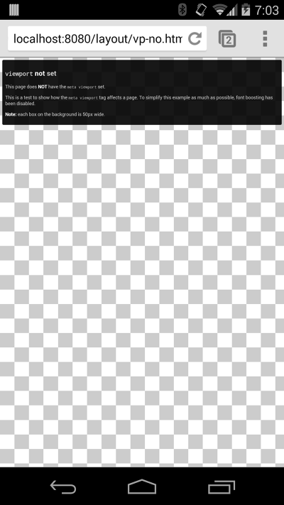
    <figcaption>
      Page without a viewport set
     </figcaption>
  </figure>
  </a>

  <a href="https://googlesamples.github.io/web-fundamentals/fundamentals/design-and-ux/responsive/vp.html">
  <figure>
    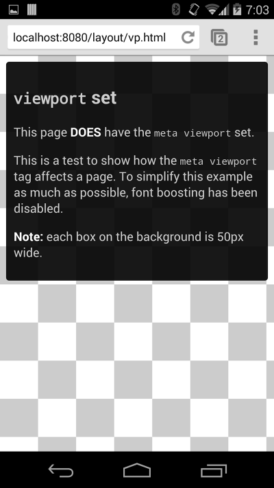
    <figcaption>
      Page with a viewport set
     </figcaption>
  </figure>
  </a>

Some browsers keep the page's width constant when rotating to landscape
mode, and zoom rather than reflow to fill the screen. Adding the attribute
`initial-scale=1` instructs browsers to establish a 1:1 relationship between CSS
pixels and device-independent pixels regardless of device orientation, and
allows the page to take advantage of the full landscape width.

Note: To ensure that older browsers can properly parse the attributes, use a comma to separate attributes.

### Ensure an accessible viewport

In addition to setting an `initial-scale`, you can also set the following attributes on the viewport:

* `minimum-scale`
* `maximum-scale`
* `user-scalable`

When set, these can disable the user's ability to zoom the viewport, potentially causing accessibility issues.

## Size content to the viewport

On both desktop and mobile devices, users are used to scrolling websites vertically but not horizontally; forcing the user to scroll horizontally or to zoom out in order to see the whole page results in a poor user experience.

### TL;DR {: .hide-from-toc }
- Do not use large fixed width elements.
- Content should not rely on a particular viewport width to render well.
- Use CSS media queries to apply different styling for small and large screens.

When developing a mobile site with a `meta viewport` tag, it's easy to
accidentally create page content that doesn't quite fit within the specified
viewport. For example, an image that is displayed at a width wider than the
viewport can cause the viewport to scroll horizontally. You should adjust this
content to fit within the width of the viewport, so that the user does not need
to scroll horizontally.

Since screen dimensions and width in CSS pixels vary widely between devices
(for example, between phones and tablets, and even between different phones), content
should not rely on a particular viewport width to render well.

Setting large absolute CSS widths for page elements (such as the example below),
cause the `div` to be too wide for the viewport on a narrower device (for example,
a device with a width of 320 CSS pixels, such as an iPhone). Instead, consider
using relative width values, such as `width: 100%`.  Similarly, beware of using
large absolute positioning values that may cause the element to fall outside the
viewport on small screens.  

  <a href="https://googlesamples.github.io/web-fundamentals/fundamentals/design-and-ux/responsive/vp-fixed.html">
  <figure>
    
    <figcaption>
      Page with a 344px fixed width element on an iPhone
    </figcaption>
  </figure>
  </a>

  <a href="https://googlesamples.github.io/web-fundamentals/fundamentals/design-and-ux/responsive/vp-fixed.html">
  <figure>
    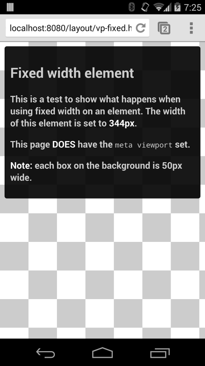
    <figcaption>
      Page with a 344px fixed width element on a Nexus 5
    </figcaption>
  </figure>
  </a>

         
## Use CSS media queries for responsiveness {: #css-media-queries }  

Media queries are simple filters that can be applied to CSS styles. They make 
it easy to change styles based on the characteristics of the device rendering
the content, including the display type, width, height, orientation, and even
resolution.

### TL;DR {: .hide-from-toc }
- Use media queries to apply styles based on device characteristics.
- Use `min-width` over `min-device-width` to ensure the broadest experience.
- Use relative sizes for elements to avoid breaking layout.

For example, you could place all styles necessary for printing
inside a print media query:

    <link rel="stylesheet" href="print.css" media="print">
    

In addition to using the `media` attribute in the style sheet link, there are two
other ways to apply media queries that can be embedded in a CSS file: `@media`
and `@import`.  For performance reasons, either of the first two methods are
recommended over the `@import` syntax
(see [Avoid CSS imports](/web/fundamentals/performance/critical-rendering-path/page-speed-rules-and-recommendations)).

    @media print {
      /* print style sheets go here */
    }
    
    @import url(print.css) print;
    

The logic that applies to media queries is not mutually exclusive, and for any filter
meeting that criteria the resulting CSS block is applied using the
standard rules of precedence in CSS.

### Apply media queries based on viewport size

Media queries enable us to create a responsive experience where specific styles
are applied to small screens, large screens, and anywhere in between.  The media
query syntax allows for the creation of rules that can be applied depending on
device characteristics.

    @media (query) {
      /* CSS Rules used when query matches */
    }
    

While there are several different items we can query on, the ones used most
often for responsive web design are `min-width`, `max-width`, `min-height`, and
`max-height`.

<table class="responsive">
  <thead>
    <tr>
      <th colspan="2">Parameters</th>
    </tr>
  </thead>
  <tbody>
    <tr>
      <td data-th="attribute"><code>min-width</code></td>
      <td data-th="Result">Rules applied for any browser width greater than the value defined in the query.</td>
    </tr>
    <tr>
      <td data-th="attribute"><code>max-width</code></td>
      <td data-th="Result">Rules applied for any browser width less than the value defined in the query.</td>
    </tr>
    <tr>
      <td data-th="attribute"><code>min-height</code></td>
      <td data-th="Result">Rules applied for any browser height greater than the value defined in the query.</td>
    </tr>
    <tr>
      <td data-th="attribute"><code>max-height</code></td>
      <td data-th="Result">Rules applied for any browser height less than the value defined in the query.</td>
    </tr>
    <tr>
      <td data-th="attribute"><code>orientation=portrait</code></td>
      <td data-th="Result">Rules applied for any browser where the height is greater than or equal to the width.</td>
    </tr>
    <tr>
      <td data-th="attribute"><code>orientation=landscape</code></td>
      <td data-th="Result">Rules for any browser where the width is greater than the height.</td>
    </tr>
  </tbody>
</table>

Let's take a look at an example:

<figure>
  <a href="https://googlesamples.github.io/web-fundamentals/fundamentals/design-and-ux/responsive/media-queries.html">
    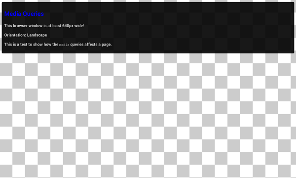
    <figcaption>
      Preview of a page using media queries to change properties as it is resized.
    </figcaption>
  </a>
</figure>

<pre class="prettyprint">

</pre>

[Try it](https://googlesamples.github.io/web-fundamentals/fundamentals/design-and-ux/responsive/media-queries.html){: target="_blank" .external }

* When the browser is between <b>0px</b> and <b>640px</b> wide, `max-640px.css` is applied.
* When the browser is between <b>500px</b> and <b>600px</b> wide, styles within the `@media` is applied.
* When the browser is <b>640px or wider</b>, `min-640px.css` is applied.
* When the browser <b>width is greater than the height</b>, `landscape.css` is applied.
* When the browser <b>height is greater than the width</b>, `portrait.css` is applied.

### A note on `min-device-width`

It is also possible to create queries based on
`min-device-width`, though this practice is **strongly discouraged**.

The difference is subtle but very important: `min-width` is based on the
size of the browser window whereas `min-device-width` is based on
the size of the screen.  Unfortunately some browsers, including the legacy
Android browser, don't report the device width properly; they report the screen size in device pixels instead of the expected viewport width.

In addition, using `min-device-width` can prevent content from adapting on
desktops or other devices that allow windows to be resized because the query
is based on the actual device size, not the size of the browser window.

### Use `any-pointer` and `any-hover` for flexible interactions

Starting with Chrome 39, your style sheets can write selectors that cover
multiple pointer types and hover behaviors. The `any-pointer` and `any-hover`
media features are similar to `pointer` and `hover` in that they allow you to query the
capabilities of the user's pointer. However, unlike the latter, `any-pointer` and
`any-hover` operate on the union of all pointer devices rather than just the
primary pointer device.

### Use relative units

A key concept behind responsive design is fluidity and proportionality as
opposed to fixed width layouts.  Using relative units for measurements can help
simplify layouts and prevent accidental creation of components that are too big
for the viewport.

For example, setting width: 100% on a top level `div`, ensures that it spans the
width of the viewport and is never too big or too small for the viewport.  The
`div` fits, no matter if it's a 320px wide iPhone, 342px wide Blackberry Z10,
or a 360px wide Nexus 5.

In addition, using relative units allows browsers to render the content based on
the user's zoom level without the need for adding horizontal scroll bars to the
page.

Not recommended&mdash;fixed width

    div.fullWidth {
      width: 320px;
      margin-left: auto;
      margin-right: auto;
    }

Recommended&mdash;responsive width

    div.fullWidth {
      width: 100%;
    }

## How to choose breakpoints 

Don't define breakpoints based on device classes. Defining breakpoints based on specific devices,
products, brand names, or operating systems that are in use today can result
in a maintenance nightmare. Instead, the content itself should determine how
the layout adjusts to its container.

### TL;DR {: .hide-from-toc }
- Create breakpoints based on content, never on specific devices, products, or brands.
- Design for the smallest mobile device first; then progressively enhance the experience as more screen real estate becomes available.
- Keep lines of text to a maximum of around 70 or 80 characters.

### Pick major breakpoints by starting small, then working up

<figure class="attempt-right">
  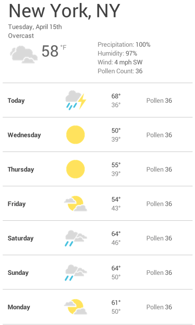
  <figcaption>
    <a href="https://googlesamples.github.io/web-fundamentals/fundamentals/design-and-ux/responsive/weather-1.html">
      Preview of the weather forecast displayed on a small screen.
    </a>
  </figcaption>
</figure>

Design the content to fit on a small screen size first, then expand the screen
until a breakpoint becomes necessary.  This allows you to optimize
breakpoints based on content and maintain the least number of breakpoints
possible.

Let's work through the example we saw at the beginning:
the weather forecast. The first step is to make the forecast look good on a
small screen.

<figure class="attempt-right">
  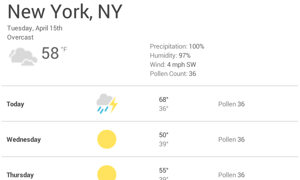
  <figcaption>
    <a href="https://googlesamples.github.io/web-fundamentals/fundamentals/design-and-ux/responsive/weather-1.html">
      Preview of the weather forecast as the page gets wider.
    </a>
  </figcaption>
</figure>

Next, resize the browser until there is too much white space between the
elements, and the forecast simply doesn't look as good.  The decision is somewhat
subjective, but above 600px is certainly too wide.

To insert a breakpoint at 600px, create two new style sheets, one to use when the
browser is 600px and below, and one for when it is wider than 600px.

<pre class="prettyprint">

</pre>

[Try it](https://googlesamples.github.io/web-fundamentals/fundamentals/design-and-ux/responsive/weather-2.html){: target="_blank" .external }

<figure class="attempt-right">
  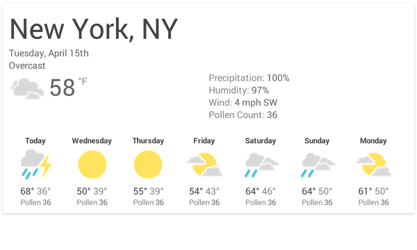
  <figcaption>
    <a href="https://googlesamples.github.io/web-fundamentals/fundamentals/design-and-ux/responsive/weather-2.html">
      Preview of the weather forecast designed for a wider screen.
    </a>
  </figcaption>
</figure>

Finally, refactor the CSS.  In this example, we've placed the common styles such
as fonts, icons, basic positioning, and colors in `weather.css`.  Specific layouts
for the small screen are then placed in `weather-small.css`, and large screen
styles are placed in `weather-large.css`.

### Pick minor breakpoints when necessary

In addition to choosing major breakpoints when layout changes significantly, it
is also helpful to adjust for minor changes.  For example, between major
breakpoints it may be helpful to adjust the margins or padding on an element,
or increase the font size to make it feel more natural in the layout.

Let's start by optimizing the small screen layout.  In this case, let's boost
the font when the viewport width is greater than 360px.  Second, when there is
enough space, we can separate the high and low temperatures so that they're on the
same line instead of on top of each other.  And let's also make the weather
icons a bit larger.

<pre class="prettyprint">

</pre>

  <figure>
    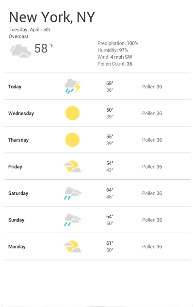
    <figcaption>
      Before adding minor breakpoints.
     </figcaption>
  </figure>

  <figure>
    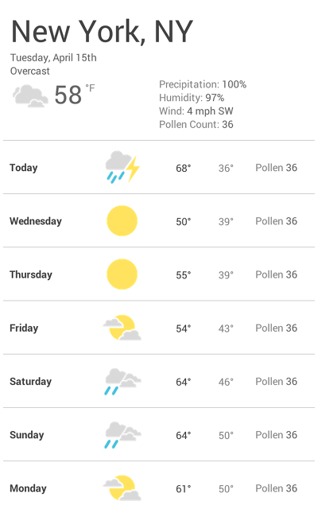
    <figcaption>
      After adding minor breakpoints.
     </figcaption>
  </figure>

Similarly, for the large screens it's best to limit to maximum width of the
forecast panel so it doesn't consume the whole screen width.

<pre class="prettyprint">

</pre>

### Optimize text for reading

Classic readability theory suggests that an ideal column should contain 70 to 80
characters per line (about  8 to 10 words in English). Thus, each time the width
of a text block grows past about 10 words, consider adding a breakpoint.

  <figure>
    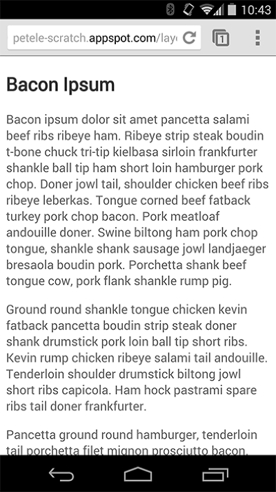
    <figcaption>Before adding minor breakpoints.</figcaption>
  </figure>

  <figure>
    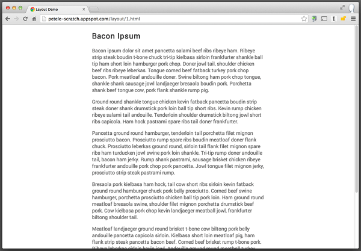
    <figcaption>After adding minor breakpoints.</figcaption>
  </figure>

Let's take a deeper look at the above blog post example.  On smaller screens,
the Roboto font at 1em works perfectly giving 10 words per line, but larger
screens require a breakpoint. In this case, if the browser width is greater
than 575px, the ideal content width is 550px.

<pre class="prettyprint">

</pre>

[Try it](https://googlesamples.github.io/web-fundamentals/fundamentals/design-and-ux/responsive/reading.html){: target="_blank" .external }

### Never completely hide content

Be careful when choosing what content to hide or show depending on screen size.
Don't simply hide content just because you can't fit it on the screen.  Screen size
is not a definitive indication of what a user may want.  For example,
eliminating the pollen count from the weather forecast could be a serious issue
for spring-time allergy sufferers who need the information to determine if they
can go outside or not.

## View media query breakpoints in Chrome DevTools {: #devtools }

Once you've got your media query breakpoints set up, you'll want to see how
your site looks with them. You *could* resize your browser window to trigger
the breakpoints, but there's a better way: Chrome DevTools. The two
screenshots below demonstrate using DevTools to view how a page looks under
different breakpoints.

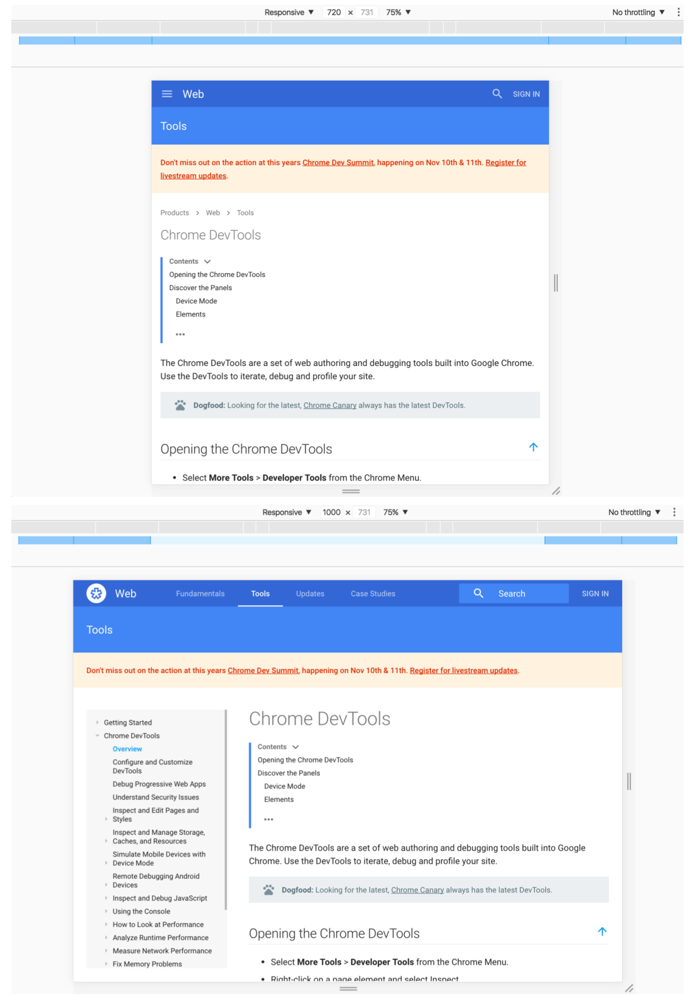

To view your page under different breakpoints:

[Open DevTools](/web/tools/chrome-devtools/#open) and then turn on [Device
Mode](/web/tools/chrome-devtools/device-mode/#toggle).

Use the
[viewport controls](/web/tools/chrome-devtools/device-mode/emulate-mobile-viewports#viewport-controls)
to select **Responsive**, which puts DevTools into responsive mode.

Last, open the Device Mode menu and select
[**Show media queries**](/web/tools/chrome-devtools/device-mode/emulate-mobile-viewports#media-queries)
to display your breakpoints as colored bars above your page.

Click on one of the bars to view your page while that media
query is active. Right-click on a bar to jump to the media query's
definition. See 
[Media queries](/web/tools/chrome-devtools/device-mode/emulate-mobile-viewports#media-queries)
for more help.
